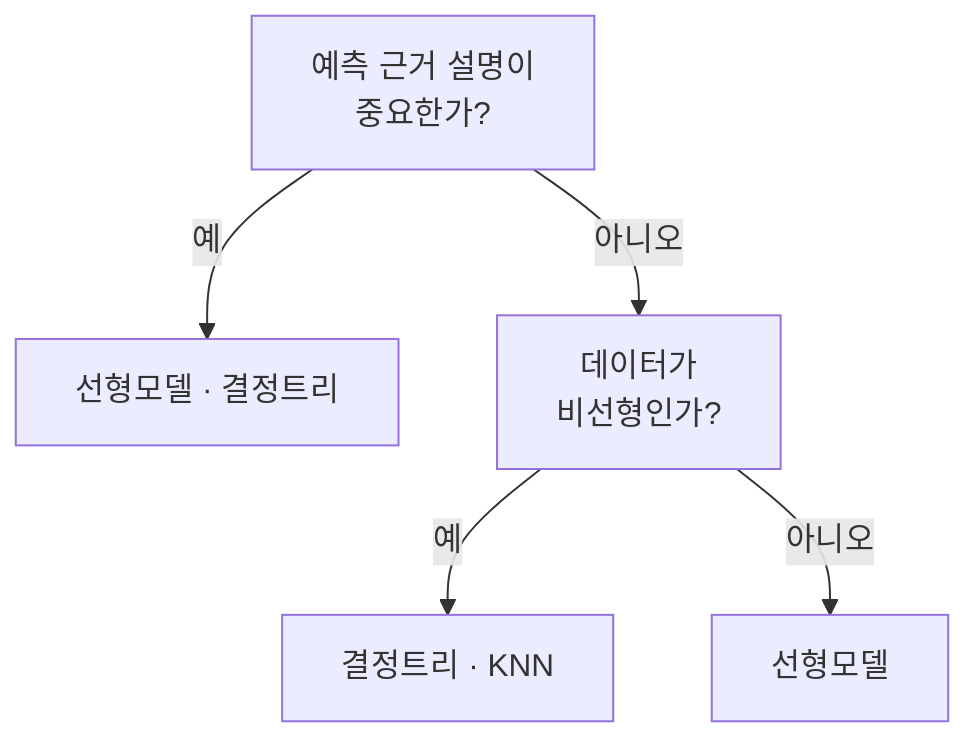

> 🗂️ **Notes · Machine Learning** — `model-selection` `linear-model` `knn` `decision-tree` `k-means`
{: .prompt-info }

---

## 1. 📖 개요

> 📌 **왜 필요한가** · 지도/비지도 학습 모델 5개를 비교하고, 모델 선택 기준의 핵심 개념과 필요성을 파악한다.
{: .prompt-tip }

[지도학습과 비지도학습](/posts/supervised-vs-unsupervised-learning/)에서 문제 유형(회귀/분류/군집화/차원축소)을 정했다고 해서 어떤 모델을 쓸지가 자동으로 정해지지는 않는다. 같은 분류 문제라도 대출 승인처럼 근거를 설명해야 하는 경우와, 이미지 인식처럼 정확도만 중요한 경우는 전혀 다른 모델을 우선 검토해야 한다.

실무에서는 처음부터 복잡한 모델을 꺼내지 않는다. 앞으로 배울 규제, 앙상블, 하이퍼파라미터 튜닝은 모두 이 다섯 기본 모델(선형모델, KNN, Decision Tree, K-means, PCA) 위에 얹어지는 기법이다 — 이 기본 모델들의 성격을 먼저 알아야 "이 데이터엔 어떤 모델부터 시도해 볼까?"라는 질문에 근거 있게 답할 수 있다.

---

## 2. 💡 핵심 개념

### 직관

병원에서 환자를 처음 진료할 때 전문의부터 부르지 않고, 먼저 문진(간단한 질문)으로 큰 범주를 좁히는 것과 같다. "설명이 필요한가?", "데이터가 비선형인가?"라는 두 가지 질문만으로 다섯 모델 중 우선 시도할 후보를 좁힐 수 있다.

### 사례와 해석

대출 승인 모델(설명 필요)과 이미지 기반 이상탐지(설명 불필요, 강한 비선형)를 각각 흐름에 따라 판단한다.

```text
사례 1: 대출 승인 모델
① 예측 근거 설명이 중요한가? → 예(규제상 설명 의무)
→ 우선 후보: 선형모델(Logistic Regression), 결정트리

사례 2: 센서 데이터 이상탐지
① 예측 근거 설명이 중요한가? → 아니오(정확도가 우선)
② 데이터가 비선형인가? → 예(센서 값 사이 복잡한 상호작용)
→ 우선 후보: 결정트리, KNN(단, 특성 수도 함께 확인)
```

처음에는 해석이 쉬운 단순한 모델을 선정하고, 필요에 따라 복잡한 모델로 넘어간다. 데이터 크기, 특성 스케일, 해석 필요성 등 여러 기준으로 후보를 좁혀 간다.

| 모델 | 핵심 질문 | 특징 |
|---|---|---|
| Linear / Logistic | 선형적인 관계로 설명 가능한가? | 해석 쉬움 |
| KNN | 가까운 데이터들은 무엇인가? | 거리 기반, 스케일링 중요 |
| Decision Tree | 어떤 조건으로 나눌까? | 규칙 기반, 비선형 가능, 스케일링 불필요 |
| K-means | 비슷한 것끼리 몇 그룹으로 묶을까? | 비지도 군집화 |
| PCA | 많은 특성을 어떻게 줄일까? | 비지도 차원축소 |



| 고려 요소 | 이런 상황이면 | 우선 후보 |
|---|---|---|
| 해석이 중요 | 근거를 설명해야 함 | 선형모델, 결정트리 |
| 특성 스케일 제각각 | 거리 기반이 위험 | 트리 계열(스케일 불필요) |
| 비선형 관계 강함 | 직선으로 안 잡힘 | 결정트리, KNN |
| 데이터가 작음 | 분할에 따른 변동이 큼 | 단순 baseline부터 시작하고 CV로 후보 비교 |

> 💡 **한 줄 정리** · 설명이 중요하다면 선형 모델이나 결정 트리를 우선 검토한다.
{: .prompt-info }

---

## 3. 🔍 모델 선택 기준

- 설명이 중요하다 → Linear / Decision Tree
- 비선형 관계가 강하다 → Decision Tree / KNN
- 거리 기반으로 모델을 쓴다 → KNN
- 정답 없이 그룹을 찾는다 → K-means
- 특성이 너무 많아 줄이고 싶다 → PCA

---

## 4. ✅ 핵심 정리

- **모델 선택은 해석이 쉬운 단순한 모델에서 시작해 필요할 때 복잡한 모델로 넘어간다**
- **데이터 크기, 특성 스케일, 해석 필요성이 모델을 좁히는 기준이 된다**

---

## 5. 🧠 핵심 기억 카드

<details markdown="1">
<summary><strong>펼쳐서 확인</strong></summary>

**필수 암기 내용**

```text
설명 중요
→ 선형모델 / Decision Tree

비선형 강함
→ Decision Tree / KNN

거리 기반
→ 스케일링 확인

정답 없이 그룹화
→ K-means

특성 수 축소
→ PCA
```

**하이퍼파라미터 정리**

```text
n_neighbors  → KNN의 이웃 수
max_depth    → Decision Tree 깊이
n_clusters   → K-means 군집 수
n_components → PCA 축소 차원 수
```

</details>

---

## 6. 🔗 관련 글

- [지도학습과 비지도학습](/posts/supervised-vs-unsupervised-learning/)
