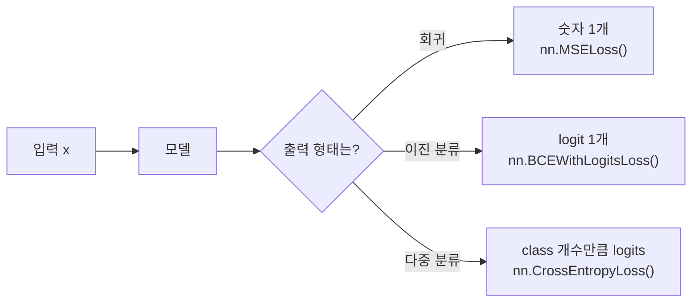

> 🗂️ **Notes · Deep Learning** — `deep-learning` `pytorch` `regression` `classification` `tensor-shape`
{: .prompt-info }

---

## 1. 📖 개요

> 📌 **왜 필요한가** · 문제 유형을 잘못 이해하면 출력층, shape, loss, metric이 모두 어긋난다.
{: .prompt-tip }

딥러닝은 문제 유형에 따라 모델 구조와 입출력 형태가 달라진다.

---

## 2. 💡 핵심 개념

입력에서 모델을 거쳐 출력이 나오는 흐름은 같지만, 아래 그림처럼 문제 유형에 따라
출력의 형태와 그에 맞는 loss 함수가 달라진다.



### 회귀 문제

예: 집값 예측, 매출 예측, 온도 예측, 배송 소요 시간 예측.

- 입력 x: 고객 정보, 상품 정보, 날짜 정보 등
- 정답 y: 실제 숫자값
- 모델 출력: 숫자값

```python
x.shape = [batch_size, feature_dim]
y.shape = [batch_size, 1]
preds.shape = [batch_size, 1]
```

`loss_fn = nn.MSELoss()`

### 이진 분류 문제

예: 스팸/정상, 이탈/유지, 불량/정상, 위험/안전처럼 두 가지 중 하나를 예측하는 문제.

- 입력 x: 샘플 feature
- 정답 y: 0 또는 1
- 모델 출력: logit 1개

```python
x.shape = [batch_size, feature_dim]
y.shape = [batch_size, 1]
logits.shape = [batch_size, 1]
```

`loss_fn = nn.BCEWithLogitsLoss()`

### 다중 분류 문제

예: 이미지(고양이/강아지/자동차/비행기), 문의 유형(배송/환불/결제/계정),
문서 주제(법률/의료/금융/기술)처럼 여러 class 중 하나를 예측하는 문제.

- 입력 x: 샘플 feature
- 정답 y: class index
- 모델 출력: class 개수만큼의 logits

클래스가 4개인 경우:

```python
x.shape = [batch_size, feature_dim]
y.shape = [batch_size]
logits.shape = [batch_size, 4]
```

`loss_fn = nn.CrossEntropyLoss()`

> 💡 **정답(y) shape이 문제 유형마다 다른 이유** · 회귀와 이진 분류는 출력이 숫자/로짓
> 1개라서 정답도 `[batch_size, 1]`로 맞춘다. 다중 분류는 `nn.CrossEntropyLoss`가 정답을
> 클래스 인덱스로 직접 받기 때문에 `[batch_size]`로 준다 — one-hot이나 `[batch_size, 1]`이
> 아니다.
{: .prompt-info }

---

## 3. 📦 데이터 유형별 입력 구조

데이터 유형에 따라 입력 Tensor의 shape이 달라진다.

| 데이터 유형 | 예시 | Tensor shape |
| --- | --- | --- |
| Tabular | 고객 정보, 거래 데이터 | `[batch_size, feature_dim]` |
| Image | 상품 이미지, 의료 이미지 | `[batch_size, channels, height, width]` |
| 텍스트 token ID | 정수로 바꾼 문장 | `[batch_size, sequence_length]` (torch.long) |
| 텍스트 embedding | token별 실수 벡터 | `[batch_size, sequence_length, embedding_dim]` |
| 시계열 | 시간별 센서·수치 feature | `[batch_size, sequence_length, feature_dim]` |

모델은 데이터 구조와 문제 유형을 파악하고, 가장 단순한 baseline부터 시작해서
추후 필요할 때 모델을 복잡하게 만드는 습관이 중요하다.

---

## 4. ✅ 핵심 정리

- **회귀** : 연속적인 숫자를 예측한다
- **이진 분류** : 두 class 중 하나를 예측한다
- **다중 분류** : 여러 class 중 하나를 예측한다
- **문제 유형에 따라** 출력층 shape, loss, metric이 달라진다
- **데이터 유형에 따라** MLP, CNN, RNN/LSTM 같은 모델 후보가 달라진다

---

## 5. 🔗 관련 글

- [머신러닝과 딥러닝의 차이, 딥러닝의 기본 개념](/posts/machine-learning-vs-deep-learning-basics/)
