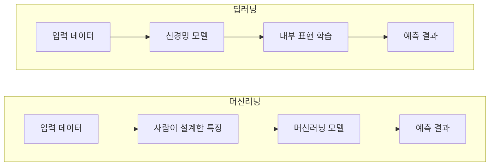
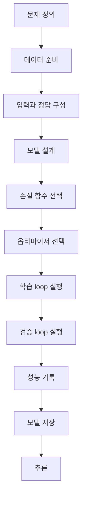

> 🗂️ **Notes · Deep Learning** — `deep-learning` `neural-network` `pytorch` `dataloader` `training-loop`
{: .prompt-info }

---

## 1. 💡 핵심 개념

### 머신러닝 vs 딥러닝

아래 그림처럼 두 흐름 모두 "입력 → ... → 예측"으로 이어지지만, 가운데 단계가 다르다.



두 흐름의 차이는 "특징(feature)을 누가 설계하느냐"다. 머신러닝은 사람이 특징을 설계하고
모델이 패턴을 학습하지만, 딥러닝은 신경망이 내부 표현(특징)까지 함께 학습한다.

> 💡 **비교 정리** · 규칙 기반은 사람이 조건을 직접 작성한다. 머신러닝은 사람이 특징을 설계하고
> 모델이 패턴을 학습한다. 딥러닝은 모델이 특징 표현까지 함께 학습한다. 단, 딥러닝이 복잡한
> 데이터에 강하다고 해서 항상 정답인 것은 아니다.
{: .prompt-info }

### 딥러닝 프로젝트 흐름



> 📌 **집중할 점** · 흐름을 읽자 — 데이터 → 모델 → 손실 → 최적화 → 평가. 처음에는 전체
> 코드의 구조와 흐름을 눈으로 파악하는 데 집중한다.
{: .prompt-tip }

---

## 2. 📦 입력 / 출력 구조

- **Dataset** — 샘플과 label을 저장한다.
- **DataLoader** — Dataset에서 데이터를 batch 단위로 꺼낸다.

---

## 3. 🧪 코드 / 실습

먼저 흐름부터 보면:


이를 코드로 옮기면:

```python
optimizer.zero_grad()
preds = model(batch_x)
loss = loss_fn(preds, batch_y)
loss.backward()
optimizer.step()
```

1. 이전 batch에서 계산된 gradient를 초기화한다. (누락하면 이전 gradient가 이전 batch의
   값과 누적되므로, 매 batch마다 초기화해야 한다.)
2. 현재 batch에 대한 예측값을 만든다.
3. 예측값과 정답의 차이를 계산한다.
4. loss를 기준으로 gradient를 계산한다.
5. gradient를 사용해 parameter를 업데이트한다.

### train loop vs validation loop

| 구분 | 사용 데이터 | 진행 | 모드 |
| --- | --- | --- | --- |
| train loop | train 데이터 | loss 계산 → gradient 계산 → parameter 업데이트 | `model.train()` |
| validation loop | validation 데이터 | 예측 → loss/metric 계산 (parameter 업데이트 없음) | `model.eval()` + `torch.no_grad()` |

train loop는 모델이 실제로 학습되는 구간이다. validation loop는 학습 데이터의 gradient
업데이트에 직접 쓰지 않은 validation 데이터로 성능을 확인하고, 모델 선택이나 하이퍼파라미터
조정에 활용한다.

train loop에서는 `model.train()`을 사용하고, validation loop에서는 `model.eval()`로
Dropout·BatchNorm 등을 평가 모드로 바꾼 뒤, `torch.no_grad()`로 gradient 기록을 꺼서
메모리 사용을 줄인다. 두 기능은 역할이 서로 다르다.

<details markdown="1">
<summary><strong>Q.</strong> 다음 단계를 학습 루프의 올바른 순서로 정렬해보기</summary>

DataLoader에서 batch 꺼내기 → optimizer.zero_grad() → model로 예측값 생성 →
loss_fn으로 loss 계산 → loss.backward() → optimizer.step() → validation loss 계산

</details>

---

## 4. ✅ 핵심 정리

- **머신러닝 vs 딥러닝** : 머신러닝은 사람이 특징을 설계하고 모델이 패턴을 학습하지만,
  딥러닝은 신경망이 내부 표현(특징)까지 함께 학습한다
- **학습 루프** : `zero_grad → 예측 → loss 계산 → backward → step` 순서로 한 batch를 학습한다
- **train / validation 모드** : `model.train()`은 학습, `model.eval()` + `torch.no_grad()`는
  검증에 사용하며, 검증은 파라미터를 갱신하지 않는다
- **validation의 목적** : 학습에 쓰지 않은 데이터로 성능을 확인해 모델 선택·하이퍼파라미터
  조정에 활용한다

---

## 5. 🧠 핵심 기억 카드

<details markdown="1">
<summary><strong>펼쳐서 확인</strong></summary>

- **예측** : 입력 → 파라미터(가중치) 거쳐 계산 → 예측값, 학습할수록 파라미터 조정
- **Loss Function** : 예측값-실제값 차이를 숫자화, 클수록 틀림 · 작을수록 정확
- **Gradient** : 손실이 커지는 방향, 옵티마이저는 반대(음의 gradient) 방향으로 갱신
- **train / validation 분리** : validation으로 처음 보는 데이터 성능 확인 → 과적합(Overfitting) 점검
- **저장 / 재현성** : 조건 재확인·비교 + 동일 결과 재현 가능해야 실험 신뢰 가능

</details>

---

## 6. 🔗 관련 글

- [데이터 분리와 평가지표 — train/valid/test](/posts/train-valid-test-split-and-metrics/)
