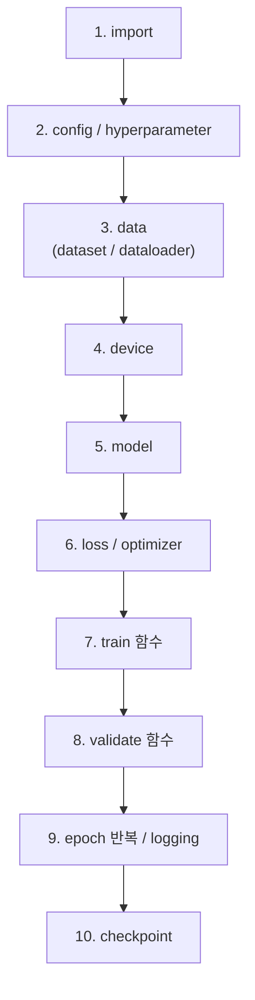
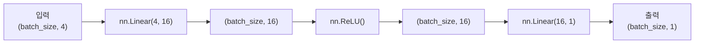
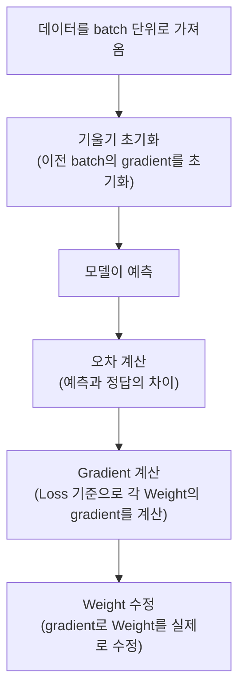

> 🗂️ **Notes · Deep Learning** — `pytorch` `neural-network` `training-loop` `dataloader` `checkpoint`
{: .prompt-info }

---

## 1. 💡 핵심 개념

PyTorch 학습 스크립트는 보통 아래 10단계로 구성된다. 아래 "코드 / 실습"의 주석
번호(`# 1.` ~ `# 10.`)가 이 순서를 그대로 따른다.



> 💡 **왜 이 순서인가** · 뒤 단계가 앞 단계의 결과를 입력으로 쓰기 때문이다. 데이터가
> 있어야 모델의 입출력 shape을 정할 수 있고, 모델과 loss가 있어야 optimizer가 무엇을
> 최적화할지 정해지며, train/validate 함수가 있어야 epoch을 반복하며 성능을 비교하고
> 마지막에 저장할 수 있다.
{: .prompt-info }

---

## 2. 🧪 코드 / 실습

### 전체 코드 예시

```python
# 1. import
import torch
from torch import nn
from torch.utils.data import DataLoader, TensorDataset, random_split


# 2. config / hyperparameter
SEED = 42
BATCH_SIZE = 32
LR = 0.05
EPOCHS = 5

torch.manual_seed(SEED)


# 3. data
X = torch.randn(200, 4)
true_w = torch.tensor([[2.0], [-1.0], [0.5], [3.0]])
y = X @ true_w + 0.1 * torch.randn(200, 1)

dataset = TensorDataset(X, y)
train_dataset, valid_dataset = random_split(dataset, [160, 40])

train_loader = DataLoader(train_dataset, batch_size=BATCH_SIZE, shuffle=True)
valid_loader = DataLoader(valid_dataset, batch_size=BATCH_SIZE, shuffle=False)


# 4. device
device = torch.device("cuda" if torch.cuda.is_available() else "cpu")


# 5. model
model = nn.Sequential(
    nn.Linear(4, 16),
    nn.ReLU(),
    nn.Linear(16, 1),
).to(device)


# 6. loss / optimizer
loss_fn = nn.MSELoss()
optimizer = torch.optim.SGD(model.parameters(), lr=LR)


# 7. train function
def train_one_epoch(model, dataloader, loss_fn, optimizer, device):
    model.train()
    total_loss = 0.0

    for batch_x, batch_y in dataloader:
        batch_x = batch_x.to(device)
        batch_y = batch_y.to(device)

        optimizer.zero_grad()
        preds = model(batch_x)
        loss = loss_fn(preds, batch_y)
        loss.backward()
        optimizer.step()

        total_loss += loss.item() * batch_x.size(0)

    return total_loss / len(dataloader.dataset)


# 8. validation function
@torch.no_grad()
def validate(model, dataloader, loss_fn, device):
    model.eval()
    total_loss = 0.0

    for batch_x, batch_y in dataloader:
        batch_x = batch_x.to(device)
        batch_y = batch_y.to(device)

        preds = model(batch_x)
        loss = loss_fn(preds, batch_y)

        total_loss += loss.item() * batch_x.size(0)

    return total_loss / len(dataloader.dataset)


# 9. epoch loop / logging
history = []

for epoch in range(1, EPOCHS + 1):
    train_loss = train_one_epoch(model, train_loader, loss_fn, optimizer, device)
    valid_loss = validate(model, valid_loader, loss_fn, device)

    log = {
        "epoch": epoch,
        "train_loss": train_loss,
        "valid_loss": valid_loss,
    }
    history.append(log)

    print(
        f"Epoch {epoch} | "
        f"train_loss={train_loss:.4f} | "
        f"valid_loss={valid_loss:.4f}"
    )


# 10. checkpoint
torch.save(model.state_dict(), "basic_mlp_regression.pt")
```

---

## 3. 🔍 이해하기

### 반드시 이해하고 작성해야 하는 코드

```python
model = nn.Sequential(
    nn.Linear(4, 16),
    nn.ReLU(),
    nn.Linear(16, 1),
)
```

이 모델에 `(batch_size, 4)` 입력을 넣으면 shape이 이렇게 바뀐다:



```python
for batch_x, batch_y in dataloader:
    optimizer.zero_grad()
    preds = model(batch_x)
    loss = loss_fn(preds, batch_y)
    loss.backward()
    optimizer.step()
```



> 💡 **왜 `loss.item() * batch_x.size(0)`을 곱하는가** · `nn.MSELoss()`는 기본값이
> batch 내 평균이다. batch마다 (평균 loss × 그 batch의 샘플 수)를 더한 뒤 마지막에
> `len(dataloader.dataset)`으로 나누면, 마지막 batch 크기가 다르게 끝나더라도 전체
> 데이터셋 기준의 정확한 평균 loss가 나온다.
{: .prompt-info }

### 구성 요소별 역할

```text
device    -> 연산을 수행할 위치(CPU/GPU) 지정
model     -> 신경망 정의
loss_fn   -> 틀린 정도 계산
optimizer -> weight 수정
train     -> 실제 학습
validate  -> 성능 확인
```

---

## 4. ✅ 핵심 정리

- **PyTorch 학습 스크립트** : import → config → data → device → model → loss/optimizer →
  train → validate → epoch 반복/로깅 → checkpoint의 10단계로 구성된다
- **한 batch 학습** : `zero_grad → 예측 → loss 계산 → backward → step` 순서로 진행된다
- **구성 요소** : `model`은 신경망 정의, `loss_fn`은 틀린 정도 계산,
  `optimizer`는 weight 수정을 담당한다

---

## 5. 🔗 관련 글

- [머신러닝과 딥러닝의 차이, 딥러닝의 기본 개념](/posts/machine-learning-vs-deep-learning-basics/)
- [딥러닝 문제 유형과 입출력 구조 설계](/posts/deep-learning-problem-types-and-io-shapes/)
