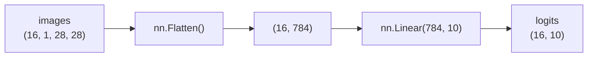

> 🗂️ **Notes · Deep Learning** — `pytorch` `flatten` `tensor-shape` `mlp` `nn-linear`
{: .prompt-info }

---

## 1. 📖 개요

> 📌 **왜 필요한가** · 여러 차원으로 된 특징을 Linear 층이 처리하기 쉬운 1줄짜리 특징
> 벡터로 바꾸기 위해서 사용한다.
{: .prompt-tip }

---

## 2. 💡 핵심 개념

### flatten이란

Tensor의 여러 차원을 길게 펼쳐서 Linear 층 등이 처리하기 쉬운 형태로 바꾸는 것이다.

### 입력 shape 비교

| 구분 | shape |
| --- | --- |
| MLP 입력 기본 형태 | `(batch_size, features)` |
| 이미지 batch 형태 | `(batch_size, channels, height, width)` |

배치 데이터에서는 보통 batch 차원은 유지하고 나머지만 펼친다.

```text
[32, 3, 224, 224]
        ↓ Flatten
[32, 150528]
```

아래 그림처럼 batch 차원 `32`는 그대로 두고, `channels`, `height`, `width` 세 차원만
하나의 feature 차원으로 합친다.

{: w="500" h="340" }
_flatten은 batch 차원을 유지한 채 나머지 차원을 하나로 합친다_

---

## 3. 🧪 코드 / 실습

### torch.flatten

```python
import torch

images = torch.randn(16,1,28,28)
images2 = torch.randn(16,2,28,28)

flat = torch.flatten(images, start_dim=1)
flat2 = torch.flatten(images2, start_dim=1)

print(images.shape)
print(flat.shape)


print(images2.shape)
print(flat2.shape)
```

### nn.Flatten()

모델 안에 flatten을 넣고 싶을 때 사용한다.

```python
import torch
import torch.nn as nn

images = torch.randn(16, 1, 28, 28)

model = nn.Sequential(
    nn.Flatten(),          # (16, 1, 28, 28) -> (16, 784)
    nn.Linear(784, 10)     # (16, 784) -> (16, 10)
)

logits = model(images)

print("images shape:", images.shape)
print("logits shape:", logits.shape)
```

아래 그림은 위 코드에서 Tensor가 지나가는 흐름이다.



_`nn.Flatten()`이 4차원 입력을 2차원으로 펼친 뒤 `nn.Linear`가 받는다_

---

## 4. ✅ 핵심 정리

- **MLP 입력** : 보통 `(batch_size, features)` 입력을 기대함
- **이미지 데이터** : `(batch_size, channels, height, width)` 형태
- **flatten** : 이미지를 MLP에 넣으려면 batch 차원을 유지한 채 나머지 차원을 flatten해야 함
- **`torch.flatten(x, start_dim=1)`** : batch 차원을 유지하는 안전한 방법
- **`in_features`** : 첫 번째 `nn.Linear`의 `in_features`는 flatten 후 feature 수와 같아야 함

---

## 5. 🔗 관련 글

- [가중치/편향과 nn.Linear](/posts/nn-linear-weight-bias/)
- [MLP의 입력층/은닉층/출력층](/posts/mlp-input-hidden-output-layers/)
- [딥러닝 문제 유형과 입출력 구조 설계](/posts/deep-learning-problem-types-and-io-shapes/)
