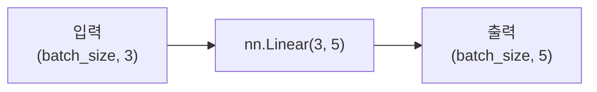

> 🗂️ **Notes · Deep Learning** — `pytorch` `nn-linear` `weight` `bias` `affine-transformation`
{: .prompt-info }

---

## 1. 📖 개요

> 📌 **학습 목표**
> - `nn.Linear(in_features, out_features)`의 의미를 설명할 수 있다.
> - `weight`, `bias` Tensor의 shape를 계산할 수 있다.
> - PyTorch의 `nn.Linear` 계산식이 `x @ weight.T + bias` 형태임을 확인할 수 있다.
> - `model.named_parameters()`로 parameter 이름과 shape를 출력할 수 있다.
{: .prompt-tip }

---

## 2. 💡 핵심 개념

한 층의 모든 뉴런이 다음 층의 뉴런과 연결되는 구조를 완전 연결층이라고 한다.
`nn.Linear`가 완전 연결 계산을 구현하는 기본 모듈이다.

`nn.Linear`는 이름은 Linear이지만, 기본값 `bias=True`일 때는 선형 변환에 편향을
더한 **아핀 변환(affine transformation)**이다. 입력 Tensor의 마지막 차원을 새로운
feature 차원으로 변환한다.

- 입력 shape : `(batch_size, in_features)`
- 출력 shape : `(batch_size, out_features)`

### nn.Linear의 주요 인자

- `in_features` : 입력 샘플 하나가 가진 feature 수
- `out_features` : 출력 샘플 하나가 가질 feature 수

```python
linear = nn.Linear(in_features=3, out_features=5)
```

아래 그림처럼 `nn.Linear(3, 5)`를 통과하면 입력 shape `(batch_size, 3)`이
`(batch_size, 5)`로 바뀐다.



---

## 3. 🧪 코드 / 실습

### weight와 bias shape

`nn.Linear(3, 5)`:

```python
import torch
import torch.nn as nn

linear = nn.Linear(3, 5)

print("weight shape:", linear.weight.shape)
print("bias shape  :", linear.bias.shape)
```

```text
weight shape: torch.Size([5, 3])
bias shape  : torch.Size([5])
```

PyTorch에서는 `(out_features, in_features)` 순서로 저장한다:

- `weight` shape = `(out_features, in_features)`
- `bias` shape = `(out_features,)`

### named_parameters()

실전에서는 `nn.Linear` 하나가 아니라 여러 층으로 구성된 모델을 사용한다. 이때는
`named_parameters()`를 사용하면 parameter 이름과 shape를 확인할 수 있다.

```python
import torch.nn as nn

model = nn.Sequential(
    nn.Linear(3, 5),
    nn.ReLU(),
    nn.Linear(5, 2)
)

for name, param in model.named_parameters():
    print(name, param.shape, "numel=", param.numel())
```

---

## 4. ✅ 핵심 정리

- **`nn.Linear(in_features, out_features)`** : 마지막 입력 차원을 `out_features`로 변환
- **weight shape** : `(out_features, in_features)`
- **bias shape** : `(out_features,)`
- **내부 계산** : `input @ weight.T + bias`
- **parameter 수** : `in_features * out_features + out_features`

---

## 5. 🔗 관련 글

- [퍼셉트론과 선형 결정 경계](/posts/perceptron-and-linear-decision-boundary/)
- [MLP의 입력층/은닉층/출력층](/posts/mlp-input-hidden-output-layers/)
