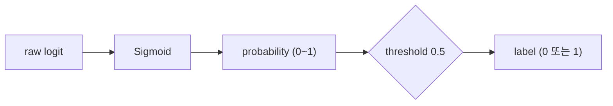

> 🗂️ **Notes · Deep Learning** — `sigmoid` `softmax` `classification` `cross-entropy-loss` `pytorch`
{: .prompt-info }

---

## 1. 💡 이진 분류

이진 분류 모델은 보통 샘플마다 logit 1개를 출력한다.

```python
logits shape: (batch_size, 1)
```

### 출력 흐름

이진 분류의 출력 흐름은 `logits -> probability -> label`이다. 모델의 raw logits를
Sigmoid로 0~1 사이 점수로 바꾸고, 예시로 threshold 0.5 기준을 적용해 label을 만든다.



_이진 분류는 raw logit을 Sigmoid로 확률로 바꾼 뒤, threshold로 label을 결정한다_

이진 분류는 class 1의 근거 점수 하나만 출력한다. 하나만 알면 나머지를 알 수 있다.

| logit | 의미 |
| --- | --- |
| `logit < 0` | class 0 쪽 근거가 더 큼 |
| `logit = 0` | 두 class의 경계 |
| `logit > 0` | class 1 쪽 근거가 더 큼 |
| `-5.0` | class 0 쪽으로 강한 근거 |
| `-0.1` | class 0 쪽이지만 경계에 가까움 |
| `0.1` | class 1 쪽이지만 경계에 가까움 |
| `5.0` | class 1 쪽으로 강한 근거 |

> 💡 **한 줄 정리** · 이진 분류의 logit 하나는 class 1 방향의 근거 점수이며, Sigmoid가
> 이를 0과 1 사이 값으로 바꾸고 threshold가 최종 label을 결정한다.
{: .prompt-info }

### Sigmoid

Sigmoid는 입력값을 0과 1 사이로 바꾼다.

```python
Sigmoid(x) = 1 / (1 + exp(-x))
```

```python
import torch
import torch.nn as nn

class BinaryMLP(nn.Module):
    """
    feature 4개를 입력받아 이진 분류 logit 1개를 출력하는 모델입니다.
    """
    def __init__(self, input_dim=4, hidden_dim=16):
        super().__init__()
        self.net = nn.Sequential(
            nn.Linear(input_dim, hidden_dim),
            nn.ReLU(),
            nn.Linear(hidden_dim, 1)  # 이진 분류에서는 logit 1개를 출력합니다.
        )

    def forward(self, x):
        logits = self.net(x)
        return logits

x = torch.randn(8, 4)
model = BinaryMLP()
logits = model(x)

print("x shape     :", x.shape)
print("logits shape:", logits.shape)
```

### target shape와 dtype 확인

```python
import torch
import torch.nn as nn

criterion = nn.BCEWithLogitsLoss()

logits = torch.randn(8, 1)

# 잘못된 target shape입니다.
# logits는 (8, 1)인데 target은 (8,)입니다.
target_wrong = torch.tensor([0, 1, 0, 1, 1, 0, 1, 0], dtype=torch.float32)

print("logits shape      :", logits.shape)
print("target_wrong shape:", target_wrong.shape)
```

```python
target = target_wrong.unsqueeze(1)

loss = criterion(logits, target)

print("target shape:", target.shape)
print("loss:", loss)
```

---

## 2. 💡 다중 분류

다중 분류는 class가 3개 이상이고, 하나의 샘플이 그중 하나의 class에 속하는 문제다. 보통
class 수만큼 logits를 출력한다.

```python
logits shape: (batch_size, num_classes)
```

### 출력 흐름


_다중 분류 출력층의 핵심 흐름 — 입력부터 예측 class index까지_

### Softmax

softmax는 각 class를 따로 계산하는 함수가 아니라, 한 샘플의 class 점수를 서로 비교하는
함수다. 각 logit에 지수 함수를 적용한 뒤, 같은 샘플의 모든 class 값을 합한 값으로 나눈다.

```python
softmax(z_i) = exp(z_i) / sum(exp(z_j))
```

한 class의 확률은 그 class logit 하나만으로 정해지지 않고 다른 class logits와의 상대적인
차이로 결정된다.

> 💡 **한 줄 정리** · Softmax는 같은 샘플 안의 class logits를 상대적으로 비교해, class
> 축의 합이 1인 분포로 바꾼다.
{: .prompt-info }

### 다중 분류 모델의 출력 shape

```python
import torch
import torch.nn as nn

class MultiClassMLP(nn.Module):
    """
    feature 4개를 입력받아 class 3개에 대한 logits를 출력하는 모델입니다.
    """
    def __init__(self, input_dim=4, hidden_dim=16, num_classes=3):
        super().__init__()
        self.net = nn.Sequential(
            nn.Linear(input_dim, hidden_dim),
            nn.ReLU(),
            nn.Linear(hidden_dim, num_classes)  # class 수만큼 logits 출력
        )

    def forward(self, x):
        logits = self.net(x)
        return logits

x = torch.randn(8, 4)
model = MultiClassMLP(num_classes=3)
logits = model(x)

print("x shape     :", x.shape)
print("logits shape:", logits.shape)
```

```text
x shape     : torch.Size([8, 4])
logits shape: torch.Size([8, 3])
```

```text
logits.shape == (8, 3)의 의미 :

샘플 8개에 대해,
각 샘플마다 class 3개 점수를 출력합니다.
```

### CrossEntropyLoss

CrossEntropyLoss는 다중 분류에서 모델이 정답 클래스를 얼마나 잘 맞혔는지 계산하는 손실
함수다. raw logits와 정답 class 번호를 받는 하나의 입력 계약을 가진다.

```python
import torch
import torch.nn as nn

model = MultiClassMLP(input_dim=4, hidden_dim=16, num_classes=3)
criterion = nn.CrossEntropyLoss()

x = torch.randn(8, 4)

# target은 one-hot이 아니라 class index입니다.
# class가 3개라면 가능한 값은 0, 1, 2입니다.
target = torch.tensor([0, 1, 2, 1, 0, 2, 1, 0], dtype=torch.long)

logits = model(x)
loss = criterion(logits, target)

print("logits shape:", logits.shape)
print("target shape:", target.shape)
print("target dtype:", target.dtype)
print("loss:", loss)
```

---

## 3. 🔍 Sigmoid vs Softmax 비교

| 구분 | Sigmoid | Softmax |
| --- | --- | --- |
| 주 사용 | 이진 분류, 멀티라벨 | 다중 클래스 분류 |
| 입력 | 보통 logit 1개 | 클래스 수만큼 logit |
| 출력 | 각각 독립적인 0~1 값 | 전체 합이 1인 확률 분포 |
| 예시 | 이탈 / 유지 | 고양이 / 강아지 / 토끼 |

> 💡 **한 줄 요약** · Sigmoid는 하나의 대상이 Positive인지 판단, Softmax는 여러 클래스
> 중 어떤 클래스인지 비교해서 선택할 때 사용한다.
{: .prompt-info }

### 다중 분류와 다중 레이블 구분

| 상황 | Loss |
| --- | --- |
| 여러 class 중 하나만 정답 | `CrossEntropyLoss` |
| 여러 label이 동시에 정답 가능 | `BCEWithLogitsLoss` |

### 다중 분류 체크리스트

| 항목 | 권장 형태 |
| --- | --- |
| logits shape | `(batch_size, num_classes)` |
| target shape | `(batch_size,)` |
| target dtype | `torch.long` |
| loss | `nn.CrossEntropyLoss()` |
| 확률 확인 | `torch.softmax(logits, dim=1)` |
| 예측 class | `torch.argmax(logits, dim=1)` |

---

## 4. ✅ 핵심 정리

- **이진 분류 출력** : 보통 샘플마다 logit 1개를 출력하고 `BCEWithLogitsLoss`를 사용함
- **Sigmoid** : logit을 0~1 사이 값으로 바꿈
- **BCEWithLogitsLoss** : Sigmoid와 BCE를 함께 처리하므로 raw logits를 입력으로 받음
- **예측 단계** : `torch.sigmoid(logits)` 후 threshold를 적용해 label을 만듦
- **shape/dtype 확인** : 이진 분류에서는 `logits`, `target`의 shape와 target dtype을 반드시 확인해야 함
- **활성화 함수** : MLP에 비선형성을 넣어줌
- **ReLU** : 은닉층에서 가장 기본적으로 사용하는 활성화 함수
- **다중 분류 출력** : class 수만큼 logits를 출력하고 `CrossEntropyLoss`를 사용함
- **Softmax** : 같은 샘플의 class logits를 상대적으로 비교해 합이 1인 확률 분포로 바꿈
- **출력층 설계** : 모델 마음대로 정하는 것이 아니라 문제 유형과 loss 함수에 맞춰 설계해야 함

---

## 5. 🔗 관련 글

- [딥러닝 문제 유형과 입출력 구조 설계](/posts/deep-learning-problem-types-and-io-shapes/)
- [비선형성과 활성화 함수 / ReLU의 역할](/posts/activation-function-and-relu/)
