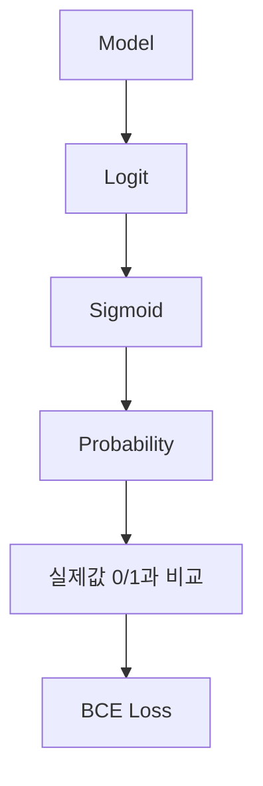
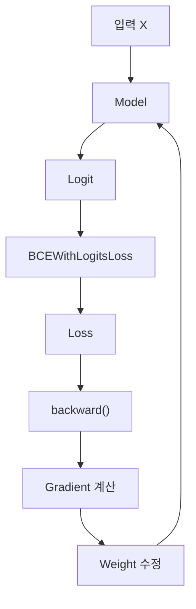

> 🗂️ **Notes · Deep Learning** — `pytorch` `loss-function` `bce-with-logits-loss` `logit` `sigmoid`
{: .prompt-info }

---

## 1. 💡 `BCEWithLogitsLoss`란?

`BCEWithLogitsLoss`는 주로 **이진 분류(Binary Classification)** 문제에서 사용하는 PyTorch
손실 함수이다.

예:

- 정상 / 불량
- 스팸 / 정상
- 구매 / 미구매
- 합격 / 불합격

PyTorch에서는 다음과 같이 사용한다.

```python
loss_fn = nn.BCEWithLogitsLoss()
```

`BCEWithLogitsLoss`는 모델이 출력한 **Logit을 직접 입력받아 Binary Cross Entropy Loss를
계산**한다.

개념적인 흐름은 다음과 같다.



> 💡 실제로 PyTorch는 `Sigmoid`와 BCE 계산을 하나로 결합하여 더 안정적으로 계산한다.
{: .prompt-info }

---

## 2. 💡 Logit이란?

`Logit`은 **분류 모델이 확률로 변환하기 전에 출력하는 원시 점수(Raw Score)**이다.

예를 들어 이진 분류 모델의 마지막 Layer가:

```python
nn.Linear(16, 1)
```

이라면 모델이 다음과 같은 값을 출력할 수 있다.

```text
2.0
```

> ⚠️ 이 `2.0`은 아직 확률이 아니다.
{: .prompt-warning }

```text
Model
  ↓
2.0
  ↓
Logit
```

Logit은 음수, 0, 양수 모두 가능하다.

```text
-3.2
-1.0
 0.0
 1.5
 4.8
```

---

## 3. 🔍 모든 모델 출력값을 Logit이라고 부르는가?

아니다.

보통 **분류 모델에서 확률 변환 전의 원시 출력값**을 Logit이라고 한다.

| 모델 출력 | 일반적인 명칭 |
|---|---|
| 이진 분류의 Sigmoid 이전 값 | `logit` |
| 다중 클래스의 Softmax 이전 값들 | `logits` |
| Sigmoid / Softmax 이후 | `probability` |
| 회귀 모델의 숫자 출력 | `prediction`, `output` |

따라서 단순히 모델이 출력했다는 이유만으로 모든 값을 Logit이라고 부르는 것은 아니다.

---

## 4. 🔍 Logit을 확률로 변환하기

이진 분류에서는 `Sigmoid` 함수를 사용하여 Logit을 `0~1` 사이의 확률로 변환한다.

```text
Logit
  ↓
Sigmoid
  ↓
0 ~ 1
  ↓
Probability
```

아래 그림은 Logit이 Sigmoid를 통과해 확률로 바뀌는 모습이다.

{: w="520" h="390" }

예를 들어:

```text
logit = 2.0
```

이라면 Sigmoid를 적용했을 때:

```text
약 0.88
```

이 된다.

즉:

```text
Positive Class일 확률 ≈ 88%
```

라고 해석할 수 있다.

반대로:

```text
logit = -2.0
```

이면:

```text
Sigmoid ≈ 0.12
```

이다.

---

## 5. 🔍 Logit과 Threshold

Sigmoid의 중요한 기준은:

```text
logit = 0
    ↓
Sigmoid
    ↓
확률 = 0.5
```

이라는 점이다.

따라서 기본 Threshold를 `0.5`로 사용하는 경우:

```text
logit > 0
→ 확률 > 0.5
→ Class 1

logit < 0
→ 확률 < 0.5
→ Class 0
```

으로 판단할 수 있다.

---

## 6. 📖 BCE란?

BCE는 `Binary Cross Entropy`의 약자이다.

**실제 정답 0/1과 모델이 예측한 확률을 비교하여 Loss를 계산하는 방법**이다.

실제 정답이:

```text
y = 1
```

이라고 하자.

### 예측 확률이 0.9인 경우

```text
실제값 = 1
예측확률 = 0.9

→ 정답에 매우 가까움
→ Loss 작음
```

### 예측 확률이 0.6인 경우

```text
실제값 = 1
예측확률 = 0.6

→ 방향은 맞음
→ 하지만 확신이 낮음
→ Loss가 더 큼
```

### 예측 확률이 0.1인 경우

```text
실제값 = 1
예측확률 = 0.1

→ 실제 정답과 반대
→ Loss 매우 큼
```

> 💡 즉 BCE는 단순히 맞았는지 틀렸는지만 보는 것이 아니라 **정답에 얼마나 높은 확률을
> 주었는지도 반영한다.**
{: .prompt-info }

---

## 7. 📖 BCE 공식

예측 확률을 `p`, 실제값을 `y`라고 하면 BCE는 다음과 같이 표현할 수 있다.

$$
BCE = -[y\log(p)+(1-y)\log(1-p)]
$$

정답이 `1`이라면:

$$
BCE=-\log(p)
$$

이므로 `p`가 1에 가까울수록 Loss가 작아진다.

아래 그림은 정답이 `1`일 때 예측 확률에 따라 Loss가 어떻게 달라지는지를 보여준다.

{: w="480" h="356" }

```text
정답 = 1

예측확률 0.99
→ Loss 매우 작음

예측확률 0.7
→ Loss 증가

예측확률 0.1
→ Loss 매우 큼
```

반대로 정답이 `0`이라면 예측 확률이 0에 가까울수록 Loss가 작아진다.

---

## 8. 💡 왜 이름이 `BCEWithLogitsLoss`인가?

이름을 나누면 이해하기 쉽다.

```text
BCE
+
With
+
Logits
+
Loss
```

즉:

> **Logit을 직접 입력받아서 BCE Loss까지 계산해주는 손실 함수**
{: .prompt-info }

이다.

일반적인 개념은:

```text
Model
  ↓
Logit
  ↓
Sigmoid
  ↓
Probability
  ↓
BCE
  ↓
Loss
```

이다.

`BCEWithLogitsLoss`가 이 과정을 하나의 손실 함수로 처리한다.

---

## 9. ⚠️ 모델 마지막에 Sigmoid를 넣지 않는다

`BCEWithLogitsLoss`를 사용할 경우 모델의 마지막 Layer에서 **Sigmoid를 적용하지 않는 것이
중요하다.**

다음과 같이 만들지 않는다.

```python
model = nn.Sequential(
    nn.Linear(4, 16),
    nn.ReLU(),
    nn.Linear(16, 1),
    nn.Sigmoid()
)

loss_fn = nn.BCEWithLogitsLoss()
```

대신:

```python
model = nn.Sequential(
    nn.Linear(4, 16),
    nn.ReLU(),
    nn.Linear(16, 1)
)

loss_fn = nn.BCEWithLogitsLoss()
```

처럼 만든다.

즉 모델은:

```text
Model
  ↓
Linear
  ↓
Logit
```

까지만 출력한다.

그리고 Logit을 그대로:

```python
loss = loss_fn(logits, y)
```

에 전달한다.

---

## 10. 🔍 왜 Sigmoid와 BCE를 하나로 처리할까?

다음과 같이 따로 계산할 수도 있다.

```python
probs = torch.sigmoid(logits)

loss_fn = nn.BCELoss()
loss = loss_fn(probs, y)
```

하지만 일반적으로는:

```python
loss_fn = nn.BCEWithLogitsLoss()

loss = loss_fn(logits, y)
```

를 사용한다.

> 📌 **이유** · PyTorch가 Logit에서 BCE를 계산하는 과정을 하나로 결합하여 **수치적으로 더
> 안정적으로 계산할 수 있기 때문**이다.
{: .prompt-tip }

따라서 일반적인 이진 분류에서는 `BCELoss`보다 `BCEWithLogitsLoss`를 사용하는 경우가 많다.

---

## 11. 🧪 실제 학습 과정

```python
logits = model(X)

loss = loss_fn(logits, y)

optimizer.zero_grad()

loss.backward()

optimizer.step()
```

전체 흐름:



모델은 BCE Loss가 작아지는 방향으로 Weight를 반복해서 수정한다.

---

## 12. 📖 Target 데이터 형태

`BCEWithLogitsLoss`에서는 정답을 일반적으로 **float 타입의 0과 1**로 사용한다.

예:

```python
y = torch.tensor([
    [1.0],
    [0.0],
    [1.0]
])
```

Batch Size가 3이라면:

```text
logits.shape = [3, 1]
y.shape      = [3, 1]
```

처럼 모델 출력과 Target의 Shape을 맞춰주는 것이 일반적이다.

---

## 13. 🔍 학습할 때와 예측할 때의 차이

### 학습할 때

Sigmoid를 직접 적용하지 않는다.

```python
logits = model(X)

loss = loss_fn(logits, y)
```

흐름:

```text
Model
 ↓
Logit
 ↓
BCEWithLogitsLoss
 ↓
Loss
```

### 실제 예측할 때

확률이 필요하다면 직접 Sigmoid를 적용한다.

```python
logits = model(X)

probs = torch.sigmoid(logits)
```

예:

```text
logits

[-2.0, 1.5, 3.0]

↓ Sigmoid

probabilities

[0.12, 0.82, 0.95]
```

Threshold가 `0.5`라면:

```python
preds = (probs >= 0.5).long()
```

결과:

```text
[0, 1, 1]
```

기본 Threshold `0.5`에서는 다음처럼 Logit 자체를 기준으로 판단할 수도 있다.

```python
preds = (logits > 0).long()
```

왜냐하면:

```text
logit > 0
↔ sigmoid(logit) > 0.5
```

이기 때문이다.

---

## 14. 🔍 `BCEWithLogitsLoss`와 `CrossEntropyLoss`

### 이진 분류

예:

```text
정상 / 불량
```

마지막 Layer:

```python
nn.Linear(16, 1)
```

Loss:

```python
nn.BCEWithLogitsLoss()
```

모델 출력:

```text
Logit 1개
```

### 다중 클래스 분류

예:

```text
고양이 / 강아지 / 새
```

3개 중 하나를 선택하는 문제라면:

```python
nn.Linear(16, 3)
```

Loss:

```python
nn.CrossEntropyLoss()
```

모델 출력:

```text
클래스별 Logit 3개
```

정리하면:

| 문제 | 모델 출력 | Loss |
|---|---|---|
| 이진 분류 | Logit 1개 | `BCEWithLogitsLoss` |
| 다중 클래스 분류 | 클래스별 Logits | `CrossEntropyLoss` |

---

## 15. 🧪 Multi-label Classification

`BCEWithLogitsLoss`는 이진 분류뿐만 아니라 **여러 정답이 동시에 존재할 수 있는 Multi-label
분류**에도 사용할 수 있다.

예를 들어 이미지 한 장에:

```text
사람 있음?   → 1
자동차 있음? → 1
강아지 있음? → 0
```

처럼 여러 항목이 동시에 `1`이 될 수 있다.

모델이:

```text
[2.1, 1.5, -0.8]
```

이라는 Logits를 출력했다면 각각 독립적으로 Sigmoid를 적용한다.

```text
사람    → 0.89
자동차  → 0.82
강아지  → 0.31
```

따라서 다음과 같이 사용할 수 있다.

```python
model = nn.Linear(16, 3)

loss_fn = nn.BCEWithLogitsLoss()
```

---

## 16. 🔍 불균형 데이터와 `pos_weight`

이진 분류에서는 Positive 데이터가 매우 적을 수 있다.

예:

```text
정상 = 9900개
불량 = 100개
```

이런 경우 Positive Class를 더 중요하게 학습시키기 위해 `pos_weight`를 사용할 수 있다.

```python
loss_fn = nn.BCEWithLogitsLoss(
    pos_weight=torch.tensor([5.0])
)
```

개념적으로는:

```text
Negative를 잘못 예측
→ 일반적인 Loss

Positive를 잘못 예측
→ 더 큰 Loss
```

를 주어 Positive Class를 놓치는 것에 더 큰 벌점을 줄 수 있다.

---

## 17. ✅ 핵심 정리

### 학습


### 예측


> 💡 **한 줄 요약** · **Logit은 분류 모델이 확률로 변환하기 전에 출력하는 원시 점수이다.
> `BCEWithLogitsLoss`는 이 Logit을 직접 입력받아 Sigmoid와 Binary Cross Entropy 계산을
> 안정적으로 함께 처리하는 손실 함수이며, 주로 이진 분류와 Multi-label 분류에서 사용한다.**
{: .prompt-info }

---

## 18. 🧠 핵심 기억 카드

<details markdown="1">
<summary><strong>펼쳐서 확인</strong></summary>

- **Logit** : 분류 모델이 확률로 변환하기 전에 출력하는 원시 점수, 음수·0·양수 모두 가능
- **명칭 구분** : Sigmoid/Softmax 이전은 `logit(s)`, 이후는 `probability`, 회귀는 `prediction`
- **Sigmoid** : Logit → `0~1` 확률 (logit 2.0 → 약 0.88, logit -2.0 → 약 0.12)
- **Threshold 기준** : `logit = 0` ↔ `확률 = 0.5`, 그래서 `logit > 0`이면 Class 1
- **BCE** : 정답 0/1과 예측 확률을 비교, 정답에 준 확률이 높을수록 Loss가 작다
- **공식** : `BCE = -[y·log(p) + (1-y)·log(1-p)]`, 정답이 1이면 `-log(p)`
- **BCEWithLogitsLoss** : Logit을 직접 받아 Sigmoid + BCE를 한 번에 계산
- **주의** : 모델 마지막에 `nn.Sigmoid()`를 넣지 않는다
- **하나로 처리하는 이유** : 수치적으로 더 안정적으로 계산할 수 있기 때문
- **Target** : float 0/1, `logits.shape`와 `y.shape`를 맞춘다
- **예측 시** : 확률이 필요하면 `torch.sigmoid()`, 아니면 `logits > 0`
- **Loss 선택** : 이진 분류 → Logit 1개 + `BCEWithLogitsLoss` / 다중 클래스 → Logits + `CrossEntropyLoss`
- **Multi-label** : 여러 정답이 동시에 가능, 각 항목에 독립적으로 Sigmoid
- **`pos_weight`** : 불균형 데이터에서 Positive를 놓치는 것에 더 큰 벌점

</details>

---

## 19. 🔗 관련 글

- [Sigmoid / Softmax — 이진·다중 분류 출력](/posts/sigmoid-softmax-classification-output/)
- [Loss Function과 Epoch 이해하기](/posts/loss-function-and-epoch/)
- [PyTorch argmax() 이해하기](/posts/pytorch-argmax-and-dim/)
