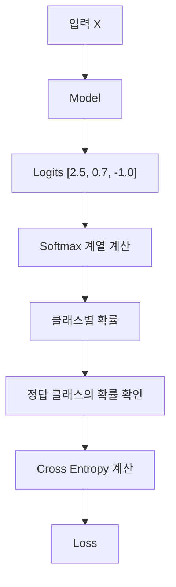
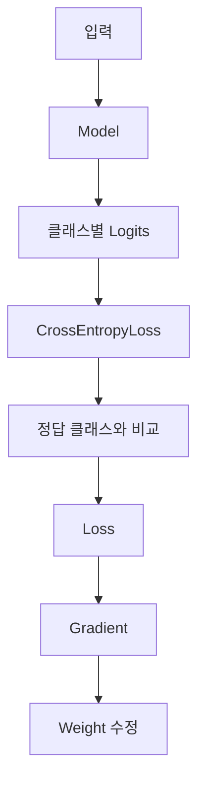

> 🗂️ **Notes · Deep Learning** — `pytorch` `loss-function` `cross-entropy-loss` `softmax` `logit`
{: .prompt-info }

---

## 1. 💡 `CrossEntropyLoss`란?

`CrossEntropyLoss`는 **여러 클래스 중 하나를 선택하는 다중 클래스 분류(Multi-class
Classification)**에서 주로 사용하는 손실 함수이다.

예를 들어 이미지가 다음 3개 중 하나라고 하자.

```text
0 = 고양이
1 = 강아지
2 = 새
```

모델의 마지막 출력층은 클래스 개수만큼 값을 출력한다.

```python
nn.Linear(16, 3)     # 모델 출력 → [2.5, 0.7, -1.0]
```

> ⚠️ 이 값들은 확률이 아니라 각 클래스에 대한 **Logits(원시 점수)**이다.
{: .prompt-warning }

---

## 2. 🔍 전체 동작 흐름

개념적으로는 다음 과정을 수행한다고 이해하면 된다.



> 💡 **정답 클래스의 점수가 다른 클래스보다 상대적으로 높을수록 Loss가 작아진다.**
{: .prompt-info }

---

## 3. 🧪 예시

실제 정답이 `0번(고양이)`이라고 하자. 같은 정답이라도 아래 그림처럼 Logits의 **상대적인
높이**에 따라 Loss가 달라진다.

![정답이 클래스 0일 때 세 가지 Logits 비교 — [5.0, 1.0, 0.2]는 정답 점수가 압도적으로 높아 Loss가 작고, [1.1, 1.0, 0.9]는 정답이 가장 높지만 차이가 작아 Loss가 상대적으로 크며, [0.2, 4.0, 1.0]은 다른 클래스 점수가 훨씬 높아 Loss가 매우 크다](/assets/img/posts/cross-entropy-loss/logits-loss-comparison.svg){: w="640" h="300" }

| Logits | 상황 | Loss |
| --- | --- | --- |
| `[5.0, 1.0, 0.2]` | 정답 클래스의 점수가 다른 클래스보다 매우 높다 | 작음 |
| `[1.1, 1.0, 0.9]` | 정답이 가장 높기는 하지만 다른 클래스와 차이가 작다 | 상대적으로 큼 |
| `[0.2, 4.0, 1.0]` | 다른 클래스의 점수가 훨씬 높다 | 매우 큼 |

---

## 4. 📖 Cross Entropy의 핵심 원리

정답 클래스의 예측 확률을 `p`라고 하면 핵심적으로 다음과 같이 생각할 수 있다.

$$
Loss = -\log(p)
$$

따라서 **정답 클래스 확률이 올라가면 Loss는 내려간다.**

| 정답 클래스 확률 | Loss |
|---:|---|
| 0.99 | 매우 작음 |
| 0.90 | 작음 |
| 0.50 | 커짐 |
| 0.10 | 매우 큼 |

> 💡 즉 **틀린 클래스를 강하게 확신할수록 더 큰 벌점**을 받는다.
{: .prompt-info }

---

## 5. ⚠️ Softmax를 직접 적용하지 않는다

PyTorch의 `CrossEntropyLoss`는 **Raw Logits를 직접 입력받도록 설계**되어 있다.

```python
model = nn.Sequential(
    nn.Linear(4, 16),
    nn.ReLU(),
    nn.Linear(16, 3)
)

loss_fn = nn.CrossEntropyLoss()

logits = model(X)
loss = loss_fn(logits, y)
```

모델 마지막에 `Softmax`를 따로 넣지 않는다.

```python
# 일반적으로 사용하지 않음
nn.Linear(16, 3)
nn.Softmax(dim=1)
```

> ⚠️ `CrossEntropyLoss`가 내부적으로 필요한 계산을 더 안정적으로 처리하기 때문이다.
{: .prompt-warning }

---

## 6. 📖 Target 형태

`CrossEntropyLoss`의 정답은 일반적으로 **클래스 번호**를 사용한다.

```python
y = torch.tensor(
    [0, 2, 1],
    dtype=torch.long
)
```

예를 들어 Batch Size가 3이고 클래스가 3개라면:

```text
logits.shape = [3, 3]
target.shape = [3]
```

각 데이터는 `데이터 1 → 정답 0`, `데이터 2 → 정답 2`, `데이터 3 → 정답 1`이라는 의미이다.

---

## 7. 🧪 실제 학습 과정

```python
logits = model(X)

loss = loss_fn(logits, y)

optimizer.zero_grad()
loss.backward()
optimizer.step()
```

모델은 이 과정을 반복하면서 **정답 클래스의 Logit은 높이고, 잘못된 클래스의 Logit은
상대적으로 낮추는 방향으로 학습**한다.

---

## 8. 🔍 예측할 때는 `argmax`

최종 클래스만 필요하다면 `Softmax`를 하지 않고 바로 `argmax()`를 사용할 수 있다.

```python
preds = torch.argmax(logits, dim=1)
```

```text
[2.5, 0.7, -1.0]
 ↑
가장 큰 값

→ Class 0
```

Softmax는 값의 순서를 바꾸지 않기 때문에 클래스 번호만 필요하다면 `Logits → argmax → 최종
Class`만으로 충분하다.

확률 자체가 필요할 때는:

```python
probs = torch.softmax(logits, dim=1)
```

을 사용한다.

---

## 9. 🔍 `BCEWithLogitsLoss`와 차이

| 구분 | `BCEWithLogitsLoss` | `CrossEntropyLoss` |
|---|---|---|
| 대표 문제 | 이진 분류 | 다중 클래스 분류 |
| 예 | 정상 / 불량 | 고양이 / 강아지 / 새 |
| 출력 | 보통 Logit 1개 | 클래스별 Logits |
| 확률 변환 | Sigmoid | Softmax |
| Target | 보통 `float` 0/1 | `long` 클래스 번호 |
| 마지막 층 | `Linear(..., 1)` | `Linear(..., 클래스 수)` |

```python
# 이진 분류
nn.Linear(16, 1)
nn.BCEWithLogitsLoss()

# 3개 클래스 분류
nn.Linear(16, 3)
nn.CrossEntropyLoss()
```

---

## 10. ✅ 핵심 정리



> 💡 **한 줄 요약** · **`CrossEntropyLoss`는 여러 클래스 중 하나를 맞히는 분류 문제에서
> 사용하며, 정답 클래스의 Logit이 다른 클래스보다 높아질수록 Loss가 작아진다. 학습할 때는
> Softmax를 따로 적용하지 않고 Raw Logits를 그대로 전달하는 것이 핵심이다.**
{: .prompt-info }

---

## 11. 🧠 핵심 기억 카드

<details markdown="1">
<summary><strong>펼쳐서 확인</strong></summary>

- **CrossEntropyLoss** : 여러 클래스 중 하나를 고르는 다중 클래스 분류용 손실 함수
- **모델 출력** : 마지막 층은 클래스 개수만큼 → `nn.Linear(16, 3)`
- **Logits** : 확률이 아닌 클래스별 원시 점수
- **핵심 원리** : `Loss = -log(p)`, `p`는 정답 클래스의 예측 확률
- **작아지는 조건** : 정답 클래스의 Logit이 다른 클래스보다 상대적으로 높을수록
- **벌점** : 틀린 클래스를 강하게 확신할수록 더 큰 Loss
- **Softmax 금지** : 모델 마지막에 `nn.Softmax()`를 넣지 않고 Raw Logits를 그대로 전달
- **Target** : `long` 타입 클래스 번호, `logits [3, 3]` ↔ `target [3]`
- **예측** : 클래스 번호만 필요하면 `argmax(dim=1)`, 확률이 필요하면 `torch.softmax()`
- **BCE와 차이** : 이진 분류 = Logit 1개 + Sigmoid / 다중 분류 = 클래스별 Logits + Softmax

</details>

---

## 12. 🔗 관련 글

- [BCEWithLogitsLoss와 Logit 이해하기](/posts/bce-with-logits-loss/)
- [Sigmoid / Softmax — 이진·다중 분류 출력](/posts/sigmoid-softmax-classification-output/)
- [PyTorch argmax() 이해하기](/posts/pytorch-argmax-and-dim/)
