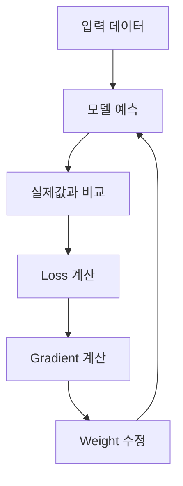
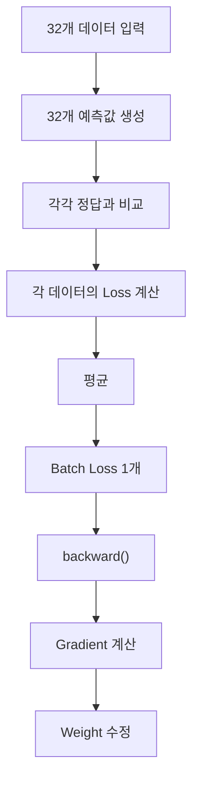
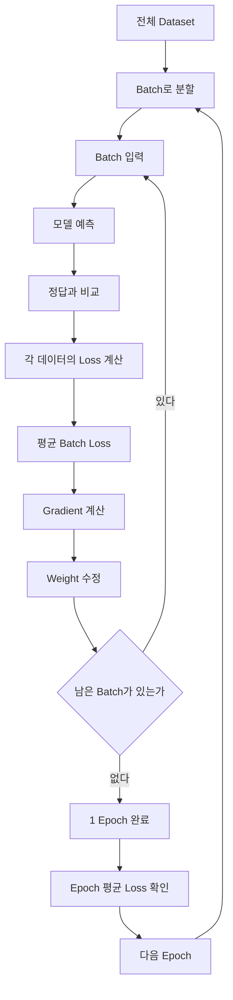

> 🗂️ **Notes · Deep Learning** — `loss-function` `mse-loss` `cross-entropy-loss` `epoch` `batch`
{: .prompt-info }

---

## 1. 💡 Loss Function이란?

Loss Function(손실 함수)은 **모델의 예측값이 실제 정답과 얼마나 다른지를 숫자로 표현하는
함수**이다.



| Loss 값 | 의미 |
| --- | --- |
| Loss가 크다 | 모델의 예측 오차가 큼 |
| Loss가 작다 | 모델의 예측이 정답에 가까움 |

> 📌 **학습의 핵심 목적** · **Loss가 작아지도록 Weight와 Bias를 수정하는 것**이다.
{: .prompt-tip }

---

## 2. 📖 MSELoss

MSE(Mean Squared Error)는 주로 **회귀 문제**에서 사용하는 대표적인 손실 함수이다.

공식:

$$
MSE = \frac{1}{n}\sum(y-\hat{y})^2
$$

| 기호 | 의미 |
| --- | --- |
| `y` | 실제값 |
| `ŷ` | 모델의 예측값 |
| `n` | 데이터 개수 |

MSE의 계산 과정은:

```text
실제값과 예측값의 차이
        ↓
       제곱
        ↓
       평균
        ↓
     MSE Loss
```

예를 들어:

| 실제값 | 예측값 | 차이 | 차이² |
| --: | --: | -: | --: |
|  10 |   8 | -2 |   4 |
|  20 |  21 |  1 |   1 |
|  30 |  27 | -3 |   9 |

따라서:

$$
MSE = \frac{4+1+9}{3}=4.67
$$

> 💡 **한 줄 정리** · MSE는 **`차이 → 제곱 → 평균`**이라는 정해진 계산 방식을 사용한다.
{: .prompt-info }

---

## 3. 🔍 왜 차이를 제곱할까?

### ① 음수와 양수 오차가 서로 없어지는 것을 막기 위해

예를 들어:

```text
오차 = -2
오차 = +2
```

그냥 더하면:

```text
-2 + 2 = 0
```

이 되어 실제로 두 번 틀렸음에도 오차가 없는 것처럼 보인다.

제곱하면:

```text
(-2)² = 4
(+2)² = 4
```

모든 오차가 양수가 되어 **얼마나 많이 틀렸는지** 비교할 수 있다.

### ② 크게 틀린 예측에 더 큰 벌점을 주기 위해

```text
오차 1  → 1²  = 1
오차 2  → 2²  = 4
오차 5  → 5²  = 25
오차 10 → 10² = 100
```

오차가 커질수록 Loss가 훨씬 빠르게 커진다.

따라서 MSE를 사용하면 모델은:

> **작은 오차보다 큰 오차를 더 강하게 줄이도록 학습한다.**
{: .prompt-info }

### ③ Gradient 기반 학습에 적합하기 때문에

오차를 `e`라고 하면:

$$
Loss = e^2
$$

오차가 클수록 Gradient도 커질 수 있으므로:

```text
큰 오차
   ↓
큰 Gradient
   ↓
Weight를 더 크게 수정

작은 오차
   ↓
작은 Gradient
   ↓
Weight를 조금 수정
```

하는 방식으로 학습할 수 있다.

---

## 4. 🔍 왜 여러 Loss의 평균을 낼까?

모델은 보통 데이터 하나가 아니라 **여러 데이터를 Batch로 묶어서 학습**한다.

예를 들어 Batch에 데이터가 3개 있고 각각의 제곱 오차가:

```text
데이터 1 → 4
데이터 2 → 1
데이터 3 → 9
```

라면 평균은:

$$
\frac{4+1+9}{3}=4.67
$$

이다.

즉:

```text
각 데이터의 Loss

[4, 1, 9]

     ↓ 평균

Batch를 대표하는 Loss

4.67
```

> 📌 **평균을 사용하는 이유** · **데이터 개수와 관계없이 비교하기 쉬운 하나의 대표 Loss를
> 만들기 위해서**이다.
{: .prompt-tip }

예를 들어 단순 합계를 사용하면:

```text
Batch 32개  → Loss 합계 64
Batch 128개 → Loss 합계 256
```

처럼 데이터가 많다는 이유만으로 값이 커질 수 있다.

평균을 사용하면:

```text
Batch 32개  → 평균 Loss 2.0
Batch 128개 → 평균 Loss 2.0
```

처럼 Batch 크기가 달라도 모델의 평균적인 오차를 비교하기 쉽다.

> 일반적인 학습에서는 **Batch의 개별 Loss를 평균낸 값을 Batch Loss로 사용하는 경우가 많다.**
{: .prompt-info }

---

## 5. 🔍 Batch Loss와 학습

예를 들어 Batch Size가 32라면 다음 흐름으로 진행된다.



즉 모델은 보통 **Batch 하나를 처리할 때마다 Loss를 계산하고 Weight를 수정**한다.

---

## 6. 💡 Epoch란?

Epoch는 **전체 학습 데이터를 모델이 한 번 모두 학습한 것**을 의미한다.

예를 들어 학습 데이터가 1,000개이고:

```python
BATCH_SIZE = 100
```

이라면:

```text
Batch 1  → 100개
Batch 2  → 100개
Batch 3  → 100개
...
Batch 10 → 100개
```

총 10개의 Batch를 모두 처리하면:

```text
전체 데이터 1,000개 학습 완료

= 1 Epoch
```

이다.

따라서:

```python
EPOCHS = 5
```

는 **전체 학습 데이터를 총 5번 반복해서 학습한다**는 뜻이다.

```text
전체 데이터 학습 → Epoch 1
전체 데이터 학습 → Epoch 2
전체 데이터 학습 → Epoch 3
전체 데이터 학습 → Epoch 4
전체 데이터 학습 → Epoch 5
```

---

## 7. ⚠️ Loss는 매번 내려가야 할까?

아니다.

특히 Batch마다 포함되는 데이터가 다르기 때문에 Batch Loss는 다음처럼 흔들릴 수 있다.

```text
0.8 → 0.5 → 0.7 → 0.4 → 0.6
```

따라서 **각 Batch Loss 하나하나가 계속 내려가는지를 보는 것보다 Epoch 단위의 평균 Loss
흐름을 보는 것이 중요하다.**

예를 들어:

```text
Epoch 1 → Loss 0.82
Epoch 2 → Loss 0.61
Epoch 3 → Loss 0.48
Epoch 4 → Loss 0.51
Epoch 5 → Loss 0.39
```

이 값을 그래프로 그리면 아래 그림처럼 Epoch 4에서 한 번 올라가지만 전체 흐름은 계속
내려간다.

{: w="500" h="320" }

Epoch 4에서:

```text
0.48 → 0.51
```

로 잠깐 증가했지만 전체적으로 보면:

```text
0.82 → 0.61 → 0.48 → 0.51 → 0.39
```

감소하는 추세이므로 정상적인 학습일 수 있다.

> ⚠️ Loss는 매번 반드시 감소해야 하는 것이 아니라 **전체적인 감소 추세가 중요하다.**
{: .prompt-warning }

---

## 8. 💡 Train Loss와 Validation Loss

학습 과정에서는 보통 두 종류의 Loss를 확인한다.

### Train Loss

**학습에 사용한 데이터에서 계산한 Loss**

```text
Train 데이터
     ↓
모델 학습
     ↓
Train Loss
```

모델이 학습 데이터에서 얼마나 잘 맞추고 있는지 확인한다.

### Validation Loss

**학습에 직접 사용하지 않은 검증 데이터에서 계산한 Loss**

```text
Validation 데이터
        ↓
현재 모델로 예측
        ↓
Validation Loss
```

처음 보는 데이터에서도 모델이 잘 작동하는지를 확인한다.

---

## 9. 🔍 Epoch에 따른 Loss 흐름 해석

두 Loss가 어떤 방향으로 움직이는지에 따라 아래 그림처럼 해석이 달라진다.

{: w="560" h="290" }

### 정상적인 학습

```text
Epoch 증가

Train Loss ↓
Valid Loss ↓
```

모델이 학습 데이터와 새로운 데이터 모두에서 점점 좋아지고 있다는 뜻이다.

### 과적합(Overfitting)

```text
Epoch 증가

Train Loss ↓
Valid Loss ↑
```

학습 데이터에서는 계속 좋아지지만 새로운 데이터에서는 성능이 나빠지는 상태이다.

> ⚠️ 즉 모델이 **학습 데이터를 지나치게 외우기 시작한 것**으로 볼 수 있다.
{: .prompt-warning }

---

## 10. 🔍 몇 Epoch 동안 학습할까?

정해진 횟수는 없다.

간단한 실습에서는 예를 들어:

```python
EPOCHS = 20
```

또는:

```python
EPOCHS = 50
```

```python
EPOCHS = 100
```

등으로 설정하고 Loss의 변화 흐름을 확인할 수 있다.

실무에서는 단순히 정해진 Epoch까지 무조건 학습하기보다 **Validation Loss가 더 이상
좋아지지 않으면 학습을 중단**하기도 한다.

예:

```text
Epoch 20 → valid_loss 0.31
Epoch 21 → valid_loss 0.30
Epoch 22 → valid_loss 0.30
Epoch 23 → valid_loss 0.31
Epoch 24 → valid_loss 0.32
Epoch 25 → valid_loss 0.31
```

여러 Epoch 동안 개선이 없다면 학습을 중단할 수 있다.

> 💡 이를 **Early Stopping**이라고 한다.
{: .prompt-info }

---

## 11. 📖 CrossEntropyLoss

`CrossEntropyLoss`는 주로 **다중 클래스 분류 문제**에서 사용한다.

예를 들어 실제 정답이 클래스 `0`이고:

```text
logits = [5.0, 1.0, 0.2]
          ↑
        정답
```

이라면 정답 클래스의 logit이 다른 클래스보다 높기 때문에 Loss가 작아진다.

반대로:

```text
logits = [0.5, 4.0, 2.0]
          ↑
        정답
```

처럼 다른 클래스의 점수가 더 높다면 Loss가 커진다.

즉:

> **정답 클래스의 logit이 다른 클래스보다 상대적으로 높을수록 CrossEntropyLoss는
> 작아진다.**
{: .prompt-info }

PyTorch에서는:

```python
loss_fn = nn.CrossEntropyLoss()

loss = loss_fn(logits, labels)
```

처럼 사용한다.

> ⚠️ 학습할 때는 일반적으로 `Softmax`를 직접 적용하지 않고 **모델의 logits를 그대로
> `CrossEntropyLoss`에 전달**한다.
{: .prompt-warning }

---

## 12. ⚠️ Loss와 Accuracy는 다른 개념이다

예를 들어 실제 정답이 고양이라고 하자.

```text
모델 A

고양이 51%
강아지 49%

→ 고양이 예측
```

```text
모델 B

고양이 95%
강아지 5%

→ 고양이 예측
```

둘 다 최종적으로 고양이를 선택했으므로 Accuracy에서는 둘 다 정답이다.

하지만 모델 B가 정답을 훨씬 확신하고 있으므로 **Loss는 모델 B가 더 작다.**

| 지표 | 무엇을 보는가 |
| --- | --- |
| Accuracy | 맞았는가 / 틀렸는가 |
| Loss | 예측이 정답에서 얼마나 벗어났는가 |

따라서 학습이 잘 진행되면 일반적으로:

```text
Loss ↓
Accuracy ↑
```

방향으로 움직이지만 두 지표는 완전히 같은 의미가 아니다.

---

## 13. ✅ 핵심 정리

전체 학습 흐름은 다음과 같다.



> 💡 **한 줄 요약** · **Loss Function은 모델의 예측 오차를 숫자로 표현하며, 모델은 Batch마다
> Loss를 계산해 Weight를 수정한다. 전체 학습 데이터를 한 번 모두 학습하면 1 Epoch이며,
> Loss는 매번 감소할 필요는 없고 여러 Epoch에 걸친 전체적인 감소 추세와 Validation Loss를
> 함께 확인하는 것이 중요하다.**
{: .prompt-info }

---

## 14. 🧠 핵심 기억 카드

<details markdown="1">
<summary><strong>펼쳐서 확인</strong></summary>

- **Loss Function** : 예측값이 정답과 얼마나 다른지를 숫자로 표현하는 함수
- **학습 목적** : Loss가 작아지도록 Weight와 Bias를 수정
- **MSE** : `차이 → 제곱 → 평균`, 주로 회귀 문제
- **제곱하는 이유** : 오차 상쇄 방지 / 큰 오차에 더 큰 벌점 / Gradient 기반 학습에 적합
- **평균을 내는 이유** : 데이터 개수와 관계없이 비교하기 쉬운 대표 Loss 하나를 만들기 위해
- **Batch Loss** : Batch 하나를 처리할 때마다 계산하고 Weight를 수정
- **Epoch** : 전체 학습 데이터를 한 번 모두 학습한 것
- **Loss 해석** : 매번 감소해야 하는 것이 아니라 전체적인 감소 추세가 중요
- **과적합** : Train Loss ↓ 인데 Valid Loss ↑
- **Early Stopping** : Validation Loss가 더 이상 좋아지지 않으면 학습 중단
- **CrossEntropyLoss** : 다중 클래스 분류, Softmax 없이 logits를 그대로 전달
- **Loss vs Accuracy** : Loss는 정답에서 벗어난 정도, Accuracy는 맞았는지 여부

</details>

---

## 15. 🔗 관련 글

- [MSELoss 이해하기 — 차이, 제곱, 평균](/posts/mse-loss/)
- [Loss의 reduction — mean, sum, none](/posts/loss-reduction-mean-sum-none/)
- [데이터 분리와 평가지표 — train/valid/test](/posts/train-valid-test-split-and-metrics/)
