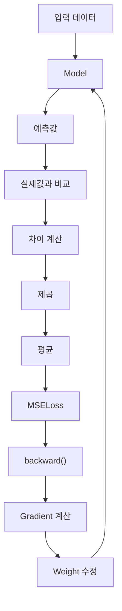
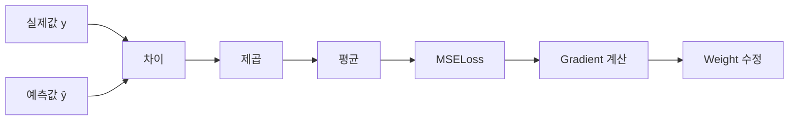

> 🗂️ **Notes · Deep Learning** — `pytorch` `loss-function` `mse-loss` `regression` `rmse`
{: .prompt-info }

---

## 1. 💡 `MSELoss`란?

`MSELoss`는 **모델의 예측값과 실제값의 차이를 제곱한 뒤 평균내는 손실 함수**이다.

MSE는 `Mean Squared Error`의 약자이며, 주로 **회귀(Regression)** 문제에서 사용한다.

예:

- 집값 예측
- 매출 예측
- 판매량 예측
- 온도 예측
- 배송 시간 예측

PyTorch에서는 다음과 같이 사용한다.

```python
loss_fn = nn.MSELoss()
```

---

## 2. 📖 계산 공식

MSE의 기본 공식은 다음과 같다.

$$
MSE = \frac{1}{n}\sum (y-\hat{y})^2
$$

| 기호 | 의미 |
| --- | --- |
| `y` | 실제값 |
| `ŷ` | 모델의 예측값 |
| `n` | 데이터 개수 |

계산 과정은 다음과 같다.

```text
실제값과 예측값의 차이 계산
            ↓
           제곱
            ↓
           평균
            ↓
         MSE Loss
```

> 💡 **한 줄 정리** · **차이 → 제곱 → 평균**이 MSE의 기본 계산 방식이다.
{: .prompt-info }

---

## 3. 🧪 실제 계산 예시

실제값과 예측값이 다음과 같다고 하자.

| 실제값 | 예측값 | 차이 | 차이² |
|---:|---:|---:|---:|
| 10 | 8 | -2 | 4 |
| 20 | 21 | 1 | 1 |
| 30 | 27 | -3 | 9 |

각 차이를 제곱하면:

```text
(-2)² = 4
1²    = 1
(-3)² = 9
```

그리고 평균을 계산한다.

$$
MSE = \frac{4+1+9}{3}
$$

$$
MSE \approx 4.67
$$

따라서:

```text
MSELoss = 4.67
```

이다.

---

## 4. 🔍 왜 차이를 제곱할까?

### ① 양수와 음수 오차가 서로 상쇄되지 않도록 하기 위해

예를 들어 오차가:

```text
-2
+2
```

라면 그냥 더했을 때:

```text
-2 + 2 = 0
```

이 된다.

> ⚠️ 실제로는 두 번 틀렸지만 오차가 없는 것처럼 보이게 된다.
{: .prompt-warning }

제곱하면:

```text
(-2)² = 4
(+2)² = 4
```

모든 오차를 양수로 만들 수 있다.

### ② 큰 오차에 더 큰 벌점을 주기 위해

제곱을 사용하면 오차가 커질수록 Loss가 훨씬 빠르게 증가한다.

```text
오차 1  → 1²  = 1
오차 2  → 2²  = 4
오차 5  → 5²  = 25
오차 10 → 10² = 100
```

이 관계를 그래프로 보면 아래 그림처럼 오차가 커지는 속도보다 Loss가 커지는 속도가 훨씬
빠르다.

{: w="470" h="340" }

오차가 5에서 10으로 2배 커질 때 Loss는 25에서 100으로 4배 커진다.

> 💡 따라서 MSE는 작은 오차보다 **크게 틀린 예측을 더욱 강하게 줄이도록 모델을 학습**시킨다.
{: .prompt-info }

### ③ Gradient 기반 학습에 적합하기 때문에

오차를 `e`라고 하면:

$$
Loss = e^2
$$

이 함수의 Gradient는 오차가 클수록 커진다.

개념적으로:

```text
큰 오차
   ↓
큰 Gradient
   ↓
Weight를 더 크게 수정

작은 오차
   ↓
작은 Gradient
   ↓
Weight를 조금 수정
```

모델은 Gradient를 이용하여 Loss가 작아지는 방향으로 Weight를 수정한다.

---

## 5. 🔍 왜 평균을 낼까?

모델은 일반적으로 데이터 하나씩이 아니라 여러 데이터를 `Batch`로 묶어서 학습한다.

예를 들어 하나의 Batch에서 제곱 오차가:

```text
[4, 1, 9]
```

라면 평균은:

$$
\frac{4+1+9}{3}=4.67
$$

이다.

즉:

```text
여러 데이터의 제곱 오차

[4, 1, 9]

      ↓ 평균

Batch를 대표하는 Loss

4.67
```

> 📌 **평균을 사용하는 이유** · 데이터 개수가 달라져도 **평균적으로 모델이 얼마나
> 틀렸는지 비교하기 쉬워진다.**
{: .prompt-tip }

---

## 6. 🧪 학습에서는 어떻게 사용되는가?

PyTorch에서는 다음과 같이 사용할 수 있다.

```python
preds = model(X)

loss = loss_fn(preds, y)

optimizer.zero_grad()
loss.backward()
optimizer.step()
```

전체 흐름은 다음과 같다.



모델은 이 과정을 반복하면서 **MSELoss가 작아지는 방향으로 학습**한다.

---

## 7. ⚠️ MSELoss의 특징

MSELoss는 큰 오차를 제곱하기 때문에 **이상치(Outlier)에 민감하다.**

예를 들어 대부분의 오차가:

```text
1, 2, 1, 3
```

인데 하나의 오차가:

```text
100
```

이라면:

```text
100² = 10000
```

이 되어 하나의 큰 오차가 전체 Loss에 매우 큰 영향을 줄 수 있다.

> ⚠️ 따라서 이상치가 많은 데이터에서는 `MAE`와 같은 다른 손실 함수를 고려하기도 한다.
{: .prompt-warning }

---

## 8. 🔍 MSE와 RMSE 차이

### MSE

제곱 오차의 평균이다.

```text
오차
 ↓
제곱
 ↓
평균
 ↓
MSE
```

### RMSE

MSE에 다시 제곱근을 적용한다.

$$
RMSE = \sqrt{MSE}
$$

예:

```text
MSE = 25

RMSE = √25
     = 5
```

> 💡 RMSE는 실제값과 같은 단위로 돌아오기 때문에 결과를 해석하기 더 쉬운 경우가 있다.
{: .prompt-info }

---

## 9. ✅ 핵심 정리

전체 흐름은 다음과 같다.



> 💡 **한 줄 요약** · **MSELoss는 회귀 문제에서 예측값과 실제값의 차이를 제곱하고
> 평균내어 모델의 오차를 측정하는 손실 함수이다. 큰 오차에 더 큰 벌점을 주며, 모델은 이
> Loss를 줄이는 방향으로 Weight를 학습한다.**
{: .prompt-info }

---

## 10. 🧠 핵심 기억 카드

<details markdown="1">
<summary><strong>펼쳐서 확인</strong></summary>

- **MSELoss** : 예측값과 실제값의 차이를 제곱한 뒤 평균내는 손실 함수
- **MSE** : `Mean Squared Error`, 주로 회귀 문제에 사용
- **계산 순서** : 차이 → 제곱 → 평균
- **제곱 이유 ①** : 양수·음수 오차가 서로 상쇄되지 않도록
- **제곱 이유 ②** : 큰 오차에 더 큰 벌점 (오차 10 → Loss 100)
- **제곱 이유 ③** : 오차가 클수록 Gradient가 커져 Gradient 기반 학습에 적합
- **평균 이유** : 데이터 개수가 달라도 평균적인 오차를 비교하기 쉬움
- **약점** : 이상치(Outlier)에 민감 → `MAE` 등을 고려하기도 함
- **RMSE** : `√MSE`, 실제값과 같은 단위라 해석이 쉬운 경우가 있음

</details>

---

## 11. 🔗 관련 글

- [Loss Function과 Epoch 이해하기](/posts/loss-function-and-epoch/)
- [Loss의 reduction — mean, sum, none](/posts/loss-reduction-mean-sum-none/)
