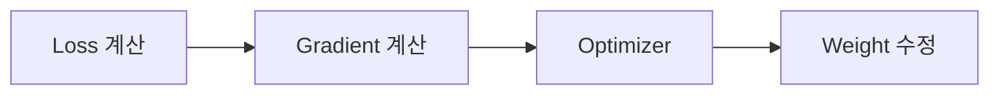
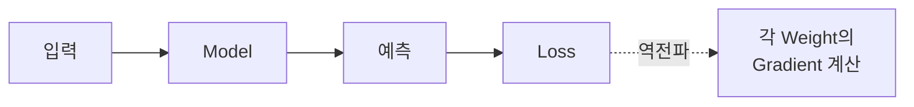
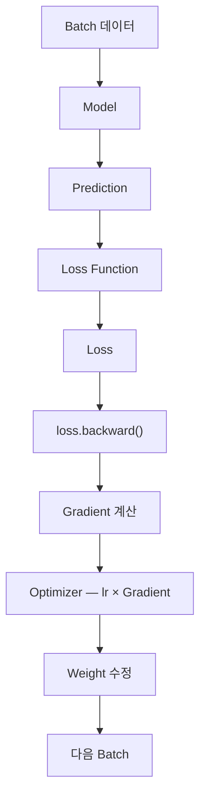

> 🗂️ **Notes · Deep Learning** — `pytorch` `optimizer` `sgd` `learning-rate` `backpropagation`
{: .prompt-info }

---

## 1. 💡 Optimizer란?

Optimizer는 **Loss를 줄이기 위해 모델의 Weight를 실제로 수정하는 역할**을 한다.



> 💡 **어디로 움직일지는 Gradient가 알려주고, 실제로 Weight를 수정하는 것은 Optimizer가
> 한다.**
{: .prompt-info }

---

## 2. 📖 `backward()`와 역전파

`loss.backward()`는 **Loss가 각 Weight에 얼마나 영향을 받았는지 Gradient를 계산하는
과정**이다. 이 과정이 바로 **역전파(Backpropagation)**이다.



중요한 점은 다음 둘의 역할이 나뉘어 있다는 것이다.

| 호출 | 하는 일 |
| --- | --- |
| `backward()` | Gradient 계산만 함 |
| `optimizer.step()` | 실제 Weight 수정 |

---

## 3. 💡 Gradient란?

Gradient는 **Weight를 어느 방향으로 바꾸면 Loss가 변하는지 알려주는 기울기**이다.

쉽게 말하면 **어느 방향으로 움직여야 하는지 알려주는 값**이다. 모델은 Loss를 줄여야 하므로
**Gradient의 반대 방향**으로 Weight를 움직인다.

---

## 4. 🔍 Learning Rate

Learning Rate(`lr`)는 **Weight를 한 번에 얼마나 크게 수정할지 정하는 값**이다.

$$
새로운\ Weight = 기존\ Weight - LearningRate \times Gradient
$$

예를 들어 `Weight = 5.0`, `Gradient = 2.0`, `lr = 0.1`이라면:

```text
새 Weight
= 5.0 - (0.1 × 2.0)
= 4.8
```

> 📌 **쉽게 기억하기** · Gradient는 **방향**, Learning Rate는 **보폭**.
{: .prompt-tip }

값에 따라 아래 그림처럼 학습이 달라진다.

{: w="660" h="304" }

| Learning Rate | 결과 |
| --- | --- |
| 너무 작으면 | Weight를 조금씩만 수정 → Loss는 내려가지만 학습이 느림 |
| 너무 크면 | Weight를 너무 크게 수정 → 최적점을 지나침 → Loss가 흔들리거나 발산 |
| 적절하면 | Loss가 비교적 빠르고 안정적으로 감소 |

따라서 Learning Rate가 적절한지는 **여러 Epoch 동안 Loss가 빠르면서도 안정적으로
내려가는지**를 보고 판단한다.

---

## 5. 📖 SGD

`SGD(Stochastic Gradient Descent)`는 가장 기본적인 Optimizer 중 하나이다.

```python
optimizer = torch.optim.SGD(
    model.parameters(),
    lr=0.01
)
```

기본 원리는 매우 단순하다 — `Gradient 계산 → Learning Rate 적용 → Weight 수정`.

$$
w_{new} = w_{old} - lr \times gradient
$$

SGD는 보통 **Batch 하나를 학습할 때마다 Weight를 한 번 수정**한다.

```text
Batch 1 → Loss → Gradient → Weight 수정
Batch 2 → Loss → Gradient → Weight 수정
...
```

전체 데이터를 한 번 모두 학습하면 **1 Epoch**이다.

---

## 6. 🔍 SGD + Momentum

SGD는 Gradient 방향이 계속 바뀌면 지그재그로 움직일 수 있다. `Momentum`을 사용하면 **이전에
이동하던 방향을 일부 기억**해서 더 부드럽게 이동한다.

```python
optimizer = torch.optim.SGD(
    model.parameters(),
    lr=0.01,
    momentum=0.9
)
```

{: w="560" h="270" }

| Optimizer | 무엇을 보고 움직이는가 |
| --- | --- |
| SGD | 현재 Gradient 중심 |
| SGD + Momentum | 현재 Gradient + 이전 이동 방향 |

---

## 7. 🧪 전체 학습 흐름



PyTorch 코드로 보면:

```python
optimizer.zero_grad()

pred = model(x)

loss = loss_fn(pred, y)

loss.backward()

optimizer.step()
```

| 호출 | 역할 |
| --- | --- |
| `zero_grad()` | 이전 Gradient 초기화 |
| `model(x)` | 예측 |
| `loss_fn()` | Loss 계산 |
| `backward()` | Gradient 계산 |
| `optimizer.step()` | Weight 수정 |

---

## 8. ✅ 핵심 정리

| 개념 | 역할 |
|---|---|
| Loss | 얼마나 틀렸는지 |
| Backward | Gradient 계산 |
| Gradient | 어느 방향으로 수정할지 |
| Learning Rate | 얼마나 크게 수정할지 |
| Optimizer | 실제 Weight 수정 |
| SGD | Gradient를 이용해 Weight를 수정하는 기본 Optimizer |

> 💡 **한 줄 요약** · **Optimizer 학습의 핵심은 `Loss 계산 → backward로 Gradient 계산 →
> Learning Rate를 적용해 Weight 수정`의 반복이다.**
{: .prompt-info }

---

## 9. 🧠 핵심 기억 카드

<details markdown="1">
<summary><strong>펼쳐서 확인</strong></summary>

- **Optimizer** : Loss를 줄이기 위해 Weight를 실제로 수정하는 역할
- **역할 분담** : Gradient는 방향을 알려주고, Optimizer가 수정한다
- **`backward()`** : 역전파 — Gradient 계산만 한다
- **`optimizer.step()`** : 실제 Weight 수정
- **Gradient** : Weight를 어느 방향으로 바꾸면 Loss가 변하는지 알려주는 기울기
- **이동 방향** : Loss를 줄여야 하므로 Gradient의 **반대 방향**
- **Learning Rate** : 한 번에 얼마나 크게 수정할지 = 보폭
- **업데이트 식** : `w_new = w_old - lr × gradient`
- **lr이 작으면** : 학습이 느림 / **크면** : 최적점을 지나쳐 흔들리거나 발산
- **SGD** : Batch 하나마다 Weight를 한 번 수정하는 기본 Optimizer
- **Momentum** : 이전 이동 방향을 일부 기억해 지그재그를 줄인다
- **`zero_grad()`** : 이전 Gradient 초기화 (학습 루프의 첫 단계)

</details>

---

## 10. 🔗 관련 글

- [Loss Function과 Epoch 이해하기](/posts/loss-function-and-epoch/)
- [PyTorch 코드 기본 구조](/posts/pytorch-training-script-structure/)
- [MSELoss 이해하기 — 차이, 제곱, 평균](/posts/mse-loss/)
