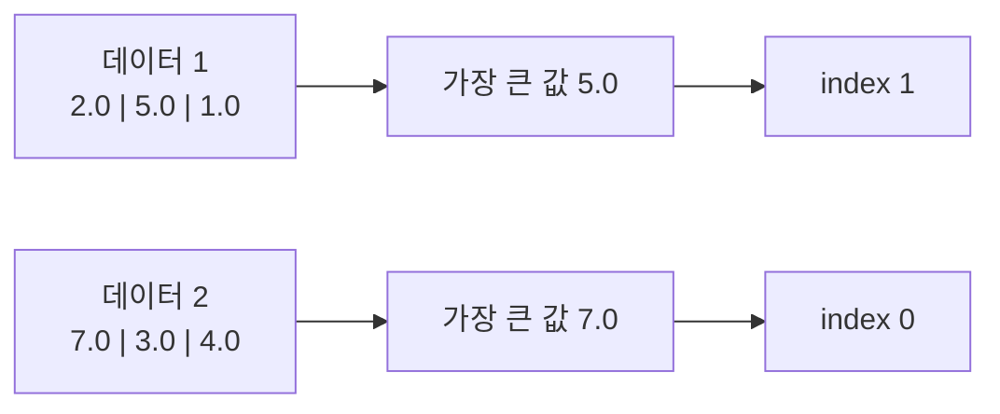

> 🗂️ **Notes · Deep Learning** — `pytorch` `argmax` `dim` `classification` `accuracy`
{: .prompt-info }

---

## 1. 💡 `argmax()`란?

`argmax()`는 여러 숫자 중에서 **가장 큰 값의 위치(index)**를 반환하는 함수이다.

예를 들어:

```python
import torch

x = torch.tensor([2.1, 0.5, 1.2])

result = torch.argmax(x)

print(result)
# tensor(0)
```

가장 큰 값은 `2.1`이고, 이 값의 index가 `0`이므로 결과는 `0`이다.

```text
index      0    1    2
값       [2.1, 0.5, 1.2]
          ↑
        가장 큼

argmax → 0
```

> `argmax()`는 가장 큰 값 자체가 아니라 **그 값이 위치한 index를 반환한다.**
{: .prompt-info }

---

## 2. 📖 머신러닝에서는 왜 사용할까?

다중 분류 모델은 보통 하나의 데이터를 보고 클래스마다 **점수(logit)**를 출력한다.

예를 들어 상품 이미지를 세 가지 카테고리로 분류한다고 하자.

```text
클래스 0 → 운동화
클래스 1 → 가방
클래스 2 → 모자
```

모델의 출력이 다음과 같다면:

```python
logits = torch.tensor([1.2, 3.8, 0.7])
```

의미는 다음과 같다.

| 클래스 | 의미  | Logit |
| --- | --- | ----: |
| 0   | 운동화 |   1.2 |
| 1   | 가방  |   3.8 |
| 2   | 모자  |   0.7 |

가장 높은 점수는 `3.8`이고 index는 `1`이다.

```python
pred = torch.argmax(logits)

print(pred)
# tensor(1)
```

따라서 모델의 최종 예측은:

```text
1 → 가방
```

이 된다.

### 흐름


---

## 3. 🧪 여러 데이터를 한 번에 처리할 때

실제 딥러닝에서는 하나의 데이터보다 **Batch 단위**로 여러 데이터를 처리하는 경우가 많다.

예를 들어 이미지가 3개이고 클래스가 3개라면:

```python
logits = torch.tensor([
    [5.0, 1.0, 0.3],
    [0.2, 4.2, 1.1],
    [0.5, 1.3, 3.7]
])
```

shape은:

```python
print(logits.shape)

# torch.Size([3, 3])
```

의미는:

```text
[데이터 개수, 클래스 개수]
        ↓
      [3, 3]
```

각 행은 하나의 데이터에 대한 클래스 점수이다.

```text
데이터 1 → [5.0, 1.0, 0.3]
데이터 2 → [0.2, 4.2, 1.1]
데이터 3 → [0.5, 1.3, 3.7]
```

각 데이터별로 가장 높은 클래스 점수를 찾으려면:

```python
pred_labels = torch.argmax(logits, dim=1)

print(pred_labels)

# tensor([0, 1, 2])
```

결과는:

```text
데이터 1 → 클래스 0
데이터 2 → 클래스 1
데이터 3 → 클래스 2
```

이다.

---

## 4. 💡 `dim=1`은 무슨 뜻인가?

`dim`은 **어느 차원을 기준으로 계산할 것인지** 지정한다.

예를 들어:

```python
x = torch.tensor([
    [2.0, 5.0, 1.0],
    [7.0, 3.0, 4.0]
])
```

shape은:

```text
[2, 3]

2 → 데이터 2개
3 → 각 데이터의 값 3개
```

### `dim=1`

```python
torch.argmax(x, dim=1)
```

각 행 내부에서 가장 큰 값을 찾는다.

```text
[2, 5, 1] → index 1
[7, 3, 4] → index 0

결과
[1, 0]
```

즉 다중 분류에서는 보통:

```python
torch.argmax(logits, dim=1)
```

을 사용한다.

### 그림으로 보면



---

## 5. 🔍 `dim=0`과 `dim=1`의 차이

Tensor가:

```python
x = torch.tensor([
    [2.0, 5.0, 1.0],
    [7.0, 3.0, 4.0]
])
```

일 때:

### `dim=1`

```python
torch.argmax(x, dim=1)
```

각 **행 안에서** 비교한다.

```text
[2, 5, 1] → 1
[7, 3, 4] → 0

결과 → [1, 0]
```

### `dim=0`

```python
torch.argmax(x, dim=0)
```

각 **열을 기준으로** 비교한다.

```text
2 vs 7 → index 1
5 vs 3 → index 0
1 vs 4 → index 1

결과 → [1, 0, 1]
```

다중 분류 모델의 일반적인 출력이:

```text
[Batch, Classes]
```

이므로 **Classes가 있는 두 번째 차원을 비교하기 위해 `dim=1`을 사용**한다.

---

## 6. 💡 `dim`에는 어떤 값을 넣을 수 있을까?

Tensor의 차원 수에 따라 사용할 수 있는 `dim`이 정해진다.

| Tensor Shape        | 차원 수 | 가능한 양수 `dim` |
| ------------------- | ---: | ------------ |
| `[3]`               |  1차원 | `0`          |
| `[4, 3]`            |  2차원 | `0, 1`       |
| `[32, 3, 224]`      |  3차원 | `0, 1, 2`    |
| `[32, 3, 224, 224]` |  4차원 | `0, 1, 2, 3` |

즉 **N차원 Tensor라면 `0 ~ N-1`까지 존재**한다.

음수 index도 사용할 수 있다.

```text
dim=-1 → 마지막 차원
dim=-2 → 뒤에서 두 번째 차원
```

따라서:

```python
logits.shape
# [32, 3]
```

이라면:

```python
torch.argmax(logits, dim=1)
```

과

```python
torch.argmax(logits, dim=-1)
```

은 같은 의미이다.

---

## 7. 🔍 `argmax()`와 Softmax의 관계

모델이 다음 logits를 출력했다고 하자.

```python
logits = torch.tensor([
    [2.0, 1.0, 0.1]
])
```

Softmax를 적용하면 대략:

```text
logits
[2.0, 1.0, 0.1]

       ↓ Softmax

확률
[0.66, 0.24, 0.10]
```

가 된다.

두 경우 모두 가장 큰 값의 위치는 `0`이다.

```python
torch.argmax(logits, dim=1)
# tensor([0])

probs = torch.softmax(logits, dim=1)

torch.argmax(probs, dim=1)
# tensor([0])
```

즉:

```text
argmax(logits)
        =
argmax(softmax(logits))
```

이다.

Softmax는 값의 크기를 확률 형태로 변환하지만 **값의 순서는 바꾸지 않기 때문**이다.

따라서 최종 클래스 번호만 필요하다면 보통 Softmax를 먼저 계산하지 않고:

```python
pred_labels = torch.argmax(logits, dim=1)
```

처럼 바로 사용할 수 있다.

---

## 8. 🧪 `argmax()` 결과로 무엇을 할까?

가장 대표적인 용도는 **Accuracy 계산**이다.

정답이:

```python
y = torch.tensor([0, 1, 1])
```

이고 모델 예측이:

```python
pred_labels = torch.tensor([0, 1, 2])
```

라면:

```python
pred_labels == y
```

결과:

```text
[True, True, False]
```

이를 이용해:

```python
accuracy = (pred_labels == y).float().mean()

print(accuracy)

# 약 0.6667
```

즉 약 `66.7%`의 Accuracy가 나온다.

전체 흐름은 다음과 같다.


---

## 9. 🧪 실제 다중 분류 코드

```python
import torch
import torch.nn as nn

model = nn.Sequential(
    nn.Linear(4, 16),
    nn.ReLU(),
    nn.Linear(16, 3)
)

X = torch.randn(32, 4)

logits = model(X)

print(logits.shape)
# torch.Size([32, 3])

pred_labels = torch.argmax(logits, dim=1)

print(pred_labels.shape)
# torch.Size([32])
```

shape 변화는:

```text
입력
[32, 4]

   ↓ Linear(4,16)

[32, 16]

   ↓ ReLU

[32, 16]

   ↓ Linear(16,3)

logits
[32, 3]

   ↓ argmax(dim=1)

예측 클래스
[32]
```

즉 32개 데이터 각각에 대해 하나의 클래스 번호를 얻는다.

---

## 10. 🔍 이진 분류에서는 항상 `argmax()`를 사용할까?

아니다.

이진 분류에서 모델이 **logit 하나만 출력하는 구조**라면 일반적으로 `argmax()`를 사용하지 않는다.

예:

```python
nn.Linear(16, 1)
```

출력이:

```text
[32, 1]
```

이라면 보통 Sigmoid나 logit 기준값을 이용한다.

```python
preds = (logits > 0).long()
```

또는:

```python
probs = torch.sigmoid(logits)

preds = (probs >= 0.5).long()
```

즉:

```text
다중 분류
[Batch, Classes]
→ argmax()

이진 분류
[Batch, 1]
→ threshold
```

라고 구분하면 이해하기 쉽다.

---

## 11. 🧪 실제 사례

### 상품 카테고리 분류

```text
0 → 의류
1 → 가방
2 → 신발
```

모델:

```text
[1.2, 4.5, 0.7]
```

`argmax()`:

```text
index 1
```

최종 결과:

```text
가방
```

### 이미지 동물 분류

```text
0 → 고양이
1 → 강아지
2 → 토끼
```

모델:

```text
[0.8, 3.7, 1.2]
```

`argmax()`:

```text
index 1
```

최종 결과:

```text
강아지
```

즉 `argmax()`는 쉽게 말하면:

> **여러 후보에게 모델이 점수를 준 뒤 가장 높은 점수를 받은 후보의 번호를 선택하는 과정이다.**
{: .prompt-info }

---

## 12. ⚠️ 자주 헷갈리는 부분

> **`argmax()`가 가장 큰 값을 반환한다?** 아니다.
>
> ```python
> x = torch.tensor([2.0, 8.0, 3.0])
>
> torch.argmax(x)
> # tensor(1)
> ```
>
> 반환하는 것은 `8.0`이 아니라 **8.0이 있는 index `1`**이다. 가장 큰 값 자체가 필요하다면
> `torch.max(x)`를 사용한다.
{: .prompt-warning }

> **Softmax를 반드시 하고 `argmax()`해야 한다?** 아니다.
>
> 최종 클래스만 필요하다면 `torch.argmax(logits, dim=1)`만으로 충분하다. Softmax는
> **클래스별 확률을 확인하고 싶을 때** 사용하면 된다.
{: .prompt-warning }

> **여러 데이터인데 `dim`을 생략해도 될까?** 주의해야 한다.
>
> `torch.argmax(logits)`처럼 `dim`을 지정하지 않으면 Tensor 전체를 하나로 보고 가장 큰
> 값 하나를 찾는다. 다중 분류 Batch에서는 보통 `torch.argmax(logits, dim=1)`처럼 각
> 데이터별로 클래스를 선택해야 한다.
{: .prompt-warning }

---

## 13. ✅ 핵심 정리

```text
모델
 ↓
logits
 ↓
각 클래스의 점수
 ↓
argmax(dim=1)
 ↓
가장 높은 점수의 index
 ↓
예측 클래스 번호
```

> 💡 **한 줄 요약** · `torch.argmax(logits, dim=1)`은 **각 데이터가 가진 여러 클래스
> 점수 중 가장 높은 점수의 index를 찾아 최종 예측 클래스 번호로 변환하는 함수**이다.
{: .prompt-info }

---

## 14. 🔗 관련 글

- [Sigmoid / Softmax — 이진·다중 분류 출력](/posts/sigmoid-softmax-classification-output/)
