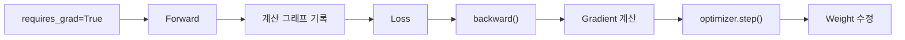
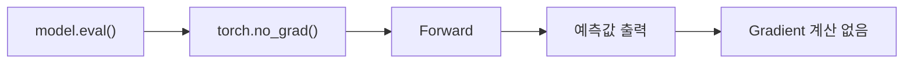

> 🗂️ **Notes · Deep Learning** — `pytorch` `requires-grad` `no-grad` `computation-graph` `gradient`
{: .prompt-info }

---

## 1. 💡 PyTorch가 `backward()`를 미리 예측하는 것은 아니다

PyTorch가 나중에 `backward()`를 할지 **예측하는 것은 아니다.**

대신 학습 가능한 Parameter는 보통 다음처럼 `requires_grad=True` 상태이다.

```python
model.weight.requires_grad
# True
```

이 값이 계산에 참여하면 PyTorch가 **Gradient 계산에 필요한 연산 과정을 기록**한다. 이렇게
기록된 계산 흐름을 **Computation Graph(계산 그래프)**라고 한다.

나중에 `loss.backward()`를 실행하면 PyTorch가 이 계산 그래프를 거꾸로 따라가면서 각
Weight의 Gradient를 계산한다.

```text
Forward → 계산 과정 기록
Loss → backward() → 기록된 계산을 역방향으로 추적 → Gradient 계산
```

> 💡 `requires_grad=True`인 값이 계산에 참여하면, PyTorch는 나중에 Gradient 계산이 필요할
> 수 있으므로 계산 과정을 기록한다.
{: .prompt-info }

---

## 2. 🔍 `torch.no_grad()`는 왜 사용할까?

검증이나 실제 예측에서는 보통 Weight를 수정하지 않는다.

학습할 때는 `예측 → Loss → backward() → Gradient → Weight 수정`이 필요하지만, 실제
예측에서는 `입력 → Model → 예측값`이면 충분하다. 이때 계산 그래프를 만드는 것은
불필요하다.

{: w="700" h="372" }

그래서 다음처럼 사용한다.

```python
with torch.no_grad():
    output = model(x)
```

의미는:

> **"이 블록 안에서는 나중에 `backward()`를 하지 않을 것이므로 Gradient 계산용 기록을
> 만들지 마."**
{: .prompt-info }

이다.

---

## 3. 📖 `no_grad()`를 사용하면 좋은 점

Gradient 계산을 위해서는 Forward 과정에서 **여러 중간값을 저장**해야 한다. 학습할 때는 이
중간값이 `backward()`에서 쓰이지만, 예측할 때는 역전파용 기록 자체가 필요 없다.

따라서 `torch.no_grad()`를 사용하면:

- 불필요한 계산 그래프 생성을 막을 수 있다.
- 메모리 사용량을 줄일 수 있다.
- 검증·추론을 더 효율적으로 수행할 수 있다.

---

## 4. 🔍 `requires_grad`와 `no_grad`의 차이

| 구분 | 의미 |
| --- | --- |
| `requires_grad=True` | 이 Tensor가 참여하는 계산을 Gradient 계산용으로 추적 가능 |
| `torch.no_grad()` | 해당 블록 안의 계산만 일시적으로 Gradient 추적 OFF |

> ⚠️ 중요한 점은 `no_grad()`를 사용해도 **Parameter 자체의 설정이 바뀌는 것은 아니라는
> 것**이다.
{: .prompt-warning }

```python
model.weight.requires_grad
# True

with torch.no_grad():
    output = model(x)

model.weight.requires_grad
# 여전히 True
```

{: w="620" h="210" }

---

## 5. ⚠️ `no_grad()` 안에서 만든 출력은 backward할 수 없다

```python
with torch.no_grad():
    output = model(x)
```

이 계산에서는 Gradient용 계산 그래프를 만들지 않는다. 따라서 이 `output`을 이용해 나중에
역전파하려고 해도 정상적으로 Gradient를 계산할 수 없다.

> ⚠️ 그래서 `torch.no_grad()`는 **학습하지 않고 검증이나 예측만 할 때** 사용한다.
{: .prompt-warning }

---

## 6. ✅ 핵심 정리

### 학습



### 검증 / 예측



> 💡 **한 줄 요약** · **PyTorch는 `backward()`를 미리 예측하는 것이 아니라,
> `requires_grad=True`인 Parameter가 계산에 참여하면 Gradient 계산을 위해 연산 과정을
> 기록한다. 반대로 검증이나 예측처럼 backward가 필요 없는 경우에는 `torch.no_grad()`를
> 사용해 해당 블록의 Gradient 추적을 일시적으로 끄고 메모리와 계산량을 줄인다.**
{: .prompt-info }

---

## 7. 🧠 핵심 기억 카드

<details markdown="1">
<summary><strong>펼쳐서 확인</strong></summary>

- **오해 정정** : PyTorch가 나중에 `backward()`를 할지 미리 예측하는 것이 아니다
- **기록의 조건** : `requires_grad=True`인 값이 계산에 참여하면 연산 과정을 기록한다
- **Computation Graph** : 그렇게 기록된 계산 흐름
- **`backward()`** : 이 계산 그래프를 거꾸로 따라가며 Gradient 계산
- **`torch.no_grad()`** : "이 블록에서는 backward를 안 하니 기록하지 마"
- **효과** : 불필요한 그래프 생성 방지, 메모리 절감, 검증·추론 효율
- **왜 절감되나** : Gradient 계산에는 Forward의 중간값 저장이 필요한데 예측엔 불필요
- **범위 차이** : `requires_grad`는 Tensor의 설정 / `no_grad()`는 블록 단위 일시 OFF
- **주의** : `no_grad()` 안에서도 `model.weight.requires_grad`는 여전히 `True`
- **제약** : `no_grad()` 안에서 만든 출력은 backward할 수 없다
- **사용처** : 학습하지 않고 검증·예측만 할 때

</details>

---

## 8. 🔗 관련 글

- [Weight와 Chain Rule 이해하기](/posts/weight-and-chain-rule/)
- [PyTorch 학습 5단계와 비지도학습](/posts/pytorch-training-5-steps/)
- [PyTorch 코드 기본 구조](/posts/pytorch-training-script-structure/)
