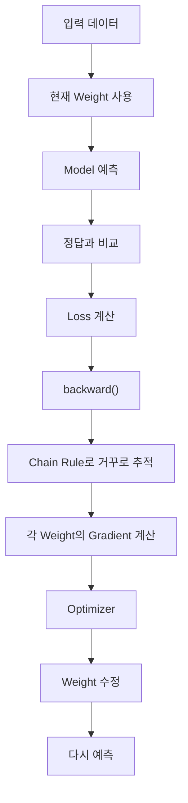

> 🗂️ **Notes · Deep Learning** — `pytorch` `weight` `chain-rule` `backpropagation` `gradient`
{: .prompt-info }

---

## 1. 💡 Weight란?

`Weight`는 **입력값이 모델의 예측에 얼마나 영향을 줄지 조절하는 학습 가능한 숫자**이다.

예를 들어 상품 판매량을 예측한다고 하면:

```text
광고비 × Weight
가격   × Weight
리뷰수 × Weight
        ↓
      예측값
```

모델은 처음에는 적절한 Weight를 모르기 때문에 임의의 값으로 시작하고, 학습하면서 계속
수정한다.

```text
초기 Weight → 예측 → Loss 확인 → Weight 수정 → 더 나은 예측
```

> 💡 즉 모델이 **학습한다는 것은 결국 Weight를 더 좋은 값으로 바꾸는 과정**이라고 볼 수 있다.
{: .prompt-info }

---

## 2. ❓ 그런데 어떤 Weight를 어떻게 수정할까?

예를 들어 실제 판매량이 `100`인데 모델 예측값이 `70`이라면 예측이 틀렸으므로 `Loss`가
발생한다.

이제 모델은 다음 문제를 해결해야 한다.

> **"어떤 Weight가 이 오차에 얼마나 영향을 줬는가?"**
{: .prompt-tip }

이것을 알아야 어떤 Weight를 많이 수정하고, 어떤 Weight를 조금 수정할지 결정할 수 있다.
여기서 사용하는 원리가 **Chain Rule(연쇄법칙)**이다.

---

## 3. 🔍 Chain Rule이란?

Chain Rule은 **최종 결과가 왜 이렇게 나왔는지 연결된 계산을 거꾸로 따라가며 각 단계의
영향도를 찾는 방법**이다.

신경망의 계산은 아래 그림처럼 위에서 아래로 흐르고, 학습할 때는 그 흐름을 거꾸로 거슬러
올라간다.

{: w="660" h="392" }

예측할 때는 `입력 → Weight → 예측 → Loss` 순으로 계산한다. 이를 **Forward(순전파)**라고
한다.

반대로 학습할 때는 Loss에서 시작해서 거꾸로 올라가며 이렇게 묻는다.

```text
예측값은 Loss에 얼마나 영향을 줬지?
   ↓
중간 계산은 예측값에 얼마나 영향을 줬지?
   ↓
각 Weight는 얼마나 영향을 줬지?
```

이렇게 각 Weight가 Loss에 미친 영향을 연결해서 계산하는 것이 Chain Rule의 핵심이다.

---

## 4. 📖 Chain Rule과 Gradient

Chain Rule로 계산한 결과를 이용해 각 Weight의 `Gradient`를 구한다.

```text
Loss → Chain Rule → 각 Weight의 영향도 계산 → Gradient
```

Gradient는 쉽게 말하면:

> **해당 Weight를 어느 방향으로 얼마나 민감하게 바꾸면 Loss가 변하는지 알려주는 값**
{: .prompt-info }

이다. PyTorch에서는 이 과정을 `loss.backward()`가 자동으로 처리한다.

```python
loss.backward()
# → Chain Rule을 이용한 역전파
# → 각 Weight의 Gradient 계산
```

---

## 5. ⚠️ Weight는 언제 실제로 바뀔까?

`backward()`는 Gradient만 계산한다. **Weight를 수정하지는 않는다.** 실제 Weight 수정은
Optimizer가 한다.

```python
optimizer.step()
```

예를 들어 SGD의 기본 원리는 다음과 같다.

```text
새 Weight
= 기존 Weight - Learning Rate × Gradient
```

즉 역할이 이렇게 나뉜다.

| 무엇이 | 무엇을 정하는가 |
| --- | --- |
| Gradient | 어느 방향으로 수정할지 |
| Learning Rate | 얼마나 크게 수정할지 |
| Optimizer | 실제 Weight 수정 |

---

## 6. 🧪 전체 학습 흐름



PyTorch 코드로 보면:

```python
optimizer.zero_grad()

outputs = model(inputs)

loss = criterion(outputs, targets)

loss.backward()

optimizer.step()
```

역할을 연결하면:

| 코드 | 역할 |
| --- | --- |
| `model(inputs)` | 현재 Weight로 예측 |
| `loss` | 얼마나 틀렸는지 계산 |
| `backward()` | Chain Rule을 이용해 각 Weight의 Gradient 계산 |
| `optimizer.step()` | Gradient를 이용해 Weight 수정 |

---

## 7. ✅ 핵심 정리

| 개념 | 의미 |
|---|---|
| `Weight` | 모델이 학습하면서 수정하는 값 |
| `Loss` | 현재 예측이 얼마나 틀렸는지 |
| `Chain Rule` | Loss에서 Weight까지 거꾸로 영향도를 추적하는 원리 |
| `Gradient` | 각 Weight를 어떻게 수정해야 할지 알려주는 값 |
| `backward()` | Chain Rule을 이용해 Gradient 계산 |
| `optimizer.step()` | Gradient를 이용해 실제 Weight 수정 |

> 💡 **한 줄 요약** · **딥러닝 학습은 현재 Weight로 예측하고 → Loss를 계산하고 → Chain
> Rule로 각 Weight가 Loss에 미친 영향을 찾아 Gradient를 계산한 뒤 → Optimizer가 Weight를
> 수정하는 과정을 반복하는 것이다.**
{: .prompt-info }

---

## 8. 🧠 핵심 기억 카드

<details markdown="1">
<summary><strong>펼쳐서 확인</strong></summary>

- **Weight** : 입력이 예측에 얼마나 영향을 줄지 조절하는 학습 가능한 숫자
- **학습이란** : Weight를 더 좋은 값으로 바꾸는 과정
- **핵심 질문** : "어떤 Weight가 이 오차에 얼마나 영향을 줬는가?"
- **Chain Rule** : 연결된 계산을 거꾸로 따라가며 각 단계의 영향도를 찾는 원리
- **Forward** : 입력 → Weight → 예측 → Loss (위에서 아래로)
- **역방향 추적** : Loss → 예측값 → 중간 계산 → 각 Weight (아래에서 거꾸로)
- **Gradient** : 그 Weight를 어느 방향으로 얼마나 민감하게 바꾸면 Loss가 변하는지
- **`backward()`** : Chain Rule을 이용한 역전파 — Gradient 계산만 한다
- **`optimizer.step()`** : 실제 Weight 수정
- **SGD 갱신식** : `새 Weight = 기존 Weight - Learning Rate × Gradient`

</details>

---

## 9. 🔗 관련 글

- [Optimizer와 Learning Rate — SGD로 Weight 수정하기](/posts/optimizer-sgd-learning-rate/)
- [PyTorch 학습 5단계와 비지도학습](/posts/pytorch-training-5-steps/)
- [가중치/편향과 nn.Linear](/posts/nn-linear-weight-bias/)
