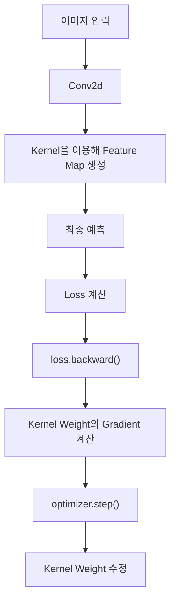
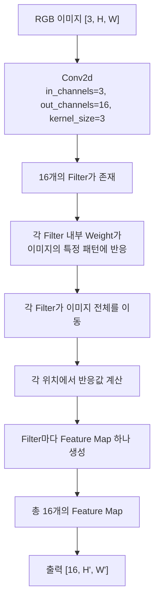

> 🗂️ **Notes · Deep Learning** — `pytorch` `cnn` `conv2d` `kernel` `feature-map`
{: .prompt-info }

---

## 1. 💡 Kernel이란?

CNN에서 `Kernel`은 이미지의 작은 영역을 보면서 **특정 패턴에 얼마나 강하게 반응하는지
계산하는 작은 특징 탐지기**이다.

```python
nn.Conv2d(
    in_channels=3,
    out_channels=16,
    kernel_size=3
)
```

| 인자 | 의미 |
| --- | --- |
| `in_channels=3` | 입력 채널 수 |
| `out_channels=16` | 사용할 Kernel(Filter) 수 |
| `kernel_size=3` | 한 번에 보는 영역 크기 3×3 |

---

## 2. 🔍 우리가 정하는 것은 Kernel의 "크기"

`kernel_size=3`이라고 하면 Kernel은 이미지에서 한 번에 `3 × 3` 영역을 본다.

하지만 우리가 직접:

```text
"이 Kernel은 세로선을 찾아라"
"이 Kernel은 곡선을 찾아라"
```

라고 설정하지는 않는다.

> 💡 무슨 특징을 찾을지는 **Kernel 내부의 Weight 값이 학습되면서 결정된다.**
{: .prompt-info }

---

## 3. 📖 Kernel 안에도 Weight가 있다

흑백 이미지에서 `3×3 Kernel` 하나는 개념적으로 다음과 같은 9개의 Weight를 가진다.

```text
Kernel

[ 0.2  -0.1   0.5 ]
[ 0.7   0.3  -0.4 ]
[-0.2   0.8   0.1 ]
```

이 값들은 고정값이 아니라 **학습 가능한 Parameter**이다. 즉 다음처럼 구분해서 이해하면 된다.

| 용어 | 의미 |
| --- | --- |
| `kernel_size` | Kernel의 크기 |
| Kernel Weight | 어떤 패턴에 반응할지를 결정하는 값 |

---

## 4. 🔍 Kernel은 특징을 어떻게 찾을까?

Kernel은 이미지의 작은 영역과 자신의 Weight를 비교한다. **같은 위치끼리 곱한 뒤 결과를 모두
더해서 하나의 숫자**를 만든다.

{: w="700" h="296" }

---

## 5. 🔍 반응값이 크다는 것은?

Kernel의 Weight가 어떤 패턴에 맞춰져 있다고 가정하면, 그 패턴과 비슷한 이미지 영역에서 큰
값이 나온다.

| 이미지 영역과 Kernel 패턴 | 반응값 |
| --- | --- |
| 비슷함 | 큼 |
| 다름 | 작음 |

그래서 Kernel을 **특정 패턴을 찾는 탐지기**라고 이해할 수 있다.

---

## 6. 📖 Feature Map은 어떻게 만들어질까?

Kernel은 한 위치만 보는 것이 아니라 이미지 전체를 이동한다. 각 위치에서 반응값을 하나씩
계산한다.

```text
위치 1 → 0.2
위치 2 → 0.1
위치 3 → 3.8
위치 4 → 4.2
...
```

이 결과를 공간 형태로 모은 것이 `Feature Map`이다.

```text
[0.1  0.2  3.8  0.1]
[0.0  0.3  4.2  0.2]
[0.1  0.1  3.9  0.1]
```

> 💡 **Feature Map** = Kernel이 이미지 각 위치에서 얼마나 강하게 반응했는지를 기록한 지도
{: .prompt-info }

---

## 7. ❓ Kernel은 처음부터 특징을 알고 있을까?

아니다. 처음에는 Kernel Weight가 초기화되어 있어 특별한 의미가 없다.

```text
Kernel 1 → 초기 Weight
Kernel 2 → 초기 Weight
Kernel 3 → 초기 Weight
```

이 상태에서 학습이 시작된다.

---

## 8. 🔍 Kernel도 일반 Weight처럼 학습된다

CNN 학습 흐름은 일반 신경망과 동일하다.



이 과정을 반복하면서 Loss가 감소하는 방향으로 Kernel Weight가 변한다.

---

## 9. 🔍 학습 결과 Kernel마다 다른 특징을 찾게 된다

학습이 진행되면 각 Kernel이 서로 다른 패턴에 반응하게 될 수 있다.

```text
Kernel 1 → 세로선에 강하게 반응
Kernel 2 → 가로선에 강하게 반응
Kernel 3 → 모서리에 강하게 반응
Kernel 4 → 특정 질감에 강하게 반응
```

> ⚠️ 중요한 점은 사람이 직접 "세로선을 찾아라"라고 설정한 것이 아니라는 것이다. Loss를
> 줄이는 방향으로 Weight가 학습된 결과, 서로 다른 특징을 찾게 되는 것이다.
{: .prompt-warning }

---

## 10. 📖 `out_channels`와 Kernel 개수

`out_channels=16`이므로 서로 다른 Filter가 16개 존재한다.

```text
Filter 개수 = out_channels = 생성되는 Feature Map 개수
```

---

## 11. 🔍 RGB 이미지에서는 Kernel이 단순한 3×3이 아니다

RGB 이미지는 Channel이 `R`, `G`, `B` 3개이다. 따라서
`nn.Conv2d(in_channels=3, out_channels=16, kernel_size=3)`에서 하나의 Filter는 실제로
다음 Weight를 모두 가진다.

```text
R 채널용 3×3
G 채널용 3×3
B 채널용 3×3
```

즉 Filter 하나의 Shape은:

```text
[3, 3, 3]

 ↑  ↑  ↑
 C  H  W
```

이다.

---

## 12. 📖 Conv2d의 전체 Weight Shape

```python
conv = nn.Conv2d(
    in_channels=3,
    out_channels=16,
    kernel_size=3
)

print(conv.weight.shape)
# torch.Size([16, 3, 3, 3])
```

![Conv2d weight shape torch.Size([16, 3, 3, 3])의 각 숫자가 뜻하는 것 — 16은 Filter 개수(out_channels), 3은 각 Filter가 보는 입력 Channel 수(in_channels), 3×3은 Kernel의 공간 크기이며 Filter 하나가 Feature Map 하나를 만든다](/assets/img/posts/cnn-kernel/conv2d-weight-shape.svg){: w="720" h="372" }

따라서 Conv2d Weight Shape은 기본적으로 다음 형태이다.

```text
[out_channels, in_channels, kernel_height, kernel_width]
```

---

## 13. 🧪 전체 흐름으로 연결하기



---

## 14. ✅ 핵심 개념 구분

| 개념 | 의미 |
| --- | --- |
| `kernel_size` | 탐지기가 한 번에 보는 범위 |
| Kernel Weight | 무엇에 반응할지 결정하는 학습 가능한 값 |
| Kernel / Filter | 작은 특징 탐지기 |
| Feature Map | Kernel이 이미지 전체를 탐색한 반응 결과 지도 |
| `out_channels` | 사용하는 Filter의 개수 = 생성되는 Feature Map의 개수 |
| 학습 | Kernel Weight를 Loss가 줄어드는 방향으로 수정하는 과정 |

> 💡 **한 줄 요약** · **Kernel은 크기만 직접 지정하고, 무엇을 찾을지는 내부 Weight가
> 학습하면서 결정한다. 학습된 Kernel이 이미지 전체를 이동하며 각 위치의 특징 반응값을
> 계산하고, 그 결과를 모은 것이 Feature Map이다.**
{: .prompt-info }

---

## 15. 🧠 핵심 기억 카드

<details markdown="1">
<summary><strong>펼쳐서 확인</strong></summary>

- **Kernel** : 이미지의 작은 영역을 보며 특정 패턴에 얼마나 반응하는지 계산하는 특징 탐지기
- **우리가 정하는 것** : `kernel_size` (크기)뿐 — 무엇을 찾을지는 Weight가 학습으로 결정
- **Kernel 내부** : `3×3`이면 학습 가능한 Weight 9개
- **계산 방식** : 같은 위치끼리 곱하기 → 모두 더하기 → 반응값 하나
- **반응값** : Kernel 패턴과 비슷하면 크고, 다르면 작다
- **Feature Map** : Kernel이 이미지 전체를 이동하며 만든 반응값의 지도
- **초기 상태** : Kernel Weight는 초기화되어 있어 특별한 의미가 없다
- **학습 방식** : 일반 신경망과 동일 — `Loss → backward → Gradient → step`
- **학습 결과** : Kernel마다 세로선·가로선·모서리·질감 등 다른 패턴에 반응하게 될 수 있다
- **RGB에서** : Filter 하나가 R/G/B 각각의 `3×3` Weight를 모두 가진다 → `[3, 3, 3]`
- **Weight Shape** : `[out_channels, in_channels, kernel_height, kernel_width]`
- **`out_channels`** : Filter 개수 = 생성되는 Feature Map 개수

</details>

---

## 16. 🔗 관련 글

- [CNN의 Padding과 Stride 이해하기](/posts/cnn-padding-and-stride/)
- [딥러닝 Weight 정리 — 비슷한 개념과 구분하기](/posts/deep-learning-weight/)
- [Weight와 Chain Rule 이해하기](/posts/weight-and-chain-rule/)
