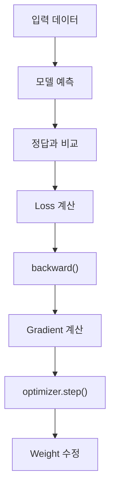
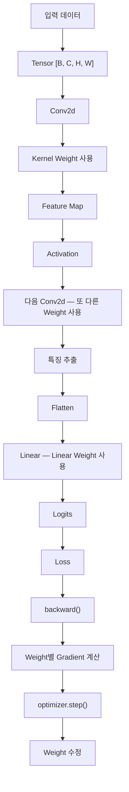

> 🗂️ **Notes · Deep Learning** — `pytorch` `weight` `parameter` `bias` `tensor`
{: .prompt-info }

---

## 1. 💡 Weight란?

딥러닝에서 `Weight`는:

> **모델 내부에 저장되어 있고, 학습을 통해 계속 수정되는 숫자이며, 입력을 어떻게 변환할지를
> 결정하는 핵심 Parameter이다.**
{: .prompt-info }

가장 단순하게 보면 `입력 × Weight → 결과`이다.

```text
입력 = 10

Weight = 0.5
10 × 0.5 = 5

Weight = 2.0
10 × 2.0 = 20
```

같은 입력이라도 Weight가 달라지면 결과가 달라진다. 따라서 Weight는 쉽게 **모델 내부의
조절값**이라고 생각할 수 있다.

---

## 2. 🔍 딥러닝에서 학습한다는 것은?

딥러닝 모델은 처음부터 좋은 Weight 값을 알고 있지 않다. 처음에는 Weight가 초기값으로
시작한다.

```text
Weight
0.13
-0.21
0.08
...
```

그리고 학습하면서 다음을 반복한다.



> 💡 **딥러닝 학습 = Loss가 작아지도록 Weight를 계속 조정하는 과정**
{: .prompt-info }

---

## 3. ⚠️ Tensor와 Weight는 같은 것인가?

아니다. `Tensor`는 **숫자를 담는 자료구조**이고, Tensor에는 여러 종류의 값이 들어갈 수 있다.

{: w="720" h="400" }

```python
x = torch.randn(32, 10)
```

이것은 입력 Tensor이다. 반면:

```python
linear = nn.Linear(10, 64)

print(linear.weight)
```

여기서 `linear.weight`도 Tensor이지만 **모델이 학습하는 Weight Tensor**이다.

> ⚠️ **Weight는 Tensor 형태로 저장되지만, 모든 Tensor가 Weight인 것은 아니다.**
{: .prompt-warning }

---

## 4. 🔍 Weight는 하나의 숫자인가?

Weight 하나하나는 숫자이지만, 딥러닝에서는 보통 여러 Weight를 묶어 Tensor 형태로 관리한다.

```python
linear = nn.Linear(3, 2)

print(linear.weight.shape)
# [2, 3]
```

실제로는:

```text
[
 [w11, w12, w13],
 [w21, w22, w23]
]
```

처럼 6개의 Weight가 존재한다.

| 대상 | 부르는 이름 |
| --- | --- |
| `w11` 하나 | Weight |
| `linear.weight` 전체 | Weight Tensor |

둘 다 문맥상 `Weight`라고 부를 수 있다.

---

## 5. 📖 Linear에서 Weight

`nn.Linear(3, 2)`는 입력 Feature 3개를 출력 Feature 2개로 바꾼다. Weight Shape은 `[2, 3]`이고,
계산은 개념적으로 다음과 같다.

```text
출력 1
= x1×w11 + x2×w12 + x3×w13 + bias1

출력 2
= x1×w21 + x2×w22 + x3×w23 + bias2
```

여기서 각각의 Weight는 **이 입력값을 출력 계산에 얼마나 반영할 것인가**를 결정한다.

> 💡 **Linear의 Weight** = 입력 Feature를 출력에 어떻게 반영할지 결정하는 값
{: .prompt-info }

---

## 6. 📖 Linear Weight Shape

```python
nn.Linear(
    in_features=3,
    out_features=2
)
```

는 `weight.shape = [out_features, in_features]`이므로 `[2, 3]`이다.

| 항목 | Shape | 개수 |
| --- | --- | ---: |
| Weight | `[2, 3]` | 2 × 3 = 6개 |
| Bias | `[2]` | 2개 |
| 총 Parameter | | 8개 |

---

## 7. 📖 CNN에서 Weight

CNN에서도 Weight의 본질은 같다.

```python
conv = nn.Conv2d(
    in_channels=3,
    out_channels=16,
    kernel_size=3
)

print(conv.weight.shape)
# [16, 3, 3, 3]
```

형식은 다음과 같다.

```text
[out_channels, in_channels, kernel_height, kernel_width]
```

---

## 8. 🔍 CNN의 Kernel과 Weight 관계

CNN에서 Kernel은 Weight들을 공간적으로 묶어 놓은 구조라고 볼 수 있다.

```text
Kernel

[ 0.2  -0.3   0.8 ]
[ 0.1   0.5  -0.2 ]
[-0.4   0.7   0.1 ]
```

여기 있는 숫자 하나하나가 모두 Weight이다.

| 용어 | 의미 |
| --- | --- |
| Kernel | Weight들을 모아 놓은 특징 탐지 구조 |
| Kernel Weight | Kernel 내부에 들어 있는 실제 학습 가능한 숫자 |

---

## 9. 🔍 CNN Weight는 무엇을 결정하는가?

Kernel이 이미지 위를 움직이면서 이미지 값과 Weight를 계산한다.

```text
Image Patch × Kernel Weight → 곱하고 더하기 → 특징 반응값
```

Kernel Weight가 어떤 값으로 학습되느냐에 따라 세로선·가로선·모서리·특정 질감 등에 강하게
반응할 수 있다.

> 💡 **CNN의 Weight** = 어떤 이미지 패턴에 반응할지를 결정하는 숫자
{: .prompt-info }

---

## 10. ❓ Linear Weight와 CNN Weight는 다른 개념인가?

아니다. 본질은 완전히 같고 사용되는 방식과 Shape만 다르다.

| | 역할 |
| --- | --- |
| Linear Weight | 입력 Feature를 어떻게 조합할지 결정 |
| CNN Weight | 이미지 패턴에 어떻게 반응할지 결정 |

공통점:

```text
숫자 → Tensor로 저장 → 학습 가능한 Parameter → Loss를 줄이는 방향으로 수정
```

---

## 11. 📖 Weight와 Parameter

`Parameter`가 더 큰 개념이다.

```text
Model Parameter
│
├─ Weight
└─ Bias
```

> 💡 **Weight는 대표적인 Parameter 중 하나이다.**
{: .prompt-info }

`nn.Linear(5, 3)`이면:

| 항목 | Shape | 개수 |
| --- | --- | ---: |
| Weight | `[3, 5]` | 15개 |
| Bias | `[3]` | 3개 |
| 총 Parameter | | 18개 |

---

## 12. 🔍 Weight와 Bias 차이

가장 단순한 계산:

```text
output = input × weight + bias
```

| Parameter | 역할 |
| --- | --- |
| Weight | 입력값의 영향력을 조절 |
| Bias | 계산 결과를 추가적으로 이동 |

둘 다 학습되는 Parameter이다.

---

## 13. ⚠️ Weight와 Activation 차이

이 둘은 반드시 구분해야 한다.

```text
입력 → Linear → Weight를 이용해 계산 → ReLU → Activation
```

| 개념 | 설명 |
| --- | --- |
| Weight | 모델 내부에 저장되어 있고 학습하면서 수정됨 |
| Activation | 입력 데이터가 모델을 통과하면서 그때그때 만들어지는 중간 결과값 |

같은 모델에 다른 데이터를 넣으면 **Weight는 기본적으로 동일**하지만 **Activation은 입력마다
달라진다.**

---

## 14. ⚠️ Weight와 Gradient 차이

`Gradient`도 Weight와 다르다.

| 개념 | 설명 |
| --- | --- |
| Weight | 현재 모델이 가지고 있는 값 |
| Gradient | Weight를 어느 방향으로 수정해야 Loss가 변하는지 알려주는 값 |

학습 흐름:

```text
Weight → Forward → Loss → backward() → Gradient 계산 → optimizer.step() → Weight 수정
```

> ⚠️ **Gradient는 Weight를 수정하기 위한 정보이고, Weight 자체가 아니다.**
{: .prompt-warning }

---

## 15. 🔍 모든 Layer가 Weight를 가지는 것은 아니다

| Layer | 학습 Weight 존재 |
|---|---|
| `Linear` | O |
| `Conv2d` | O |
| `Embedding` | O |
| `BatchNorm` | O |
| `ReLU` | X |
| `Dropout` | X |
| `MaxPool` | X |

`nn.ReLU()`는 "입력이 0보다 작으면 0, 0보다 크면 그대로"라는 정해진 계산만 하므로 학습할
Weight가 없다. Dropout도 "일부 Activation을 랜덤하게 0으로 만듦"이라는 동작만 하므로 자체적인
Weight가 없다.

---

## 16. 📖 BatchNorm의 Weight

PyTorch에서는 `bn.weight` 같은 표현도 볼 수 있다. BatchNorm에서는 정규화된 값을 다시 적절히
조절하기 위한 학습 가능한 값이 존재한다.

```text
정규화 → scale 조절 → shift 조절
```

여기서 scale을 담당하는 Parameter를 PyTorch가 `weight`라는 이름으로 제공한다.

> 💡 **Weight의 구체적인 역할은 Layer에 따라 달라질 수 있다.**
{: .prompt-info }

---

## 17. ⚠️ Weight라는 단어가 항상 Parameter를 의미하는 것은 아니다

딥러닝을 계속 공부하면 `Attention Weight`라는 표현도 나오게 된다. 이 경우 Attention Weight는
보통 **각 정보에 얼마나 집중할 것인가**를 나타내는 계산 결과이다.

| 표현 | 의미 |
| --- | --- |
| `Linear.weight`, `Conv2d.weight` | 모델 내부에 저장된 학습 Parameter |
| Attention Weight | Forward 과정에서 계산되는 중요도 값 |

따라서 앞으로 `weight`라는 단어가 나오면:

> ⚠️ **"이 문맥에서 Weight가 학습 Parameter를 뜻하는가, 아니면 단순한 가중값을 뜻하는가?"**
{: .prompt-warning }

를 확인하면 된다.

---

## 18. 🧪 지금까지 배운 개념 전체 연결



---

## 19. ✅ 핵심 개념 한 번에 구분하기

| 개념 | 의미 |
| --- | --- |
| Tensor | 숫자를 담고 계산하는 자료구조 |
| Parameter | 모델이 학습하면서 수정하는 값 |
| Weight | 대표적인 Parameter — 입력을 어떻게 변환할지 결정하는 숫자 |
| Bias | 대표적인 Parameter — 계산 결과를 추가적으로 이동시키는 숫자 |
| Activation | 입력이 모델을 통과하면서 만들어진 중간 결과값 |
| Gradient | Weight를 어떤 방향으로 수정할지 알려주는 값 |
| Kernel | CNN에서 여러 Weight를 공간적으로 묶어 사용하는 특징 탐지 구조 |

---

## 20. 🧠 Weight를 앞으로 이렇게 이해하기

딥러닝에서 Weight가 나오면 가장 먼저 **"모델이 학습해서 조절하는 숫자구나"**라고 생각한다.
그 다음 **"이 Layer에서는 이 Weight가 무슨 역할을 하지?"**를 확인한다.

| Layer | Weight의 역할 |
| --- | --- |
| Linear | 입력 Feature 조합 |
| CNN | 이미지 특징 탐지 |
| BatchNorm | 정규화된 값의 크기 조절 |

즉 Weight의 **역할은 Layer마다 다르지만 본질은 같다.**

> 💡 **한 줄 요약** · **Weight는 모델 내부에 저장되어 학습을 통해 수정되는 숫자들의 집합이며,
> 각 Layer가 입력을 어떤 방식으로 처리하고 변환할지를 결정하는 핵심 Parameter이다.**
{: .prompt-info }

---

## 21. 🧠 핵심 기억 카드

<details markdown="1">
<summary><strong>펼쳐서 확인</strong></summary>

- **Weight** : 모델 내부에 저장되고 학습으로 수정되며, 입력을 어떻게 변환할지 결정하는 값
- **학습이란** : Loss가 작아지도록 Weight를 계속 조정하는 과정
- **Tensor와의 관계** : Weight는 Tensor로 저장되지만, 모든 Tensor가 Weight는 아니다
- **Tensor에 담기는 것** : 입력 데이터, Label, Activation, Gradient, Weight
- **Parameter와의 관계** : `Parameter ⊃ {Weight, Bias}` — Weight는 대표적인 Parameter
- **Linear** : `weight.shape = [out_features, in_features]` — `nn.Linear(3,2)` → `[2,3]`, 총 8개
- **CNN** : `weight.shape = [out_channels, in_channels, kernel_h, kernel_w]` → `[16,3,3,3]`
- **Linear vs CNN** : 본질은 같고 사용 방식과 Shape만 다르다
- **Bias와 차이** : Weight는 입력의 영향력 조절, Bias는 결과를 추가로 이동
- **Activation과 차이** : Weight는 저장된 값, Activation은 입력마다 달라지는 중간 결과
- **Gradient와 차이** : Gradient는 Weight를 수정하기 위한 정보이지 Weight가 아니다
- **Weight 없는 Layer** : `ReLU`, `Dropout`, `MaxPool`
- **BatchNorm의 `weight`** : 정규화 후 scale을 담당하는 Parameter
- **주의** : `Attention Weight`는 Forward에서 계산되는 중요도 값이지 학습 Parameter가 아니다

</details>

---

## 22. 🔗 관련 글

- [CNN Kernel 이해하기](/posts/cnn-kernel/)
- [Weight와 Chain Rule 이해하기](/posts/weight-and-chain-rule/)
- [가중치/편향과 nn.Linear](/posts/nn-linear-weight-bias/)
