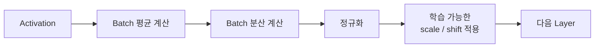
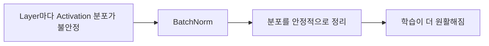

> 🗂️ **Notes · Deep Learning** — `pytorch` `dropout` `batch-norm` `overfitting` `mlp`
{: .prompt-info }

---

## 1. 💡 먼저 공통점

`Dropout`과 `BatchNorm`은 둘 다 **은닉층의 Activation을 다루는 Layer**지만 목적은 다르다.

| Layer | 하는 일 | 목적 |
| --- | --- | --- |
| Dropout | 일부 Activation을 랜덤하게 끔 | 과적합 완화 |
| BatchNorm | Activation의 분포를 정리 | 학습 안정화 |

---

## 2. 📖 Dropout

`Dropout`은 학습 중 일부 Activation을 무작위로 0으로 만든다.

```python
nn.Dropout(p=0.5)
```

예:

```text
원래 Activation
[2.0, 1.0, 3.0, 0.5]

      ↓ Dropout

[4.0, 0, 6.0, 0]   # 예시
```

일부 값을 꺼서 특정 뉴런 몇 개에 모델이 지나치게 의존하지 못하게 한다.

### 목적


보통 MLP에서는:

```python
model = nn.Sequential(
    nn.Linear(10, 64),
    nn.ReLU(),
    nn.Dropout(0.5),
    nn.Linear(64, 2)
)
```

처럼 사용한다.

---

## 3. 📖 BatchNorm

`BatchNorm`은 Activation을 제거하지 않고 **Batch 단위로 값의 분포를 정규화**한다.

```python
nn.BatchNorm1d(64)
```

예를 들어 중간 Activation 값의 크기가 제각각이라면:

```text
[100, 120, 80, 110, ...]
```

BatchNorm이 평균과 분산을 이용해 값의 분포를 정리한다. 개념적으로:



### 목적



MLP에서는 보통:

```python
model = nn.Sequential(
    nn.Linear(10, 64),
    nn.BatchNorm1d(64),
    nn.ReLU(),
    nn.Linear(64, 2)
)
```

처럼 사용한다.

> ⚠️ `64`는 앞 `Linear`의 출력 feature 수와 맞춘다.
>
> ```text
> Linear(10, 64) → [Batch, 64] → BatchNorm1d(64)
> ```
{: .prompt-warning }

---

## 4. 🔍 둘을 같이 사용하면?

둘의 역할이 다르기 때문에 함께 사용할 수도 있다.

```python
model = nn.Sequential(
    nn.Linear(10, 64),
    nn.BatchNorm1d(64),
    nn.ReLU(),
    nn.Dropout(0.5),

    nn.Linear(64, 2)
)
```

흐름은 아래 그림과 같다.

{: w="740" h="250" }

---

## 5. 🔍 학습과 평가에서의 차이

### Dropout

| 모드 | 동작 |
| --- | --- |
| `model.train()` | 일부 Activation 랜덤 제거 → Dropout ON |
| `model.eval()` | 모든 Activation 사용 → Dropout OFF |

### BatchNorm

| 모드 | 동작 |
| --- | --- |
| 학습 | 현재 Batch의 평균/분산 사용 + running mean / variance 업데이트 |
| 평가 | 학습 중 저장된 running mean / variance 사용 |

> ⚠️ 즉 BatchNorm은 평가할 때 사라지는 것이 아니라 **사용하는 통계가 달라진다.**
{: .prompt-warning }

---

## 6. ✅ 핵심 차이

| 구분 | Dropout | BatchNorm |
|---|---|---|
| 주 목적 | 과적합 완화 | 학습 안정화 |
| Activation 일부 제거 | O | X |
| 값의 분포 정규화 | X | O |
| 랜덤하게 0으로 만듦 | O | X |
| 학습 시 | 일부 출력 제거 | Batch 통계 사용 |
| 평가 시 | 비활성화 | 저장된 통계 사용 |

---

## 7. 🧠 가장 쉽게 기억하기

> 💡 **Dropout** · "몇 명은 이번 학습에서 쉬어" → 특정 뉴런 의존 방지 → 과적합 완화
{: .prompt-info }

> 📌 **BatchNorm** · "값의 크기를 일정한 기준으로 정리하자" → Layer 간 값의 분포 안정화 →
> 학습 안정
{: .prompt-tip }

> 💡 **한 줄 요약** · **Dropout은 일부 Activation을 랜덤하게 꺼서 과적합을 줄이는 방법이고,
> BatchNorm은 Activation의 분포를 정규화해서 학습을 안정시키는 방법이다.**
{: .prompt-info }

---

## 8. 🧠 핵심 기억 카드

<details markdown="1">
<summary><strong>펼쳐서 확인</strong></summary>

- **공통점** : 둘 다 은닉층의 Activation을 다루는 Layer
- **Dropout** : 일부 Activation을 랜덤하게 0으로 → 과적합 완화
- **BatchNorm** : Batch 단위로 값의 분포를 정규화 → 학습 안정화
- **BatchNorm 과정** : Batch 평균 → Batch 분산 → 정규화 → 학습 가능한 scale / shift
- **`nn.BatchNorm1d(64)`** : `64`는 앞 `Linear`의 출력 feature 수와 맞춘다
- **함께 쓰는 순서** : `Linear → BatchNorm → ReLU → Dropout → Linear`
- **Dropout의 평가 시** : 비활성화 (모든 Activation 사용)
- **BatchNorm의 평가 시** : 사라지는 게 아니라 저장된 running mean / variance를 쓴다
- **한 줄 비유** : Dropout은 "몇 명은 이번 학습에서 쉬어", BatchNorm은 "값의 크기를 일정한 기준으로 정리하자"

</details>

---

## 9. 🔗 관련 글

- [Dropout 이해하기](/posts/dropout/)
- [비선형성과 활성화 함수 / ReLU의 역할](/posts/activation-function-and-relu/)
- [MLP의 입력층/은닉층/출력층](/posts/mlp-input-hidden-output-layers/)
