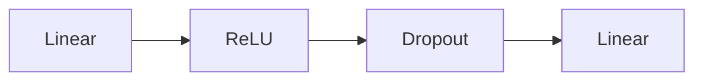
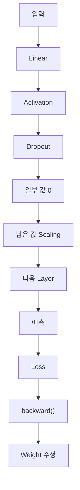

> 🗂️ **Notes · Deep Learning** — `pytorch` `dropout` `overfitting` `activation-function` `mlp`
{: .prompt-info }

---

## 1. 💡 Dropout이란?

`Dropout`은 **학습 중 일부 뉴런의 출력값을 무작위로 0으로 만들어 과적합을 줄이는 방법**이다.

쉽게 말하면:

> 특정 뉴런 몇 개에 모델이 너무 의존하지 못하도록 일부 출력을 잠시 꺼두는 방식
{: .prompt-info }

이다.

---

## 2. 🔍 왜 0으로 만들까?

예를 들어 어떤 은닉층의 출력이 다음과 같다고 하자.

```text
[2.0, 1.5, 3.0, 0.5]
```

`Dropout(p=0.5)`를 적용하면 학습 중 일부 값이 랜덤하게 0이 될 수 있다.

```text
[2.0, 0, 3.0, 0]
```

0이 된 값은 다음 Layer 계산에서 사실상 영향을 주지 않는다.

```text
0 × Weight = 0
```

즉 `0`은 **이번 Forward에서는 해당 뉴런의 출력을 사용하지 않음**이라는 의미이다.

> ⚠️ 뉴런 자체가 삭제되는 것은 아니며, 다음 Batch에서는 다른 뉴런이 0이 될 수 있다.
{: .prompt-warning }

---

## 3. 📖 남아 있는 값은 무엇인가?

0이 되지 않은 값은 **앞 Layer에서 계산된 Activation 값**이다.

```text
ReLU 출력
[2.0, 1.5, 3.0, 0.5]

        ↓ Dropout

[2.0, 0, 3.0, 0]
```

다만 PyTorch에서는 살아남은 값을 그대로 사용하지 않고 **Scaling**을 적용한다.

---

## 4. 🔍 Scaling은 왜 할까?

`p=0.5`라면 평균적으로 절반의 값이 사라진다. 값이 절반 사라지면 전체 출력 크기가 작아지므로,
살아남은 값에 `1 / (1 - p)`를 곱한다. `p=0.5`라면 `1 / (1 - 0.5) = 2`이다.

![p=0.5일 때 Dropout의 동작 — 원래 [2, 2, 2, 2]는 합이 8이지만 일부 값이 랜덤하게 0이 되어 [2, 0, 2, 0]이 되면 합이 4로 줄고, 살아남은 값에 1/(1-p)=2를 곱해 [4, 0, 4, 0]으로 크기를 보정한다](/assets/img/posts/dropout/dropout-scaling.svg){: w="700" h="268" }

이렇게 해서 학습 시 출력의 평균적인 크기를 유지한다.

> 💡 이를 **Inverted Dropout** 방식이라고 한다.
{: .prompt-info }

---

## 5. 📖 Dropout은 어디에 넣을까?

MLP에서는 보통 은닉층의 활성화 함수 뒤에 넣는다. 가장 흔한 형태는 다음과 같다.



PyTorch 예:

```python
model = nn.Sequential(
    nn.Linear(10, 64),
    nn.ReLU(),
    nn.Dropout(p=0.5),

    nn.Linear(64, 32),
    nn.ReLU(),
    nn.Dropout(p=0.5),

    nn.Linear(32, 2)
)
```

전체 흐름:

```text
입력 → Linear → ReLU → Dropout → Linear → ReLU → Dropout → Output Layer
```

---

## 6. 📖 Dropout은 Shape을 바꾸지 않는다

```text
입력 Shape
[32, 64]

↓ Dropout

출력 Shape
[32, 64]
```

처럼 Shape은 그대로 유지된다.

> 💡 Dropout은 **Tensor 구조를 바꾸는 것이 아니라 값 일부를 0으로 만드는 것**이다.
{: .prompt-info }

---

## 7. 🔍 ReLU가 꼭 필요한가?

아니다. Dropout은 ReLU 없이도 사용할 수 있다.

```python
model = nn.Sequential(
    nn.Linear(10, 64),
    nn.Dropout(0.5),
    nn.Linear(64, 2)
)
```

이 코드도 정상적으로 동작한다. 하지만 ReLU와 Dropout은 역할이 다르다.

| Layer | 역할 |
| --- | --- |
| ReLU | 비선형성 추가 → 복잡한 패턴 학습 |
| Dropout | 일부 Activation 제거 → 과적합 완화 |

따라서 일반적인 MLP에서는 `Linear → ReLU → Dropout` 형태를 많이 사용한다.

또한 꼭 ReLU일 필요는 없다.

```python
nn.GELU()
nn.LeakyReLU()
nn.Tanh()
```

같은 다른 활성화 함수와도 함께 사용할 수 있다.

---

## 8. ⚠️ 마지막 출력층 뒤에는 보통 넣지 않는다

예를 들어 다중 클래스 분류에서는 마지막 Layer가:

```python
nn.Linear(32, 3)
```

이고 다음과 같은 Logits를 만든다.

```text
[고양이 점수, 강아지 점수, 새 점수]
```

보통 이 최종 출력값 뒤에는 Dropout을 넣지 않는다.

| 위치 | Dropout |
| --- | --- |
| Hidden Layer | 사용 가능 |
| Output Layer | 보통 사용하지 않음 |

> ⚠️ 최종 출력 자체를 랜덤하게 제거하면 예측값이 불안정해질 수 있기 때문이다.
{: .prompt-warning }

---

## 9. 🔍 학습과 평가에서 동작이 다르다

### 학습할 때

```python
model.train()
```

Dropout이 활성화된다.

```text
Activation → 일부 값 랜덤 제거 → Scaling → 다음 Layer
```

### 검증 / 예측할 때

```python
model.eval()

with torch.no_grad():
    output = model(x)
```

Dropout이 비활성화된다.

```text
모든 뉴런 사용 → 값 제거 없음 → 별도 Scaling 없음
```

| 모드 | Dropout |
| --- | --- |
| Training | ON |
| Evaluation | OFF |

---

## 10. 🧪 실제 학습 흐름

```python
model = nn.Sequential(
    nn.Linear(10, 64),
    nn.ReLU(),
    nn.Dropout(0.5),
    nn.Linear(64, 2)
)

model.train()

for x, y in train_loader:

    optimizer.zero_grad()

    logits = model(x)

    loss = criterion(logits, y)

    loss.backward()

    optimizer.step()
```

`nn.Sequential` 안에 Dropout을 넣어두면 `logits = model(x)`가 실행될 때 자동으로
`Linear → ReLU → Dropout → Linear` 순서로 처리된다.

---

## 11. ✅ 핵심 정리



| 항목 | 의미 |
| --- | --- |
| Dropout | 과적합 완화를 위해 사용 |
| `p` | 0으로 만들 확률 |
| `0` | 이번 Forward에서 해당 뉴런의 출력 사용 안 함 |
| 남은 값 | 살아남은 Activation |
| Scaling | `1 / (1 - p)` 만큼 보정 |
| `train()` | Dropout 작동 |
| `eval()` | Dropout 작동 안 함 |

> 💡 **한 줄 요약** · **Dropout은 학습 중 일부 Activation을 랜덤하게 0으로 만들어 특정
> 뉴런에 대한 의존을 줄이고, 살아남은 값은 `1 / (1-p)`로 보정한다. 일반적인 MLP에서는
> `Linear → ReLU(또는 다른 활성화 함수) → Dropout` 형태로 은닉층에 사용한다.**
{: .prompt-info }

---

## 12. 🧠 핵심 기억 카드

<details markdown="1">
<summary><strong>펼쳐서 확인</strong></summary>

- **Dropout** : 학습 중 일부 뉴런의 출력을 무작위로 0으로 만들어 과적합을 줄이는 방법
- **의도** : 특정 뉴런 몇 개에 모델이 너무 의존하지 못하게 한다
- **`0`의 의미** : 이번 Forward에서 그 뉴런의 출력을 쓰지 않음 (`0 × Weight = 0`)
- **뉴런 삭제 아님** : 다음 Batch에서는 다른 뉴런이 0이 될 수 있다
- **남은 값** : 앞 Layer에서 계산된 Activation 값
- **Scaling** : 살아남은 값에 `1 / (1 - p)`를 곱한다 (`p=0.5` → ×2)
- **Inverted Dropout** : 이렇게 학습 시 출력의 평균적인 크기를 유지하는 방식
- **위치** : 보통 은닉층의 활성화 함수 뒤 — `Linear → ReLU → Dropout`
- **Shape** : 바뀌지 않는다 (`[32, 64]` → `[32, 64]`)
- **ReLU 필수 아님** : `GELU`, `LeakyReLU`, `Tanh` 등과도 함께 쓸 수 있다
- **출력층 뒤** : 보통 넣지 않는다 — 예측값이 불안정해질 수 있다
- **`train()` / `eval()`** : 학습에서는 ON, 검증·예측에서는 OFF

</details>

---

## 13. 🔗 관련 글

- [Dropout과 BatchNorm — 과적합 완화와 학습 안정화](/posts/dropout-vs-batchnorm/)
- [비선형성과 활성화 함수 / ReLU의 역할](/posts/activation-function-and-relu/)
- [requires_grad와 torch.no_grad() 이해하기](/posts/requires-grad-and-no-grad/)
