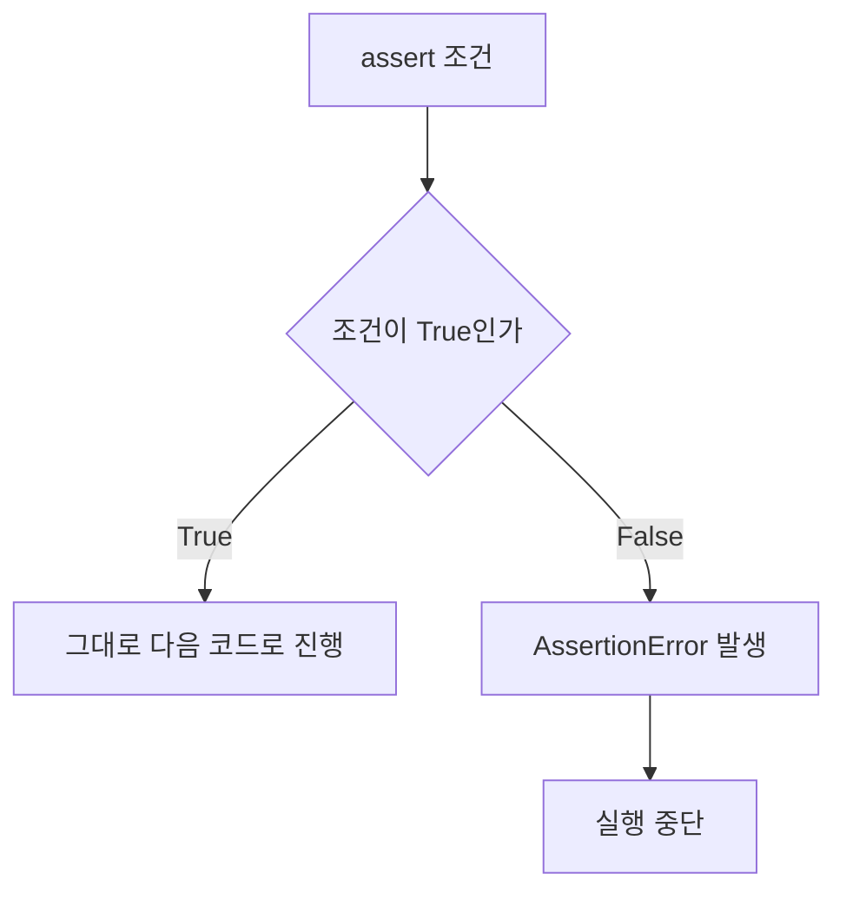

> 🗂️ **Notes · Python** — `python` `assert` `assertion-error` `shape` `device`
{: .prompt-info }

---

## 1. 💡 `assert`란?

`assert`는 **"이 조건은 반드시 참이어야 한다"**라고 검사하는 Python 키워드이다.

기본 문법:

```python
assert 조건
```

조건이 `True`이면 그대로 다음 코드로 진행하고, 조건이 `False`이면 `AssertionError`를
발생시키며 실행을 멈춘다.



---

## 2. 🧪 기본 예시

```python
x = 10

assert x > 0
```

결과:

```text
10 > 0
→ True
→ 정상 실행
```

반대로:

```python
x = -10

assert x > 0
```

결과:

```text
-10 > 0
→ False
→ AssertionError
```

---

## 3. 🧪 딥러닝 코드 예시

```python
assert out.device == device
```

의 의미는:

> **`out` Tensor가 내가 기대한 `device`에 있는지 확인한다.**
{: .prompt-info }

| `out.device` | `device` | 결과 |
| --- | --- | --- |
| `cuda:0` | `cuda:0` | 같은 device → 정상 실행 |
| `cpu` | `cuda:0` | 서로 다름 → `AssertionError` |

---

## 4. 📖 에러 메시지 추가하기

조건이 틀렸을 때 설명을 함께 표시할 수도 있다.

```python
assert out.device == device, "Tensor의 device가 다릅니다."
```

조건이 `False`이면 다음처럼 출력된다.

```text
AssertionError: Tensor의 device가 다릅니다.
```

---

## 5. 🔍 딥러닝에서 자주 사용하는 예

| 검사 | 코드 | 확인하는 것 |
| --- | --- | --- |
| Shape 확인 | `assert pred.shape == target.shape` | 예측값과 정답값의 Shape이 같은지 확인 |
| Device 확인 | `assert out.device == device` | Tensor가 올바른 CPU/GPU에 있는지 확인 |
| 데이터 개수 확인 | `assert len(images) == len(labels)` | 이미지 개수와 Label 개수가 같은지 확인 |

---

## 6. 🔍 `if`문과 차이

`if`는 **조건에 따라 다른 동작을 수행하기 위한 일반적인 조건문**이다.

```python
if x < 0:
    print("음수입니다.")
```

반면 `assert`는:

```python
assert x >= 0
```

처럼

> **"이 조건이 틀리면 코드나 데이터에 문제가 있는 것이다."**
{: .prompt-warning }

라는 상황을 빠르게 검사할 때 사용한다.

---

## 7. ✅ 핵심 정리

```text
assert 조건
     ↓
True
→ 계속 실행

False
→ AssertionError
→ 실행 중단
```

> 💡 **한 줄 요약** · **`assert`는 코드가 내가 예상한 조건을 만족하는지 검사하고, 조건이
> 틀리면 즉시 오류를 발생시키는 Python 키워드이다.**
{: .prompt-info }

---

## 8. 🧠 핵심 기억 카드

<details markdown="1">
<summary><strong>펼쳐서 확인</strong></summary>

- **`assert`** : "이 조건은 반드시 참이어야 한다"를 검사하는 Python 키워드
- **문법** : `assert 조건` / `assert 조건, "메시지"`
- **`True`일 때** : 그대로 다음 코드로 진행
- **`False`일 때** : `AssertionError`를 발생시키며 실행 중단
- **메시지** : 두 번째 인자로 넣으면 `AssertionError: 메시지` 형태로 출력
- **Shape 검사** : `assert pred.shape == target.shape`
- **Device 검사** : `assert out.device == device`
- **개수 검사** : `assert len(images) == len(labels)`
- **`if`와 차이** : `if`는 조건에 따라 다른 동작을 하려는 것,
  `assert`는 "틀리면 코드나 데이터에 문제가 있다"를 빠르게 검사하는 것

</details>

---

## 9. 🔗 관련 글

- [위험한 Broadcasting — 에러 없이 틀리는 Shape 불일치](/posts/dangerous-broadcasting/)
- [Batch dimension과 broadcasting](/posts/batch-dimension-and-broadcasting/)
- [PyTorch shape·device 오류 디버깅 체크리스트](/posts/pytorch-shape-device-debugging/)
