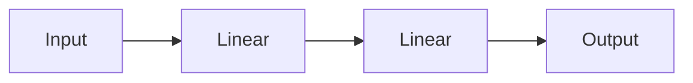
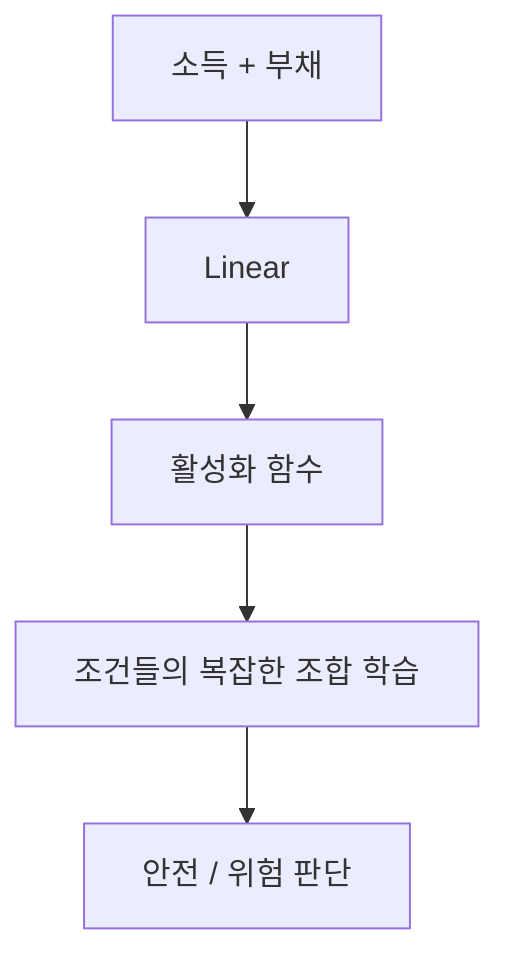
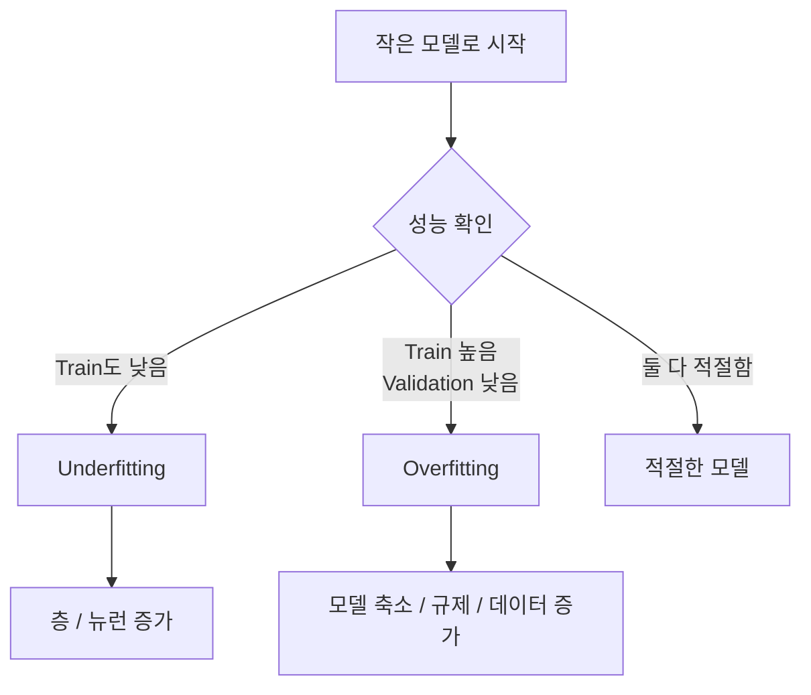
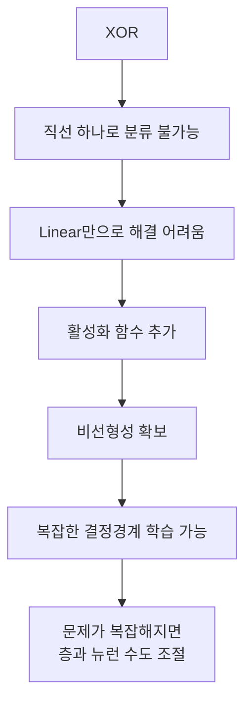

> 🗂️ **Notes · Deep Learning** — `xor` `activation-function` `decision-boundary` `overfitting` `underfitting`
{: .prompt-info }

---

## 1. 💡 XOR이란?

XOR(Exclusive OR)는 **두 입력이 서로 다를 때만 1**이 되는 논리 연산이다.

|  A |  B | XOR |
| -: | -: | --: |
|  0 |  0 |   0 |
|  0 |  1 |   1 |
|  1 |  0 |   1 |
|  1 |  1 |   0 |

쉽게 기억하면:

```text
같으면 0
다르면 1
```

### 현실적인 예시

두 가지 인증 방법 중 **정확히 하나만 사용해야 성공**한다고 가정하면:

- 카드 X + 모바일 X → 실패
- 카드 O + 모바일 X → 성공
- 카드 X + 모바일 O → 성공
- 카드 O + 모바일 O → 실패

---

## 2. 🔍 왜 Linear 하나로 XOR를 풀기 어려운가?

XOR 데이터를 좌표로 표현하면 다음과 같다.

```text
B
1    1       0

0    0       1

     0       1    → A
```

즉:

```text
(0,0) → 0
(0,1) → 1
(1,0) → 1
(1,1) → 0
```

`0`과 `1`이 대각선으로 섞여 있어 **직선 하나로 분리할 수 없다.** 이를 **선형 분리
불가능(Linearly Non-separable)**이라고 한다.


---

## 3. 💡 활성화 함수란?

**활성화 함수(Activation Function)**는 신경망에 **비선형성**을 추가하는 함수다.

대표적인 활성화 함수:

- `ReLU`
- `Sigmoid`
- `Tanh`

가장 많이 사용하는 ReLU는 다음처럼 동작한다.

```python
ReLU(x) = max(0, x)
```

```text
-3 → 0
-1 → 0
 2 → 2
 5 → 5
```

즉 음수는 `0`, 양수는 그대로 통과시킨다.

---

## 4. 🔍 XOR에서 활성화 함수가 필요한 이유

활성화 함수 없이 Linear만 여러 개 연결하면:



수학적으로 결국 **하나의 Linear와 비슷한 선형 관계**가 된다.

> 📌 왜 하나로 합쳐지는지는 [비선형성과 활성화 함수 / ReLU의
> 역할](/posts/activation-function-and-relu/)에서 `out = x @ W1.T @ W2.T + b1 @ W2.T + b2`
> 형태로 풀어서 정리했다.
{: .prompt-tip }

반면 중간에 비선형 활성화 함수를 넣으면:


신경망이 단순한 직선보다 **복잡한 관계**를 표현할 수 있게 된다.

```python
model = nn.Sequential(
    nn.Linear(2, 4),
    nn.ReLU(),
    nn.Linear(4, 1)
)
```

XOR 정도의 단순한 비선형 문제는 이런 작은 신경망으로도 학습할 수 있다.

---

## 5. 🔍 비선형 결정경계

**결정경계(Decision Boundary)**는 모델이 데이터를 서로 다른 클래스로 나누는 기준선이다.

Linear 모델은 주로:

```text
○ ○ ○ │ ● ● ●
○ ○ ○ │ ● ● ●
       ↑
    직선 경계
```

처럼 단순한 경계를 만든다.

하지만 현실의 데이터는 여러 조건의 **조합**에 따라 결과가 달라지는 경우가 많다.

### 현실적인 예시: 대출 위험 판단

입력:

```text
X1 = 소득
X2 = 부채
```

예를 들어:

```text
소득 높음 + 부채 낮음       → 안전
소득 낮음 + 부채 높음       → 위험
소득 매우 높음 + 부채 매우 높음 → 위험할 수도 있음
소득 낮음 + 부채 거의 없음    → 안전할 수도 있음
```

이 네 가지를 소득·부채 평면에 놓으면 아래 그림과 같다.

{: w="660" h="396" }

단순히 `소득이 높으면 안전` 같은 직선적인 규칙만으로 판단하기 어렵다.

활성화 함수가 들어간 신경망은 이런 **복잡한 비선형 결정경계**를 학습할 수 있다.



---

## 6. ⚠️ 활성화 함수 하나면 모든 비선형 문제를 해결할까?

**아니다.**

활성화 함수를 넣으면 비선형 관계를 표현할 **능력**은 생기지만 모든 문제를 자동으로 해결하는
것은 아니다.

모델 성능에는 다음 요소도 영향을 준다.

- 층(Layer)의 수
- 뉴런(Neuron)의 수
- 활성화 함수 종류
- 데이터의 복잡도
- 학습이 제대로 되었는지

| 문제 | 필요한 모델 |
| --- | --- |
| XOR | 비교적 단순한 문제 → 작은 신경망으로도 가능 |
| 이미지 / 음성 / 자연어 | 매우 복잡한 문제 → 더 많은 층과 뉴런 필요 |

---

## 7. 🔍 층과 뉴런 수는 어떻게 결정할까?

정확한 공식이 있는 것은 아니다. 일반적으로 **작은 모델부터 시작해서 Train / Validation
성능을 보며 조절한다.**



### Underfitting

**과소적합**이라고 하며, 모델이 너무 단순해서 학습 데이터의 패턴조차 제대로 학습하지 못한
상태다.

### Overfitting

**과적합**이라고 하며, 학습 데이터를 너무 외워서 새로운 데이터에서는 성능이 떨어지는 상태다.

### 규제(Regularization)

위 흐름에서 Overfitting의 대응책으로 나온 **규제**는 모델이 학습 데이터에 지나치게 맞춰지지
않도록 **제약을 거는 방법들**을 가리킨다. 앞서 정리한 [Dropout](/posts/dropout/)이 대표적인
예로, 학습 중 일부 Activation을 랜덤하게 꺼서 특정 뉴런에 대한 의존을 줄인다.

| 대응책 | 방향 |
| --- | --- |
| 모델 축소 | 층·뉴런 수를 줄여 표현력을 낮춘다 |
| 규제 | 모델 크기는 두고 학습에 제약을 건다 (예: Dropout) |
| 데이터 증가 | 외울 수 없을 만큼 데이터를 늘린다 |

---

## 8. ✅ 전체 흐름



> 💡 **한 줄 요약** · **XOR는 활성화 함수가 왜 필요한지를 보여주는 대표적인 문제다.**
> `Linear`만 사용하면 선형적인 관계만 표현할 수 있지만, `ReLU` 같은 활성화 함수를 추가하면
> 비선형성을 얻어 복잡한 결정경계를 학습할 수 있다. 다만 활성화 함수 하나만 넣는다고 모든
> 문제를 해결하는 것은 아니며, 문제의 복잡도에 따라 층과 뉴런 수도 함께 조절해야 한다.
{: .prompt-info }

---

## 9. 🧠 핵심 기억 카드

<details markdown="1">
<summary><strong>펼쳐서 확인</strong></summary>

- **XOR** : 두 입력이 서로 다를 때만 1 — 같으면 0, 다르면 1
- **선형 분리 불가능** : `(0,0)→0`, `(0,1)→1`, `(1,0)→1`, `(1,1)→0`이 대각선으로 섞여 있다
- **활성화 함수** : 신경망에 비선형성을 추가하는 함수 — `ReLU`, `Sigmoid`, `Tanh`
- **ReLU** : `max(0, x)` — 음수는 0, 양수는 그대로
- **활성화 함수가 없으면** : Linear를 여러 개 연결해도 하나의 Linear와 비슷한 선형 관계
- **결정경계** : 모델이 데이터를 서로 다른 클래스로 나누는 기준선
- **현실 데이터** : 여러 조건의 조합에 따라 결과가 달라져 직선 규칙만으로는 어렵다
- **활성화 함수 ≠ 만능** : 비선형을 표현할 능력이 생길 뿐, 층·뉴런 수·데이터 복잡도도 영향
- **모델 크기 결정** : 작은 모델부터 시작해 Train / Validation 성능을 보며 조절
- **Underfitting** : 모델이 너무 단순해 학습 데이터의 패턴조차 학습하지 못한 상태
- **Overfitting** : 학습 데이터를 너무 외워 새로운 데이터에서 성능이 떨어지는 상태
- **규제(Regularization)** : 학습 데이터에 지나치게 맞춰지지 않도록 제약을 거는 방법 (예: Dropout)

</details>

---

## 10. 🔗 관련 글

- [비선형성과 활성화 함수 / ReLU의 역할](/posts/activation-function-and-relu/)
- [MLP의 입력층/은닉층/출력층](/posts/mlp-input-hidden-output-layers/)
- [Dropout 이해하기](/posts/dropout/)
