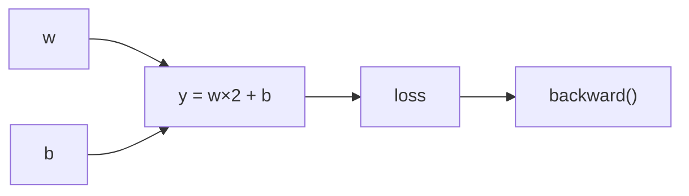
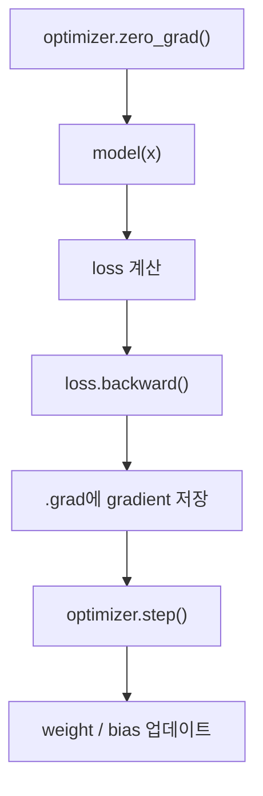
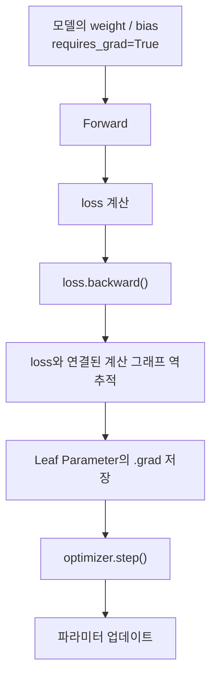

> 🗂️ **Notes · Deep Learning** — `pytorch` `backpropagation` `gradient` `requires-grad` `leaf-tensor`
{: .prompt-info }

---

## 1. 💡 `loss.backward()`란?

`loss.backward()`는 **손실(loss)을 기준으로 각 파라미터의 gradient(기울기)를 계산하는
함수**다.

```python
pred = model(x)
loss = loss_fn(pred, y)

loss.backward()
```

실행 흐름:


이 과정을 **역전파(Backpropagation)**라고 한다.

---

## 2. 📖 `backward()`를 호출하면 `.grad`에 자동 저장될까?

그렇다.

```python
w = torch.tensor(3.0, requires_grad=True)

loss = (w * 2) ** 2
loss.backward()

print(w.grad)
```

`backward()`가 실행되면 PyTorch가 자동으로 다음을 한다.

```text
loss
 ↓
계산 과정을 역으로 추적
 ↓
w에 대한 gradient 계산
 ↓
w.grad에 저장
```

> 💡 즉 `w.grad = ...` 처럼 직접 넣을 필요가 없다.
{: .prompt-info }

---

## 3. 🔍 `backward()`의 계산 범위(scope)는?

프로그램 전체 변수를 계산하는 것이 아니다. **현재 `loss`와 연결된 계산 그래프만** 역으로
추적한다.

```python
w = torch.tensor(3.0, requires_grad=True)
b = torch.tensor(1.0, requires_grad=True)

y = w * 2 + b
loss = y ** 2

loss.backward()
```

계산 그래프:



따라서 `w`, `b`는 loss와 연결되어 있으므로 gradient를 계산할 수 있다.

반면:

```python
z = torch.tensor(5.0, requires_grad=True)
```

`z`가 loss 계산에 사용되지 않았다면:

```python
print(z.grad)
# None
```

이다.

---

## 4. 📖 `requires_grad=True`의 의미

```python
w = torch.tensor(3.0, requires_grad=True)
```

`requires_grad=True`는 PyTorch에게:

> 이 값을 사용하는 계산을 추적해서 gradient를 구할 수 있게 해줘.
{: .prompt-info }

라는 의미다.

> ⚠️ 하지만 `requires_grad=True`라고 해서 무조건 `.grad`가 생기는 것은 아니다.
{: .prompt-warning }

보통 다음 조건이 필요하다.

```text
requires_grad=True
        +
loss 계산에 연결되어 있음
        +
기본적으로 leaf tensor
```

---

## 5. 💡 Leaf Tensor란?

**Leaf Tensor**는 다른 계산의 결과로 만들어진 것이 아니라, 계산 그래프의 **출발점이 되는
텐서**다.

```python
w = torch.tensor(3.0, requires_grad=True)

y = w * 2
```

여기서:

```text
w  → Leaf Tensor
↓
y  → w를 계산해서 만들어진 중간 Tensor
↓
loss
```

`loss.backward()` 후:

```python
print(w.grad)  # 저장됨
print(y.grad)  # 기본적으로 None
```

중간 Tensor도 gradient 계산에는 사용되지만 `.grad`를 기본적으로 보관하지 않는다.

필요하다면 `y.retain_grad()`를 사용해 중간 Tensor의 gradient도 저장할 수 있다.

앞 절의 계산 범위(scope)와 여기서 본 Leaf Tensor를 함께 놓고 보면, `.grad`가 저장되는 조건이
아래 그림처럼 정리된다.

{: w="740" h="396" }

---

## 6. ⚠️ `backward()`는 weight를 수정할까?

아니다. `loss.backward()`는 **gradient만 계산**한다. 실제 파라미터 수정은
`optimizer.step()`이 담당한다.

전체 학습 흐름:



---

## 7. ⚠️ 왜 `zero_grad()`가 필요한가?

PyTorch의 gradient는 기본적으로 **누적된다.**

```text
첫 번째 backward
w.grad = 0.5

두 번째 backward
새 gradient = 0.3
```

그대로 두면 `w.grad = 0.8`처럼 더해질 수 있다.

그래서 일반적인 학습에서는 다음 순서로 사용한다.

```python
optimizer.zero_grad()

pred = model(x)
loss = loss_fn(pred, y)

loss.backward()
optimizer.step()
```

---

## 8. ✅ 핵심 정리



| 항목 | 의미 |
| --- | --- |
| `loss.backward()` | gradient 계산 |
| `.grad` | 계산된 gradient가 저장되는 곳 |
| scope | loss와 연결된 계산 그래프 |
| `requires_grad=True` | gradient 추적 대상 |
| Leaf Tensor | 계산 그래프의 출발점 |
| `optimizer.step()` | gradient를 이용해 실제 파라미터 수정 |

> 💡 **한 줄 요약** · `loss.backward()`는 loss에서 시작해 계산 그래프를 거꾸로 따라가면서,
> 학습 대상이 되는 leaf parameter의 gradient를 계산해 `.grad`에 저장한다.
{: .prompt-info }

---

## 9. 🧠 핵심 기억 카드

<details markdown="1">
<summary><strong>펼쳐서 확인</strong></summary>

- **`loss.backward()`** : loss를 기준으로 각 파라미터의 gradient를 계산하는 함수 = 역전파
- **자동 저장** : 계산된 gradient는 `.grad`에 자동으로 들어간다 — 직접 넣을 필요 없음
- **scope** : 프로그램 전체가 아니라 **loss와 연결된 계산 그래프만** 역추적한다
- **연결 안 되면** : `requires_grad=True`여도 loss에 안 쓰였으면 `.grad`는 `None`
- **`requires_grad=True`** : "이 값을 쓰는 계산을 추적해달라"는 표시일 뿐, `.grad`를 보장하지 않는다
- **`.grad`가 생기는 조건** : `requires_grad=True` + loss에 연결됨 + 기본적으로 leaf tensor
- **Leaf Tensor** : 다른 계산의 결과가 아닌, 계산 그래프의 출발점이 되는 텐서
- **중간 Tensor** : gradient 계산에는 쓰이지만 `.grad`를 기본적으로 보관하지 않는다
- **`retain_grad()`** : 중간 Tensor의 gradient도 저장하고 싶을 때 사용
- **weight 수정 아님** : `backward()`는 계산만, 수정은 `optimizer.step()`
- **gradient 누적** : 기본적으로 더해진다 (`0.5` → `+0.3` → `0.8`)
- **`zero_grad()`** : 그래서 매 학습 스텝 앞에서 이전 gradient를 초기화한다

</details>

---

## 10. 🔗 관련 글

- [requires_grad와 torch.no_grad() 이해하기](/posts/requires-grad-and-no-grad/)
- [Weight와 Chain Rule 이해하기](/posts/weight-and-chain-rule/)
- [Optimizer와 Learning Rate — SGD로 Weight 수정하기](/posts/optimizer-sgd-learning-rate/)
