> 🗂️ **Notes · Deep Learning** — `pytorch` `rnn` `hidden-state` `bidirectional` `sequence`
{: .prompt-info }

---

## 1. 📖 RNN의 기본 식

RNN의 핵심은 다음 식으로 표현할 수 있다.

```text
h_t = tanh(x_t W_x + h_(t-1) W_h + b)
```

각 의미는 다음과 같다.

| 기호 | 의미 |
| --- | --- |
| `x_t` | 현재 시점의 입력 |
| `h_(t-1)` | 이전 시점까지의 hidden state |
| `W_x` | 현재 입력에 적용하는 가중치 |
| `W_h` | 이전 hidden state에 적용하는 가중치 |
| `b` | bias |
| `tanh` | 비선형 활성화 함수 |
| `h_t` | 현재 시점의 새로운 hidden state |

즉:

```text
현재 입력 x_t
      +
이전 기억 h_(t-1)
      ↓
가중치 적용 + 합산
      ↓
     tanh
      ↓
새로운 hidden state h_t
```

---

## 2. 💡 Hidden State란?

Hidden State는 **현재까지 입력된 정보를 압축해서 가지고 있는 상태값**이다.

예를 들어 문장이 `나는 → 오늘 → 사과를 → 먹었다`라면:

```text
h1 = "나는"까지 반영한 상태
h2 = "나는 오늘"까지 반영한 상태
h3 = "나는 오늘 사과를"까지 반영한 상태
h4 = "나는 오늘 사과를 먹었다"까지 반영한 상태
```

### RNN이 정보를 전달하는 모습

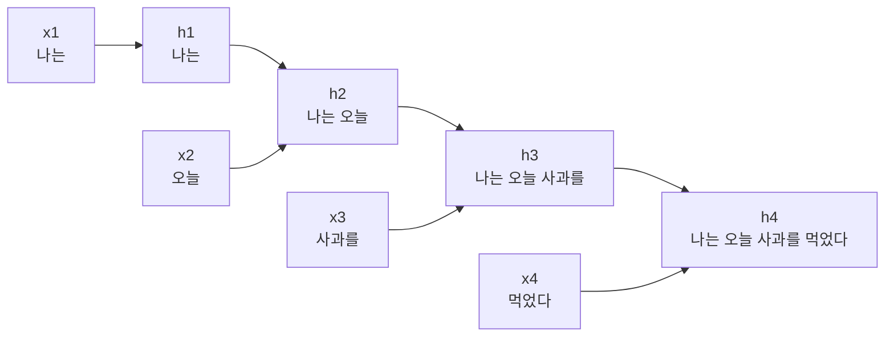

핵심은:

> `h4`는 `h1 → h2 → h3`의 정보가 순차적으로 반영되어 만들어진 최종 상태다.
{: .prompt-info }

> ⚠️ 하지만 `h4` 안에 `h1`, `h2`, `h3`가 그대로 저장되어 있는 것은 아니다. 이전 정보를 하나의
> 벡터로 **압축한 결과**에 가깝다.
{: .prompt-warning }

---

## 3. 📖 PyTorch RNN의 `output`과 `h_n`

PyTorch에서는 다음처럼 두 값을 반환한다.

```python
output, h_n = rnn(x)
```

### `output`

`output`은 **각 시점에서 만들어진 hidden state 전체**다.

```text
output = [h1, h2, h3, ..., hL]
```

shape은 `[B, L, H]`이다.

| 기호 | 의미 |
| --- | --- |
| `B` | Batch size |
| `L` | Sequence length |
| `H` | Hidden size |

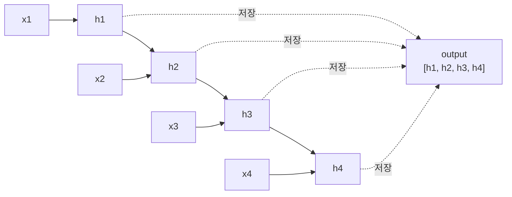

즉 `output`은 **RNN이 지나오면서 만든 상태들의 기록 전체**라고 생각하면 된다.

### `h_n`

`h_n`은 **각 층·방향에서 마지막으로 만들어진 hidden state**다. 1층 단방향 RNN이라면
`h_n = hL`이다.

```text
output = [h1, h2, h3, h4]

h_n
          ↓
         h4
```

---

## 4. 🔍 `output`과 마지막 Hidden State의 차이

이 부분이 가장 중요하다.

```text
output
= [h1, h2, h3, h4]

마지막 hidden state
= h4
```

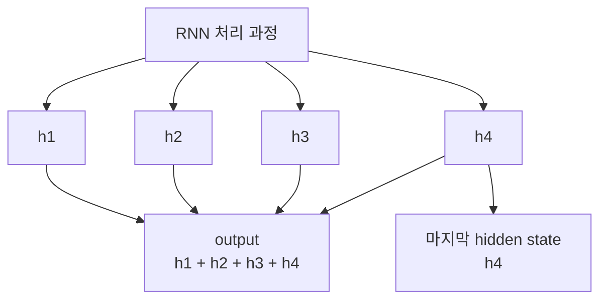

쉽게 비유하면:

| | 비유 |
| --- | --- |
| `output` | 공부하면서 작성한 모든 중간 노트 |
| `h4` | 공부가 끝난 뒤 머릿속에 남은 최종 요약 |

> ⚠️ `h4`에는 앞의 정보가 반영되어 있지만, 각 시점의 상태가 모두 그대로 남아 있는 것은
> 아니다.
{: .prompt-warning }

---

## 5. 📖 단방향 RNN

단방향 RNN은 입력을 한 방향으로 읽는다.

```text
x1 → x2 → x3 → x4 → x5
```

hidden state는 `h1 → h2 → h3 → h4 → h5`가 된다.

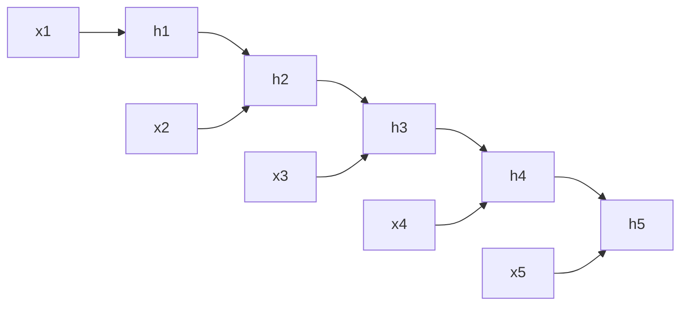

1층 단방향에서는 `output[:, -1, :]`과 `h_n[-1]`이 같은 마지막 상태 `h5`를 의미한다.

```text
output
[h1, h2, h3, h4, h5]
                     ↑
              output[:, -1]

h_n
= h5
```

> 💡 따라서 1층 단방향에서는 `output[:, -1] ≈ h_n[-1]`이라고 이해해도 된다.
{: .prompt-info }

---

## 6. 📖 양방향 RNN

양방향 RNN은 같은 시퀀스를 두 방향으로 읽는다.

```text
Forward
x1 → x2 → x3 → x4 → x5

Backward
x1 ← x2 ← x3 ← x4 ← x5
```

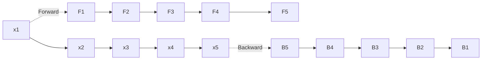

각 위치의 `output`은 두 방향의 상태를 합친 것이다.

```text
output[:, t]

= [Forward_t | Backward_t]
```

따라서 shape은 `[B, L, 2H]`가 된다.

---

## 7. ⚠️ 양방향에서 `output[:, -1]`이 최종 표현이 아닌 이유

마지막 위치 `x5`를 생각해보자. Forward 방향에서 `x5`는 **최종 상태**지만, Backward
방향에서는 **첫 번째 상태**다.

![양방향 RNN에서 마지막 위치의 output이 최종 표현이 아닌 이유 — Forward는 F1에서 F5로 진행해 F5가 최종 상태이고 Backward는 B5에서 B1으로 진행해 B1이 최종 상태인데, output[:, -1]은 F5와 B5를 합친 것이라 Backward 쪽은 첫 부분 상태만 담기고, torch.cat으로 만든 final은 F5와 B1을 합쳐 두 방향 모두의 최종 상태를 담는다](/assets/img/posts/rnn-hidden-state-and-output/bidirectional-final.svg){: w="780" h="448" }

```text
Forward
x1 → x2 → x3 → x4 → x5
                      ↑
                  최종 상태

Backward
x5 → x4 → x3 → x2 → x1
↑
첫 번째 상태
```

따라서 `output[:, -1]`에는 다음이 들어 있다.

```text
[Forward의 최종 상태 | Backward의 첫 부분 상태]
```

> ⚠️ 즉 두 방향 모두의 **최종 상태**가 아니다.
{: .prompt-warning }

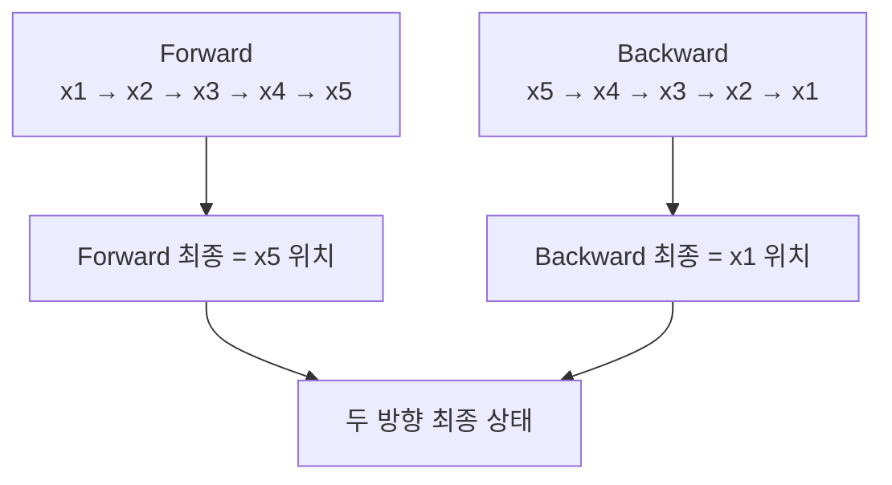

---

## 8. 📖 양방향 RNN의 `h_n`

1층 양방향 RNN에서는 다음과 같다.

| | 의미 |
| --- | --- |
| `h_n[0]` | Forward가 전체 문장을 읽은 결과 |
| `h_n[1]` | Backward가 전체 문장을 읽은 결과 |

---

## 9. 🧪 `final = torch.cat(...)`

문장 전체를 양쪽 방향에서 본 정보를 하나로 합치려면 다음을 사용할 수 있다.

```python
final = torch.cat(
    [h_n[0], h_n[1]],
    dim=1
)
```

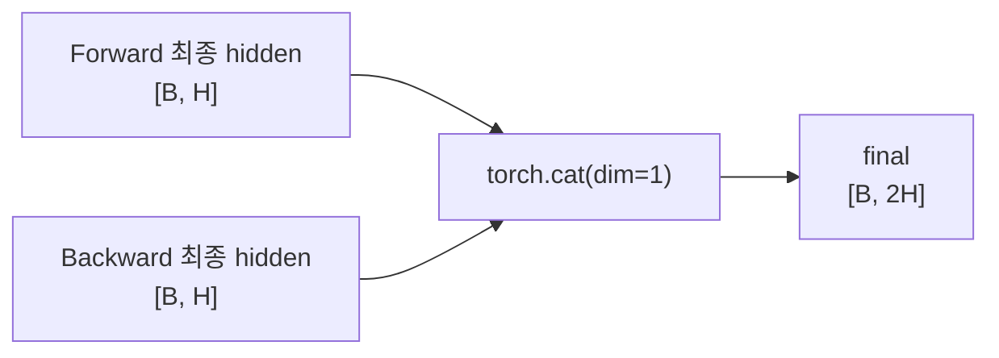

shape은 다음처럼 바뀐다.

```text
[B, H] + [B, H]
        ↓
      [B, 2H]
```

> 💡 즉 `final`은 **양방향 RNN이 시퀀스 전체를 읽은 결과를 하나의 벡터로 합친 것**이다.
{: .prompt-info }

---

## 10. 🔍 `output`과 `final`은 무엇이 다른가?

| | 담고 있는 것 | shape |
| --- | --- | --- |
| `output` | 각 위치의 표현을 모두 가지고 있음 — `[o1, o2, o3, o4, o5]` | `[B, L, 2H]` |
| `final` | Forward 최종 상태 + Backward 최종 상태 | `[B, 2H]` |

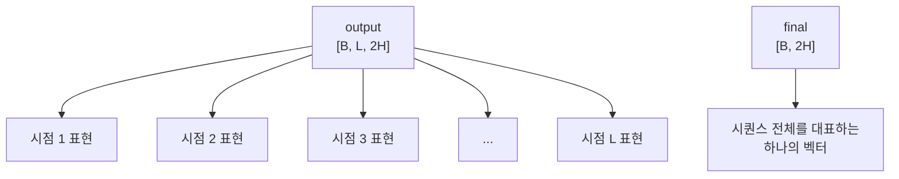

따라서 `output = final들의 모음`이 아니라:

```text
output
= 각 시점의 hidden 표현들의 모음

final
= 전체 시퀀스를 대표하도록
  두 방향의 마지막 hidden state를 합친 값
```

이라고 이해해야 한다.

---

## 11. 🔍 단방향과 양방향의 최종 표현 비교

### 단방향

```text
x1 → x2 → x3 → x4 → x5
                     ↓
                    h5
```

```text
최종 표현
≈ h5
≈ output[:, -1]
≈ h_n[-1]
```

### 양방향

```text
Forward  최종 ─┐
               ├─ torch.cat() → final
Backward 최종 ─┘
```

```python
final = torch.cat(
    [h_n[0], h_n[1]],
    dim=1
)
```

즉:

| 방향 | 최종 표현 |
| --- | --- |
| 단방향 | 마지막 hidden 하나가 전체 표현 |
| 양방향 | 두 방향의 마지막 hidden을 합쳐 전체 표현 |

---

## 12. 🔍 `output`은 언제 사용할까?

`output`과 `final`은 목적이 다르다.

### 문장 전체를 하나로 분류

```text
"이 영화는 정말 재미있었다."
             ↓
         긍정 / 부정
```

문장 전체를 대표하는 하나의 벡터가 필요하므로 `final` 같은 표현을 사용할 수 있다.

### 각 단어의 정보가 필요

```text
나는   사과를   먹었다
 ↓       ↓        ↓
표현1   표현2    표현3
```

각 토큰마다 표현이 필요하므로 `output` 전체를 사용한다. 예를 들면:

- Sequence Labeling
- Attention
- 번역
- 토큰 단위 예측

등이 있다.

---

## 13. 🔍 RNN과 Transformer의 Output

RNN만 `output`을 만드는 것도 아니고, Transformer만 만드는 것도 아니다. 둘 다 **각 위치에 대한
표현을 출력**한다. 차이는 계산 방식이다.

### RNN

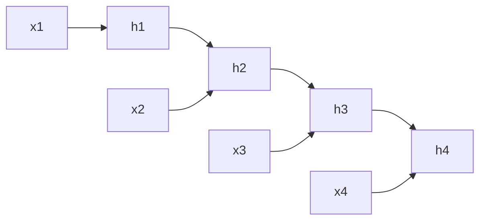

```text
이전 hidden state를 다음 시점으로 전달
→ 순차 처리
```

### Transformer

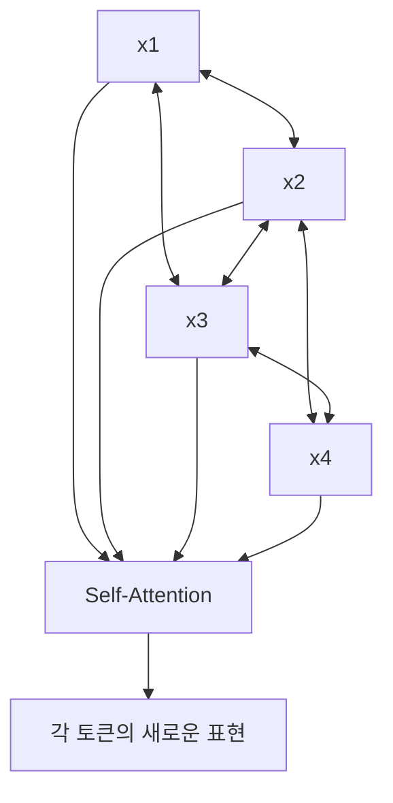

```text
각 토큰이 다른 토큰을 직접 참고
→ Self-Attention
```

| 모델 | output 생성 방식 |
| --- | --- |
| RNN | 순차적으로 output 생성 |
| Transformer | Attention을 이용해 output 생성 |

> 💡 **둘 다 output은 존재하고, 계산 방법이 다르다.**
{: .prompt-info }

---

## 14. ✅ 핵심 정리

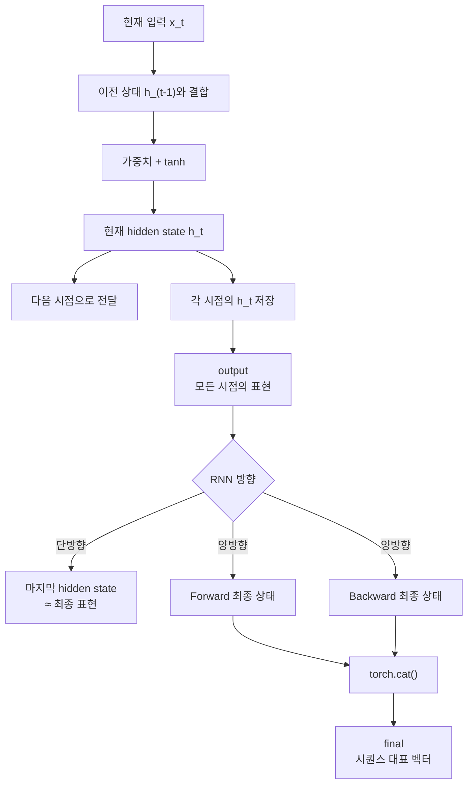

| 개념 | 의미 |
| --- | --- |
| `h_t` | 현재 입력과 이전 hidden state를 반영한 현재 상태 |
| `output` | 모든 시점의 hidden state 모음 |
| `h_n` | 각 층·방향의 마지막 hidden state |
| 단방향 | `output[:, -1]`과 마지막 `h_n`이 사실상 같은 상태 |
| 양방향 | `output[:, -1]`만으로 두 방향의 최종 상태를 얻을 수 없음 |
| `final` | Forward 최종 hidden + Backward 최종 hidden |
| RNN / Transformer | 둘 다 각 위치의 output을 만들지만 계산 방식이 다름 |

> 💡 **한 줄 요약** · RNN은 입력을 순차적으로 처리하며 매 시점 `hidden state`를 만들고, 이
> 전체가 `output`, 각 방향의 마지막 상태가 `h_n`, 양방향에서는 두 방향의 마지막 상태를 합친
> `final`을 시퀀스 전체의 대표 표현으로 사용할 수 있다.
{: .prompt-info }

---

## 15. 🧠 핵심 기억 카드

<details markdown="1">
<summary><strong>펼쳐서 확인</strong></summary>

- **RNN 기본 식** : `h_t = tanh(x_t W_x + h_(t-1) W_h + b)`
- **Hidden State** : 현재까지 입력된 정보를 압축해서 가지고 있는 상태값
- **압축이다** : `h4` 안에 `h1`, `h2`, `h3`가 그대로 저장된 것은 아니다
- **`output`** : 각 시점에서 만들어진 hidden state 전체 — `[B, L, H]`
- **`h_n`** : 각 층·방향에서 마지막으로 만들어진 hidden state
- **비유** : `output`은 모든 중간 노트, 마지막 hidden state는 최종 요약
- **단방향** : `output[:, -1] ≈ h_n[-1]` — 둘 다 마지막 상태 `h5`
- **양방향 shape** : `output[:, t] = [Forward_t | Backward_t]` → `[B, L, 2H]`
- **양방향 함정** : `output[:, -1]`은 `[Forward 최종 | Backward 첫 부분]` — 최종 표현이 아니다
- **`h_n[0]` / `h_n[1]`** : 각각 Forward / Backward가 전체 문장을 읽은 결과
- **`final`** : `torch.cat([h_n[0], h_n[1]], dim=1)` → `[B, 2H]`
- **용도 구분** : 문장 전체 분류 → `final` / 토큰마다 표현 필요 → `output`
- **`output`을 쓰는 예** : Sequence Labeling, Attention, 번역, 토큰 단위 예측
- **RNN vs Transformer** : 둘 다 output을 만들며, 순차 처리 vs Self-Attention의 차이

</details>

---

## 16. 🔗 관련 글

- [torch.cat()과 dim 이해하기](/posts/torch-cat-dim/)
- [딥러닝 문제 유형과 입출력 구조 설계](/posts/deep-learning-problem-types-and-io-shapes/)
- [비선형성과 활성화 함수 / ReLU의 역할](/posts/activation-function-and-relu/)
