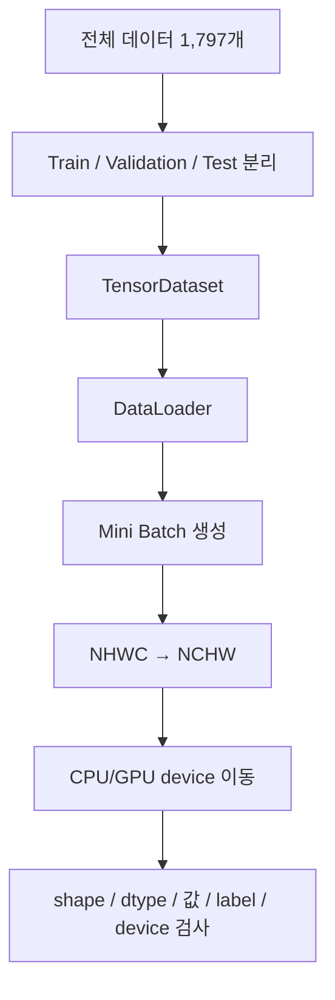

> 🗂️ **Notes · Deep Learning** — `dataloader` `batch` `train-test-split` `tensor-shape` `assignment`
{: .prompt-info }

---

## 1. 📖 개요

> 📌 **이 글의 목적** · 딥러닝 과제 — 문제 (1) 개념 복습 정리.
{: .prompt-tip }

### Dataset

딥러닝에서 사용할 **전체 데이터 묶음**이다.

이번 문제에서는 하나의 데이터가

```text
이미지 + 정답 label
```

형태로 구성된다.

### Train / Validation / Test

전체 데이터를 목적에 따라 세 부분으로 나눈다.

| 구분 | 역할 |
| --- | --- |
| **Train** | 모델이 실제로 학습하는 데이터 |
| **Validation** | 학습 중 모델의 성능과 상태를 확인하는 데이터 |
| **Test** | 모든 모델 선택이 끝난 뒤 최종 성능을 확인하는 데이터 |

> ⚠️ **주의** · Test를 학습 중 계속 확인하면 Test가 사실상 Validation 역할을 하게 되므로
> 최종 평가의 의미가 약해진다.
{: .prompt-warning }

이번 문제에서는 전체 데이터 **1,797개**를

$$
Train : Validation : Test = 70 : 15 : 15
$$

비율로 나눈다.

### 전체 흐름



---

## 2. 🔪 데이터 분할

### 왜 나누는가 — Data Split

딥러닝에서는 하나의 데이터로 학습과 평가를 모두 하면 안 된다.

모델이 이미 학습하면서 본 데이터를 다시 평가하면

```text
모델이 처음 보는 데이터를 잘 맞히는지
```

판단하기 어렵기 때문이다.

그래서 데이터를 먼저 나눈다. 이번 문제에서는 한 번에 70/15/15로 나누지 않고

```text
1차
70% / 30%

2차
남은 30% → 15% / 15%
```

방식을 사용한다.

### 1차 분할 — 70% / 30%

```python
train_indices, remainder_indices = train_test_split(
    all_indices,
    test_size=0.3,
    random_state=SEED,
    stratify=source_labels
)
```

전체 데이터:

$$
1797
$$

Train은 약 70%이므로:

$$
1797 \times 0.7 \approx 1257
$$

나머지는:

$$
1797 - 1257 = 540
$$

따라서:

```text
Train     = 1257개
Remainder = 540개
```

### `all_indices` — 왜 이미지 대신 index를 나눌까?

Index는 데이터의 **위치 번호**이다. 예를 들어:

```text
index       0       1       2
image     이미지A  이미지B  이미지C
label       5       2       9
```

이미지와 label은 같은 index로 연결되어 있다. 따라서 index만 먼저 나눠두면

```python
images_all[train_indices]
labels_all[train_indices]
```

처럼 이미지와 정답을 동시에 정확하게 선택할 수 있다.

```python
all_indices
```

는 개념적으로

```text
[0, 1, 2, ..., 1796]
```

이다. 즉 이번 문제에서는 이미지 자체보다 **이미지의 위치 번호를 먼저 분할**한다.

### `test_size=0.3` — 비율

`train_test_split()`은 데이터를 두 그룹으로 나눈다.

```python
A, B = train_test_split(
    data,
    test_size=0.3
)
```

이면

```text
A → 약 70%
B → 약 30%
```

가 된다. 따라서 `train_indices`는 70%, `remainder_indices`는 30%가 된다.

### `random_state=SEED` — Random Seed

컴퓨터의 랜덤 연산은 실행할 때마다 결과가 달라질 수 있다.

```text
1회 실행 → A, B, C
2회 실행 → C, A, B
```

Seed를 고정하면

```text
1회 실행 → A, B, C
2회 실행 → A, B, C
```

처럼 동일한 결과를 다시 재현할 수 있다.

> 💡 **왜 중요한가** · 딥러닝 실험에서는 **같은 조건에서 다시 실험할 수 있는
> 재현성(Reproducibility)** 이 중요하다.
{: .prompt-info }

이번 문제에서는

```python
SEED = 42
```

를 사용한다.

### `stratify=source_labels` — Label과 Stratified Split

Label은 이미지의 **정답**이다.

```text
이미지 → 손글씨 7
label → 7
```

`source_labels`에는 전체 이미지의 정답

```text
0, 1, 2, ..., 9
```

가 들어 있다.

단순 랜덤 분할을 하면 특정 class가 한쪽에 너무 많이 들어갈 수 있다. Stratified Split은

> **원본 데이터의 class 비율을 가능한 한 유지하면서 나누는 방법**

이다.

```python
stratify=source_labels
```

는 숫자 0~9의 비율을 참고해서 데이터를 나누라는 의미이다. 예를 들어 전체에서 숫자 `5`가
약 10%라면 Train에서도 약 10%가 되도록 분할한다.

### 2차 분할 — 나머지 30%를 Validation / Test로

여기서 중요한 것은

```text
50%가 전체 데이터의 50%가 아니다.
```

라는 점이다. 현재 분할 대상은 **전체의 30%인 remainder**이다. 따라서

$$
30\% \times 50\% = 15\%
$$

이다.

```python
valid_indices, final_test_indices = train_test_split(
    remainder_indices,
    test_size=0.5,
    random_state=SEED
)
```

남은 30%를 반으로 나누기 때문에

```text
Validation = 15%
Test       = 15%
```

가 된다. 실제로는

```text
Train      = 1257
Validation = 270
Test       = 270
```

이며

$$
1257 + 270 + 270 = 1797
$$

이다.

두 번에 걸친 분할 과정을 그림으로 정리하면 아래와 같다.

{: w="720" h="320" }

그림에서 보이듯 2차 분할의 `test_size=0.5`는 **전체가 아니라 Remainder 540개를 반으로**
나누는 값이고, Train 1257개는 2차 분할에서 건드리지 않는다.

> ⚠️ **주의** · 현재 작성한 두 번째 split에는 `stratify`가 없다. 따라서 Validation/Test의
> 0~9 비율은 첫 split만큼 직접적으로 보존하도록 지정된 것은 아니다.
{: .prompt-warning }

---

## 3. 🧮 분할이 제대로 됐는지 검사하기

### `set`으로 index 검사하기

Python의 `set`은 수학의 **집합**과 비슷하다.

```python
{1, 2, 3}
```

집합은 데이터 중복 여부나 두 그룹이 서로 겹치는지 검사할 때 유용하다.

```python
train_index_set = set(map(int, train_indices))
valid_index_set = set(map(int, valid_indices))
test_index_set = set(map(int, final_test_indices))
```

`map(int, ...)`는 각 index를 Python `int`로 변환한다.

```text
각 원소
 ↓
int()
 ↓
Python 정수
```

### 세 데이터의 교집합 검사

두 집합에 동시에 포함된 값을 **교집합**이라고 한다. 수학적으로

$$
A \cap B
$$

Train과 Validation에 같은 이미지가 들어가면 데이터 누수가 발생할 수 있다. 따라서

$$
Train \cap Validation = \varnothing
$$

이어야 한다.

```python
assert train_index_set.isdisjoint(valid_index_set)
assert train_index_set.isdisjoint(test_index_set)
assert valid_index_set.isdisjoint(test_index_set)
```

`isdisjoint()`는 **두 집합에 공통 원소가 없는가?** 를 확인한다. 즉

```text
Train ∩ Validation = 없음
Train ∩ Test       = 없음
Validation ∩ Test  = 없음
```

을 검사한다.

### 모든 데이터가 빠짐없이 사용되었는지 확인

합집합은 두 집합의 모든 원소를 합친 것이다. 수학적으로

$$
A \cup B
$$

Python의 set에서는 `A | B`로 표현할 수 있다.

```python
assert len(
    train_index_set |
    valid_index_set |
    test_index_set
) == len(all_indices)
```

즉

$$
Train \cup Validation \cup Test
$$

의 크기가 전체 데이터 크기인

$$
1797
$$

과 같은지 검사한다. 이 검사를 통해

```text
빠진 데이터 없음
+
중복 데이터 없음
```

을 확인할 수 있다.

### `assert`란?

`assert`는 **"이 조건은 반드시 True여야 한다."** 라는 검사이다.

```python
assert 조건
```

조건이

```text
True
→ 다음 코드 실행

False
→ AssertionError 발생
```

한다. 예를 들어

```python
assert len(train_indices) == 1257
```

는 train 데이터 수는 반드시 1257이어야 한다는 의미이다.

### Split 크기 확인

```python
assert (
    len(train_indices),
    len(valid_indices),
    len(final_test_indices)
) == (1257, 270, 270)
```

기대 결과:

```text
Train      1257
Validation 270
Test       270
```

### 모든 Class가 존재하는지 검사

분류 문제에서 예측 가능한 종류 하나를 **Class**라고 한다. 이번 문제에서는 숫자

```text
0,1,2,3,4,5,6,7,8,9
```

총 10개이므로

```python
NUM_CLASSES = 10
```

이다.

```python
set(range(NUM_CLASSES))
```

는

```text
{0,1,2,3,4,5,6,7,8,9}
```

가 된다. 따라서

```python
assert set(source_labels[train_indices]) == set(range(NUM_CLASSES))
```

는 Train 안에 0~9가 모두 존재하는가를 검사한다. Validation과 Test도 동일하다.

### Split Fingerprint

Hash는 긴 데이터를 고정된 길이의 문자열로 요약하는 방법이다.

```text
현재 데이터 분할
        ↓
SHA256
        ↓
긴 고유 문자열
```

동일한 split이면 동일한 fingerprint를 만들 수 있으므로

> **현재 실험에서 어떤 데이터 분할을 사용했는지 확인하는 식별값**

으로 활용할 수 있다.

```python
split_fingerprint = hashlib.sha256(...).hexdigest()
```

실제 결과:

```text
887e4461712c61d359ad17867b71239e52ba1be90cf4fd6bad09661718852062
```

---

## 4. 📦 `TensorDataset`과 `DataLoader`

### `TensorDataset`

PyTorch에서 Dataset은

> **모델 학습에 사용할 입력과 정답을 하나의 데이터 단위로 관리하는 객체**

이다. 이번 문제에서는 `이미지 + 정답`을 묶는다.

```python
train_dataset = TensorDataset(
    images_all[train_indices],
    labels_all[train_indices]
)
```

개념적으로

```text
image[0] ↔ label[0]
image[1] ↔ label[1]
image[2] ↔ label[2]
...
```

가 된다. Validation도 동일하다.

### `DataLoader`와 Mini Batch

신경망은 보통 전체 데이터를 한 번에 모델에 넣지 않는다. 예를 들어 Train 데이터가
1257개라도

```text
1257개 한꺼번에
```

가 아니라

```text
64개
64개
64개
...
```

처럼 작은 묶음으로 나눈다. 이 작은 데이터 묶음을 **Mini Batch**라고 한다.
`DataLoader`가 Dataset에서 Mini Batch를 만들어준다.

```python
train_loader = DataLoader(
    train_dataset,
    batch_size=BATCH_SIZE,
    shuffle=True
)
```

여기서

```python
BATCH_SIZE = 64
```

이다.

### 왜 Train만 `shuffle=True`인가?

Shuffle은 데이터의 순서를 섞는 것이다. Train에서는 매번 같은 데이터 조합만 학습하지
않도록 데이터를 섞는다.

```text
원래
1 → 2 → 3 → 4 → 5

shuffle
3 → 1 → 5 → 2 → 4
```

Validation은 학습하는 데이터가 아니므로 순서를 섞을 필요가 없다. 따라서

| Loader | 설정 | Sampler |
| --- | --- | --- |
| Train | `shuffle=True` | `RandomSampler` |
| Validation | `shuffle=False` | `SequentialSampler` |

실제 결과:

```text
Train      → RandomSampler
Validation → SequentialSampler
```

### 첫 번째 Batch 꺼내기

DataLoader는 여러 Batch를 차례대로 제공한다.

```python
iter(train_loader)
```

는 DataLoader를 하나씩 꺼낼 수 있는 형태로 만들고, `next(...)`는 그중 다음 하나를
가져온다.

```python
batch_images, batch_labels = next(iter(train_loader))
```

현재 Batch Size가 64이므로

```text
image 64개
label 64개
```

를 가져온다.

---

## 5. 📐 Tensor Shape — NCHW와 NHWC

### Tensor Shape

Tensor의 Shape는

> **각 차원이 몇 개의 값을 가지고 있는지**

를 나타낸다. 예:

```text
[64, 1, 8, 8]
```

PyTorch CNN에서는 이미지 Tensor를 주로

```text
[B, C, H, W]
```

또는

```text
[N, C, H, W]
```

형태로 사용한다. 각각

| 기호 | 의미 |
| --- | --- |
| `B` / `N` | Batch |
| `C` | Channel |
| `H` | Height |
| `W` | Width |

이다. 현재 `[64,1,8,8]`은

```text
Batch   = 64
Channel = 1
Height  = 8
Width   = 8
```

이다. 흑백 이미지이므로 Channel은 `1`이다.

### NHWC — 차원 순서는 라이브러리마다 다를 수 있다

어떤 이미지 도구는

```text
[B,H,W,C]
```

즉 NHWC를 사용할 수 있다. 반면 PyTorch `Conv2d`는 기본적으로

```text
[B,C,H,W]
```

즉 NCHW를 기대한다. 따라서 데이터 값이 같더라도 **차원의 의미와 순서가 맞아야 한다.**

```python
batch_nhwc = batch_images.permute(0, 2, 3, 1)
```

원래

```text
N C H W
0 1 2 3
```

를

```text
N H W C
0 2 3 1
```

로 바꾼다. 따라서

```text
[64,1,8,8]
    ↓
[64,8,8,1]
```

가 된다.

### `permute()`

`permute()`는 Tensor의 **차원 순서를 변경**한다. 중요한 것은

> 값을 새로 계산하는 것이 아니라 각 차원의 위치를 재배치한다.

는 점이다. NHWC

```text
N H W C
0 1 2 3
```

를 NCHW로 돌리려면

```python
batch.permute(0, 3, 1, 2)
```

를 사용한다. 따라서

```text
[64,8,8,1]
      ↓
[64,1,8,8]
```

이 된다. 두 번의 `permute()`로 shape가 어떻게 오갔는지를 그림으로 보면 아래와 같다.

![NCHW [64, 1, 8, 8] Tensor에 permute(0, 2, 3, 1)을 적용해 Channel 축이 맨 뒤로 이동한 NHWC [64, 8, 8, 1]이 되고, 다시 permute(0, 3, 1, 2)를 적용하면 Channel 축이 두 번째로 돌아와 NCHW [64, 1, 8, 8]이 되는 과정](/assets/img/posts/data-split-dataloader-batch-contract/nchw-nhwc-permute.svg){: w="700" h="490" }

그림에서 이동하는 것은 각 축(N, C, H, W)의 **위치**뿐이고, 각 축이 가진 크기(64, 1, 8, 8)와
그 안의 값은 그대로 따라다닌다.

### 값 보존 검사

차원의 순서를 바꾼 것과 pixel 값을 변경하는 것은 다르다. 이번 문제에서는

```text
NHWC
 ↓
NCHW
 ↓
다시 NHWC
```

했을 때 원래 값과 같아야 한다.

```python
torch.testing.assert_close(
    restored_nchw.permute(0, 2, 3, 1),
    batch_nhwc
)
```

실제 결과:

```text
roundtrip_values_preserved = true
```

따라서 차원의 위치만 바뀌었고 pixel 값은 유지되었다.

---

## 6. 🖥️ CPU / GPU와 Device

### Device

PyTorch Tensor와 Model은 실제 계산을 수행하는 장소를 가진다. 대표적으로

```text
CPU
GPU(cuda)
```

이다. PyTorch에서는 이를

```python
tensor.device
```

로 확인한다.

> ⚠️ **주의** · 딥러닝 연산에서는 일반적으로 Model, Image, Label이 모두 같은 Device에
> 있어야 한다. `Model → GPU`, `Image → CPU`이면 모델 연산에서 오류가 발생한다.
{: .prompt-warning }

### `.to(device)`

Tensor나 모델을 지정한 device로 이동할 때 사용한다.

```python
tensor.to(device)
model.to(device)
```

```python
images_device = batch_images.to(expected_device)
labels_device = batch_labels.to(expected_device)
```

현재 실제 실행 결과:

```text
device = cpu
```

이다.

---

## 7. 🧾 Batch Contract

Contract는

> **모델에 데이터를 넣기 전에 반드시 지켜야 하는 규칙**

이라고 생각하면 된다. 잘못된 데이터가 모델 안쪽까지 들어가기 전에 입구에서 바로 검사한다.

이번 문제의 Contract:

```text
Image shape   [B,1,8,8]
Image dtype   float32

Label shape   [B]
Label dtype   int64

Image         NaN/Inf 없음
Label         0~9

Image device  모델과 동일
Label device  모델과 동일
```

### Shape 검사

```python
assert images.shape == (len(images), 1, 8, 8)
```

현재 첫 batch가 64개이므로

```text
[64,1,8,8]
```

이어야 한다. Label은

```python
assert labels.shape == (len(images),)
```

이미지 64개면

```text
labels = [64]
```

가 되어야 한다.

### dtype

dtype은 Tensor 안에 저장되는 값의 **자료형**이다. 이미지는 연속적인 수치 계산이 필요하므로
`torch.float32`를 사용한다. Class label은

```text
0,1,2,...,9
```

의 정수 번호이므로 `torch.int64`를 사용한다.

```python
assert images.dtype == torch.float32
assert labels.dtype == torch.int64
```

실제:

```text
image → torch.float32
label → torch.int64
```

### Finite 검사

딥러닝 계산 중 다음과 같은 비정상 값이 발생할 수 있다.

```text
NaN
+Infinity
-Infinity
```

> 🚨 **위험** · 이 값이 모델에 들어가면 이후 계산이 망가질 수 있다.
{: .prompt-danger }

```python
torch.isfinite(images)
```

는 각각의 값이 정상적인 유한값이면 `True`를 반환한다.

```python
torch.isfinite(images).all()
```

은 모든 값이 정상인지 검사한다.

### Label 범위

이번 모델은 숫자 10개를 분류한다.

```python
NUM_CLASSES = 10
```

따라서 가능한 label은

$$
0 \le label < 10
$$

즉 `0 ~ 9`이다. 검사:

```python
assert torch.all(labels >= 0)
assert torch.all(labels < NUM_CLASSES)
```

실제 결과:

```text
label_min = 0
label_max = 9
```

이다.

### Device 검사

```python
assert images.device == device
assert labels.device == device
```

의미:

```text
Image가 모델과 같은 곳에 있는가?
Label도 모델과 같은 곳에 있는가?
```

이번 결과:

```text
Model  → CPU
Image  → CPU
Label  → CPU
```

이므로 정상이다.

---

## 8. 🔎 첫 Batch 결과

실제 출력:

```python
{
    'batch': 64,
    'image_shape': (64, 1, 8, 8),
    'image_dtype': 'torch.float32',
    'label_dtype': 'torch.int64',
    'label_min': 0,
    'label_max': 9,
    'device': 'cpu'
}
```

| 항목 | 실제 값 |
| --- | --- |
| Batch | 64 |
| Image Shape | `(64,1,8,8)` |
| Image dtype | `torch.float32` |
| Label dtype | `torch.int64` |
| Label 최소 | 0 |
| Label 최대 | 9 |
| Device | CPU |

---

## 9. 📊 실제 Class Distribution

### Train

```text
[124, 127, 124, 128, 127,
 127, 127, 125, 122, 126]
```

총 `1257`이다. 0~9가 비교적 균등하게 분포하고 있다.

### Validation

```text
[29, 23, 29, 28, 24,
 25, 32, 29, 28, 23]
```

총 `270`이다.

### Test

```text
[25, 32, 24, 27, 30,
 30, 22, 25, 24, 31]
```

총 `270`이다.

---

## 10. 🧮 수학 문제처럼 한 번에 정리

### 최종 Shape 변화

```text
PyTorch 원본
[B,C,H,W]

[64,1,8,8]

      ↓ permute(0,2,3,1)

NHWC
[64,8,8,1]

      ↓ permute(0,3,1,2)

NCHW
[64,1,8,8]
```

값은 그대로 유지된다.

### 데이터 개수

전체:

$$
1797
$$

1차:

$$
1797 \times 0.7 \approx 1257
$$

남은 데이터:

$$
1797 - 1257 = 540
$$

2차:

$$
540 \times 0.5 = 270
$$

따라서:

$$
1257 + 270 + 270 = 1797
$$

최종:

```text
Train      1257 ≈ 70%
Validation 270  ≈ 15%
Test       270  ≈ 15%
```

### Batch Shape

$$
B=64,\ C=1,\ H=8,\ W=8
$$

따라서:

$$
[B,C,H,W]
=
[64,1,8,8]
$$

---

## 11. 🧰 반드시 기억해야 할 PyTorch 문법

| 문법 | 역할 |
| --- | --- |
| `TensorDataset(images, labels)` | Image와 Label을 Dataset으로 묶는다 |
| `DataLoader(dataset, batch_size=64, shuffle=True)` | Dataset을 Mini Batch 단위로 공급한다 |
| `next(iter(train_loader))` | DataLoader에서 Batch 하나를 꺼낸다 |
| `tensor.permute(...)` | Tensor의 차원 순서를 바꾼다 |
| `tensor.to(device)` | Tensor를 CPU/GPU로 이동한다 |
| `tensor.shape` | Tensor의 차원 크기를 확인한다 |
| `tensor.dtype` | Tensor의 자료형을 확인한다 |
| `tensor.device` | Tensor가 CPU/GPU 중 어디에 있는지 확인한다 |
| `torch.isfinite(tensor).all()` | NaN이나 Inf가 없는지 검사한다 |
| `assert 조건` | 조건이 반드시 True인지 검사한다 |

---

## 12. ✅ 핵심 정리

> 💡 **한 줄 요약** · **문제 1은 데이터를 Train/Validation/Test로 안전하게 분리하고,
> PyTorch `DataLoader`로 Mini Batch를 만든 뒤, CNN에 넣기 전에 `[B,C,H,W]` shape·dtype·
> label 범위·device가 모두 올바른지 검증하는 문제이다.**
{: .prompt-info }

---

## 13. 🧠 핵심 기억 카드

<details markdown="1">
<summary><strong>펼쳐서 확인</strong></summary>

- **Train** : 모델이 학습하는 데이터
- **Validation** : 학습 중 모델 선택·상태 확인
- **Test** : 모든 선택 후 최종 평가
- **Index** : 데이터의 위치 번호
- **Label** : 데이터의 정답
- **Stratify** : Class 비율을 유지하며 분할
- **Seed** : 랜덤 결과를 재현 가능하게 고정
- **Dataset** : Image와 Label의 데이터 묶음
- **DataLoader** : Dataset을 Batch 단위로 공급
- **Batch** : 한 번에 모델이 처리하는 데이터 묶음
- **Shuffle** : Train 데이터 순서를 섞음
- **NCHW** : PyTorch 이미지 `[B,C,H,W]`
- **`permute()`** : Tensor 차원 순서 변경
- **Device** : Tensor/Model이 계산되는 CPU/GPU
- **dtype** : Tensor 값의 자료형
- **Batch Contract** : 모델 입력 전에 지켜야 할 데이터 규칙
- **`assert`** : 조건이 올바른지 즉시 검사

</details>

---

## 14. 🔜 다음 문제와 연결

문제 1에서 최종적으로 만든

```text
[B,1,8,8]
```

Tensor가 문제 2에서 실제로

```text
MLP
→ Flatten → Linear

CNN
→ Conv → Pool → Conv → Pool
```

을 통과하게 된다. 따라서 문제 2에서는 가장 먼저

> **입력 `[B,1,8,8]`이 각 Layer를 통과하면서 Shape가 어떻게 바뀌는가**

를 이해하는 것이 중요하다.

---

## 15. 🔗 관련 글

- [데이터 분리와 평가지표 — train/valid/test](/posts/train-valid-test-split-and-metrics/)
- [Python assert — 예상한 조건 검사하기](/posts/python-assert/)
- [PyTorch reshape() 이해하기](/posts/pytorch-reshape/)
