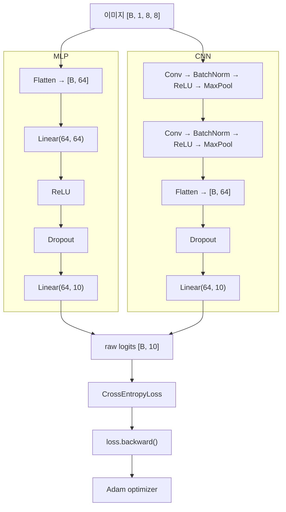

> 🗂️ **Notes · Deep Learning** — `cnn` `mlp` `conv2d` `batch-norm` `assignment`
{: .prompt-info }

---

## 1. 📖 개요

> 📌 **이 글의 목적** · 딥러닝 과제 — 문제 (2) 개념 복습 정리.
{: .prompt-tip }

문제 2의 핵심은 **이미지 데이터를 받아 0~9 숫자를 분류하는 신경망을 직접 설계하고, 모델
내부에서 데이터가 어떻게 변하는지 확인하는 것**이다.

전체 흐름은 다음과 같다.

```text
이미지 입력 [B, 1, 8, 8]
        ↓
특징 추출 / 변환
        ↓
분류를 위한 벡터
        ↓
10개의 raw logits [B, 10]
        ↓
CrossEntropyLoss
```

이번 문제에서는 두 가지 모델을 비교했다.

| 모델 | 처리 방식 |
| --- | --- |
| **MLP** | 이미지를 처음부터 1차원으로 펼쳐서 처리 |
| **CNN** | 이미지의 공간 구조를 유지하면서 특징을 추출 |

---

## 2. 🔀 MLP와 CNN의 가장 큰 차이

### MLP — 먼저 펼치고 시작한다

MLP는 `8 × 8` 이미지를 먼저 일렬로 펼친다.

```text
[B, 1, 8, 8]
      ↓ Flatten
[B, 64]
      ↓ Linear
[B, 64]
      ↓ ReLU + Dropout
[B, 64]
      ↓ Linear
[B, 10]
```

구현 구조:

```python
self.network = nn.Sequential(
    nn.Flatten(),
    nn.Linear(64, 64),
    nn.ReLU(),
    nn.Dropout(dropout_rate),
    nn.Linear(64, 10)
)
```

MLP는 다음과 같이 생각할 수 있다.

```text
이미지
 ↓
64개의 숫자로 펼침
 ↓
일반적인 숫자 데이터처럼 처리
```

> ⚠️ **문제점** · 이미지를 펼치는 순간 **픽셀의 위치 관계가 명시적으로 유지되지 않는다.**
{: .prompt-warning }

예를 들어 원래 이미지에서

```text
■ ■
■ □
```

처럼 서로 가까운 픽셀도 Flatten 이후에는 단순한 숫자 배열의 위치가 된다.

### CNN — 펼치지 않고 특징부터 찾는다

CNN은 이미지를 처음부터 펼치지 않는다.

```text
[B, Channel, Height, Width]
```

형태를 유지하면서 작은 필터(kernel)가 이미지를 훑는다. 이번 모델의 구조는

```text
Conv
 ↓
BatchNorm
 ↓
ReLU
 ↓
MaxPool
 ↓
Conv
 ↓
BatchNorm
 ↓
ReLU
 ↓
MaxPool
 ↓
Flatten
 ↓
Dropout
 ↓
Linear
```

즉,

> CNN은 먼저 **이미지에서 특징을 찾고**, 마지막에 그 특징을 이용해 분류한다.

### 두 모델을 나란히 보면

두 모델은 입력과 출력이 같고 중간 처리 방식만 다르다.



MLP는 맨 앞에서 Flatten하고, CNN은 특징을 다 뽑은 뒤 맨 뒤에서 Flatten한다는 점이 가장 큰
차이다.

---

## 3. 🧩 CNN을 이루는 layer

### Conv2d — 이미지 특징 추출

이번 첫 번째 convolution:

```python
nn.Conv2d(
    in_channels=1,
    out_channels=8,
    kernel_size=3,
    padding=1
)
```

의미:

```text
입력 채널: 1
      ↓
3×3 필터로 특징 탐색
      ↓
8개의 특징맵 생성
```

shape:

```text
[B, 1, 8, 8]
        ↓
[B, 8, 8, 8]
```

`out_channels=8`이므로 하나의 이미지에서 **8종류의 특징을 찾는 필터를 학습**한다고 이해하면
된다. 예를 들면 CNN은 학습을 통해 다음과 같은 특징을 감지할 수 있다.

```text
세로선
가로선
곡선
모서리
특정 패턴
...
```

### BatchNorm2d — 중간 feature 정규화

```python
nn.BatchNorm2d(8)
```

Conv가 만든 8개 feature channel의 값 분포를 조절해 학습을 안정화하는 역할을 한다.

```text
Conv 결과
    ↓
BatchNorm
    ↓
값의 분포를 안정적으로 조정
```

중요한 특징은 **train과 eval에서 동작 방식이 다르다**는 것이다.

| 모드 | 동작 |
| --- | --- |
| `model.train()` | 현재 mini-batch의 통계를 사용하고 `running_mean`, `running_var`도 계속 업데이트된다 |
| `model.eval()` | 학습 중 저장된 `running_mean`, `running_var`를 사용한다 |

### ReLU — 비선형성 추가

```python
nn.ReLU()
```

기본 동작:

```text
x < 0 → 0
x ≥ 0 → x
```

수식:

```text
ReLU(x) = max(0, x)
```

신경망에 비선형성을 추가하여 단순한 선형 변환보다 복잡한 패턴을 학습할 수 있게 한다.

### MaxPool2d — 이미지 크기 축소

```python
nn.MaxPool2d(2)
```

2×2 영역에서 가장 큰 값 하나만 선택한다. 동작과 이번 모델에서의 크기 변화는 아래 그림과
같다.

{: w="720" h="290" }

값 4개 중 가장 큰 값 하나만 남기므로 가로·세로가 각각 절반이 되고, 이번 모델에서는 Pool을
두 번 거쳐 `8×8 → 4×4 → 2×2`가 된다.

목적은 다음과 같다.

- 계산량 감소
- 중요한 특징 강조
- feature를 더 압축된 형태로 표현

---

## 4. 📐 CNN의 전체 Shape 변화

이번 문제에서 가장 중요한 shape 흐름이다.

![CNN을 통과하며 Tensor Shape가 바뀌는 순서 — 입력 [B,1,8,8]이 Conv1으로 [B,8,8,8], Pool1으로 [B,8,4,4], Conv2로 [B,16,4,4], Pool2로 [B,16,2,2]가 되고 Flatten으로 [B,64], Linear로 최종 logits [B,10]이 된다](/assets/img/posts/mlp-cnn-model-design-and-shape-flow/cnn-shape-flow.svg){: w="720" h="628" }

과제에서 `B = 16`으로 실제 확인한 값은 다음과 같다.

```text
입력
(16, 1, 8, 8)

↓ Conv1

(16, 8, 8, 8)

↓ Pool1

(16, 8, 4, 4)

↓ Conv2

(16, 16, 4, 4)

↓ Pool2

(16, 16, 2, 2)

↓ Flatten

(16, 64)

↓ Linear

(16, 10)
```

과제에서도 이 `input → feature map → flatten → logits` 흐름을 직접 확인하도록 구성되어 있다.

### Flatten — CNN 특징을 분류기로 연결

마지막 feature map

```text
[B, 16, 2, 2]
```

에서 한 이미지가 가진 feature 개수는

```text
16 × 2 × 2 = 64
```

따라서

```python
flattened = torch.flatten(features, start_dim=1)
```

결과:

```text
[B, 16, 2, 2]
        ↓
[B, 64]
```

> 💡 **`start_dim=1`이 중요한 이유** · 0번 차원은 batch이기 때문이다.
>
> ```text
> dim=0 → batch
> dim=1 이후 → feature
> ```
>
> 따라서 batch는 유지하고 이미지별 feature만 펼친다.
{: .prompt-info }

### Linear — 최종 10개 class 출력

```python
self.classifier = nn.Linear(
    16 * 2 * 2,
    NUM_CLASSES
)
```

즉:

```text
64개의 특징
    ↓
10개의 숫자 점수
```

결과는 `[B, 10]`이다. 10개인 이유는 정답 class가

```text
0, 1, 2, 3, 4, 5, 6, 7, 8, 9
```

총 10개이기 때문이다.

---

## 5. 🎯 Logits와 Loss

### Logits란?

모델의 마지막 출력 `[B, 10]`의 각 숫자는 각 class에 대한 **가공되지 않은
점수(raw score)** 이다.

```text
[-1.2, 0.5, 4.8, 0.3, ...]
            ↑
        가장 큰 값
```

이 경우 class `2`의 점수가 가장 크므로 추론에서는

```python
torch.argmax(logits, dim=1)
```

을 이용해 예측 class를 얻는다.

### 왜 Softmax를 모델에 넣지 않았는가?

이번 문제에서는

```python
criterion = nn.CrossEntropyLoss()
```

를 사용한다. `CrossEntropyLoss`는 raw logits를 입력으로 받아 내부에서 분류 확률 계산에
필요한 처리를 수행한다.

![왼쪽은 모델 → raw logits [B, 10] → nn.CrossEntropyLoss()로 이어지는 이번 과제의 구조, 오른쪽은 모델과 CrossEntropyLoss 사이에 Softmax를 넣어 이번 과제에서는 사용하지 않은 구조](/assets/img/posts/mlp-cnn-model-design-and-shape-flow/logits-and-softmax.svg){: w="720" h="320" }

이번 과제에서도 모델 끝에 `Softmax` 또는 `LogSoftmax`가 존재하지 않는지 검사한다.

### CrossEntropyLoss

다중 class 분류에서 사용한 loss 함수이다.

```python
criterion = nn.CrossEntropyLoss()
```

입력:

```text
logits : [B, 10]
labels : [B]
```

예:

```text
logits
[0.2, 0.1, 3.5, ...]

정답
2
```

정답 class `2`의 점수가 높으면 loss가 작아지고, 틀린 class의 점수가 높으면 loss가 커진다.
즉 학습의 목표는

```text
정답 class의 logit ↑
오답 class의 logit ↓
```

가 되도록 parameter를 수정하는 것이다.

---

## 6. ⚙️ Optimizer와 Gradient 확인

### Adam Optimizer

이번에는 MLP와 CNN 모두 같은 optimizer를 사용했다.

```python
torch.optim.Adam(
    model.parameters(),
    lr=LEARNING_RATE
)
```

학습률:

```python
LEARNING_RATE = 0.005
```

Optimizer의 역할은

```text
loss 계산
    ↓
gradient 계산
    ↓
gradient를 참고
    ↓
parameter 수정
```

이다.

> 💡 **한 줄 정리** · loss가 **얼마나 틀렸는지 측정**한다면, optimizer는 **어떻게 parameter를
> 수정할지 결정**한다.
{: .prompt-info }

### Gradient가 실제로 전달되는지 확인

모델 구조가 만들어졌다고 해서 학습이 반드시 가능한 것은 아니다. 따라서 다음 흐름을
확인했다.

```python
optimizer.zero_grad()

logits = model(images)

loss = criterion(logits, labels)

loss.backward()
```

`loss.backward()`를 실행하면

```text
Loss
 ↓
Linear
 ↓
CNN layers
 ↓
각 parameter의 .grad
```

방향으로 gradient가 계산된다. 확인은

```python
parameter.grad is not None
```

로 한다. 즉 모델의 trainable parameter까지 gradient가 정상적으로 전달되어야 실제 학습이
가능하다.

---

## 7. 🔢 Parameter 수 비교

실제 결과:

| 모델 | Parameter 수 |
| --- | --- |
| MLP | 4,810 |
| CNN | 1,946 |

흥미로운 점은 이번 작은 모델에서는 CNN이 더 복잡해 보이지만 parameter 수는 오히려 적다는
것이다.

MLP의 계산:

```text
첫 Linear (64 → 64)
64 × 64 + 64 = 4160

마지막 Linear (64 → 10)
64 × 10 + 10 = 650

합계
4160 + 650 = 4810
```

CNN은 작은 convolution filter를 공간 전체에서 공유하기 때문에 비교적 적은 parameter로 이미지
특징을 추출할 수 있다.

---

## 8. 🔁 train() / eval()에 따라 달라지는 동작

### Dropout

```python
nn.Dropout(0.2)
```

학습 중 일부 neuron 출력을 랜덤하게 꺼서 특정 feature에 지나치게 의존하는 것을 줄이는
정규화 기법이다.

| 모드 | Dropout | 같은 입력을 두 번 넣으면 |
| --- | --- | --- |
| `model.train()` | 활성화 | 출력 1 ≠ 출력 2 |
| `model.eval()` | 비활성화 | 출력 1 ≈ 출력 2 |

이번 문제의

```text
train_repeat_gap > 0
```

은 train mode에서 Dropout 때문에 같은 입력의 출력이 달라지는지 확인한다.

### BatchNorm의 train / eval 차이

BatchNorm은 train 상태에서 batch 통계를 사용하면서

```text
running_mean
running_var
```

를 업데이트한다. 따라서

```text
bn_running_delta > 0
```

이면 학습 중 BatchNorm의 running statistics가 실제로 변경된 것이다. 반면 eval mode에서는
저장된 통계를 사용하므로

```text
eval_repeat_gap ≈ 0
```

이 된다.

문제 2는 Dropout과 BatchNorm 때문에 `train()`과 `eval()`을 구분해야 하는지를 직접 검증하도록
설계되어 있다.

### 핵심 정리

| | `model.train()` | `model.eval()` |
| --- | --- | --- |
| 용도 | 학습용 | 검증·추론용 |
| Dropout | ON | OFF |
| BatchNorm | 현재 batch 통계 사용 | 저장된 running 통계 사용 |
| BN running | 업데이트 | 업데이트하지 않음 |
| Gradient | 계산 가능 | — |

> ⚠️ **주의** · `model.eval()` 자체가 gradient 계산을 끄는 것은 아니다.
{: .prompt-warning }

검증할 때는 일반적으로

```python
model.eval()

with torch.no_grad():
    ...
```

를 함께 사용한다.

---

## 9. 🧭 실무에서 모델을 설계하는 흐름

> 아래는 이번 과제 내용을 실제 모델 개발 흐름으로 확장해 이해한 것이다.

이미지 분류 모델을 만들 때는 보통 다음 순서로 확인한다.

### STEP 1. 입력 shape 확인

```text
[B, C, H, W]
```

예:

```text
[B, 1, 8, 8]
```

### STEP 2. 출력 class 수 결정

숫자 분류:

```text
0~9
→ 10 classes
```

따라서 최종 출력은 `[B, 10]`.

### STEP 3. 특징 추출 구조 설계

```text
Conv
 ↓
Normalization
 ↓
Activation
 ↓
Pooling
```

을 반복하여 이미지 특징을 압축한다.

### STEP 4. 중간 shape 계산

특히 다음을 반드시 확인한다.

```text
Conv 후 H/W
Pool 후 H/W
마지막 channel
Flatten 크기
```

이번 모델은 `16 × 2 × 2 = 64`이므로 classifier 입력은 `64`.

### STEP 5. classifier 연결

```text
feature
 ↓
Flatten
 ↓
Linear
 ↓
logits
```

### STEP 6. Loss 연결

다중 class 분류이므로 `nn.CrossEntropyLoss()`를 사용하고, 모델은 raw logits를 출력한다.

### STEP 7. Optimizer 연결

```python
Adam(model.parameters(), lr=...)
```

### STEP 8. Forward / Loss / Backward 검사

정식 학습 전에 작은 batch로

```text
forward 가능?
 ↓
shape 정상?
 ↓
loss finite?
 ↓
gradient 존재?
```

를 확인한다. 실무에서도 이 단계가 매우 중요하다.

### STEP 9. Train / Eval mode 확인

특히 모델에 `Dropout`이나 `BatchNorm`이 있다면 필수이다.

```text
학습       → model.train()
검증·추론  → model.eval()
```

---

## 10. ⚠️ 자주 발생하는 오류

### ① Flatten 크기를 추측

잘못된 방식:

```python
nn.Linear(128, 10)
```

처럼 중간 shape를 계산하지 않고 임의로 작성. 올바른 흐름은

```text
마지막 feature map
[B,16,2,2]

16 × 2 × 2
= 64
```

### ② CrossEntropyLoss 앞에 Softmax 추가

```text
Softmax
 ↓
CrossEntropyLoss
```

가 아니라

```text
raw logits
 ↓
CrossEntropyLoss
```

### ③ Validation에서 `model.train()` 사용

그렇게 되면 Dropout이 계속 랜덤하게 동작하고 BatchNorm의 running statistics도 변경될 수 있다.
검증에서는 `model.eval()`로 전환해야 한다.

### ④ `zero_grad()` 누락

gradient는 기본적으로 누적될 수 있다. 따라서 일반적인 학습에서는

```python
optimizer.zero_grad()
```

후 새로운 gradient를 계산한다.

---

## 11. 🧰 핵심 PyTorch 문법

| 문법 | 역할 |
| --- | --- |
| `nn.Module` | 신경망 모델의 기본 클래스 |
| `forward()` | 입력이 모델을 통과하는 계산 정의 |
| `nn.Sequential()` | layer를 순서대로 연결 |
| `nn.Flatten()` | Tensor를 1차원 feature로 펼침 |
| `nn.Linear()` | Fully Connected layer |
| `nn.Conv2d()` | 이미지 특징 추출 |
| `nn.BatchNorm2d()` | feature 분포 정규화 |
| `nn.ReLU()` | 비선형 활성화 |
| `nn.MaxPool2d()` | 공간 크기 축소 |
| `nn.Dropout()` | 일부 neuron을 랜덤하게 비활성화 |
| `torch.flatten(x, start_dim=1)` | batch를 제외한 차원을 펼침 |
| `model.parameters()` | 학습 가능한 parameter 접근 |
| `p.numel()` | Tensor 원소 수 |
| `nn.CrossEntropyLoss()` | 다중 class 분류 loss |
| `torch.optim.Adam()` | parameter 업데이트 optimizer |
| `optimizer.zero_grad()` | 이전 gradient 초기화 |
| `loss.backward()` | 역전파로 gradient 계산 |
| `model.train()` | 학습 mode |
| `model.eval()` | 검증·추론 mode |
| `torch.argmax(logits, dim=1)` | 가장 큰 class logit의 index 선택 |

---

## 12. ✅ 핵심 정리

```text
MLP
→ 이미지를 Flatten해서 처리

CNN
→ 공간 구조를 유지하면서 특징을 먼저 추출
```

각 layer의 역할:

| Layer | 역할 |
| --- | --- |
| Conv | 특징 추출 |
| BatchNorm | 학습 안정화 |
| ReLU | 비선형성 |
| Pooling | 특징 압축 |
| Flatten | CNN feature를 Linear에 연결 |
| Linear | class별 logit 출력 |

최종 분류 구조는

```text
[B,1,8,8]
    ↓
CNN
    ↓
[B,64]
    ↓
Linear
    ↓
[B,10] raw logits
    ↓
CrossEntropyLoss
```

그리고 학습·추론에서 반드시 기억해야 할 핵심은

```text
학습       → model.train()
검증/추론  → model.eval()
```

이다. 특히 **Dropout과 BatchNorm이 존재하면 train/eval mode의 차이가 실제 모델 출력에 영향을
준다.**

> 💡 **한 줄 정리** · **문제 2의 핵심은 단순히 CNN 코드를 만드는 것이 아니라, 입력 shape →
> 특징 추출 → flatten → logits → loss까지의 흐름과 train/eval에 따른 모델 동작 차이를
> 이해하는 것이다.**
{: .prompt-info }

---

## 13. 🧠 핵심 기억 카드

<details markdown="1">
<summary><strong>펼쳐서 확인</strong></summary>

- **MLP** : 이미지를 먼저 Flatten해서 처리 — 픽셀의 위치 관계가 명시적으로 유지되지 않음
- **CNN** : `[B, C, H, W]`를 유지한 채 필터가 훑으며 특징을 먼저 추출
- **`Conv2d(1, 8, kernel_size=3, padding=1)`** : 8종류의 특징맵 생성, `[B,1,8,8] → [B,8,8,8]`
- **`BatchNorm2d(8)`** : feature 값 분포를 조절해 학습 안정화, train/eval 동작이 다름
- **`ReLU()`** : `max(0, x)` — 비선형성 추가
- **`MaxPool2d(2)`** : 2×2에서 최댓값 1개 선택 — 계산량 감소, 특징 강조, 압축
- **Shape 흐름** : `[B,1,8,8] → [B,8,8,8] → [B,8,4,4] → [B,16,4,4] → [B,16,2,2] → [B,64] → [B,10]`
- **`torch.flatten(x, start_dim=1)`** : dim 0은 batch라 유지하고 이미지별 feature만 펼침
- **classifier 입력** : `16 × 2 × 2 = 64`
- **Logits** : 가공되지 않은 raw score — `torch.argmax(logits, dim=1)`로 예측 class 선택
- **Softmax를 넣지 않는 이유** : `CrossEntropyLoss`가 raw logits를 받아 내부에서 처리
- **Adam** : `lr = 0.005`, gradient를 참고해 parameter 수정
- **Parameter 수** : MLP 4,810 / CNN 1,946 — CNN은 필터를 공간 전체에서 공유
- **`Dropout(0.2)`** : train ON(`train_repeat_gap > 0`) / eval OFF(`eval_repeat_gap ≈ 0`)
- **`model.train()`** : Dropout ON, BN은 현재 batch 통계 사용 + running 업데이트
- **`model.eval()`** : Dropout OFF, BN은 저장된 running 통계 사용
- **주의** : `model.eval()`이 gradient 계산을 끄지는 않는다 — `torch.no_grad()`를 함께 사용

</details>

---

## 14. 🔗 관련 글

- [데이터 분할과 DataLoader — Batch Contract 검사까지](/posts/data-split-dataloader-batch-contract/)
- [CNN Kernel 이해하기](/posts/cnn-kernel/)
- [Dropout과 BatchNorm — 과적합 완화와 학습 안정화](/posts/dropout-vs-batchnorm/)
