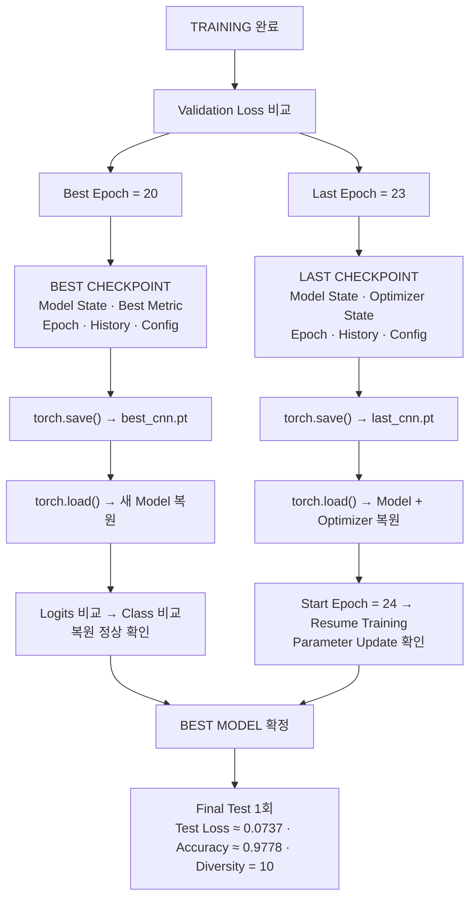

> 🗂️ **Notes · Deep Learning** — `checkpoint` `optimizer` `training-loop` `argmax` `assignment`
{: .prompt-info }

---

## 1. 📖 개요

> 📌 **이 글의 목적** · 딥러닝 과제 — 문제 (4) 개념 복습 정리.
{: .prompt-tip }

문제 3에서 모델을 학습하고 **best epoch**를 찾았다면, 문제 4에서는 그 모델 상태를 파일로
저장하고 다시 사용할 수 있어야 한다.

전체 흐름은 다음과 같다.

```text
Training 완료
    ↓
Best Epoch 선택
    ↓
Best Checkpoint 저장
Last Checkpoint 저장
    ↓
파일에서 다시 Load
    ↓
모델 복원 검증
    ↓
Last 상태에서 학습 Resume
    ↓
Best 모델로 최종 Test
```

핵심은 단순히 `weight` 파일 하나를 저장하는 것이 아니다.

> **모델을 평가용으로 다시 사용할 것인지, 중단된 학습을 이어갈 것인지에 따라 저장해야 하는
> 정보가 달라진다.**

---

## 2. 💾 Checkpoint란?

Checkpoint는 특정 시점의 딥러닝 실험 상태를 저장한 기록이다. 가장 단순하게는

```text
model weights
```

만 저장할 수도 있지만, 학습을 제대로 복원하려면 다음과 같은 정보가 필요할 수 있다.

```text
Model State
Optimizer State
Epoch
Validation Loss
Training History
Model Config
```

이번 문제에서는 이 정보를 Python `dictionary`로 묶어 저장했다.

```python
checkpoint = {
    "model_state_dict": ...,
    "epoch": ...,
    ...
}
```

### 왜 모델을 저장해야 하는가?

학습된 모델은 실행 중 메모리에 존재한다.

```text
Python Runtime
    ↓
Model Parameters
```

하지만 프로그램이나 Colab runtime이 종료되면 메모리의 모델은 사라진다. 따라서

```text
학습 완료
   ↓
Checkpoint 파일 저장
   ↓
Runtime 종료
   ↓
나중에 파일 Load
   ↓
모델 다시 사용
```

할 수 있도록 해야 한다.

---

## 3. 🎯 Best Epoch와 Last Epoch

문제 3에서 중요한 개념이었다.

| 구분 | 의미 | 이번 실행 |
| --- | --- | --- |
| **Best Epoch** | Validation loss가 가장 낮았던 시점 | 20 (Best Validation Loss ≈ 0.0288) |
| **Last Epoch** | 실제로 학습이 마지막으로 실행된 epoch | 23 |

따라서

```text
Best Epoch
20

≠

Last Epoch
23
```

이다. 즉,

> **마지막으로 학습한 모델이 가장 좋은 모델이라는 보장은 없다.**

### Best 모델을 찾는 방법

문제 3에서 각 epoch의 결과가 `cnn_records`에 저장되어 있었다.

```text
Epoch 1  → valid_loss
Epoch 2  → valid_loss
...
Epoch 20 → valid_loss
...
Epoch 23 → valid_loss
```

가장 작은 validation loss의 위치를 찾는다.

```python
best_cnn_index = np.argmin([
    record["valid_loss"]
    for record in cnn_records
])
```

`np.argmin()`은 가장 작은 값의 **index**를 반환한다.

```text
[0.10, 0.07, 0.03, 0.05]
             ↑
        index = 2
```

---

## 4. 🗂️ Best와 Last Checkpoint의 차이

이번 과제에서는 두 checkpoint의 역할을 이름으로 명확하게 구분했다.

{: w="720" h="388" }

### Best Checkpoint — `best_for_inference`

```text
가장 좋은 Validation 성능의 모델
        ↓
평가
추론
최종 Test
배포 후보
```

구조:

```python
best_checkpoint = {
    "checkpoint_role": "best_for_inference",
    "model_state_dict": ...,
    "epoch": ...,
    "best_valid_loss": ...,
    "best_valid_accuracy": ...,
    "history": ...,
    "config": ...,
}
```

> 💡 **왜 Optimizer를 넣지 않았는가** · Best checkpoint의 목적은 **평가·추론**이다.
> 추론에서는 `Forward`만 수행하며 `Backward`, `Optimizer Step`을 하지 않는다. 그래서 이번
> 과제에서는 best checkpoint에 optimizer 상태를 섞지 않았다.
{: .prompt-info }

### Last Checkpoint — `last_for_resume`

```python
last_checkpoint = {
    "checkpoint_role": "last_for_resume",
    "model_state_dict": ...,
    "optimizer_state_dict": ...,
    "epoch": ...,
    "last_valid_loss": ...,
    "history": ...,
    "config": ...,
}
```

즉 마지막 학습 시점의 `Model`, `Optimizer`, `Epoch`를 함께 보관한다.

### 한 줄로 정리하면

| Checkpoint | 목적 | 담는 것 |
| --- | --- | --- |
| **BEST** | 평가 / 추론 | model state, best epoch, best validation metric, history, config |
| **LAST** | 학습 Resume | model state, **optimizer state**, last epoch, last validation metric, history, config |

> 💡 **한 줄 정리** · **Best는 가장 좋은 모델을 사용하기 위한 파일이고, Last는 멈춘 학습을
> 정확히 이어가기 위한 파일이다.**
{: .prompt-info }

---

## 5. 🔑 `state_dict`와 함께 저장하는 정보

### `state_dict()`란?

PyTorch 모델은 학습된 parameter와 buffer를 `state_dict` 형태로 관리한다.

```python
model.state_dict()
```

개념적으로

```text
Conv Weight
Conv Bias
BatchNorm Weight
BatchNorm Bias
running_mean
running_var
Linear Weight
Linear Bias
...
```

등을 key-value 형태로 담고 있다.

### `model_state_dict`

모델의 학습 상태를 저장한다.

```text
저장                      복원
현재 Model               Checkpoint
   ↓                        ↓
state_dict            model_state_dict
   ↓                        ↓
Checkpoint               새 Model
```

PyTorch에서는

```python
model.load_state_dict(
    checkpoint["model_state_dict"]
)
```

를 사용한다.

### `optimizer_state_dict`

Optimizer도 내부 상태를 가지고 있다. 이번에는 Adam을 사용했다. Adam은 단순히 learning
rate만 기억하는 것이 아니라, parameter별로 학습 과정에서 누적된 내부 값을 가지고 있다.
따라서 학습을 정확하게 이어가려면 `optimizer.state_dict()`도 함께 저장해야 한다.

예를 들어 Epoch 23까지 Adam이 학습했다고 하자. 이때 optimizer는 이전 gradient 흐름을 반영하는
내부 상태를 가지고 있다. 모델 weight만 복원하고 optimizer를 새로 만들면

```text
Model
→ Epoch 23 상태

Optimizer
→ 처음 시작 상태
```

가 되어 완전한 학습 재개가 아니다. 따라서

```text
Resume
=
Model State 복원
+
Optimizer State 복원
+
Epoch 복원
```

이 필요하다.

### `copy.deepcopy()`

Checkpoint에 상태를 보관할 때 사용했다.

```python
copy.deepcopy(...)
```

의 목적은 현재 객체와 독립적인 복사본을 만드는 것이다.

```text
원본 상태
   ↓ deepcopy
Checkpoint 복사본
```

이후 원본 객체가 바뀌더라도 저장하려던 상태와 섞이지 않도록 한다.

### Checkpoint에 Config를 저장하는 이유

이번 과제에서는 다음과 같은 설정도 함께 저장했다.

```text
model_class
input_shape
num_classes
dropout_rate
seed
batch_size
learning_rate
max_epochs
early_stopping_patience
early_stopping_min_delta
```

즉 나중에 파일만 보더라도

```text
어떤 모델인가?
입력 크기는?
class 수는?
learning rate는?
dropout은?
seed는?
```

를 확인할 수 있다. 실험 재현성에서 매우 중요한 정보다.

---

## 6. 💿 저장과 불러오기

### `torch.save()`

Checkpoint dictionary를 파일에 저장한다. 기본 형태:

```python
torch.save(
    저장할_객체,
    파일_경로
)
```

이번 구조:

```python
torch.save(
    best_checkpoint,
    best_checkpoint_path
)

torch.save(
    last_checkpoint,
    last_checkpoint_path
)
```

즉

```text
Python Dictionary
      ↓
.pt 파일
```

로 저장한다.

### `torch.load()`

저장했던 checkpoint를 다시 읽는다.

```python
loaded_checkpoint = torch.load(...)
```

흐름:

```text
.pt File
  ↓
torch.load()
  ↓
Python Dictionary
```

그리고 dictionary 안의 상태를 모델에 적용한다.

### 새 모델에 복원하는 이유

기존 학습 모델에 다시 state를 적용하면 정말 파일 저장·복원이 정상인지 검증하기 어렵다.
그래서 새로운 모델

```python
restored_model = ImprovedCNN()
```

을 만든 다음

```python
restored_model.load_state_dict(
    loaded_best_checkpoint["model_state_dict"]
)
```

로 복원한다. 즉

```text
새로운 빈 CNN
    ↓
저장된 Best Weight Load
    ↓
Best CNN 복원
```

이다.

---

## 7. ✅ 복원 검증

Checkpoint가 정상적으로 저장·복원되었는지를 단순히

```text
에러 안 났음
```

으로 판단하면 부족하다. 이번 과제에서는 저장 전 모델과 복원 후 모델에 **같은 validation
image**를 넣어 logits를 비교했다.

{: w="720" h="292" }

### 실제 Reload 검증 결과

이번 실행:

```text
reload_max_abs_gap = 0.0
reload_class_exact = True
```

즉 저장 전후 모델의 logits 최대 차이가 `0.0`이었고 예측 class도 완전히 동일했다. 따라서

```text
저장
 ↓
Load
 ↓
Model 복원
```

과정이 정상적으로 수행되었다고 볼 수 있다.

### 왜 Logits와 Class를 둘 다 비교하는가?

예를 들어 두 모델의 logits가

```text
Model A
[0.1, 0.2, 4.5]

Model B
[0.2, 0.1, 4.3]
```

이면 예측 class는 모두 `2`일 수 있다. 즉 **class 동일**만으로는 내부 출력이 완전히 동일한지
알 수 없다. 그래서

```text
Logits 차이
+
최종 Class 일치
```

를 모두 검사한다.

---

## 8. ▶️ Resume — 중단된 학습 이어가기

Resume는 중단된 학습을 이어서 실행하는 것이다.

```text
Epoch 1
 ↓
...
 ↓
Epoch 23
 ↓
Checkpoint 저장
 ↓
Runtime 종료
 ↓
나중에 Load
 ↓
Epoch 24부터 계속 학습
```

즉 새롭게 1 epoch부터 다시 학습하는 것이 아니다.

### Model과 Optimizer를 함께 복원

먼저 새 모델을 만든 뒤 last checkpoint의 모델 상태를 복원한다.

```python
resume_model = ImprovedCNN()

resume_model.load_state_dict(
    loaded_last_checkpoint["model_state_dict"]
)
```

optimizer도 마찬가지다.

```python
resume_optimizer = torch.optim.Adam(...)

resume_optimizer.load_state_dict(
    loaded_last_checkpoint["optimizer_state_dict"]
)
```

즉

```text
Last Checkpoint
      │
      ├─ Model State
      │      ↓
      │   resume_model
      │
      └─ Optimizer State
             ↓
        resume_optimizer
```

이다.

### `start_epoch`

마지막으로 완료한 epoch 다음 번호부터 학습해야 한다.

```python
start_epoch = (
    loaded_last_checkpoint["epoch"] + 1
)
```

이번 실행은 Last Epoch가 23이므로

```text
Start Epoch
= 23 + 1
= 24
```

이다.

### Resume가 정말 되는지 확인

Checkpoint를 load했다고 해서 실제 학습 재개가 되는지는 별도로 확인해야 한다. 이번 문제에서는
한 mini-batch를 이용해

```text
resume_model.train()
       ↓
zero_grad()
       ↓
forward
       ↓
loss
       ↓
backward
       ↓
optimizer.step()
```

을 실행했다. 복원한 모델에 이미지를 넣고

```python
resume_logits = resume_model(
    resume_images
)

resume_loss = criterion(
    resume_logits,
    resume_labels
)
```

로 loss를 계산한다. 이번 실행의 `resume_loss ≈ 0.0397`이었고, loss가 `NaN`이나 `Inf`가 아닌
finite 값인지 검사했다. 즉 복원된 상태에서 정상적인 forward/loss 계산이 가능하다는 의미다.

### Parameter Update 검증

더 중요한 것은 실제 parameter가 변경되는지 확인하는 것이다. 학습 전
`before_resume_parameters`를 저장하고

```text
Backward
 ↓
optimizer.step()
```

후 `after_resume_parameters`와 비교했다. 결과는

```text
resume_parameter_update = True
```

즉 복원한 model과 optimizer로 **실제 학습을 이어갈 수 있음**을 확인했다.

---

## 9. 📋 이번 Checkpoint 검증 결과

| 항목 | 값 |
| --- | --- |
| Best Epoch | 20 |
| Best Validation Loss | ≈ 0.0288 |
| Last Epoch | 23 |
| Start Epoch | 24 |
| Reload Max Abs Gap | 0.0 |
| Reload Class Exact | True |
| Resume Loss | ≈ 0.0397 |
| Parameter Update | True |

즉

```text
Save
 ↓
Load
 ↓
Restore
 ↓
Resume
```

전체 흐름이 정상적으로 동작했다.

---

## 10. 🧪 Validation과 Test의 역할 분리

문제 4 마지막 단계에서 매우 중요한 개념이다.

| 데이터 | 역할 |
| --- | --- |
| Train | Parameter 학습 |
| Validation | 모델 구조 / Epoch / Checkpoint 선택 |
| Test | 최종 확정 모델의 성능 평가 |

이번 과제에서는 문제 1~3 동안 test index만 예약해 두고 **실제 Test DataLoader는 문제 4
마지막에만 생성**했다.

### 왜 Test를 마지막까지 사용하지 않는가?

Validation 결과를 보고

```text
Model
Epoch
Dropout
Learning Rate
```

등을 선택한다. 만약 test 결과까지 확인한 후

```text
성능이 별로네
→ Dropout 변경
→ 다시 Test
```

를 반복하면 test 데이터가 사실상 validation 데이터가 된다. 그러면 **독립적인 최종 성능
평가**라는 test의 의미가 사라진다.

### Test를 한 번만 평가하는 이유

이번 과제에서는

```text
Test DataLoader 생성 = 1회
전체 Test 평가 = 1회
```

로 제한했다. 흐름은

```text
Validation으로 모든 선택 완료
        ↓
Best Checkpoint 확정
        ↓
Test DataLoader 생성
        ↓
최종 Test 1회
        ↓
결과 기록
```

즉 test 결과를 모델 선택에 다시 사용하지 않도록 의도적으로 분리한다.

---

## 11. 🔢 최종 Inference와 Test 결과

모델은 각 이미지에 대해 `[B, 10]` 형태의 raw logits를 출력한다.

```text
[0.1, 0.3, 5.2, 0.8, ...]
          ↑
      가장 큰 값
```

따라서

```python
predictions = torch.argmax(
    logits,
    dim=1
)
```

을 이용해 class ID를 얻는다. `dim=1`인 이유는

```text
[B, 10]

dim 0
→ Batch

dim 1
→ Class
```

이기 때문이다. 과제의 최종 inference도 raw logits에서 가장 큰 class index를 선택하도록
구성되어 있다.

### 최종 Test 결과

| 항목 | 값 |
| --- | --- |
| Test Samples | 270 |
| Test Loss | ≈ 0.0737 |
| Test Accuracy | ≈ 0.9778 |
| Prediction Diversity | 10 |

즉 약 `97.78%`의 test accuracy를 기록했다. Prediction diversity가 `10`이라는 것은 0~9의 모든
class가 예측 결과에 나타났다는 의미다.

### Validation과 Test 결과가 다른 이유

```text
Best Validation Loss
≈ 0.0288

Test Loss
≈ 0.0737
```

로 차이가 존재한다. Validation과 Test는 서로 다른 sample 집합이므로 결과가 완전히 같을
필요는 없다. 중요한 것은

```text
Validation
→ 모델 선택용

Test
→ 선택 완료 후 최종 평가용
```

이라는 역할 분리를 유지하는 것이다.

### Test Accuracy의 한계

이번 test는 `270 samples`, `고정 split 1회`의 결과다.

> ⚠️ **일반화 주의** · `Test Accuracy = 0.9778`이라고 해서 모든 손글씨 숫자 이미지에서 항상
> 97.78%라고 일반화할 수는 없다. 특히 과제 자체에서도 이 결과를 **다른 이미지 도메인으로
> 일반화하지 않는다**고 명시한다.
{: .prompt-warning }

### Prediction Diversity

예측이 한 class로 무너졌는지도 확인했다. 잘못된 모델이

```text
7
7
7
7
7
7
...
```

라면 accuracy 수치만 봐서는 모델 이상을 놓칠 수도 있다. 이번 결과는
`prediction_diversity = 10`으로 모든 class가 예측에 나타났다.

> 단, Diversity가 10이라고 해서 모든 예측이 정확하다는 뜻은 아니다. Accuracy와 함께 해석해야
> 한다.

---

## 12. 🗺️ 문제 4 전체 흐름



---

## 13. 🧭 실무 적용 흐름

> 아래는 과제에서 학습한 checkpoint 흐름을 실제 딥러닝 개발 과정에 연결한 것이다.

### STEP 1. Validation 기준 Best 모델 결정

```text
Training History
      ↓
Validation Metric 비교
      ↓
Best Epoch 결정
```

### STEP 2. 목적에 따라 Checkpoint 분리

```text
Best
→ 평가 / 추론 / 배포 후보

Last
→ 학습 Resume
```

### STEP 3. 모델 정보도 함께 저장

최소한 `Model State`, `Epoch`, `Config`, `Metric`을 관리한다. Resume가 필요하면
`Optimizer State`까지 저장한다.

### STEP 4. 파일 저장

```text
Dictionary
   ↓
torch.save()
   ↓
Checkpoint File
```

### STEP 5. 새 환경에서 Load

```text
Checkpoint File
    ↓
torch.load()
    ↓
Dictionary 복원
```

### STEP 6. 모델 구조 생성

`ImprovedCNN()`처럼 checkpoint와 동일한 구조를 먼저 만든다.

### STEP 7. State 적용

`model.load_state_dict()`으로 weight를 적용한다.

### STEP 8. Reload 검증

같은 input을 이용해

```text
저장 전 Logits
vs
복원 후 Logits
```

를 비교한다.

### STEP 9. Resume가 필요하면 Optimizer도 복원

```text
Model State
+
Optimizer State
+
Epoch
```

를 모두 복원한다.

### STEP 10. 실제 한 Batch 학습 검사

```text
Forward
 ↓
Loss
 ↓
Backward
 ↓
Step
 ↓
Parameter 변경?
```

을 확인한다.

### STEP 11. Validation으로 모든 선택 완료

`Model`, `Epoch`, `Hyperparameter`, `Checkpoint`를 확정한다.

### STEP 12. Test는 마지막에 한 번

```text
Best Model 확정
      ↓
Test
      ↓
Final Metric
```

만 수행한다.

### 실무에서 Checkpoint가 중요한 상황

**장시간 학습** — `100 Epoch 학습 중 Epoch 63에서 서버 종료`가 되면 checkpoint가 없을 때
Epoch 1부터 다시 시작해야 한다. Last checkpoint가 있다면 Epoch 64부터 Resume할 수 있다.

**모델 배포** — 실제 서비스에서는 Training Code 전체가 필요한 것이 아니라 `Model 구조 +
Best Weight`를 이용해 inference를 수행할 수 있다.

**실험 재현** — Checkpoint에 config와 history가 있으면 어떤 LR, Batch Size, Dropout, Epoch로
어떤 성능을 낸 모델인지 추적하기 쉽다.

---

## 14. 🔒 Checkpoint 호환성과 Fingerprint

과제의 5점 도전에서는 load 전에 다음을 검사하도록 확장한다.

```text
schema_version
config
input_shape
num_classes
source_fingerprint
split_fingerprint
```

예를 들어 checkpoint는 `Input Shape = [1,8,8]`을 기대하는데 현재 모델이 `[1,28,28]`을
기대한다면 서로 다른 실험일 가능성이 높다. 따라서 state를 적용하기 전에 호환성을 검사하는
것이 안전하다.

> 📌 **범위** · 이 부분은 기본 필수가 아니라 과제의 **B4 선택 심화**에 해당한다.
{: .prompt-tip }

`source_fingerprint`와 `split_fingerprint`의 목적은

```text
같은 원본 데이터인가?
같은 train/validation/test split인가?
```

를 확인하는 것이다. 즉 이름이 같은 checkpoint라도 실제로 다른 데이터 실험의 결과를 잘못
불러오는 것을 방지하는 장치다.

---

## 15. ⚠️ 자주 발생하는 실수

### ① Last Model을 자동으로 Best Model로 사용

```text
Last Epoch
≠
Best Epoch
```

일 수 있다. Validation 기준 best를 따로 관리해야 한다.

### ② Resume 파일에 Optimizer를 저장하지 않음

Model weight만 복원하면 optimizer의 학습 상태가 이어지지 않는다.

### ③ Epoch를 저장하지 않음

마지막 epoch를 모르면 어디서부터 학습을 이어야 하는지 판단하기 어렵다.

### ④ 저장 후 Reload 검증을 하지 않음

파일이 존재한다는 사실만으로 복원이 정확하다고 판단하지 않는다.

```text
Same Input
→ Same Logits?
→ Same Class?
```

를 확인하는 것이 좋다.

### ⑤ Test 결과를 보고 다시 모델 수정

```text
Test 확인
 ↓
모델 변경
 ↓
Test 다시 확인
```

을 반복하면 test 데이터가 validation처럼 사용된다.

### ⑥ `model.eval()`을 하지 않고 추론

Dropout과 BatchNorm이 있는 모델에서는 inference 결과가 달라질 수 있다. 최종 평가 전
`model.eval()`이 필요하다.

---

## 16. 🧰 핵심 PyTorch / Python 문법

| 문법 | 역할 |
| --- | --- |
| `np.argmin()` | 가장 작은 값의 index 검색 |
| `model.state_dict()` | 모델 상태 dictionary |
| `model.load_state_dict()` | 저장된 모델 상태 복원 |
| `optimizer.state_dict()` | optimizer 상태 저장 |
| `optimizer.load_state_dict()` | optimizer 상태 복원 |
| `copy.deepcopy()` | 객체의 독립적인 복사본 생성 |
| `torch.save(obj, path)` | 객체를 파일로 저장 |
| `torch.load(path)` | 저장 파일 Load |
| `Path.mkdir()` | checkpoint 저장 폴더 생성 |
| `model.eval()` | 평가·추론 mode |
| `model.train()` | 학습 mode |
| `torch.no_grad()` | gradient 계산 비활성화 |
| `torch.testing.assert_close()` | Tensor 값이 허용오차 내 동일한지 검사 |
| `torch.equal()` | Tensor가 정확히 동일한지 검사 |
| `torch.isfinite()` | NaN/Inf 여부 검사 |
| `torch.argmax(logits, dim=1)` | 가장 높은 class logit의 index 반환 |

---

## 17. 🔗 문제 1~4 전체 연결

문제 3이 `Training → Validation → Early Stopping → Best Epoch 결정`이었다면, 문제 4는
**학습이 끝난 모델을 실제로 보존하고 다시 사용하는 단계**다.

```text
문제 1
DATA

Split
DataLoader
Shape
Device

        ↓

문제 2
MODEL

MLP / CNN
Forward
Logits
Loss

        ↓

문제 3
TRAINING

Backward
Optimizer
Validation
Early Stopping
Best Epoch

        ↓

문제 4
MODEL LIFECYCLE

Checkpoint
Save
Load
Restore
Resume
Final Test
```

이 흐름을 모두 연결하면 하나의 작은 딥러닝 실험 전체 과정이 된다.

---

## 18. ✅ 핵심 정리

Checkpoint에서 가장 중요한 구분:

```text
BEST
→ 가장 좋은 모델
→ 평가 / 추론용

LAST
→ 가장 마지막 학습 상태
→ Resume용
```

Resume의 핵심:

```text
Model State
+
Optimizer State
+
Epoch
```

복원의 핵심:

```text
Save했다고 끝이 아니라

같은 입력
 ↓
같은 Logits?
 ↓
같은 Class?

까지 검증
```

Test의 핵심:

```text
Validation으로
모델 선택 완료

        ↓

Test는 마지막에
한 번만 평가
```

> 💡 **한 줄 정리** · **문제 4의 핵심은 validation으로 선택한 best 모델을 안전하게
> 저장·복원해 최종 추론에 사용하고, 별도의 last checkpoint에는 model·optimizer·epoch 상태를
> 함께 보관하여 중단된 학습을 정확하게 이어갈 수 있도록 만드는 것이다.**
{: .prompt-info }

---

## 19. 🧠 핵심 기억 카드

<details markdown="1">
<summary><strong>펼쳐서 확인</strong></summary>

- **Checkpoint** : 특정 시점의 실험 상태 기록 — model / optimizer / epoch / metric / history / config
- **Best Epoch ≠ Last Epoch** : 이번 실행은 Best 20, Last 23
- **`np.argmin()`** : 가장 작은 validation loss의 **index**를 반환
- **Best Checkpoint** : `best_for_inference` — 평가·추론용, optimizer 상태를 넣지 않음
- **Last Checkpoint** : `last_for_resume` — model + **optimizer** + epoch를 함께 보관
- **`state_dict()`** : parameter와 buffer(`running_mean`, `running_var` 등)를 key-value로 관리
- **Optimizer 상태가 필요한 이유** : Adam은 parameter별 누적 내부 값을 가짐 — 안 넣으면 optimizer만 처음 상태
- **`copy.deepcopy()`** : 원본이 바뀌어도 저장하려던 상태와 섞이지 않게 독립 복사
- **Config 저장** : model_class · input_shape · num_classes · dropout_rate · seed · batch_size · learning_rate · max_epochs · patience · min_delta
- **`torch.save()` / `torch.load()`** : dictionary ↔ `.pt` 파일
- **새 모델에 복원** : 기존 모델에 다시 적용하면 저장·복원이 정말 되는지 검증하기 어려움
- **복원 검증** : 같은 이미지 → `reload_max_abs_gap = 0.0`, `reload_class_exact = True`
- **Logits와 Class를 둘 다 비교** : class만 같아도 내부 출력은 다를 수 있음
- **Resume** : model state + optimizer state + `start_epoch = last_epoch + 1 = 24`
- **Resume 검증** : `resume_loss ≈ 0.0397`(finite), `resume_parameter_update = True`
- **Test 1회 원칙** : Test DataLoader 생성 1회, 평가 1회 — 결과를 모델 선택에 재사용하지 않음
- **최종 추론** : `torch.argmax(logits, dim=1)` — `[B, 10]`에서 dim 1이 Class
- **Test 결과** : 270 samples, Loss ≈ 0.0737, Accuracy ≈ 0.9778, Diversity = 10
- **주의** : 고정 split 1회 결과이므로 다른 이미지 도메인으로 일반화하지 않는다

</details>

---

## 20. 🔗 관련 글

- [학습·검증 루프와 Early Stopping — MLP와 CNN 공정 비교](/posts/training-validation-loop-and-early-stopping/)
- [PyTorch 코드 기본 구조](/posts/pytorch-training-script-structure/)
- [데이터 분할과 DataLoader — Batch Contract 검사까지](/posts/data-split-dataloader-batch-contract/)
