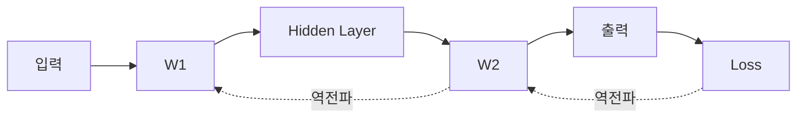

> 🗂️ **Notes · Deep Learning** — `backpropagation` `gradient` `loss-function` `optimizer` `weight`
{: .prompt-info }

---

## 1. 📖 Loss란?

> ❓ "loss 손실 측정 = 역전파. 이렇게 이해해도 괜찮은지?"

결론부터 말하면

```text
Loss 계산 ≠ 역전파
```

이다. Loss는

> **현재 모델의 예측이 정답과 얼마나 차이가 나는지 나타내는 값**

이다.

```python
loss = criterion(pred, y)
```

이 단계에서는

```text
"얼마나 틀렸는가?"
```

를 계산한다.

---

## 2. 🔁 역전파(Backpropagation)

Loss를 계산한 다음 `loss.backward()`를 수행한다. 역전파는

> **현재 발생한 Loss를 기준으로 모델 내부의 각 파라미터가 Loss에 어떻게 영향을 주는지 계산하는
> 과정**

이다.

> ❓ "이미 출력층이 나왔는데, 역전파로 각 파라미터들의 오차 발생 기여도를 측정하는 이유가 뭔지"

출력층의 값은 단지

```text
현재 파라미터를 사용했을 때 모델이 만든 예측값
```

일 뿐이다.



Loss가 크다고 해서 바로

```text
W1을 얼마나 바꿔야 하는가?
W2를 얼마나 바꿔야 하는가?
값을 키워야 하는가?
줄여야 하는가?
```

를 알 수 있는 것은 아니다. 그래서 역전파가 필요하다.

---

## 3. 📐 Gradient란?

역전파를 통해 계산하는 핵심값이 `Gradient`이다.

```text
∂Loss / ∂W
```

의미는

> **파라미터 W를 아주 조금 바꿨을 때 Loss가 얼마나 변하는가**

이다.

> ❓ "loss는 손실의 정도이고, 역전파를 각 파라미터에서 손실에 기여한 정도를 거꾸로 거슬러
> 올라가면서 파악하는 행위. 맞나?"

개념적으로 맞다. 다만 더 정확한 표현은

> **역전파는 뒤에서부터 거슬러 올라가며 각 파라미터를 조금 변화시켰을 때 Loss가 얼마나
> 민감하게 변하는지를 계산하는 과정**

이다. 즉 단순한 "책임 추적"보다는

```text
Loss 변화에 대한 민감도
+
어느 방향으로 값을 수정해야 하는지
```

를 계산한다고 보면 된다.

---

## 4. 📊 Gradient의 크기와 부호

Gradient는 숫자 하나지만 **크기**와 **부호**가 서로 다른 정보를 담고 있다.

{: w="720" h="292" }

예를 들어

```text
W1 gradient = +0.8
W2 gradient = -0.1
W3 gradient = +0.001
```

이라면 직관적으로 다음과 같이 볼 수 있다.

| 파라미터 | Gradient | 해석 |
| --- | --- | --- |
| `W1` | `+0.8` | Loss에 대한 민감도가 큼 |
| `W2` | `-0.1` | 어느 정도 영향 |
| `W3` | `+0.001` | 현재 Loss에 거의 영향을 주지 않음 |

부호도 중요하다.

```text
gradient > 0
→ W를 감소시키는 방향이 Loss 감소 방향

gradient < 0
→ W를 증가시키는 방향이 Loss 감소 방향
```

---

## 5. ⚙️ `backward()`와 `optimizer.step()`

전체 흐름은 다음과 같다.

```python
loss.backward()
optimizer.step()
```

두 함수의 역할은 다르다.

| 함수 | 역할 |
| --- | --- |
| `loss.backward()` | 각 파라미터의 Gradient 계산 |
| `optimizer.step()` | 계산된 Gradient를 이용해 실제 파라미터 수정 |

Gradient Descent의 기본 아이디어는

```text
W_new
=
W_old
-
learning_rate × gradient
```

이다. 앞에서 본 `W1`의 값을 그대로 넣어 보면 다음과 같다.

{: w="720" h="262" }

```text
W = 2.0
gradient = +0.8
learning_rate = 0.1
```

이면

```text
W_new
= 2.0 - 0.1 × 0.8
= 1.92
```

이 된다.

---

## 6. 🗺️ 전체 학습 흐름

```text
입력
 ↓
Forward
 ↓
예측값 출력
 ↓
정답과 비교
 ↓
Loss 계산
 ↓
Backward
 ↓
Gradient 계산
 ↓
optimizer.step()
 ↓
파라미터 수정
 ↓
다시 Forward
```

각 단계가 답하는 질문이 서로 다르다는 점이 핵심이다.

{: w="720" h="344" }

```text
Forward
→ 현재 모델이 어떤 답을 내는가?

Loss
→ 얼마나 틀렸는가?

Backward
→ 이 Loss를 줄이려면 각 파라미터를
   어느 방향으로 얼마나 수정해야 하는가?

Optimizer
→ 실제 파라미터 수정
```

---

## 7. ✅ 핵심 정리

| 항목 | 내용 |
| --- | --- |
| Loss | 손실의 크기 |
| Backpropagation | Loss를 기준으로 뒤에서부터 Gradient 계산 |
| Gradient | 파라미터를 바꿨을 때 Loss가 얼마나 변하는지 나타내는 값 |
| Optimizer | Gradient를 이용해 실제 파라미터 수정 |

> 💡 **한 줄 요약** · **Loss는 "얼마나 틀렸는지"를 측정하고, 역전파는 그 Loss를 줄이기 위해 각
> 파라미터의 Gradient를 계산하며, Optimizer가 그 Gradient를 사용해 실제 파라미터를 수정한다.**
{: .prompt-info }

---

## 8. 🧠 핵심 기억 카드

<details markdown="1">
<summary><strong>펼쳐서 확인</strong></summary>

- **Loss ≠ 역전파** : Loss 계산은 "얼마나 틀렸는가", 역전파는 그 다음 단계
- **Loss** : 현재 모델의 예측이 정답과 얼마나 차이가 나는지 나타내는 값 — `criterion(pred, y)`
- **역전파가 필요한 이유** : 출력값만으로는 어떤 W를 얼마나, 어느 방향으로 바꿀지 알 수 없다
- **Gradient** : `∂Loss / ∂W` — W를 아주 조금 바꿨을 때 Loss가 얼마나 변하는가
- **더 정확한 표현** : 책임 추적이 아니라 **Loss 변화에 대한 민감도 + 수정 방향** 계산
- **크기** : `+0.8` 민감도 큼 / `-0.1` 어느 정도 영향 / `+0.001` 거의 영향 없음
- **부호 > 0** : W를 감소시키는 방향이 Loss 감소 방향
- **부호 < 0** : W를 증가시키는 방향이 Loss 감소 방향
- **`loss.backward()`** : Gradient만 계산
- **`optimizer.step()`** : 계산된 Gradient로 실제 파라미터 수정
- **Gradient Descent** : `W_new = W_old − learning_rate × gradient`
- **계산 예** : `W = 2.0`, `gradient = +0.8`, `lr = 0.1` → `W_new = 1.92`
- **네 단계의 질문** : Forward "어떤 답?" / Loss "얼마나 틀렸나?" / Backward "어디를 어떻게 고칠까?" / Optimizer "실제 수정"

</details>

---

## 9. 🔗 관련 글

- [loss.backward()와 .grad — 어디까지 계산하고 어디에 저장하나](/posts/loss-backward-and-grad/)
- [Optimizer와 Learning Rate — SGD로 Weight 수정하기](/posts/optimizer-sgd-learning-rate/)
- [Weight와 Chain Rule 이해하기](/posts/weight-and-chain-rule/)
