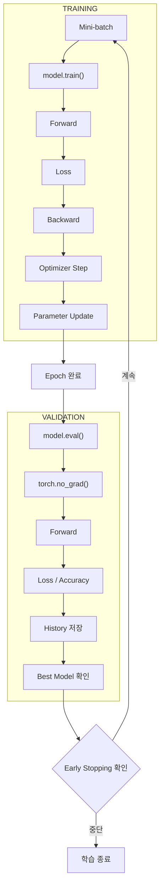

> 🗂️ **Notes · Deep Learning** — `training-loop` `epoch` `optimizer` `overfitting` `assignment`
{: .prompt-info }

---

## 1. 📖 개요

> 📌 **이 글의 목적** · 딥러닝 과제 — 문제 (3) 개념 복습 정리.
{: .prompt-tip }

문제 2에서 **모델 구조**를 만들었다면, 문제 3에서는 그 모델을 실제로 학습시키고 성능을
검증한다.

전체 흐름은 다음과 같다.

```text
모델 준비
   ↓
Training
   ↓
Validation
   ↓
epoch별 결과 기록
   ↓
Early Stopping
   ↓
Best 모델 선택
   ↓
MLP / CNN 비교
```

이번 문제의 핵심은 단순히 accuracy를 높이는 것이 아니라,

> **같은 조건에서 모델을 학습하고, validation 결과를 기준으로 어떤 모델이 더 안정적으로
> 학습되는지 판단하는 것**

이다.

---

## 2. 🔄 Epoch와 Mini-batch

### Epoch

**전체 train 데이터를 한 번 모두 학습하는 것**을 1 epoch라고 한다.

예를 들어 train 데이터가 1,257개이고

```text
batch_size = 64
```

라면 데이터를 약 20개의 mini-batch로 나누어 처리한다.

```text
1 epoch

batch 1
  ↓
batch 2
  ↓
batch 3
  ↓
...
  ↓
마지막 batch
```

이 전체 과정이 끝나면 1 epoch가 완료된다.

### Mini-batch를 사용하는 이유

전체 데이터를 한 번에 모델에 넣으면 메모리 사용량이 커진다. 그래서 실제 딥러닝에서는
데이터를 작은 묶음으로 나눠 반복 학습한다.

```text
전체 데이터
    ↓
mini-batch 1 → parameter update
mini-batch 2 → parameter update
mini-batch 3 → parameter update
...
```

> 💡 **핵심** · **parameter는 epoch마다 한 번이 아니라 mini-batch마다 계속 업데이트된다.**
{: .prompt-info }

---

## 3. 🏃 한 Batch를 학습하는 5단계

이번 과제의 `train_one_epoch()`에서 가장 중요한 흐름이다.

{: w="720" h="340" }

코드 흐름:

```python
model.train()

for images, labels in data_loader:

    images = images.to(device)
    labels = labels.to(device)

    optimizer.zero_grad()

    logits = model(images)

    loss = loss_fn(logits, labels)

    loss.backward()

    optimizer.step()
```

이 흐름은 PyTorch 학습에서 가장 기본적인 패턴이다. 이제 각 단계를 순서대로 본다.

### 준비 ① — `model.train()`

```python
model.train()
```

모델을 **학습 mode**로 전환한다. 문제 2에서 확인했듯이 특히 `Dropout`과 `BatchNorm`에 영향을
준다.

```text
Dropout
→ 일부 neuron 랜덤 비활성화

BatchNorm
→ 현재 batch 통계 사용
→ running_mean / running_var 업데이트
```

따라서 실제 parameter 학습 전에 반드시 `model.train()`을 호출한다.

### 준비 ② — Device 이동

```python
images = images.to(device)
labels = labels.to(device)
```

모델이 GPU에 있으면 입력 데이터와 label도 GPU에 있어야 한다.

| 상태 | 결과 |
| --- | --- |
| `Model → GPU`, `Image → CPU` | 연산할 수 없다 |
| Model · Image · Label이 같은 Device | 정상 |

### 1단계 — `optimizer.zero_grad()`

PyTorch의 gradient는 기본적으로 **누적**된다. 예를 들어 이전 batch에서

```text
gradient = 0.3
```

이 남아 있는데 다음 batch gradient가

```text
0.2
```

라면 초기화하지 않을 경우

```text
0.3 + 0.2 = 0.5
```

처럼 누적될 수 있다. 일반적인 학습에서는 batch마다 `optimizer.zero_grad()`로 이전 gradient를
초기화한다.

### 2단계 — Forward

```python
logits = model(images)
```

입력 이미지가 모델을 통과해 예측 점수인 logits를 만든다. CNN 기준:

```text
images
[B,1,8,8]

   ↓ CNN

features

   ↓ Linear

logits
[B,10]
```

아직 여기서는 parameter를 수정하지 않는다. 단순히 현재 parameter로 **예측 결과를 계산하는
단계**다.

### 3단계 — Loss 계산

```python
loss = loss_fn(logits, labels)
```

이번 과제에서는 `nn.CrossEntropyLoss()`를 사용한다.

| 모델 예측 | 실제 정답 | Loss |
| --- | --- | --- |
| class 3 점수 ↑ | class 7 | 커진다 |
| class 7 점수 ↑ | class 7 | 작아진다 |

즉 Loss는

> **현재 모델의 예측이 정답과 얼마나 차이나는지 나타내는 값**

이다.

### 4단계 — Backpropagation (`loss.backward()`)

```python
loss.backward()
```

Loss를 기준으로 각 parameter가 결과에 얼마나 영향을 주었는지 gradient를 계산한다.

```text
Loss
 ↑
Linear
 ↑
Conv
 ↑
Conv
```

즉 forward의 반대 방향으로 미분값이 전달된다. 이것이 **역전파(Backpropagation)** 이다.

> ⚠️ **중요** · `loss.backward()`는 parameter를 직접 수정하는 것이 아니다. 단지
> `parameter.grad`에 gradient를 계산해 저장한다.
{: .prompt-warning }

### 5단계 — `optimizer.step()`

실제 parameter가 변경되는 시점이다.

```python
optimizer.step()
```

흐름은

```text
loss.backward()
     ↓
gradient 계산
     ↓
optimizer.step()
     ↓
parameter 업데이트
```

즉

```text
현재 Weight
    ↓
Gradient 참고
    ↓
새로운 Weight
```

가 된다.

> 💡 **한 줄 요약** · **예측 → 틀린 정도 계산 → 원인 계산 → parameter 수정**
{: .prompt-info }

---

## 4. 🔍 Validation — 모델을 바꾸지 않고 평가만

### Training과 Validation의 차이

| | Training | Validation |
| --- | --- | --- |
| 목적 | 모델을 학습 | 현재 모델 성능 평가 |
| gradient | 필요 | 필요 없음 |
| parameter update | 있음 | 없음 |

따라서 코드 구조도 달라진다.

### Validation 기본 구조

과제의 `validate_one_epoch()`은 다음 흐름을 사용한다.

```python
model.eval()

with torch.no_grad():

    for images, labels in data_loader:

        logits = model(images)

        loss = loss_fn(logits, labels)
```

Training과 달리 다음이 없다.

```text
zero_grad()
backward()
optimizer.step()
```

### `model.eval()`과 `torch.no_grad()`는 역할이 다르다

```python
model.eval()
```

검증 mode로 전환한다.

```text
Dropout
→ OFF

BatchNorm
→ 학습 중 저장한 running statistics 사용
```

검증할 때 Dropout을 계속 랜덤하게 적용하면 모델 성능을 안정적으로 측정할 수 없다.

```python
with torch.no_grad():
```

Validation에서는 gradient를 계산할 필요가 없으므로 위 구문을 사용한다. 효과는

```text
gradient graph 생성 X
    ↓
메모리 사용 감소
    ↓
연산량 감소
```

이다. 두 구문의 역할을 정리하면 다음과 같다.

| 구문 | 역할 |
| --- | --- |
| `model.eval()` | Dropout / BatchNorm 동작 변경 |
| `torch.no_grad()` | gradient 계산 중지 |

검증에서는 보통 둘 다 사용한다.

### Validation에서 모델이 바뀌면 안 되는 이유

이번 과제에서는 validation 전후의 `model.state_dict()`를 비교한다. 목적은

```text
validation 전 모델
        =
validation 후 모델
```

인지 확인하는 것이다. Validation은 모델을 **평가만 하는 과정**이므로 `Parameter`와
`BatchNorm buffer` 등이 바뀌어서는 안 된다. 과제에서는 실제로 state를 복사한 뒤 validation
전후가 달라졌는지 검사한다.

---

## 5. 📊 Loss와 Accuracy를 계산하는 방법

### Loss를 Sample 수 기준으로 누적하는 이유

각 batch의 loss는 보통 평균값이다.

```text
batch 1
64개
loss = 0.5

batch 2
64개
loss = 0.3

마지막 batch
41개
loss = 0.4
```

단순히

```text
(0.5 + 0.3 + 0.4) / 3
```

하면 batch 크기가 다른 마지막 batch도 동일한 비중을 갖게 된다. 따라서 이번 과제에서는

```python
total_loss += loss * batch_size
```

로 다시 sample 수를 반영하고, 마지막에

```python
average_loss = total_loss / total_samples
```

를 계산한다. 즉

> **모든 sample이 동일한 비중을 가지도록 전체 평균 loss를 계산하는 방식**이다.

### Accuracy 계산

```python
logits.argmax(dim=1)
```

을 통해 가장 큰 logit의 class를 선택한다.

```text
정답
[3, 1, 5, 7]

예측
[3, 1, 2, 7]
```

맞은 개수는 `3개`이므로

```text
Accuracy = 3 / 4 = 0.75
```

과제에서는 batch별 정답 개수를 누적하여

```python
total_correct += ...
total_samples += batch_size
```

마지막에

```python
accuracy = total_correct / total_samples
```

를 계산한다.

---

## 6. 📈 Epoch별 기록과 학습 곡선

### 한 Epoch가 끝난 뒤 얻는 값

epoch마다 네 가지 값을 기록한다.

| 구분 | 값 |
| --- | --- |
| Training | `train_loss`, `train_accuracy` |
| Validation | `valid_loss`, `valid_accuracy` |

이것을 `history`에 저장한다.

```python
history = {
    "train_loss": [],
    "train_accuracy": [],
    "valid_loss": [],
    "valid_accuracy": [],
}
```

매 epoch 결과를 계속 추가한다.

```text
Epoch
  ↓
Training
  ↓
Validation
  ↓
history 저장
```

History가 필요한 이유는 나중에 **학습 곡선**을 보기 위해서다.

### 학습 곡선 읽기

문제에서는 네 가지 곡선을 확인한다.

```text
Train Loss
Validation Loss
Train Accuracy
Validation Accuracy
```

가장 먼저 볼 것은 Loss이다. 정상적인 학습과 과적합 패턴은 아래 그림처럼 구분된다.

{: w="720" h="290" }

**정상적인 학습**에서는 Train Loss와 Validation Loss가 둘 다 감소한다. 모델이 train
데이터뿐 아니라 validation에서도 점점 좋아지고 있다는 의미다.

**과적합(Overfitting)** 의 대표적인 패턴은 다음과 같다.

```text
Train Loss
계속 ↓

Validation Loss
처음 ↓
나중 ↑
```

즉

```text
Train 성능은 계속 좋아짐

하지만

새로운 데이터 성능은 나빠짐
```

> ⚠️ **주의** · Early Stopping이 발생했다는 사실만으로 곧바로 과적합이라고 단정할 수는
> 없다. 실제 train/validation 곡선을 함께 봐야 한다.
{: .prompt-warning }

### Accuracy만 보면 안 되는 이유

두 모델이 모두 `accuracy = 0.99`라고 하더라도 loss는 다를 수 있다.

| 모델 | 상태 |
| --- | --- |
| 모델 A | 정답 확신도 높음 |
| 모델 B | 간신히 정답 |

두 모델 모두 class는 맞혔으므로 accuracy는 같을 수 있다. 하지만 loss는 모델의 출력 점수까지
반영한다. 따라서 과제에서도

```text
Accuracy만 보지 말고
Loss와 함께 판단
```

하도록 되어 있다.

---

## 7. ⏹️ Early Stopping

학습 epoch를 무조건 끝까지 실행하는 대신 validation 성능이 더 이상 의미 있게 개선되지 않으면
중단하는 방법이다.

이번 설정:

```text
최대 epoch = 30
patience = 3
min_delta = 0.002
```

의미는

```text
validation loss가
0.002 이상 좋아지지 않는 상태가
3번 누적되면

→ 학습 중단
```

이다.

### `patience`

`patience = 3`은 바로 한 번 validation loss가 나빠졌다고 중단하지 않는다는 의미다.

{: w="720" h="256" }

그림처럼 개선이 없는 epoch가 연속으로 3번 쌓여야 중단된다. `patience`는 일시적인 흔들림을
허용하는 역할을 한다.

### `min_delta`

`min_delta = 0.002`는 아주 작은 변화까지 개선으로 인정하지 않기 위한 기준이다.

```text
기존 validation loss
0.1000

새로운 loss
0.0999
```

차이가 `0.0001`이면 설정된 `0.002`보다 작으므로 Early Stopping 관점에서는 **의미 있는
개선으로 보지 않는다.**

### Best 모델과 Last 모델은 다를 수 있다

이 부분은 문제 4 checkpoint와도 연결되는 중요한 개념이다.

```text
Epoch 20
validation loss = 가장 낮음
→ BEST

Epoch 21
조금 나빠짐

Epoch 22
조금 나빠짐

Epoch 23
학습 종료
→ LAST
```

따라서

```text
Best Model
≠
Last Model
```

일 수 있다. 이번 과제에서는 **실제 가장 낮은 validation loss**를 기록한 epoch의 모델을
`best_record`로 따로 보관한다.

### Best 기준과 Early Stopping 기준의 차이

이번 과제에는 중요한 차이가 하나 있다.

| 판단 | 기준 |
| --- | --- |
| Best 모델 선택 | 실제로 가장 작은 validation loss (절대 최저) |
| 학습 중단 판단 | `min_delta` 이상 의미 있게 개선되었는가 + `patience` |

두 기준은 목적이 다르다.

---

## 8. ⚖️ MLP와 CNN을 공정하게 비교하기

모델 구조만 비교하려면 다른 조건은 같아야 한다. 이번 과제에서는

```text
같은 dataset split
같은 seed
같은 batch size
같은 learning rate
같은 optimizer
같은 loss
같은 최대 epoch
같은 Early Stopping 정책
```

을 적용한다. 실제 공통 조건은 다음과 같다.

| 항목 | 값 |
| --- | --- |
| SEED | 42 |
| BATCH_SIZE | 64 |
| LEARNING_RATE | 0.005 |
| Optimizer | Adam |
| Loss | CrossEntropyLoss |
| Max Epoch | 30 |
| Patience | 3 |
| Min Delta | 0.002 |

과제 자체도 **구조 비교 시 다른 학습 조건을 동일하게 유지해야 한다**는 점을 핵심으로 둔다.

### 왜 Seed도 같아야 하는가?

딥러닝에는 여러 난수가 개입한다.

```text
초기 Weight
Data shuffle
Dropout
```

Seed가 다르면 모델 구조 때문이 아니라 **난수 차이** 때문에 결과가 달라질 수 있다. 따라서
비교 실험에서는

```python
set_all_seeds(SEED)
```

처럼 난수 시작점을 최대한 동일하게 맞춘다.

### 같은 Train Data 순서 사용

이번 과제에서는 각 모델에

```python
make_train_loader(SEED)
```

를 새로 만들어 준다. 목적은

```text
MLP가 본 batch 순서
≈
CNN이 본 batch 순서
```

가 되도록 하여 비교 조건을 맞추는 것이다.

### Prediction Diversity

Accuracy만 보는 것 외에 모델의 예측이 한 class로 무너지는지도 검사했다. 예를 들어 모델이
모든 이미지를

```text
7
7
7
7
7
7
...
```

로 예측한다면 문제가 있다. 이를 **prediction collapse**의 한 형태로 볼 수 있다. 그래서

```python
len(set(predictions))
```

을 확인한다. 이번 실행에서는

```text
MLP prediction diversity = 10
CNN prediction diversity = 10
```

으로 0~9의 여러 class를 실제로 예측하고 있음을 확인했다. 단, diversity가 높다는 것만으로
모델이 정확하다는 의미는 아니다.

---

## 9. 📋 이번 실행 결과와 해석

이번 문제 3에서 얻었던 결과 기준:

| 항목 | MLP | CNN |
| --- | --- | --- |
| Parameters | 4,810 | 1,946 |
| Best Valid Loss | ≈ 0.0561 | ≈ 0.0284 |
| Valid Accuracy | ≈ 0.9852 | ≈ 0.9926 |
| Epochs Run | 30 | 23 |
| Best Epoch | — | 20 |
| Early Stopping | False | True |

이번 실행에서는 CNN이 더 적은 parameter를 사용하면서 더 낮은 validation loss와 더 높은
validation accuracy를 기록했다.

> ⚠️ **일반화 주의** · 이것만으로 **CNN은 언제나 MLP보다 우수하다**라고 일반화해서는 안 된다.
{: .prompt-warning }

### CNN 결과를 해석할 때 주의할 점

CNN은 23 epoch에서 Early Stopping되었고 best 모델은 그보다 앞선 epoch에 존재했다. 하지만

```text
Early Stopping 발생
=
무조건 과적합 발생
```

은 아니다. 정확한 해석은 반드시

```text
Train Loss
Validation Loss
Train Accuracy
Validation Accuracy
```

곡선을 함께 확인해야 한다.

### 두 모델은 layer 하나만 다른 것이 아니다

문제 2에서 CNN은

```text
[B,1,8,8]
 ↓
[B,8,8,8]
 ↓
[B,8,4,4]
 ↓
[B,16,4,4]
 ↓
[B,16,2,2]
 ↓
[B,64]
 ↓
[B,10]
```

형태로 이미지의 공간 구조를 이용해 특징을 추출했다. 반면 MLP는 이미지를 처음부터 `[B,64]`로
Flatten했다. 따라서 두 모델은 단순히 layer 하나만 다른 것이 아니라 **전체 구조가 다르다.**
그래서 CNN의 성능 차이를 특정 한 layer의 효과라고 단정할 수 없다.

### 통제 실험(Controlled Experiment)

특정 요소의 효과를 확인하려면 **한 번에 하나만 바꾸는 것**이 중요하다. 예를 들어 Dropout
효과를 알고 싶다면

```text
실험 A
CNN + Dropout 0.2

실험 B
CNN + Dropout 0.0
```

만 바꾼다. 나머지

```text
Seed
Split
Batch Size
Learning Rate
Optimizer
Loss
Epoch
Early Stopping
Model 구조
```

는 동일하게 유지한다. 이렇게 해야 결과 차이를 Dropout 변화와 더 직접적으로 연결해서 해석할
수 있다. 과제의 5점 도전도 `dropout_rate=0.0`만 바꾼 CNN을 같은 조건에서 비교하도록 구성되어
있다.

---

## 10. 🗺️ 전체 학습 흐름

지금까지의 내용을 한 장으로 이으면 다음과 같다.



---

## 11. 🧭 실무 적용 흐름

> 아래는 문제 3의 학습·검증 개념을 실제 모델 개발 흐름으로 연결한 것이다.

### STEP 1. 실험 조건 고정

먼저 기록한다.

```text
Dataset version
Split
Seed
Batch Size
Learning Rate
Optimizer
Loss
Model
Epoch
Early Stopping
```

### STEP 2. 작은 Batch로 학습 가능 여부 확인

전체 학습 전에

```text
Forward 정상?
 ↓
Loss finite?
 ↓
Backward 정상?
 ↓
Parameter update?
```

부터 확인한다.

### STEP 3. Training Loop 실행

```text
train()
 ↓
zero_grad()
 ↓
forward
 ↓
loss
 ↓
backward
 ↓
step
```

### STEP 4. Validation 실행

```text
eval()
 ↓
no_grad()
 ↓
forward
 ↓
loss / accuracy 계산
```

Validation에서는 model parameter가 변경되지 않는지도 확인한다.

### STEP 5. Epoch별 Metric 기록

```text
train_loss
train_accuracy
valid_loss
valid_accuracy
```

를 저장한다.

### STEP 6. 학습 곡선 확인

우선순위:

```text
① Train Loss 감소?
② Validation Loss 감소?
③ 둘 사이 gap 증가?
④ Accuracy도 같이 개선?
```

### STEP 7. Early Stopping

Validation 개선이 멈추면 불필요한 추가 학습을 중단한다.

### STEP 8. Best 모델 저장

마지막 모델이 아니라 **최저 Validation Loss**를 기록한 모델을 따로 저장한다.

### STEP 9. 여러 모델 비교

모델 구조를 비교할 때는 다른 조건은 최대한 동일하게 유지한다.

### STEP 10. Test는 마지막에

실무에서도 validation은 모델 선택에 사용한다.

| 데이터 | 역할 |
| --- | --- |
| Train | 학습 |
| Validation | 모델 선택 / 튜닝 |
| Test | 최종 성능 평가 |

Test 결과를 확인한 뒤 다시 hyperparameter를 수정하면 test가 사실상 validation처럼 사용되어
평가가 오염될 수 있다.

---

## 12. ⚠️ 자주 발생하는 실수

### ① `zero_grad()` 누락

```text
이전 Gradient
+
현재 Gradient
```

가 원치 않게 누적될 수 있다.

### ② `loss.backward()`만 하고 `step()` 누락

`loss.backward()`는 gradient만 계산한다. 실제 parameter 변경에는 `optimizer.step()`이
필요하다.

### ③ Validation에서 `model.train()`

Dropout과 BatchNorm이 학습 mode로 동작해 validation 결과가 왜곡될 수 있다.

### ④ Validation에서 `optimizer.step()`

Validation은 평가 과정이므로 parameter를 수정하면 안 된다.

### ⑤ Accuracy만 보고 모델 선택

Loss 변화와 train/validation gap을 함께 보지 않으면 학습 상태를 제대로 판단하기 어렵다.

### ⑥ 마지막 epoch를 무조건 best 모델로 사용

```text
Last Model
≠
Best Model
```

일 수 있다. Validation 기준으로 best epoch를 따로 관리해야 한다.

### ⑦ 서로 다른 조건의 모델 비교

```text
MLP
LR = 0.001

CNN
LR = 0.005
```

라면 결과 차이가 모델 구조 때문인지 learning rate 때문인지 알기 어렵다.

---

## 13. 🧰 핵심 PyTorch 문법

| 문법 | 역할 |
| --- | --- |
| `model.train()` | 모델을 학습 mode로 전환 |
| `model.eval()` | 모델을 검증·추론 mode로 전환 |
| `tensor.to(device)` | Tensor를 CPU/GPU로 이동 |
| `optimizer.zero_grad()` | 이전 gradient 초기화 |
| `model(images)` | Forward |
| `criterion(logits, labels)` | Loss 계산 |
| `loss.backward()` | 역전파 및 gradient 계산 |
| `optimizer.step()` | Parameter 업데이트 |
| `torch.no_grad()` | Gradient 계산 비활성화 |
| `logits.argmax(dim=1)` | 예측 class 선택 |
| `.sum().item()` | 맞은 sample 수 등을 Python 숫자로 변환 |
| `model.state_dict()` | 모델 parameter와 buffer 상태 |
| `copy.deepcopy()` | 현재 상태를 독립적으로 복사 |
| `np.isfinite()` | NaN/Inf 여부 검사 |
| `len(set(predictions))` | 예측 class 다양성 확인 |

---

## 14. 🔗 문제 2와 문제 3의 연결

| 문제 | 질문 |
| --- | --- |
| 문제 2 | 모델을 어떻게 만들 것인가? |
| 문제 3 | 그 모델을 어떻게 학습하고 어떻게 공정하게 평가할 것인가? |

전체 흐름:

```text
문제 2

Input
 ↓
CNN / MLP
 ↓
Logits
 ↓
Loss

        ↓

문제 3

Backward
 ↓
Optimizer
 ↓
Parameter Update
 ↓
Validation
 ↓
History
 ↓
Early Stopping
 ↓
Best Model
```

---

## 15. ✅ 핵심 정리

```text
Training
→ 모델을 실제로 업데이트

Validation
→ 모델을 업데이트하지 않고 성능만 평가
```

학습의 핵심 5단계:

```text
zero_grad
   ↓
forward
   ↓
loss
   ↓
backward
   ↓
optimizer.step
```

모델 비교의 핵심:

```text
같은 Split
같은 Seed
같은 Batch Size
같은 LR
같은 Optimizer
같은 Loss
같은 Early Stopping
```

그리고 최종 모델은 `마지막 Epoch`가 아니라 보통 `Validation 기준 Best Epoch`를 선택한다.

> 💡 **한 줄 정리** · **문제 3의 핵심은 `Forward → Loss → Backward → Update`로 모델을
> 학습하고, 별도의 Validation으로 일반화 성능을 확인하면서 Early Stopping과 동일한 실험
> 조건을 이용해 모델을 공정하게 비교하는 것이다.**
{: .prompt-info }

---

## 16. 🧠 핵심 기억 카드

<details markdown="1">
<summary><strong>펼쳐서 확인</strong></summary>

- **Epoch** : 전체 train 데이터를 한 번 모두 학습 — 1,257개 / batch 64면 약 20개 mini-batch
- **Mini-batch** : parameter는 epoch마다 한 번이 아니라 mini-batch마다 업데이트
- **학습 5단계** : `zero_grad` → `forward` → `loss` → `backward` → `optimizer.step`
- **`zero_grad()`** : gradient는 기본적으로 누적되므로 batch마다 초기화
- **`loss.backward()`** : parameter를 수정하지 않고 `parameter.grad`에 gradient만 저장
- **`optimizer.step()`** : gradient를 참고해 parameter를 실제로 변경
- **Training vs Validation** : Validation은 gradient도 parameter update도 없음
- **`model.eval()`** : Dropout / BatchNorm 동작 변경
- **`torch.no_grad()`** : gradient 계산 중지 — `eval()`과 역할이 다르며 보통 함께 사용
- **Validation 불변성** : validation 전후 `state_dict()`가 같아야 함
- **Loss 누적** : `loss * batch_size`로 더한 뒤 전체 sample 수로 나눠 sample 비중을 맞춤
- **Accuracy** : `logits.argmax(dim=1)`로 예측 → 맞은 개수 / 전체 개수
- **History** : epoch마다 train/valid의 loss·accuracy 4개를 저장 → 학습 곡선
- **정상 학습** : Train Loss와 Validation Loss가 둘 다 감소
- **Overfitting** : Train Loss는 계속 감소, Validation Loss는 감소 후 상승
- **Accuracy만 보면 안 됨** : accuracy가 같아도 loss는 다를 수 있음
- **Early Stopping** : 최대 epoch 30, `patience = 3`, `min_delta = 0.002`
- **`patience`** : 개선 없음이 3번 누적되면 중단 — 일시적 흔들림 허용
- **`min_delta`** : 0.002보다 작은 개선은 의미 있는 개선으로 보지 않음
- **Best ≠ Last** : best는 절대 최저 validation loss, 중단 판단은 `min_delta` + `patience`
- **공정 비교 조건** : SEED 42, BATCH 64, LR 0.005, Adam, CrossEntropyLoss, Max Epoch 30, Patience 3, Min Delta 0.002
- **Prediction Diversity** : `len(set(predictions))` — 이번 실행은 MLP·CNN 모두 10
- **이번 결과** : MLP 4,810 params / valid loss ≈ 0.0561, CNN 1,946 params / valid loss ≈ 0.0284
- **주의** : Early Stopping 발생이 곧 과적합은 아니며, 곡선을 함께 봐야 한다

</details>

---

## 17. 🔗 관련 글

- [MLP와 CNN 모델 설계 — Shape 흐름과 train/eval 차이](/posts/mlp-cnn-model-design-and-shape-flow/)
- [PyTorch 학습 5단계와 비지도학습](/posts/pytorch-training-5-steps/)
- [loss.backward()와 .grad — 어디까지 계산하고 어디에 저장하나](/posts/loss-backward-and-grad/)
