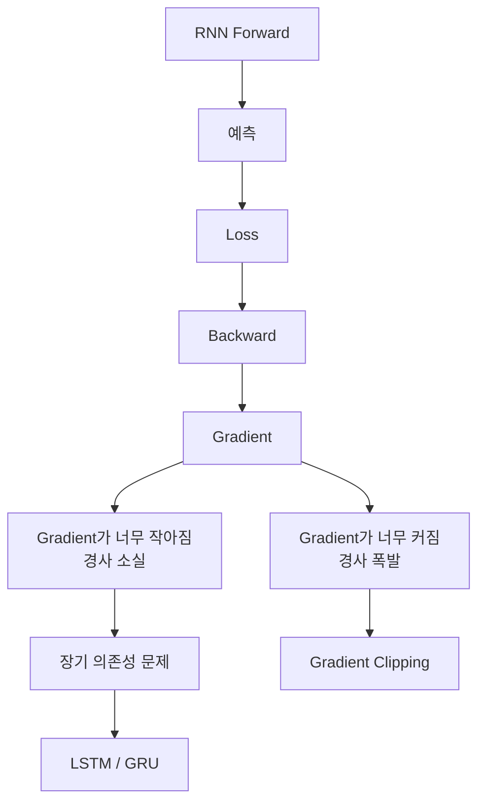

> 🗂️ **Notes · Deep Learning** — `rnn` `backpropagation` `gradient` `lstm` `gradient-clipping`
{: .prompt-info }

---

## 1. 📖 Gradient의 문제

> ❓ "이 핵심값의 한계가 경사 소실이고?"

여기서 핵심값은 `Gradient`이다.

RNN은 여러 시점을 연결해서 학습하기 때문에 역전파할 때도 시간축을 거꾸로 거슬러 올라간다.

{: w="720" h="210" }

```text
h1 → h2 → h3 → h4 → h5 → Loss
 ↑    ↑    ↑    ↑    ↑
 └────── 역전파 ──────┘
```

이 과정에서 Gradient가 계속 반복적으로 계산된다. 그 결과 대표적으로 두 가지 문제가 발생할 수
있다.

```text
Gradient가 지나치게 작아짐
→ 경사 소실

Gradient가 지나치게 커짐
→ 경사 폭발
```

---

## 2. 📉 경사 소실(Vanishing Gradient)

경사 소실은

> **역전파 과정에서 Gradient가 점점 작아져 0에 가까워지는 현상**

이다. 예를 들어 매 단계마다 Gradient가 `0.5`배가 된다면

```text
0.5
→ 0.25
→ 0.125
→ 0.0625
→ 0.03125
→ ...
```

앞쪽 시점에 도착했을 때는 `gradient ≈ 0`이 될 수 있다.

### 왜 문제가 되는가?

Gradient가 거의 0이면

```text
파라미터 변화량
≈ 0
```

이 된다. 따라서 모델이 오래된 시점의 정보를 제대로 학습하지 못한다.

```text
나는 → 어제 → 극장에서 → 영화를 → 봤는데 → 정말 → 재미있었다
```

마지막 `"재미있었다"`를 학습할 때 앞쪽의 `"영화"`와 연결해야 할 수도 있다. 하지만 Gradient가
중간에서 소실되면

```text
앞부분 정보
→ 학습 영향 거의 없음
```

이 될 수 있다.

> 💡 이것이 RNN의 대표적인 **장기 의존성(Long-Term Dependency) 문제**다.
{: .prompt-info }

---

## 3. 📈 경사 폭발(Exploding Gradient)

> ❓ "여기서 이 문제라는게 경사소실을 말하는거야? 아니면 경사 폭발을 말하는 거야?"

이전에 말한 RNN의 대표적인 문제는 주로 `경사 소실`을 의미했다. 하지만 반대 현상인
`경사 폭발`도 존재한다.

경사 폭발은

> **역전파 과정에서 Gradient 값이 반복적으로 커져 지나치게 큰 값이 되는 현상**

이다. 예를 들어

```text
2
→ 4
→ 8
→ 16
→ 32
→ 64
→ ...
```

처럼 값이 계속 커질 수 있다. 이 경우 파라미터가 한 번에 지나치게 크게 수정되어 학습이
불안정해진다.

---

## 4. ⚖️ 경사 소실과 경사 폭발은 반대 개념

> ❓ "경사 폭발이랑 경사 소실은 반대의 개념."

맞다. 두 현상이 같은 역전파 과정에서 정반대로 나타나는 모습은 아래 그림처럼 비교할 수 있다.

{: w="720" h="326" }

| 현상 | Gradient | 결과 |
| --- | --- | --- |
| **경사 소실** | 너무 작아짐 | 학습이 거의 진행되지 않음 |
| **경사 폭발** | 너무 커짐 | 파라미터가 과도하게 변경되어 학습 불안정 |

둘 다

```text
역전파에서 Gradient가 반복적으로 계산되는 과정
```

에서 발생할 수 있는 문제다.

---

## 5. 🧩 경사 소실 대응 — LSTM과 GRU

> ❓ "경사 소실을 해결하기 위한 방법이 LSTM과 GRU이고."

학습 흐름상 이렇게 이해하면 좋다. 기본 RNN은 오래된 정보를 전달하면서 Gradient가 소실되기
쉽다. 그래서

```text
기본 RNN
→ 장기 의존성 문제
→ 경사 소실
→ LSTM / GRU
```

구조가 등장했다.

### LSTM / GRU의 핵심 목적

LSTM과 GRU는 내부에 Gate 구조를 사용해

```text
어떤 정보를 유지할지
어떤 정보를 버릴지
어떤 정보를 새롭게 저장할지
```

조절한다. 그 결과 기본 RNN보다 장기적인 정보를 더 안정적으로 전달할 수 있다. 따라서

> **LSTM / GRU는 경사 소실과 장기 의존성 문제를 완화하기 위해 사용되는 대표적인 RNN 구조**

이다.

---

## 6. ✂️ 경사 폭발 대응 — Gradient Clipping

> ❓ "gradient clipping은 backward() 후 optimizer.step() 전에 경사 폭주를 완화하는
> 안전장치이며, 경사 소실 자체를 해결하지는 않습니다."

정확하다. 일반적인 순서는 다음과 같다.

```python
loss.backward()

torch.nn.utils.clip_grad_norm_(
    model.parameters(),
    max_norm=1.0
)

optimizer.step()
```

{: w="720" h="224" }

Gradient가 너무 커졌을 때 일정 기준 이상으로 커지지 않도록 제한한다.

### 왜 Clipping은 `backward()` 이후인가?

`backward()`를 해야 `parameter.grad`가 계산된다. 즉 Gradient가 먼저 존재해야 한다. 그래서

| 순서 | 하는 일 |
| --- | --- |
| `backward()` | Gradient 계산 |
| clipping | Gradient 크기 제한 |
| `optimizer.step()` | 제한된 Gradient를 사용해 파라미터 수정 |

가 된다.

---

## 7. 🛠️ 경사 폭발을 완화하는 다른 방법들

> ❓ "그러면 폭발을 해결하기 위한 방법은 뭐야?"

가장 대표적인 대응은 `Gradient Clipping`이다.

> ⚠️ 다만 경사 폭발은 보통 "완전히 해결한다"기보다 여러 방법으로 **완화하고 안정화한다**고
> 표현하는 것이 더 정확하다.
{: .prompt-warning }

대표적인 방법은 다음과 같다.

| 방법 | 역할 |
| --- | --- |
| Gradient Clipping | 너무 큰 Gradient 제한 |
| 좋은 Weight Initialization | 초기부터 값이 폭주할 가능성 감소 |
| Layer Normalization | Hidden State의 값 안정화 |
| Truncated BPTT | 너무 긴 구간을 한 번에 역전파하지 않음 |

LSTM / GRU 역시 기본 RNN보다 Gradient 흐름을 안정화하는 데 도움이 된다.

---

## 8. 📋 경사 소실과 경사 폭발 대응 비교

```text
경사 소실
↓
Gradient ≈ 0
↓
학습 정체
↓
대표 대응
LSTM / GRU
```

```text
경사 폭발
↓
Gradient가 매우 큼
↓
파라미터 급격히 변경
↓
대표 대응
Gradient Clipping
```

하지만 정확하게는

```text
LSTM/GRU = 경사 소실 전용
Gradient Clipping = 경사 폭발 전용
```

처럼 완벽히 1:1 대응되는 것은 아니다. 둘 모두 학습 안정화와 관련된 여러 기법이 함께
사용된다.

---

## 9. 🗺️ 전체 학습 흐름 연결

지금까지 배운 흐름을 연결하면 다음과 같다.



---

## 10. ✅ 핵심 정리

```text
경사 소실
→ Gradient가 0에 가까워짐
→ 오래된 정보를 학습하기 어려움
→ LSTM / GRU가 대표적인 대응

경사 폭발
→ Gradient가 너무 커짐
→ 학습이 불안정해짐
→ Gradient Clipping이 대표적인 대응

Gradient Clipping
→ backward() 후
→ optimizer.step() 전에 적용
```

> 💡 **한 줄 요약** · **RNN의 역전파에서는 Gradient가 너무 작아지는 경사 소실과 너무 커지는
> 경사 폭발이 발생할 수 있으며, 경사 소실은 LSTM/GRU로, 경사 폭발은 Gradient Clipping 등으로
> 완화한다.**
{: .prompt-info }

---

## 11. 🧠 핵심 기억 카드

<details markdown="1">
<summary><strong>펼쳐서 확인</strong></summary>

- **RNN 역전파** : 여러 시점을 연결해 학습하므로 시간축을 거꾸로 거슬러 올라간다
- **경사 소실** : 역전파에서 Gradient가 점점 작아져 0에 가까워지는 현상
- **소실 예시** : 매 단계 0.5배 → `0.5 → 0.25 → 0.125 → 0.0625 → 0.03125 → ...`
- **소실의 결과** : 파라미터 변화량 ≈ 0 → 오래된 시점의 정보를 학습하지 못함
- **장기 의존성 문제** : 앞쪽의 "영화"와 뒤쪽의 "재미있었다"를 연결하지 못하는 상황
- **경사 폭발** : 역전파에서 Gradient가 반복적으로 커져 지나치게 큰 값이 되는 현상
- **폭발 예시** : 매 단계 2배 → `2 → 4 → 8 → 16 → 32 → 64 → ...`
- **폭발의 결과** : 파라미터가 한 번에 크게 수정되어 학습이 불안정
- **LSTM / GRU** : Gate로 유지·삭제·저장을 조절 — 경사 소실과 장기 의존성 완화
- **Gradient Clipping** : `torch.nn.utils.clip_grad_norm_(model.parameters(), max_norm=1.0)`
- **Clipping 위치** : `backward()` 뒤, `optimizer.step()` 앞 — grad가 먼저 존재해야 하므로
- **Clipping의 한계** : 경사 폭주를 완화하는 안전장치이지 경사 소실을 해결하지는 않는다
- **폭발 완화 기법** : Gradient Clipping · Weight Initialization · Layer Normalization · Truncated BPTT
- **주의** : LSTM/GRU = 소실 전용, Clipping = 폭발 전용처럼 1:1 대응되지는 않는다

</details>

---

## 12. 🔗 관련 글

- [RNN 입력 Shape과 batch_first — 시점 L과 h_n 읽는 법](/posts/rnn-input-shape-and-batch-first/)
- [Loss와 역전파는 같은 것이 아니다 — Gradient의 크기와 부호](/posts/loss-vs-backpropagation-and-gradient/)
- [RNN의 Hidden State와 output — 무엇이 최종 표현인가](/posts/rnn-hidden-state-and-output/)
