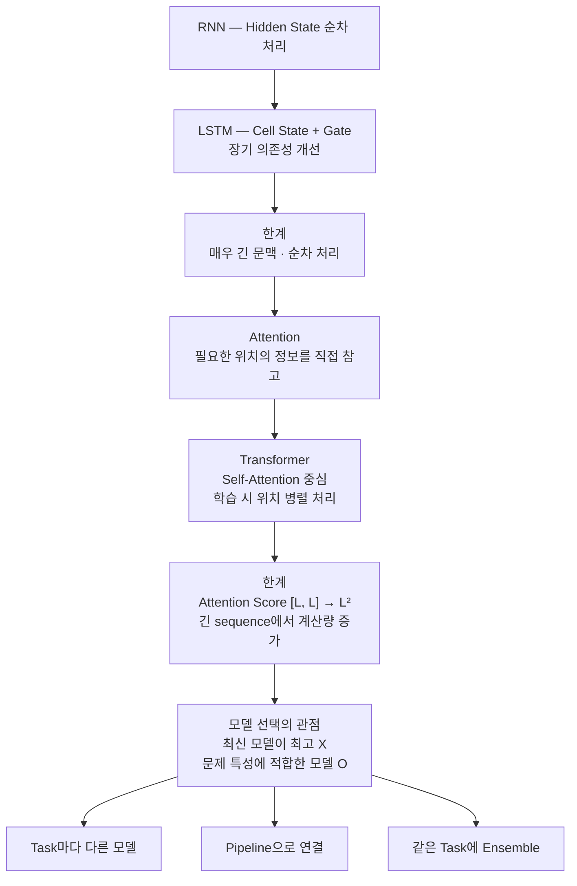

> 🗂️ **Notes · Deep Learning** — `attention` `transformer` `sequence` `model-selection` `ensemble`
{: .prompt-info }

---

## 1. 📖 LSTM 이후 왜 Attention이 필요했을까?

LSTM은 RNN보다 긴 문맥을 더 잘 처리하도록 개선된 구조이지만 여전히 두 가지 대표적인 한계가
있다.

```text
1. 아주 긴 문맥을 완벽하게 처리하지 못함
2. 이전 시점의 결과가 있어야 다음 시점을 계산할 수 있음
   → 순차 처리 → 병렬 처리 어려움 → 학습 속도 제한
```

이러한 한계를 개선하기 위해 등장한 핵심 아이디어 중 하나가 **Attention**이다.

---

## 2. 💡 Attention의 핵심 아이디어

Attention은 쉽게 말하면

> **현재 정보를 처리할 때, 전체 입력 중 어떤 정보가 더 중요한지를 계산하는 방식**

이다. RNN/LSTM은 이전 정보를 계속 다음 시점으로 전달하지만, Attention은 필요한 정보를 찾기
위해 **입력의 다른 위치를 직접 참고**할 수 있다.

```text
현재 token
    ↓
전체 token 중 어떤 token이 중요한지 계산
    ↓
중요한 정보에 더 큰 가중치 부여
```

> 💡 RNN/LSTM처럼 모든 정보를 하나의 상태에 계속 압축해서 전달하기보다, **필요한 정보가
> 어디에 있는지를 직접 찾아보는 방식**이라고 이해하면 된다.
{: .prompt-info }

---

## 3. 🏗️ Transformer는 Attention을 핵심으로 사용하는 구조

Attention 자체는 하나의 **정보 선택 메커니즘**에 가깝다. 따라서 `RNN / LSTM / Transformer`
처럼 Attention을 완전히 독립된 하나의 모델 종류로만 보는 것은 조금 부정확하다. Attention은
다른 모델에도 붙일 수 있어서 `LSTM + Attention` 같은 구조도 존재한다.

Transformer는 이러한 Attention, 특히 **Self-Attention을 핵심 구조로 사용하는 모델
아키텍처**이다.

| 구조 | 정보 처리 방식 |
| --- | --- |
| RNN / LSTM | 순차적인 정보 전달 중심 |
| Transformer | Self-Attention으로 sequence 내부 위치들의 관계를 직접 계산 |

---

## 4. ⚡ Transformer는 왜 병렬 처리가 쉬운가?

RNN/LSTM은 `x₃`를 계산하려면 먼저 `x₂` 계산이 끝나야 한다. 반면 Transformer의
Self-Attention에서는 학습할 때 한 층의 여러 위치를 **큰 행렬 연산으로 동시에 처리**할 수 있다.

{: w="720" h="300" }

> **한 층의 모든 위치를 큰 행렬 연산으로 계산하므로 학습 시 sequence 위치의 병렬화가 쉽다.**

그래서 GPU의 병렬 연산 능력을 훨씬 효과적으로 활용할 수 있다.

---

## 5. 🔢 `[L, L]`과 `L²`의 의미

> ❓ "위 문장에서 말하고 있는 `(L, L)`이랑 `L²`은 트랜스포머의 산식을 말하는 건지?"

아니다. `[L, L]`과 `L²`은 Transformer 전체의 산식이 아니라 **Self-Attention에서 만들어지는
Attention Score 행렬의 크기와 원소 개수**를 의미한다.

여기서 `L`은 **Sequence Length**, 즉 입력 token의 개수이다. `나는 / 오늘 / 학교에 / 갔다`라면
`L = 4`이다.

![왼쪽은 나는·오늘·학교에·갔다 네 token이 서로 모든 조합의 관계를 계산해 4×4 Score 행렬이 되는 그림, 오른쪽은 Q [L, d]와 K를 전치한 [d, L]의 행렬곱이 [L, L]이 되고 원소 개수가 L × L = L²이 되는 계산](/assets/img/posts/attention-transformer-and-model-combination/attention-score-matrix.svg){: w="720" h="320" }

Self-Attention에서는 각 token이 다른 모든 token과 얼마나 관련 있는지를 계산한다. 그 이유는
핵심 계산 중 하나가 `Q @ Kᵀ`이기 때문이다.

```text
Q       @ Kᵀ
[L, d]    [d, L]

        ↓

      [L, L]
```

즉 **L개의 Query 각각이 L개의 Key와 관계를 계산하기 때문에 `[L, L]` 행렬이 만들어진다.**

`L²`은 그 `[L, L]` 행렬의 전체 원소 개수(`L × L`)이다. sequence가 길어질수록 빠르게 증가한다.

| `L` | Attention Score 개수 |
| --- | --- |
| 4 | 16 |
| 100 | 10,000 |
| 1,000 | 1,000,000 |
| 10,000 | 100,000,000 |

> ⚠️ 따라서 Transformer는 병렬 처리에 강하지만 기본 Self-Attention에서는 sequence가 길어질수록
> **메모리와 계산량이 크게 증가하는 한계**가 있다.
{: .prompt-warning }

---

## 6. 🔀 병렬 처리에도 주의할 점 — 학습과 생성은 다르다

Transformer가 병렬 처리가 가능하다고 해서 모든 상황에서 token을 전부 동시에 생성하는 것은
아니다. **텍스트 생성 과정**에서는 다음 token이 이전 token들을 기반으로 만들어진다.

```text
"나는"
 ↓
"나는 오늘"
 ↓
"나는 오늘 학교에"
 ↓
"나는 오늘 학교에 갔다"
```

| 단계 | 처리 방식 |
| --- | --- |
| **학습** | sequence 위치 병렬화 가능 |
| **생성** | 다음 token이 이전 token에 의존 → token별 순차 생성 |

---

## 7. ⚖️ 최신 모델이 항상 더 좋은 것은 아니다

> ❓ "RNN, LSTM, 어텐션, 트랜스포머 등의 모델들은 모델들이 갈수록 발전했다고 생각해야 하나?"

큰 흐름으로 보면 **기존 구조의 한계를 개선하면서 발전해왔다고 볼 수 있다.** 하지만 이것을
`Transformer > Attention > LSTM > RNN`처럼 **항상 최신 구조가 모든 상황에서 더 좋다**고
이해하면 안 된다.

| 구조 | 강점 | 대표적인 약점 |
| --- | --- | --- |
| RNN | 단순한 순차 데이터 처리 | 긴 문맥, 경사 소실 |
| LSTM | RNN보다 장기 정보 유지에 강함 | 순차 계산, 병렬화 어려움 |
| Attention | 필요한 위치를 직접 참고 가능 | 전체 위치 비교 시 계산량 증가 |
| Transformer | 긴 문맥 관계 학습, 학습 병렬화 | 긴 sequence에서 계산/메모리 비용 증가 |

### 이전 모델이 더 효율적인 경우

> ❓ "이렇게 발전한 모델이 있어도 예전 모델들이 더 효율적인 성능을 발휘하는 특정 케이스들이
> 있는 건가?"

있다. 예를 들어 실시간으로 센서 데이터가 하나씩 들어온다고 해보자.

```text
23.1 → 23.4 → 23.8 → 24.0 → ...
```

이런 경우 LSTM은 자연스럽게 이전 상태를 유지하면서 데이터를 하나씩 처리할 수 있다. 즉

- 데이터가 순차적으로 들어오고
- sequence가 아주 길지 않고
- 실시간 처리가 중요하며
- 계산 자원이 제한되어 있다면

LSTM이 충분히 효율적인 선택이 될 수 있다.

반대로 `token 1`과 `token 1000`처럼 멀리 떨어진 정보의 관계를 학습해야 한다면 Transformer가
강점을 가진다. LSTM은 정보를 여러 시점을 거쳐 전달해야 하지만, Transformer는 Self-Attention
으로 멀리 떨어진 token 사이의 관계도 직접 계산할 수 있다. 그래서 긴 문맥 · 대규모 데이터 ·
병렬 학습 · NLP · LLM 같은 환경에서 매우 강하다.

> 💡 중요한 것은 **"어떤 모델이 최신인가?"** 가 아니라 **"현재 문제와 데이터 특성에 어떤 모델이
> 가장 적합한가?"** 이다.
{: .prompt-info }

---

## 8. 🧱 하나의 문제에 여러 모델 쓰기

> ❓ "하나의 문제에 여러 모델들을 적용하는 것도 가능한 거야? 지금까지 하나의 문제에는 하나의
> 모델만 사용하는 줄 알았음."

가능하다. `하나의 문제 = 반드시 하나의 모델`일 필요는 없다. 하나의 최종 문제를 여러 하위
과제로 나누고 각 과제에 적합한 모델을 따로 사용할 수 있다.

{: w="720" h="320" }

### ① 과제마다 다른 모델

예를 들어 쇼핑몰 분석 시스템의 최종 목표가 `상품 데이터를 분석해서 판매자에게 유용한 정보를
제공`이라고 해도, 내부적으로는 여러 과제가 존재할 수 있다.

| 하위 과제 | 모델 |
| --- | --- |
| 리뷰 감성 분석 | Transformer |
| 리뷰 주제 분류 | Transformer |
| 판매량 예측 | LSTM 또는 시계열 모델 |
| 반품 가능성 예측 | XGBoost |
| 이미지 분석 | CNN / Vision Transformer |

각 결과를 종합해 최종 분석 결과를 만든다. 데이터 종류로 정리하면 `텍스트 → Transformer`,
`이미지 → CNN`, `시계열 → LSTM`, `표 데이터 → XGBoost`처럼 구성할 수 있다.

### ② 여러 모델을 순서대로 연결 (Pipeline)

하나의 모델 결과가 다음 모델의 입력으로 들어가는 구조도 가능하다.

```text
고객 리뷰
 ↓
Transformer
 ↓
텍스트 특징 추출
 ↓
분류 모델
 ↓
배송 불만 / 품질 불만 / 가격 불만
```

이처럼 여러 처리 단계를 연결한 것을 **Pipeline** 형태라고 생각하면 된다.

### ③ 같은 과제에 여러 모델 (Ensemble)

과제가 여러 개일 때만 여러 모델을 사용하는 것은 아니다. 판매량 예측이라는 동일한 문제에

```text
LSTM      → 520개
XGBoost   → 490개
Transformer → 510개
```

의 예측 결과가 나왔다면, 이를 종합해 `507`처럼 최종 예측값을 만들 수도 있다. 이렇게 여러
모델의 예측을 결합하는 방식을 **Ensemble**이라고 한다. 목적은

> 한 모델의 약점을 다른 모델이 보완하여 전체 예측 성능을 높이는 것

이다.

---

## 9. 🗺️ 전체 개념 연결



---

## 10. ✅ 핵심 정리

| 항목 | 내용 |
| --- | --- |
| **Attention** | 현재 정보를 처리할 때 입력 전체에서 어떤 위치가 중요한지를 계산해 필요한 정보를 직접 참고하는 메커니즘 |
| **Transformer** | Self-Attention을 핵심으로 사용해 긴 문맥의 관계를 학습하고, 학습 시 sequence 위치를 병렬로 처리할 수 있게 만든 구조 |
| **`[L, L]` / `L²`** | `[L, L]`은 Attention Score 행렬의 크기, `L²`은 그 안의 전체 score 개수 |
| **모델의 발전** | 기존 한계를 개선하며 등장했지만, 최신 모델이 모든 상황에서 무조건 더 효율적인 것은 아니다 |
| **여러 모델의 사용** | 하위 과제별로 다른 모델을 쓰거나, 동일한 과제에 여러 모델을 적용해 결과를 종합할 수 있다 |

---

## 11. 🧠 핵심 기억 카드

<details markdown="1">
<summary><strong>펼쳐서 확인</strong></summary>

- **Attention의 등장 배경** : LSTM의 긴 문맥 한계 + 순차 처리로 인한 병렬화 어려움
- **Attention** : 전체 입력 중 어떤 위치가 중요한지 계산해 가중치를 부여하는 **정보 선택 메커니즘**
- **Attention ≠ 독립된 모델 종류** : `LSTM + Attention` 처럼 다른 모델에도 붙일 수 있다
- **Transformer** : Self-Attention을 핵심 구조로 쓰는 모델 아키텍처
- **병렬화가 되는 이유** : 한 층의 여러 위치를 큰 행렬 연산으로 동시에 계산
- **`L`** : Sequence Length, 즉 입력 token의 개수
- **`[L, L]`** : Attention Score 행렬의 **크기** — `Q [L, d] @ Kᵀ [d, L]`의 결과
- **`L²`** : `[L, L]` 행렬의 전체 원소 **개수** — L=100이면 10,000개, L=10,000이면 1억 개
- **Transformer의 한계** : 긴 sequence에서 메모리·계산량이 크게 증가
- **학습 vs 생성** : 학습은 위치 병렬화 가능, 생성은 다음 token이 이전 token에 의존해 순차
- **모델 선택 기준** : "어떤 모델이 최신인가"가 아니라 "문제와 데이터 특성에 무엇이 적합한가"
- **LSTM이 유리한 경우** : 순차 유입 · 길지 않은 sequence · 실시간 처리 · 제한된 계산 자원
- **Transformer가 유리한 경우** : 긴 문맥 · 대규모 데이터 · 병렬 학습 · NLP / LLM
- **① Task별 모델** : 텍스트→Transformer, 이미지→CNN, 시계열→LSTM, 표→XGBoost 후 결과 종합
- **② Pipeline** : 한 모델의 출력이 다음 모델의 입력이 되는 연결 구조
- **③ Ensemble** : 같은 과제에 여러 모델을 적용해 결과를 결합 — 한 모델의 약점을 다른 모델이 보완

</details>

---

## 12. 🔗 관련 글

- [LSTM 이해하기 — Cell State와 Gate, 그리고 남은 한계](/posts/lstm-cell-state-and-gate/)
- [RNN의 Hidden State와 output — 무엇이 최종 표현인가](/posts/rnn-hidden-state-and-output/)
- [지도·비지도 5개 모델 비교와 선택 기준](/posts/model-selection-linear-knn-tree-kmeans-pca/)
