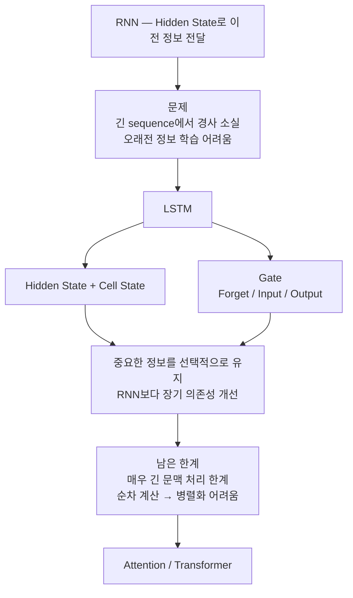

> 🗂️ **Notes · Deep Learning** — `lstm` `rnn` `cell-state` `hidden-state` `sequence`
{: .prompt-info }

---

## 1. 📖 RNN은 어떻게 정보를 기억할까?

RNN은 **각 시점의 정보를 `hidden_state`에 담아서 다음 시점으로 전달해 정보를 유지한다.**

```text
x₁ → h₁ → h₂ → h₃ → ...
          ↑    ↑
         x₂   x₃
```

각 시점의 `hidden_state`에는 **현재 입력 정보 + 이전 시점에서 전달받은 정보**가 함께 반영된다.

```text
이전 정보
   ↓
hidden_state + 현재 입력
   ↓
새로운 hidden_state
   ↓
다음 시점으로 전달
```

이러한 구조 덕분에 RNN은 이전 시점의 정보를 어느 정도 기억하면서 순차 데이터를 처리할 수 있다.

---

## 2. ⚠️ RNN의 한계

sequence가 길어질수록 **오래전의 정보를 학습하기 어려워질 수 있다.** 그 이유 중 하나가
**역전파 과정에서 발생하는 경사 소실(Vanishing Gradient)** 문제이다.

```text
순전파   시점 1 → 시점 2 → 시점 3 → ... → 시점 100
역전파   시점 1 ← 시점 2 ← 시점 3 ← ... ← 시점 100
```

이 과정에서 gradient가 계속 작아질 경우, 초반 시점까지 충분한 학습 신호가 전달되지 않을 수
있다. 따라서 RNN은 **긴 문맥의 장기 의존성(Long-term Dependency)을 학습하는 데 어려움**이
있다.

---

## 3. 🧩 LSTM은 무엇을 더했나

RNN의 경사 소실 문제와 장기 의존성 문제를 완화하기 위해 등장한 구조 중 하나가
**LSTM(Long Short-Term Memory)** 이다. LSTM은 단순히 `hidden_state`만 다음 시점으로 전달하지
않는다.

{: w="720" h="254" }

여기에 **Gate 구조**를 추가하여 어떤 정보를 유지하고, 어떤 정보를 버릴지를 조절한다.

LSTM은 각 시점마다 다음 시점으로 넘겨야 할 정보들 중에서 유지할 정보 · 버릴 정보 · 새롭게
추가할 정보 · 현재 출력으로 사용할 정보를 구분한다. 쉽게 말하면

> **중요한 정보는 오래 유지하고, 덜 필요한 정보는 버리면서 새로운 정보를 추가한다.**

이 정보 선택 과정을 담당하는 구조를 **Gate**라고 한다.

| Gate | 역할 |
| --- | --- |
| **Forget Gate** | 필요 없는 정보 제거 |
| **Input Gate** | 현재 정보 중 필요한 정보 추가 |
| **Output Gate** | 현재 시점에서 사용할 정보 결정 |

---

## 4. 📦 Cell State와 Hidden State

LSTM에서는 `hidden_state`와 별도로 **`cell_state`** 라는 상태를 사용한다. `cell_state`는

> **여러 시점을 거치면서 비교적 장기적으로 유지되는 메모리**

라고 볼 수 있다. 각 시점에서 Gate들이 `cell_state`를 조절한다.

{: w="720" h="288" }

> 💡 "각 gate들을 통과하면서 종합된 정보들을 cell_state라고 한다"라고 이해할 수도 있지만, 조금
> 더 정확하게는 **Cell State는 장기적으로 전달되는 메모리이고, Gate들이 Cell State에 어떤
> 정보를 버리고 추가할지를 제어한다.**
{: .prompt-info }

두 상태의 차이는 다음과 같다.

| 상태 | 담는 것 |
| --- | --- |
| **Hidden State** | 현재 시점의 출력 또는 비교적 단기적인 정보 — 현재 시점에서 사용할 정보 |
| **Cell State** | 여러 시점에 걸쳐 유지해야 하는 장기적인 정보 — 오래 유지할 정보 |

---

## 5. 🚧 LSTM에도 한계가 있다

LSTM은 RNN의 문제를 많이 개선했지만 완벽하게 해결한 것은 아니다.

### 5.1 긴 문맥을 완전히 해결하지는 못한다

LSTM은 Gate와 Cell State를 사용하기 때문에 RNN보다 오래된 정보를 훨씬 잘 유지할 수 있다.
하지만 sequence가 매우 길어질 경우에는 여전히 초반의 정보를 끝까지 정확하게 유지하기 어려울
수 있다.

> ⚠️ **경사 소실 문제를 완화했지만 완전히 제거한 것은 아니다.** 따라서 매우 긴 sequence에서는
> 여전히 장기 의존성 학습에 한계가 존재한다.
{: .prompt-warning }

### 5.2 무조건 시점 순서대로 계산하는 구조이다

LSTM도 기본적으로 RNN 계열의 구조이기 때문에 **순차적으로 계산해야 한다.**

{: w="720" h="296" }

두 번째 시점을 계산하려면 첫 번째 시점의 결과인 `h₁, C₁`이 필요하다. 이 때문에 GPU가 잘하는
**대규모 병렬 연산을 충분히 활용하기 어렵고**, sequence가 길어지면 처리해야 하는 시점도
많아지므로 **학습 속도에도 영향을 준다.**

---

## 6. ➡️ 이후 시퀀스 구조가 개선하려 한 것

이후의 시퀀스 구조들은 크게 두 가지 문제를 개선하려고 했다.

| 개선 대상 | 방향 |
| --- | --- |
| **긴 문맥 처리** | 멀리 떨어져 있는 정보들 사이의 관계를 더 잘 학습하여 장기 의존성 문제 개선 |
| **순차 처리 문제** | 반드시 시점 순서대로 계산해야 하는 제약을 줄이고 병렬 처리를 통해 학습 속도 개선 |

```text
RNN / LSTM
      │
      ├─ 긴 문맥의 장기 의존성 문제
      │
      └─ 순차 계산으로 병렬 처리 어려움
                ↓
        이후의 시퀀스 구조
                ↓
      Attention / Transformer
```

---

## 7. 🗺️ 전체 흐름 한 번에 보기



---

## 8. ✅ 핵심 정리

| 구조 | 내용 |
| --- | --- |
| **RNN** | 각 시점의 정보를 `hidden_state`에 담아 다음 시점으로 전달하지만, 긴 sequence에서는 경사 소실로 오래전 정보를 학습하기 어렵다 |
| **LSTM** | `hidden_state`뿐 아니라 `cell_state`와 Gate 구조를 사용해 중요한 정보는 유지하고 필요 없는 정보는 버리면서 장기 의존성 문제를 완화한다 |
| **LSTM의 한계** | 긴 문맥 문제를 완전히 해결하지 못하며, 이전 시점의 결과가 필요해 반드시 순차적으로 계산해야 한다 |
| **이후의 방향** | 긴 문맥의 관계를 더 잘 학습하고, 순차 계산의 제약을 줄여 병렬 처리를 가능하게 하는 방향 |

---

## 9. 🧠 핵심 기억 카드

<details markdown="1">
<summary><strong>펼쳐서 확인</strong></summary>

- **RNN의 기억 방식** : 각 시점의 정보를 `hidden_state`에 담아 다음 시점으로 전달
- **`hidden_state`의 내용** : 현재 입력 정보 + 이전 시점에서 전달받은 정보
- **RNN의 한계** : 역전파에서 경사 소실 → 초반 시점까지 학습 신호가 도달하지 않음
- **장기 의존성** : 긴 문맥에서 오래전 정보를 학습하기 어려운 문제
- **LSTM이 더한 것** : `cell_state` + Gate 구조
- **Cell State** : 여러 시점을 거치며 비교적 장기적으로 유지되는 메모리 — 오래 유지할 정보
- **Hidden State** : 현재 시점의 출력 또는 단기적인 정보 — 현재 시점에서 사용할 정보
- **Forget Gate** : 필요 없는 정보 제거
- **Input Gate** : 현재 정보 중 필요한 정보 추가
- **Output Gate** : 현재 시점에서 사용할 정보 결정
- **더 정확한 표현** : Cell State가 장기 메모리이고, Gate가 무엇을 버리고 더할지를 **제어**한다
- **한계 ①** : 경사 소실을 완화했을 뿐 완전히 제거하지 못함 — 매우 긴 sequence는 여전히 어려움
- **한계 ②** : `h₁, C₁`이 있어야 두 번째 시점을 계산 → 병렬 연산 활용이 어렵고 학습 속도에 영향
- **이후 방향** : 긴 문맥 관계 학습 개선 + 순차 계산 제약 완화 → Attention / Transformer

</details>

---

## 10. 🔗 관련 글

- [경사 소실과 경사 폭발 — LSTM/GRU와 Gradient Clipping](/posts/vanishing-exploding-gradient/)
- [RNN 입력 Shape과 batch_first — 시점 L과 h_n 읽는 법](/posts/rnn-input-shape-and-batch-first/)
- [Attention과 Transformer, 그리고 모델을 고르고 조합하는 법](/posts/attention-transformer-and-model-combination/)
