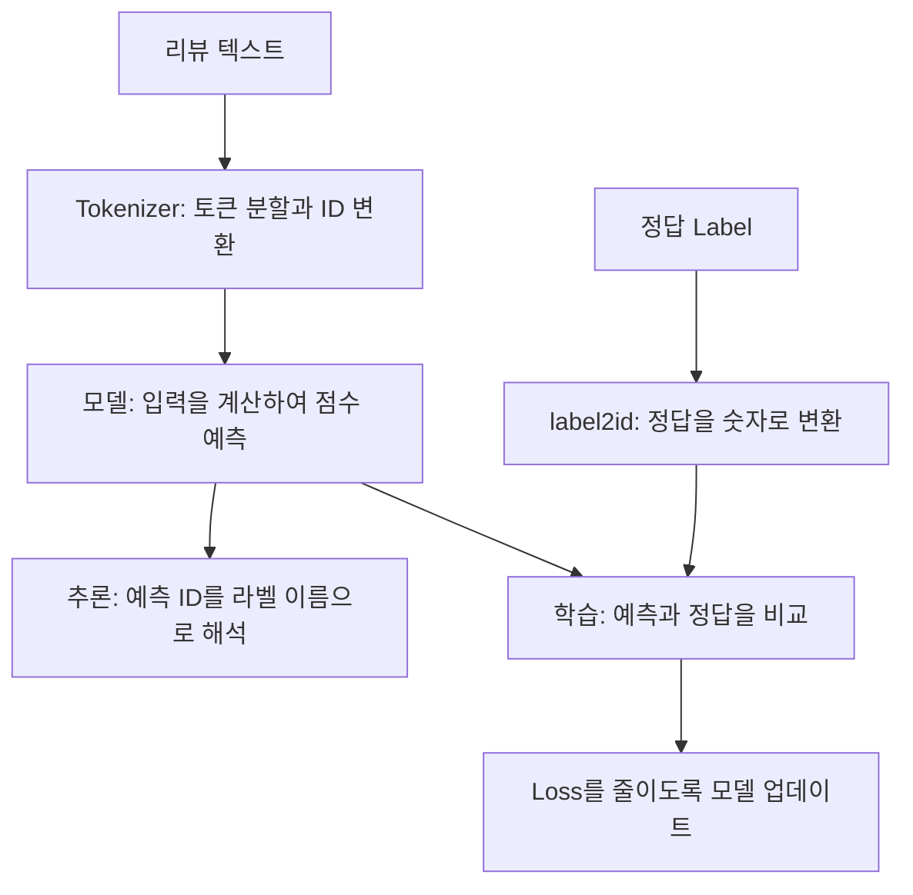

> 🗂️ **Notes · Deep Learning** — `nlp` `tokenizer` `subword` `label` `classification`
{: .prompt-info }

---

## 1. 📖 NLP의 큰 흐름

> 📌 **이 글의 범위** · 지금까지의 질문과 답변을 연결한 복습 노트입니다. 리뷰 분류를 공통
> 예시로 사용하며, 토큰 분할과 ID는 설명을 위한 가상 값입니다. 실제 결과는 tokenizer마다
> 다릅니다.
{: .prompt-tip }

NLP(Natural Language Processing, 자연어 처리)는 사람이 사용하는 언어를 컴퓨터가 분석하고
활용하도록 만드는 기술 분야입니다. 리뷰의 긍정·부정 분류, 요약, 번역 등이 여기에 해당합니다.

모델은 문장을 그대로 계산할 수 없으므로, 텍스트를 숫자로 표현하는 과정이 필요합니다.



이 흐름에는 두 종류의 정보가 있습니다.

| 종류 | 내용 |
| --- | --- |
| **입력** | 모델이 판단할 재료인 리뷰 텍스트 |
| **정답** | 모델이 맞혀야 하는 목표인 label |

**데이터 계약**은 이 정보들을 주고받는 단계들이 같은 형식과 의미를 사용하도록 정한 약속입니다.

---

## 2. 🔤 Token — 텍스트를 처리하는 단위

Token은 tokenizer가 텍스트를 나누어 만든 처리 단위입니다. 무조건 글자 하나나 단어 하나를
뜻하지 않습니다.

{: w="720" h="262" }

> 💡 같은 문장이라도 어떤 tokenizer를 사용하느냐에 따라 토큰의 종류와 개수가 달라질 수 있습니다.
{: .prompt-info }

따라서 단어 수와 토큰 수는 같지 않을 수 있습니다. 여기서 sequence 길이는 모델이 처리할 토큰의
개수로 생각하면 됩니다.

---

## 3. 🧩 Subword — Word와 Character 사이의 절충

### 왜 단어를 조각내는가?

Word 방식으로 모든 단어 형태를 별도로 등록하려면 사전이 매우 커질 수 있습니다. 예를 들어
`설치`, `설치가`, `설치는`, `재설치`를 각각 등록해야 할 수 있고, 신조어나 처음 보는 상품명까지
전부 미리 등록하기는 어렵습니다.

이처럼 vocabulary에 없는 표현을 **OOV(Out Of Vocabulary)** 라고 합니다. 단어 단위 방식에서
해당 단어를 표현할 다른 방법이 없다면, 모르는 토큰을 뜻하는 `[UNK]`로 처리할 수 있습니다.

반대로 Character 방식은 등록된 문자들을 조합해 다양한 단어를 표현할 수 있지만, 문장을 잘게
나누어 sequence가 길어지는 문제가 있습니다.

### Subword는 두 문제를 어떻게 절충하는가?

`재설치`라는 단어 전체는 사전에 없지만 `재`와 `설치`는 있다고 가정하면 다음처럼 비교할 수
있습니다.

| 방식 | 처리 예시 | 특징 |
| --- | --- | --- |
| Word | `[UNK]` | 등록되지 않은 단어를 구분하여 표현하지 못함 |
| Character | `["재", "설", "치"]` | 문자로 표현하지만 토큰이 3개 필요 |
| Subword | `["재", "설치"]` | 기존 조각을 재사용하여 토큰 2개로 표현 |

> ❓ "Word보다 작은 조각을 재사용해 OOV를 줄이면서, Character보다 sequence를 덜 늘리기 때문에
> 중간 절충인 것인가?"

맞습니다. 제한된 vocabulary로 다양한 단어를 표현하면서, 문자 단위만큼 sequence가 길어지지
않도록 절충하는 것입니다. 구체적인 효과는 vocabulary와 분할 규칙에 따라 달라집니다.

### 형태소 분석과는 다르다

Subword는 문법적인 의미 단위로 나누는 것을 반드시 목표로 하지 않습니다. 분할 결과가 형태소와
우연히 일치할 수는 있지만, 한국어 형태소 분석과 같은 개념은 아닙니다.

> ⚠️ 자주 쓰이는 단어는 쪼개지 않고 하나의 토큰으로 유지할 수 있습니다. 그리고 필요한 문자나
> 조각까지 사전에 없으면 처리하지 못할 수 있으므로, **subword라는 이유만으로 OOV가 무조건
> 없어지는 것은 아닙니다.**
{: .prompt-warning }

---

## 4. 🔢 Vocabulary · ID · Tokenizer

### Vocabulary — 토큰과 ID의 대응 사전

Vocabulary(vocab)는 tokenizer가 사용하는 토큰 목록과 각 토큰의 정수 ID를 연결한 사전입니다.
일상적인 "단어 목록"보다 넓은 개념으로, 단어 조각·구두점·특수 토큰 등도 포함할 수 있습니다.

| Token | Token ID |
| --- | --- |
| 설치 | 10 |
| 가 | 11 |
| 편 | 12 |
| 해요 | 13 |

### ID — 사전 안에서 토큰을 식별하는 번호

Token ID는 해당 vocabulary 안에서 토큰을 식별하는 정수입니다.

- 숫자가 크다고 의미가 더 강한 것은 아닙니다.
- 번호가 가깝다고 의미가 비슷한 것도 아닙니다.
- 다른 vocabulary에서는 같은 번호가 다른 토큰을 가리킬 수 있습니다.

예를 들어 tokenizer A에서 `10`이 `설치`여도, tokenizer B에서는 다른 토큰일 수 있습니다.

### Tokenizer — 변환을 실제로 수행하는 도구

Tokenizer는 분할 규칙과 vocabulary를 사용해 텍스트를 토큰과 ID로 변환하는 도구입니다.

```text
원문:       "설치가 편해요"
토큰:       ["설치", "가", "편", "해요"]
토큰 ID:    [10, 11, 12, 13]
```

위 예시는 핵심 변환만 보여주기 위해 특수 토큰 등은 생략했습니다.

| 개념 | 역할 |
| --- | --- |
| Token | 분할 결과로 나온 조각 |
| Subword | 단어와 단어 조각을 활용하는 토큰화 방식 |
| Vocabulary | 토큰과 ID를 연결하는 사전 |
| ID | 토큰을 식별하는 번호 |
| Tokenizer | 규칙과 사전을 이용해 실제 변환을 수행하는 도구 |

> ⚠️ Vocabulary만 같다고 tokenizer의 동작까지 같은 것은 아닙니다. 어떤 규칙으로 나누고
> 텍스트를 처리하는지도 함께 맞아야 합니다.
{: .prompt-warning }

### 모델은 번호로 어떻게 계산하는가?

모델은 일반적으로 Token ID에 대응하는 embedding, 즉 학습 가능한 숫자 벡터를 조회하고, 그
벡터들로 문맥을 계산합니다.

```text
"설치" → Token ID 10 → 10번 embedding 벡터 → 문맥 계산
```

여기서는 ID는 조회 번호이고, 실제 계산에는 그 번호에 대응하는 벡터가 사용된다는 점만 이해하면
충분합니다.

---

## 5. 🏷️ Label — 모델이 맞혀야 하는 정답

Label은 학습에서 정답 역할을 하는 정보입니다.

| 입력 텍스트 | 정답 Label |
| --- | --- |
| 설치가 편해요 | 긍정 |
| 하루 만에 떨어졌어요 | 부정 |
| 생각했던 것과 비슷해요 | 중립 |

학습에서는 모델의 예측을 정답과 비교하여 loss, 즉 틀린 정도를 계산하고 이를 줄이는 방향으로
모델을 업데이트합니다.

| 단계 | 정답 Label의 사용 |
| --- | --- |
| 학습 | 예측과 비교해 모델을 업데이트 |
| 검증·평가 | 예측이 얼마나 맞는지 측정 |
| 실제 추론 | 정답 없이 새로운 입력의 결과를 예측 |

모델이 고른 결과는 **예측 라벨**, 학습·평가의 기준은 **정답 라벨**이라고 구분할 수 있습니다.

### 라벨은 작업에 따라 형태가 달라진다

| 작업 | 정답의 형태 |
| --- | --- |
| 문장 분류 | 문장 전체의 범주: 긍정·중립·부정 |
| 다중 라벨 분류 | 한 문장에 해당하는 여러 범주: 배송, 품질 |
| 토큰 분류 | 각 토큰의 종류: 사람, 장소 등 |
| 문장 생성 | 생성해야 하는 정답 토큰들의 나열 |

라벨은 사람이 직접 붙이거나 별점 같은 기존 정보에서 만들 수 있습니다.

> ⚠️ 정답으로 사용한다는 것이 항상 객관적으로 정확하다는 뜻은 아닙니다. 별점과 리뷰 내용이
> 어긋나는 경우처럼, 라벨의 기준과 품질도 중요합니다.
{: .prompt-warning }

---

## 6. 🔀 Token과 Label의 매핑을 왜 분리하는가?

> ❓ "label2id, id2label이라는 계약은 단순히 모델과 사람이 읽기 편하게 하기 위함인가?"

가독성에도 도움이 되지만, 핵심은 분류에서 입력 토큰과 정답 범주가 **서로 다른 대상**을
나타내기 때문입니다.

![입력 "설치가 편해요"가 Tokenizer를 거쳐 [10, 11, 12, 13]이 되고 embedding 조회로 이어지는 흐름과, 정답 "긍정"이 label2id를 거쳐 2가 되고 출력 2번 위치로 이어지는 흐름을 나란히 비교한 그림](/assets/img/posts/nlp-token-label-and-data-contract/token-id-vs-label-id.svg){: w="720" h="296" }

| 구분 | Token ID | 분류의 Label ID |
| --- | --- | --- |
| 의미 | 어떤 텍스트 조각인가? | 어떤 정답 범주인가? |
| 대응 관계 | Vocabulary | Label 매핑 |
| 예시 | `10 → "설치"` | `2 → "긍정"` |
| 모델에서의 역할 | 입력 embedding 조회 | 정답과 출력 위치 연결 |

입력 문장에 등장하는 글자 `긍정`과, 리뷰의 정답 범주인 `긍정`도 역할이 다릅니다. 앞의 것은
tokenizer로 변환하고, 뒤의 것은 label 매핑으로 변환합니다.

### `label2id`와 `id2label`

```python
label2id = {"부정": 0, "중립": 1, "긍정": 2}
id2label = {0: "부정", 1: "중립", 2: "긍정"}
```

`label2id`는 정답 이름을 숫자로 변환하고, `id2label`은 예측한 숫자를 라벨 이름으로 해석합니다.
두 딕셔너리는 하나의 대응 관계를 양방향으로 표현한 것입니다.

### Label ID는 출력의 어느 위치가 정답인지 정한다

![출력 0번은 부정 -1.2, 1번은 중립 0.3, 2번은 긍정 2.4의 점수를 가지며 가장 높은 2번이 선택되어 argmax 결과 2가 id2label[2]로 긍정이 되는 과정](/assets/img/posts/nlp-token-label-and-data-contract/label-id-and-output.svg){: w="720" h="278" }

학습에서 정답이 `label=2`라면, 일반적인 분류 손실은 2번 위치가 정답이라는 기준으로 계산됩니다.
추론에서는 가장 높은 점수의 위치를 선택하므로, 이 예시에서는 `argmax` 결과가 `2`이고
`id2label[2]`로 해석하면 `긍정`입니다.

> 💡 따라서 Label ID는 단순한 표시용 번호가 아니라 **학습 목표와 출력의 의미를 연결하는
> 번호**입니다.
{: .prompt-info }

### 딕셔너리 자체보다 중요한 것은 일관된 대응 관계

데이터가 이미 숫자라면 `label2id`를 직접 호출하지 않고 학습할 수 있고, 숫자 결과만 사용한다면
`id2label` 없이도 계산할 수 있습니다. 필수인 것은 이 이름의 딕셔너리가 아니라, 각 번호가
무엇을 뜻하는지에 대한 일관된 약속입니다.

> 🚨 학습에서는 `2=긍정`이었는데 서비스에서 `2=부정`으로 해석하면, 모델이 맞혀도 반대로
> 표시됩니다.
{: .prompt-danger }

### 생성 작업에서는 정답이 Token ID일 수 있다

분류와 달리 다음 토큰을 예측하는 모델에서는 정답 자체가 토큰입니다. 따라서 label에
vocabulary의 Token ID를 사용합니다.

```text
Token ID : 이 값이 무엇을 식별하는가?
Label    : 이 값이 학습에서 정답 역할을 하는가?
```

이 두 질문은 서로 다릅니다. 분류에서는 정답 범주가 입력 토큰과 달라 매핑을 분리하고,
생성에서는 Token ID가 label 역할을 할 수 있습니다.

---

## 7. 📜 데이터 계약 — 보내는 쪽과 받는 쪽의 공통 약속

> ❓ "API 인터페이스처럼 데이터간의 계약 / 약속 같은 느낌인가?"

API 인터페이스와 비슷하게 이해하면 됩니다. 다만 데이터끼리 계약한다기보다는, **데이터를
보내는 쪽과 받는 쪽이 형식·의미·처리 조건에 대해 맺는 약속**입니다. 각 키워드의 뜻이나 기능을
설명하는 데서 끝나지 않고, 어떻게 전달하고 해석해야 하는지까지 정합니다.

| 종류 | 계약 예시 |
| --- | --- |
| 이름·역할 | `input_ids`에는 토큰 ID를 전달한다 |
| 자료형 | 토큰 ID를 정수 Tensor로 전달한다 |
| 형태 | 문장 분류의 `input_ids`는 `[B, L]`, 정답 `labels`는 `[B]`이다 |
| 값의 의미 | 동일한 토큰 ID를 동일한 토큰으로 해석한다 |
| 입력 처리 | 정해진 tokenizer, 길이 제한, padding 규칙을 사용한다 |
| 정답 해석 | Label ID `0=부정`, `1=중립`, `2=긍정`을 유지한다 |

`B`는 한 번에 처리하는 샘플 수이고, `L`은 입력 토큰 길이입니다. 위 형태는 단일 라벨 문장
분류의 예시이며 작업에 따라 달라집니다.

길이가 다른 문장들을 묶을 때는 padding으로 길이를 맞출 수 있습니다. 일반적인
`attention_mask`에서는 실제 입력을 `1`, padding을 `0`으로 구분합니다. 이러한 마스크 해석
규칙도 계약에 포함됩니다.

### 형식이 맞아도 의미가 틀릴 수 있다

API로 `{"price": 1000}`을 보낼 때 숫자라는 것만 맞춰서는 부족합니다. 보내는 쪽은 원화, 받는
쪽은 달러로 해석하면 처리 결과가 달라집니다. NLP에서도 마찬가지입니다.

```text
Tokenizer: ID 10은 "설치"다.
모델:      ID 10을 다른 토큰의 embedding으로 조회한다.
```

정수 형식과 shape가 맞아서 실행되더라도 의미는 어긋납니다. 그래서 모델과 호환되는 tokenizer
및 vocabulary를 사용해야 합니다.

### Tokenizer와 데이터 계약의 관계

Tokenizer는 데이터 계약의 **일부를 실제로 수행하는 도구**입니다. 토큰 분할, ID 변환, 특수 토큰
처리 등의 규칙을 실행합니다. 전체 계약은 tokenizer보다 넓습니다. Batch를 묶는 data collator,
모델이 요구하는 입력 형태, 라벨 매핑과 출력 해석까지 함께 맞아야 합니다.

### TCP 패킷 비유로 이해하기

> ❓ "TCP에서의 패킷과도 유사한 개념인가?"

송신자와 수신자가 같은 규칙을 지켜야 한다는 점은 유사합니다. 다만 데이터 계약은 전달물
자체보다 그 전달물을 구성하고 해석하는 규칙에 가깝습니다. 참고로 TCP의 데이터 단위는 정확히는
세그먼트입니다.

| 구분 | TCP 통신에 비유 | NLP |
| --- | --- | --- |
| 실제 전달물 | TCP 세그먼트 | 실제 `input_ids` 등의 데이터 |
| 약속 | 헤더 형식과 필드 해석 규칙 | Tensor 형태와 ID의 의미 등 |

전달물은 약속에 맞춰 만든 데이터이고, 계약은 그 데이터를 만들고 읽는 약속입니다.

---

## 8. 🧵 하나의 예시로 전체 연결하기

리뷰 `설치가 편해요`의 정답이 `긍정`이라고 가정합니다.

| 단계 | 처리 | 결과 예시 |
| --- | --- | --- |
| 1. 입력 준비 | 리뷰와 정답을 준비 | 텍스트: 설치가 편해요, 정답: 긍정 |
| 2. 토큰화 | Tokenizer가 문장을 분할 | `["설치", "가", "편", "해요"]` |
| 3. 입력 ID 변환 | Vocabulary에서 번호 조회 | `[10, 11, 12, 13]` |
| 4. 정답 ID 변환 | `label2id["긍정"]` | `2` |
| 5. 모델 계산 | Embedding과 문맥 계산 후 분류 점수 출력 | `[-1.2, 0.3, 2.4]` |
| 6. 학습 | 정답 위치 2를 기준으로 loss 계산 | Loss를 줄이도록 모델 업데이트 |
| 7. 추론 결과 해석 | 가장 높은 점수의 위치를 `id2label`로 변환 | `2 → 긍정` |

6번은 학습 시의 처리이고, 7번은 예측 결과를 해석하는 처리입니다. 실제 추론에는 4번의 정답이
필요하지 않습니다. 표에서는 특수 토큰과 batch 구성 등을 생략했습니다.

> 💡 이 전 과정에서 **토큰 ID의 의미, 모델의 입력 규격, 라벨 ID와 출력 위치의 관계가
> 일치하도록 유지하는 것**이 데이터 계약입니다.
{: .prompt-info }

---

## 9. ✅ 핵심 정리

| 개념 | 기억할 문장 |
| --- | --- |
| NLP | 사람이 사용하는 언어를 컴퓨터가 분석하고 활용하는 분야 |
| Token | Tokenizer가 만든 텍스트 처리 단위로, 글자나 단어와 반드시 같지 않음 |
| Subword | 조각을 재사용해 OOV와 sequence 길이 사이를 절충하는 방식 |
| Vocabulary | 사용 가능한 토큰과 ID의 대응 사전 |
| Token ID | 해당 vocabulary 안에서 토큰을 식별하는 번호 |
| Tokenizer | 분할 규칙과 vocabulary로 텍스트를 토큰·ID로 변환하는 도구 |
| Label | 모델이 맞혀야 하는 정답 역할의 정보 |
| `label2id` / `id2label` | 분류의 라벨 이름과 출력 위치 번호를 양방향으로 연결하는 매핑 |
| 데이터 계약 | 데이터를 보내고 받는 단계들이 형식과 의미를 일치시키는 약속 |

---

## 10. 🧠 핵심 기억 카드

<details markdown="1">
<summary><strong>펼쳐서 확인</strong></summary>

- **토큰 수 ≠ 단어 수** : `"설치가 편해요"` → Word 2개 / Character 6개 / Subword 4개
- **OOV** : vocabulary에 없는 표현 — Word 방식에서는 `[UNK]`로 처리될 수 있음
- **Subword의 절충** : `재설치` → Word는 `[UNK]`, Character는 3토큰, Subword는 `["재", "설치"]` 2토큰
- **Token ID** : 그 vocabulary 안에서만 유효 — 번호가 크거나 가깝다고 의미가 강하거나 비슷하지 않음
- **ID → embedding** : ID는 조회 번호이고 계산에는 대응 벡터가 쓰인다
- **Token ID vs Label ID** : "어떤 텍스트 조각인가" vs "어떤 정답 범주인가"
- **Label ID의 실제 역할** : 출력의 몇 번 위치가 정답인지 정한다 — 학습 loss 기준, 추론 `argmax` 해석
- **딕셔너리보다 중요한 것** : 각 번호의 의미에 대한 **일관된 약속** — 학습 `2=긍정`, 서비스 `2=부정`이면 반대로 표시된다
- **생성 작업** : 정답이 토큰 자체이므로 label에 Token ID를 쓸 수 있다
- **데이터 계약** : 이름·역할 / 자료형 / 형태 / 값의 의미 / 입력 처리 / 정답 해석
- **형식이 맞아도 의미는 틀릴 수 있다** : 정수·shape가 맞아 실행돼도 모델이 다른 토큰의 embedding을 조회할 수 있다

</details>

---

## 11. 🔗 관련 글

- [AutoTokenizer — padding·truncation과 shape가 필요한 이유](/posts/autotokenizer-padding-truncation-shape/)
- [Attention과 Transformer, 그리고 모델을 고르고 조합하는 법](/posts/attention-transformer-and-model-combination/)
- [CrossEntropyLoss 이해하기 — 다중 클래스 분류](/posts/cross-entropy-loss/)
