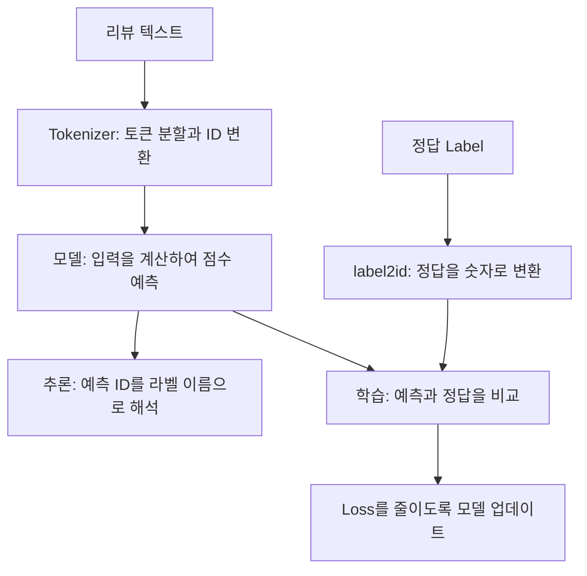

> 🗂️ **Notes · Deep Learning** — `nlp` `tokenizer` `subword` `vocabulary` `classification`
{: .prompt-info }

---

## 1. 📖 NLP의 큰 흐름

> 📌 **이 글의 범위** · 지금까지의 질문과 답변을 연결한 복습 노트입니다. 리뷰 분류를 공통
> 예시로 사용하며, 토큰 분할과 ID는 설명을 위한 가상 값입니다. 실제 결과는 tokenizer마다
> 다릅니다.
{: .prompt-tip }

NLP(Natural Language Processing, 자연어 처리)는 사람이 사용하는 언어를 컴퓨터가 분석하고
활용하도록 만드는 기술 분야입니다. 리뷰의 긍정·부정 분류, 요약, 번역 등이 여기에 해당합니다.

모델은 문장을 그대로 계산할 수 없으므로, 텍스트를 숫자로 표현하는 과정이 필요합니다.



이 흐름에는 두 종류의 정보가 있습니다.

| 종류 | 내용 |
| --- | --- |
| **입력** | 모델이 판단할 재료인 리뷰 텍스트 |
| **정답** | 모델이 맞혀야 하는 목표인 label |

**데이터 계약**은 이 정보들을 주고받는 단계들이 같은 형식과 의미를 사용하도록 정한 약속입니다.

---

## 2. 🔤 Token — 텍스트를 처리하는 단위

Token은 tokenizer가 텍스트를 나누어 만든 처리 단위입니다. 무조건 글자 하나나 단어 하나를
뜻하지 않습니다.

{: w="720" h="262" }

> 💡 같은 문장이라도 어떤 tokenizer를 사용하느냐에 따라 토큰의 종류와 개수가 달라질 수 있습니다.
{: .prompt-info }

따라서 단어 수와 토큰 수는 같지 않을 수 있습니다. 여기서 sequence 길이는 모델이 처리할 토큰의
개수로 생각하면 됩니다.

---

## 3. 🧩 Subword — Word와 Character 사이의 절충

### 왜 단어를 조각내는가?

Word 방식으로 모든 단어 형태를 별도로 등록하려면 사전이 매우 커질 수 있습니다. 예를 들어
`설치`, `설치가`, `설치는`, `재설치`를 각각 등록해야 할 수 있고, 신조어나 처음 보는 상품명까지
전부 미리 등록하기는 어렵습니다.

이처럼 vocabulary에 없는 표현을 **OOV(Out Of Vocabulary)** 라고 합니다. 단어 단위 방식에서
해당 단어를 표현할 다른 방법이 없다면, 모르는 토큰을 뜻하는 `[UNK]`로 처리할 수 있습니다.

반대로 Character 방식은 등록된 문자들을 조합해 다양한 단어를 표현할 수 있지만, 문장을 잘게
나누어 sequence가 길어지는 문제가 있습니다.

### Subword는 두 문제를 어떻게 절충하는가?

`재설치`라는 단어 전체는 사전에 없지만 `재`와 `설치`는 있다고 가정하면 다음처럼 비교할 수
있습니다.

| 방식 | 처리 예시 | 특징 |
| --- | --- | --- |
| Word | `[UNK]` | 등록되지 않은 단어를 구분하여 표현하지 못함 |
| Character | `["재", "설", "치"]` | 문자로 표현하지만 토큰이 3개 필요 |
| Subword | `["재", "설치"]` | 기존 조각을 재사용하여 토큰 2개로 표현 |

> ❓ "Word보다 작은 조각을 재사용해 OOV를 줄이면서, Character보다 sequence를 덜 늘리기 때문에
> 중간 절충인 것인가?"

맞습니다. 제한된 vocabulary로 다양한 단어를 표현하면서, 문자 단위만큼 sequence가 길어지지
않도록 절충하는 것입니다. 구체적인 효과는 vocabulary와 분할 규칙에 따라 달라집니다.

### 형태소 분석과는 다르다

Subword는 문법적인 의미 단위로 나누는 것을 반드시 목표로 하지 않습니다. 분할 결과가 형태소와
우연히 일치할 수는 있지만, 한국어 형태소 분석과 같은 개념은 아닙니다.

> ⚠️ 자주 쓰이는 단어는 쪼개지 않고 하나의 토큰으로 유지할 수 있습니다. 그리고 필요한 문자나
> 조각까지 사전에 없으면 처리하지 못할 수 있으므로, **subword라는 이유만으로 OOV가 무조건
> 없어지는 것은 아닙니다.**
{: .prompt-warning }

---

## 4. 🔢 Vocabulary · ID · Tokenizer

### Vocabulary — 토큰과 ID의 대응 사전

Vocabulary(vocab)는 tokenizer가 사용하는 토큰 목록과 각 토큰의 정수 ID를 연결한 사전입니다.
일상적인 "단어 목록"보다 넓은 개념으로, 단어 조각·구두점·특수 토큰 등도 포함할 수 있습니다.

| Token | Token ID |
| --- | --- |
| 설치 | 10 |
| 가 | 11 |
| 편 | 12 |
| 해요 | 13 |

### ID — 사전 안에서 토큰을 식별하는 번호

Token ID는 해당 vocabulary 안에서 토큰을 식별하는 정수입니다.

- 숫자가 크다고 의미가 더 강한 것은 아닙니다.
- 번호가 가깝다고 의미가 비슷한 것도 아닙니다.
- 다른 vocabulary에서는 같은 번호가 다른 토큰을 가리킬 수 있습니다.

예를 들어 tokenizer A에서 `10`이 `설치`여도, tokenizer B에서는 다른 토큰일 수 있습니다.

### Tokenizer — 변환을 실제로 수행하는 도구

Tokenizer는 분할 규칙과 vocabulary를 사용해 텍스트를 토큰과 ID로 변환하는 도구입니다.

```text
원문:       "설치가 편해요"
토큰:       ["설치", "가", "편", "해요"]
토큰 ID:    [10, 11, 12, 13]
```

위 예시는 핵심 변환만 보여주기 위해 특수 토큰 등은 생략했습니다.

| 개념 | 역할 |
| --- | --- |
| Token | 분할 결과로 나온 조각 |
| Subword | 단어와 단어 조각을 활용하는 토큰화 방식 |
| Vocabulary | 토큰과 ID를 연결하는 사전 |
| ID | 토큰을 식별하는 번호 |
| Tokenizer | 규칙과 사전을 이용해 실제 변환을 수행하는 도구 |

> ⚠️ Vocabulary만 같다고 tokenizer의 동작까지 같은 것은 아닙니다. 어떤 규칙으로 나누고
> 텍스트를 처리하는지도 함께 맞아야 합니다.
{: .prompt-warning }

### 모델은 번호로 어떻게 계산하는가?

모델은 일반적으로 Token ID에 대응하는 embedding, 즉 학습 가능한 숫자 벡터를 조회하고, 그
벡터들로 문맥을 계산합니다.

```text
"설치" → Token ID 10 → 10번 embedding 벡터 → 문맥 계산
```

여기서는 ID는 조회 번호이고, 실제 계산에는 그 번호에 대응하는 벡터가 사용된다는 점만 이해하면
충분합니다.

---

## 5. ✅ 핵심 정리

| 개념 | 기억할 문장 |
| --- | --- |
| NLP | 사람이 사용하는 언어를 컴퓨터가 분석하고 활용하는 분야 |
| Token | Tokenizer가 만든 텍스트 처리 단위로, 글자나 단어와 반드시 같지 않음 |
| Subword | 조각을 재사용해 OOV와 sequence 길이 사이를 절충하는 방식 |
| Vocabulary | 사용 가능한 토큰과 ID의 대응 사전 |
| Token ID | 해당 vocabulary 안에서 토큰을 식별하는 번호 |
| Tokenizer | 분할 규칙과 vocabulary로 텍스트를 토큰·ID로 변환하는 도구 |

---

## 6. 🧠 핵심 기억 카드

<details markdown="1">
<summary><strong>펼쳐서 확인</strong></summary>

- **토큰 수 ≠ 단어 수** : `"설치가 편해요"` → Word 2개 / Character 6개 / Subword 4개
- **sequence 길이** : 모델이 처리할 토큰의 개수
- **OOV** : vocabulary에 없는 표현 — Word 방식에서는 `[UNK]`로 처리될 수 있음
- **Subword의 절충** : `재설치` → Word는 `[UNK]`, Character는 3토큰, Subword는 `["재", "설치"]` 2토큰
- **Subword ≠ 형태소 분석** : 문법적 의미 단위를 목표로 하지 않으며, subword라고 OOV가 사라지지는 않음
- **Vocabulary** : 단어 목록보다 넓은 개념 — 단어 조각·구두점·특수 토큰도 포함
- **Token ID** : 그 vocabulary 안에서만 유효 — 번호가 크거나 가깝다고 의미가 강하거나 비슷하지 않음
- **Vocabulary가 같아도** 분할 규칙까지 같아야 tokenizer 동작이 같다
- **ID → embedding** : ID는 조회 번호이고 계산에는 대응 벡터가 쓰인다

</details>

---

## 7. 🔗 관련 글

- [Label과 데이터 계약 — 번호의 의미를 맞추는 약속](/posts/nlp-label-and-data-contract/)
- [AutoTokenizer와 체크포인트 — 토크나이저를 맞춰야 하는 이유](/posts/autotokenizer-and-checkpoint/)
- [Attention과 Transformer, 그리고 모델을 고르고 조합하는 법](/posts/attention-transformer-and-model-combination/)
