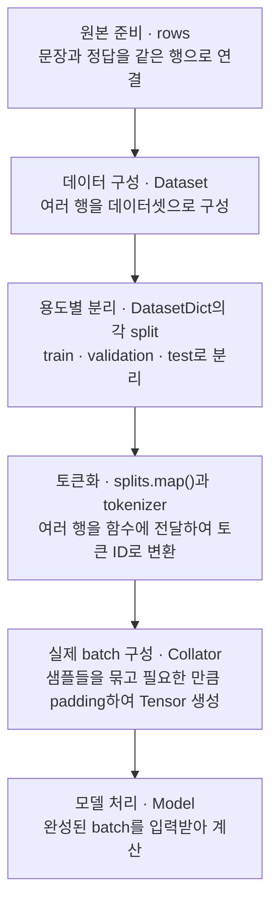

> 🗂️ **Notes · Deep Learning** — `nlp` `train-test-split` `label` `batch` `tokenizer`
{: .prompt-info }

---

## 1. 📖 전체 흐름 이해하기

> 📌 **이 글의 범위** · "여기까지 리셋하고, 새로운 개념 학습 시작" 이후의 질문과 답변입니다.
> 데이터 분리 → 토큰화 → batch 구성 → padding과 길이 정책 순서로 연결했습니다. 예시의 길이는
> 글자 수가 아니라 토큰 수입니다.
{: .prompt-tip }

문장과 정답을 준비하고, 용도별로 데이터를 나눈 뒤, 각 문장을 토큰화하고 실제 학습 batch를 만들
때 길이를 맞춥니다.



> ⚠️ 여기서 토큰화할 때 한 번에 묶는 batch와, 모델이 한 번에 처리하는 학습 batch는 서로 다를 수
> 있습니다. 이 차이는 4절에서 설명합니다.
{: .prompt-warning }

---

## 2. ✂️ Dataset을 왜 train·validation·test로 나누는가?

> ❓ "단문 여러개를 train, validation, test의 항목을 rows의 index로 하드코딩해서, split한다.까지
> 이해함. 여기서 split은 왜하는건지?"

사용한 코드의 역할은 다음과 같습니다.

```python
dataset = Dataset.from_dict(rows)
splits = DatasetDict({
    "train": dataset.select([0, 1, 3, 4, 6, 7]),
    "validation": dataset.select([2, 5, 8]),
    "test": dataset.select([9, 10, 11]),
})
```

해석한 대로, 원본 행의 index를 직접 지정해 세 용도의 데이터로 분리하는 코드입니다.
`select()`로 행을 선택하면 해당 행의 문장과 정답이 함께 선택됩니다.

### 분리하는 이유

학습에 사용한 문장으로만 평가하면, 이미 본 내용을 기억해서 맞힌 것인지 새로운 문장에도 잘
적용되는지 구분하기 어렵습니다.

| Split | 역할 | 예제의 행 수 |
| --- | --- | --- |
| train | 모델의 파라미터 학습 | 6 |
| validation | 학습 중 성능 확인, 설정과 모델 선택 | 3 |
| test | 선택이 끝난 모델의 최종 성능 평가 | 3 |

Train으로 공부하고, validation으로 학습 방법을 점검하고, test로 최종 평가한다고 이해하면
됩니다. Test 결과를 반복해서 보며 설정을 고르면 최종 평가의 독립성이 약해집니다.

> ⚠️ 이 예제는 각 split에 클래스가 고르게 들어가도록 직접 선택한 교육용 데이터입니다. 이처럼
> 적은 샘플 수로 측정한 점수는 실제 성능을 판단하기에는 부족합니다.
{: .prompt-warning }

### `isdisjoint()`는 무엇을 확인하는가?

```python
assert split_indices["train"].isdisjoint(split_indices["validation"])
```

두 index 집합에 공통 원소가 없는지 확인합니다. `assert`는 조건이 거짓이면 오류를 발생시킵니다.

이 검사는 같은 원본 index의 중복을 확인합니다. 서로 다른 index에 같은 문장이 복제되어 있는지까지
확인하는 검사는 아닙니다.

---

## 3. 🏷️ label의 각 숫자는 무엇을 뜻하는가?

> ❓ "label의 원소가 뜻하는 의미가 뭔지 간략하게 정리해서 알려줘."

label의 각 원소는 같은 index에 있는 문장의 정답 범주입니다.

| Index | 문장 | Label ID | 내용상 해석 |
| --- | --- | --- | --- |
| 0 | 금리 인상 전망 | 0 | 경제 |
| 3 | 대표팀 결승 진출 | 1 | 스포츠 |
| 6 | 새 AI 반도체 공개 | 2 | 기술 |

```python
rows["text"][0]   # "금리 인상 전망"
rows["label"][0]  # 0
```

이 두 값이 한 샘플을 구성합니다. 모델은 문장을 보고 정답 범주를 예측하도록 학습합니다.

원본 코드에는 범주 이름이 직접 선언되어 있지 않지만, 내용상 다음과 같이 해석할 수 있습니다.

```python
label2id = {"경제": 0, "스포츠": 1, "기술": 2}
id2label = {0: "경제", 1: "스포츠", 2: "기술"}
```

`0`, `1`, `2`는 범주를 구분하는 번호입니다. 숫자의 크기가 중요도나 강도를 나타내지는 않습니다.

---

## 4. 🔁 `tokenize_batch(batch)`의 batch는 어디에서 오는가?

> ❓ "위 코드에서 파라미터로 들어가는 batch는 어디서 가져오는건지 알려줘."

질문한 코드의 핵심은 다음 부분입니다.

```python
def tokenize_batch(batch):
    encoded = tokenizer(
        batch["text"],
        truncation=True,
        max_length=16,
        padding=False,
    )
    encoded["labels"] = batch["label"]
    return encoded

tokenized = splits.map(tokenize_batch, batched=True)
```

### `map()`이 데이터를 꺼내 함수에 전달한다

`splits.map()`이 각 split에서 여러 행을 꺼내 batch로 묶고, `tokenize_batch(batch)`를 호출합니다.

![splits["train"]의 여러 행을 splits.map()이 꺼내 열마다 여러 값을 담은 딕셔너리 하나로 묶은 뒤 tokenize_batch 함수에 전달하는 흐름](/assets/img/posts/dataset-split-and-map/map-batch-flow.svg){: w="720" h="256" }

`batched=True`이므로 batch는 열마다 여러 값을 담은 딕셔너리 형태입니다. 예를 들어 train의 첫 두
행을 묶으면 다음과 같습니다.

```python
batch = {
    "text": ["금리 인상 전망", "수출 증가 발표"],
    "label": [0, 0],
}
```

따라서 `batch["text"]`는 문자열 하나가 아니라 문자열 list입니다. Tokenizer는 이 목록의 문장들을
토큰화하고, 아래 코드는 정답 목록을 모델 입력에 사용하는 이름으로 연결합니다.

```python
encoded["labels"] = batch["label"]
```

이때 정답 숫자는 그대로이고, 반환하는 쪽의 key를 `labels`로 지정한 것입니다.

### 함수 이름 뒤에 괄호가 없는 이유

`splits.map(tokenize_batch, batched=True)`에서는 함수를 즉시 실행하지 않고 함수 자체를 `map()`에
전달합니다. 이후 `map()`이 준비한 데이터를 인수로 넣어 호출합니다.

| 표현 | 의미 |
| --- | --- |
| `tokenize_batch` | 함수 자체 |
| `tokenize_batch(batch)` | batch를 전달하여 함수 실행 |

### 코드 블록만으로 출처를 알 수 있는가?

> ❓ "저 코드블럭에서는 어디서 왔는지 알 수 없는게 맞지?"

| 확인 대상 | 현재 토큰화 코드만으로 확인 가능? |
| --- | --- |
| 누가 batch를 전달하는가? | 가능: `splits.map()` |
| 어떤 데이터에서 꺼내는가? | 가능: `splits` |
| `splits`를 어디서 만들었는가? | 불가능: 정의 부분이 이 블록에 없음 |

이 대화에서는 **앞선 `DatasetDict` 생성 코드에서 만든 `splits`** 를 사용하는 것입니다. 해당
정의가 실행되지 않았다면 `splits`를 찾을 수 없다는 오류가 발생합니다.

### 전처리 batch와 학습 batch는 별개

```python
splits.map(tokenize_batch, batched=True, batch_size=2)
```

이 설정은 토큰화 함수에 한 번에 최대 2행씩 전달한다는 뜻입니다. 모델을 반드시 2개씩
학습시킨다는 뜻은 아닙니다.

> 💡 토큰화한 샘플을 저장한 뒤, 학습할 때는 별도로 정한 batch 크기에 따라 샘플을 꺼내 collator로
> 묶습니다. 이 때문에 **padding을 실제 학습 batch가 만들어질 때까지 미루는 것**이 유용합니다.
{: .prompt-info }

---

## 5. ✅ 핵심 정리

| 질문 | 핵심 답변 |
| --- | --- |
| Split은 왜 하는가? | 학습·설정 선택·최종 평가의 데이터를 나누어 새로운 데이터에 대한 성능을 확인하기 위해 |
| label의 숫자는 무엇인가? | 같은 행에 있는 문장의 정답 범주 ID |
| 함수의 batch는 어디서 오는가? | `splits.map()`이 각 split에서 여러 행을 꺼내 자동 전달 |
| 전처리 batch와 학습 batch는 같은가? | 다르다. `batch_size=2`는 토큰화 함수에 2행씩 전달한다는 뜻 |

---

## 6. 🧠 핵심 기억 카드

<details markdown="1">
<summary><strong>펼쳐서 확인</strong></summary>

- **전체 흐름** : `rows → Dataset → split → map + tokenizer → Collator → Model`
- **Split의 목적** : train은 학습, validation은 설정·모델 선택, test는 최종 평가
- **`select()`** : 행을 고르면 그 행의 문장과 정답이 함께 선택된다
- **`isdisjoint()`** : 같은 원본 index의 중복만 확인 — 내용이 복제된 문장까지 잡지는 못한다
- **label 원소** : 같은 index 문장의 정답 범주 ID — 숫자 크기가 중요도를 뜻하지 않는다
- **`map()`의 batch** : `splits.map()`이 여러 행을 꺼내 딕셔너리로 묶어 전달 (`batched=True`)
- **`batch["text"]`** : 문자열 하나가 아니라 문자열 **list**
- **`encoded["labels"]`** : 정답 숫자는 그대로, 반환하는 쪽의 key만 `labels`로 지정
- **`tokenize_batch` vs `tokenize_batch(batch)`** : 함수 자체 vs 실행
- **`batch_size=2`** : 토큰화 함수에 한 번에 2행 전달 — 학습을 2개씩 한다는 뜻이 아니다
- **padding을 미루는 이유** : 실제 학습 batch가 만들어질 때 collator가 길이를 맞추기 때문

</details>

---

## 7. 🔗 관련 글

- [동적 Padding과 Collator — PAD를 줄이는 길이 정책](/posts/dynamic-padding-and-collator/)
- [Label과 데이터 계약 — 번호의 의미를 맞추는 약속](/posts/nlp-label-and-data-contract/)
- [데이터 분할과 DataLoader — Batch Contract 검사까지](/posts/data-split-dataloader-batch-contract/)
