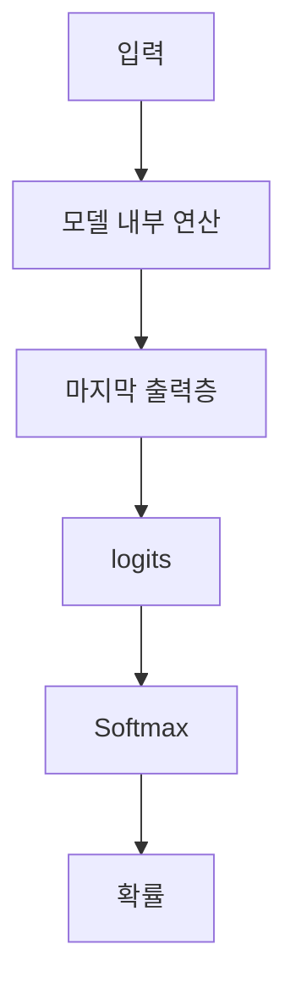

> 🗂️ **Notes · Deep Learning** — `softmax` `logit` `numerical-stability` `numpy` `normalization`
{: .prompt-info }

---

## 1. 📖 Logits란?

`logits`는 모델이 여러 내부 연산을 거친 뒤 **마지막 출력층에서 반환하는 확률 변환 전 원시
점수(raw score)** 입니다.

```python
logits = [2.4, -0.8, 1.2]
```

이 값들은 아직 확률이 아닙니다.



---

## 2. 🎲 Softmax란?

Softmax는 logits를 **클래스별 확률값으로 변환**합니다.

| 특징 | 내용 |
| --- | --- |
| 범위 | 모든 출력값은 `0 이상 1 이하` |
| 합 | 하나의 샘플 안에서 모든 확률의 합은 `1` |
| 순서 | logit이 클수록 더 높은 확률을 받음 |
| 비례 관계 | 단순 비례가 아니라 `exp(logit)`에 비례 |

수식은 다음과 같습니다.

```text
softmax(zᵢ) = exp(zᵢ) / Σexp(z)
```

{: w="720" h="280" }

`C`의 logit이 음수여도 확률은 음수가 되지 않고, 세 확률의 합은 정확히 `1`이 됩니다.

---

## 3. ⚖️ 정규화란?

정규화는 **값의 범위, 크기, 합 등을 일정한 기준에 맞게 변환하는 과정**입니다. Softmax에서는

```text
exp 적용
↓
전체 합으로 나누기
↓
합이 1인 확률 분포 생성
```

즉 다음 부분이 정규화에 해당합니다.

```python
exp_values / np.sum(exp_values)
```

---

## 4. 🛡️ 수치 안정화 — 최댓값 빼기

수치 안정화는 **계산 과정에서 overflow, underflow, NaN 등이 발생하지 않도록 계산식을 안전하게
바꾸는 것**입니다. Softmax에서는 logits가 너무 클 경우 문제가 생길 수 있습니다.

`[1000, 1001, 1002]`에 그대로 `exp()`를 적용하면 `exp(1000)`, `exp(1001)`, `exp(1002)`처럼 값이
너무 커질 수 있습니다. 그래서 **가장 큰 값을 모든 값에서 빼줍니다.**

{: w="720" h="290" }

### 왜 최댓값을 빼도 결과가 같나?

Softmax는 절대적인 크기보다 **값들 사이의 상대적인 차이**가 중요하기 때문입니다.

```text
원래:
1002 - 1001 = 1

변환 후:
0 - (-1) = 1
```

차이가 그대로 유지됩니다. 따라서

> 최댓값 빼기 = Softmax 결과는 유지하면서 `exp()` 계산을 안전하게 만드는 수치 안정화

---

## 5. 🧩 Stable Softmax의 핵심 구성요소

```python
def stable_softmax(x, axis=-1):

    x = np.asarray(x, dtype=np.float64)

    shifted = x - np.max(
        x,
        axis=axis,
        keepdims=True
    )

    exp_values = np.exp(shifted)

    return exp_values / np.sum(
        exp_values,
        axis=axis,
        keepdims=True
    )
```

| 순서 | 하는 일 | 역할 |
| --- | --- | --- |
| ① | 입력 배열 변환 | — |
| ② | 최댓값 빼기 | 수치 안정화 |
| ③ | `exp` 적용 | — |
| ④ | 전체 합으로 나누기 | 정규화 |

---

## 6. 📐 `keepdims=True`의 의미

`keepdims=True`는 `max`, `sum` 등의 연산 후에도 **해당 축을 없애지 않고 크기 1인 차원으로
유지**합니다.

{: w="720" h="232" }

```python
x.shape
# (2, 3)

np.max(x, axis=1).shape
# (2,)

np.max(x, axis=1, keepdims=True).shape
# (2, 1)
```

이렇게 하면 이후 NumPy의 **브로드캐스팅**을 이용하기 편해집니다.

> 💡 **한 줄 정리** · `keepdims=True` = 계산한 축을 없애지 않고 유지해서 이후 연산을 쉽게 함
{: .prompt-info }

---

## 7. 🔀 Softmax와 LogSumExp의 차이

### Softmax

```python
exp_values / np.sum(
    exp_values,
    axis=axis,
    keepdims=True
)
```

결과는 `[0.6897, 0.2537, 0.0566]`처럼 **클래스별 확률**입니다.

### LogSumExp

```python
np.log(
    np.sum(
        np.exp(shifted),
        axis=axis,
        keepdims=True
    )
)
```

이 코드는 확률을 만드는 것이 아니라 `exp → 합 → log`를 계산한 **하나의 기준값**입니다. 주로
`log-softmax`를 계산할 때 사용됩니다.

```text
log_softmax
= shifted - log(sum(exp(shifted)))
```

---

## 8. 🧭 `axis=-1`과 샘플별 클래스 확률

`axis=-1`은 배열의 **마지막 차원**을 기준으로 계산하라는 뜻입니다.

```python
x = [
    [2.0, 1.0, -0.5],
    [0.3, 2.1,  1.2]
]
```

`x.shape`가 `(2, 3)`이고 `2 = 샘플 개수`, `3 = 클래스 개수`라면, 마지막 차원이 클래스이므로
`axis=-1`은 각 샘플 안의 `[A, B, C]` 점수들을 기준으로 Softmax를 적용한다는 뜻입니다.

{: w="720" h="268" }

> ⚠️ **헷갈리기 쉬운 부분**
>
> ```text
> axis=-1
> ≠ 마지막 값 C
>
> axis=-1
> = 마지막 차원 전체
> = [A, B, C]가 들어 있는 클래스 축
> ```
{: .prompt-warning }

각 행은 하나의 샘플이므로, `axis=-1`로 Softmax를 적용하면 샘플마다 확률의 합이 각각 `1`이
됩니다.

> 💡 **샘플별 클래스 확률** = 각 샘플 안의 모든 클래스 점수를 서로 비교해서 확률로 변환하는 것
{: .prompt-info }

---

## 9. ✅ 핵심 정리

전체 흐름을 값으로 따라가면 다음과 같습니다.

```text
모델 출력
↓
logits
[2.0, 1.0, -0.5]

↓ 최댓값 빼기 (수치 안정화)

[0.0, -1.0, -2.5]

↓ exp()

[1.0, 0.368, 0.082]

↓ 전체 합으로 나누기 (정규화)

[0.6897, 0.2537, 0.0566]
합 = 1
```

| 개념 | 한 줄 정리 |
| --- | --- |
| logits | 확률 변환 전 원시 점수 |
| Softmax | logits → 확률 |
| 최댓값 빼기 | 수치 안정화 |
| 전체 합으로 나누기 | 정규화 |
| `axis=-1` | 마지막 차원 기준 연산 — 클래스가 마지막 차원이라면 클래스별 Softmax |
| `keepdims=True` | 축을 유지해서 브로드캐스팅을 쉽게 함 |

---

## 10. 🧠 핵심 기억 카드

<details markdown="1">
<summary><strong>펼쳐서 확인</strong></summary>

- **logits** : 마지막 출력층이 반환하는 확률 변환 전 원시 점수 — 아직 확률이 아니다
- **Softmax의 4가지 특징** : 0~1 / 한 샘플 안의 합은 1 / logit이 클수록 높은 확률 / `exp(logit)`에 비례
- **수식** : `softmax(zᵢ) = exp(zᵢ) / Σexp(z)`
- **정규화** : `exp` 적용 → 전체 합으로 나누기 → 합이 1인 확률 분포
- **수치 안정화** : overflow·underflow·NaN이 나지 않도록 계산식을 안전하게 바꾸는 것
- **최댓값 빼기** : `[1000, 1001, 1002]` → `[-2, -1, 0]` — `exp()`가 안전한 크기가 된다
- **결과가 같은 이유** : Softmax는 절대 크기가 아니라 값 사이의 **차이**가 중요 — `1002−1001 = 0−(−1) = 1`
- **Stable Softmax 순서** : 배열 변환 → 최댓값 빼기 → `exp` → 전체 합으로 나누기
- **`keepdims=True`** : `(2, 3)`에서 `axis=1` 연산 시 `(2,)`가 아니라 `(2, 1)`로 축을 남긴다
- **`keepdims`를 쓰는 이유** : 이후 브로드캐스팅(`x - max`)이 자연스러워진다
- **LogSumExp** : 확률이 아니라 `exp → 합 → log`로 얻은 **하나의 기준값**
- **log_softmax** : `shifted - log(sum(exp(shifted)))`
- **`axis=-1`** : 마지막 **차원 전체** — 마지막 값 하나가 아니다
- **샘플별 클래스 확률** : 각 샘플 안의 클래스 점수끼리만 비교해 확률로 변환 — 샘플마다 합이 1

</details>

---

## 11. 🔗 관련 글

- [Sigmoid / Softmax — 이진·다중 분류 출력](/posts/sigmoid-softmax-classification-output/)
- [CrossEntropyLoss 이해하기 — 다중 클래스 분류](/posts/cross-entropy-loss/)
- [MSE·BCE·CrossEntropy — 문제 유형별 Loss 고르기](/posts/loss-function-comparison/)
