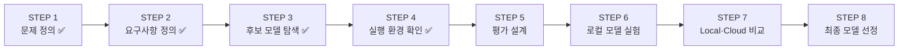

> 🗂️ **Projects · AI Service** — `llm` `ollama` `model-selection` `ecommerce` `quantization`
{: .prompt-info }

---

## 1. 📖 프로젝트 개요

첫 번째 개인 프로젝트. 로컬 LLM 2개를 Ollama로 실행 및 비교한 뒤 적합한 모델 1개를 선정한다.
진행 기간은 5일. Cloud API 모델 1개에는 공통 질문 일부를 적용해 실제 운영 방식도 검토한다.

---

## 2. ❓ 문제 정의

개인적으로 하고도 있고, 관심이 있는 이커머스 도메인 관련 주제를 이번 프로젝트 문제의
주제로 설정했다. 추후에 직접 사용할 수도 있지 않을까 하는 기대감에, 일반적인 이커머스
고객 문의와 셀러 업무 질문에 적절하게 답변하는지 비교하는 것으로 정했다.

> ❓ "현재 어떤 업무 상황이 있고, 왜 이 문제가 중요한가?"
>
> 각 상품별로 고객 문의에 대해 답변하는 시스템을 운영중이다. 상품에 대한 고객문의 폭주로
> 인한 업무 마비. 정확히 답변할 수 있는 AI 자동 답변 모델이 필요하다.
{: .prompt-info }

> ❓ "누가 이 시스템을 사용하는가?"
>
> 일반 쇼핑몰 고객과 상품을 운영하는 셀러. 고객은 상품·주문에 대해 묻고, 셀러는 반복
> 문의 대응·FAQ 구성·판매 문제 진단을 묻는다. 실제 평가 질문도 `고객 문의 5문항 + 셀러
> 업무 5문항`으로 절반씩 나눴다.
{: .prompt-info }

> ❓ "어떤 종류의 질문에 답해야 하는가?"
>
> 상품·주문·배송·불량 처리에 대한 고객 문의와, FAQ 구성·VOC 대응·판매 문제 진단 같은
> 셀러 업무 질문.
{: .prompt-info }

---

## 3. 🎯 목표

- 서로 다른 로컬 LLM 2개 이상을 Ollama로 실행·비교해 적합한 모델 1개를 선정한다.
- Cloud API 모델 1개에도 공통 질문 일부를 적용해 실제 운영 방식을 함께 검토한다.

---

## 4. 🗺️ 전체 진행 계획

오늘은 STEP 1~4까지 진행했다.

| STEP | 내용 |
| --- | --- |
| 1. 문제 정의 | 사용자·사용 상황 정의, 답해야 할 질문 정리, 한국어 성능·보안·응답 속도·GPU 등 주요 제약 확인 |
| 2. 모델 요구사항 정의 | 실행 가능 여부 확인, License·Context Length·최소 품질 기준 정의, 필수 통과 조건·선호 우선순위 설정 |
| 3. 후보 모델 탐색 | 서로 다른 로컬 모델 2개 이상 선정, Model Card·License·Parameter·Context Length 조사, Quantization·모델 태그·digest 등 실행 정보 기록, 후보 선정 이유 정리 |
| 4. 실행 환경 확인 | Windows·Python·Ollama 환경 확인, CLI 및 Python 호출 테스트, GPU·VRAM·버전·실행 설정 기록, 기본 응답과 결과 파일 저장 확인 |
| 5. 평가 질문·품질 기준 확정 | 고정 평가 질문 10개 확정, 문항별 기대 결과·확인 항목 정의, 정상/경계/정보 부족 사례 포함, 품질 채점 기준 확정, 실행 설정 통제, Cloud 비교용 5문항 사전 선정 |
| 6. 로컬 모델 품질·성능 측정 | 모델별 워밍업 분리, 질문 10개 × 각 2회 반복 실행, 품질 점수 평가, 응답 시간·로딩 시간·tokens/s·VRAM 측정, 성공률·실패 사례 집계 |
| 7. Local LLM vs Cloud API 비교 | Cloud 모델에 공통 5문항 × 각 1회 실행, 동일 기준으로 품질 비교, 응답 시간·토큰 사용량·비용 비교, 보안·인프라·운영 비교 |
| 8. 최종 모델 선정·발표 | 필수 통과 조건 충족 여부 확인, 통과 후보에 선호 우선순위 적용, 최종 로컬 모델 1개 선정, 선택·탈락 이유 정리, 운영 권고 및 최종 보고서 정리 |

---

## 5. 🤔 주요 의사결정

이런 종류의 프로젝트는 처음이라서, 문제를 어떻게 정의해야 최대한 얻는 게 많은지 고민을
많이 했다. 질문에 의한 답변의 품질을 다양한 수치들로 비교해보는 것이 이번 프로젝트의
방향성에 맞다고 생각했고, 이커머스 포함 다양한 도메인으로 특화된 모델들에 이커머스 특화된
질문을 함으로써 답변 품질이 얼마나 차이나는지 궁금해졌다.

다양한 모델들이 많았는데, 하나하나 확인했다기보다 AI에게 질문해서 특정 도메인별로 제일
특화된 모델들을 추천받아서 비교 대상으로 선정했다.

> ⚠️ 솔직히 모델 카드들을 봐도 비슷해 보여서, 어떤 차이가 있는지 몰랐다. 모델 카드가
> 익숙해지도록 틈틈이 많이 봐야겠다.
{: .prompt-warning }

> 📌 **오늘의 한 줄평** · 최종 산출물을 작성하기 위해, 각 스텝별 결과 데이터들을 자동
> 적재하도록 구조를 이리저리 바꾸느라 진도를 많이 못 나갔다. 어느 정도 확정했으니,
> 내일부터는 진도를 나가야겠다.
{: .prompt-tip }

---

## 6. 🧠 핵심 기억 카드

<strong>펼쳐서 확인</strong>

- **프로젝트 목표** : 로컬 LLM 2개 이상을 Ollama로 실행·비교해 적합한 모델 1개 선정, Cloud API 모델 1개로 운영 방식도 검토
- **문제 상황** : 상품별 고객 문의 폭주로 인한 업무 마비 — 정확히 답변하는 AI 자동 답변 모델 필요
- **사용자** : 일반 쇼핑몰 고객(상품·주문 문의) + 셀러(반복 문의 대응·FAQ 구성·판매 문제 진단)
- **평가 질문 구성** : 고객 문의 5문항 + 셀러 업무 5문항
- **STEP 1~4 (오늘 완료)** : 문제 정의 → 모델 요구사항 정의 → 후보 모델 탐색 → 실행 환경 확인
- **STEP 5~8 (예정)** : 평가 설계 → 로컬 모델 실험 → Local·Cloud 비교 → 최종 모델 선정
- **후보 모델 선정 방식** : 모델을 하나하나 직접 조사하기보다 AI에게 도메인별 특화 모델을 추천받아 선정
- **어려웠던 점** : 모델 카드들이 서로 비슷해 보여 차이를 파악하기 어려웠음 — 익숙해지려면 자주 봐야 함을 느낌

