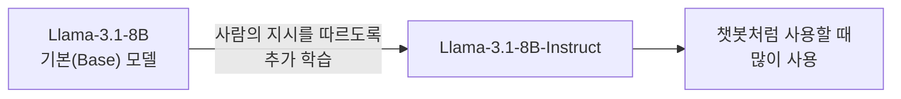
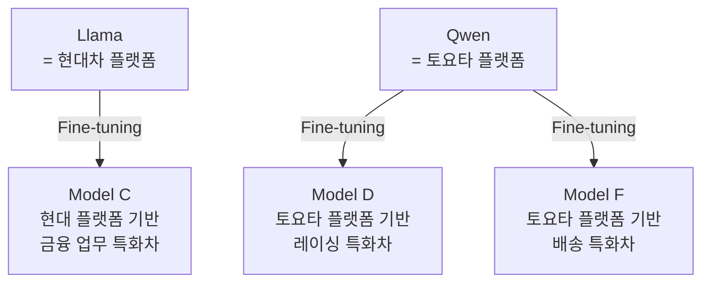

> 🗂️ **Notes · Deep Learning** — `llm` `llama` `qwen` `model-family` `fine-tuning`
{: .prompt-info }

---

## 1. 🦙 Llama

Meta가 개발한 모델 계열이다.

모델 이름 뒤에 붙는 `B`는 파라미터 수를 나타낸다.

```text
8B → 대략 80억개의 파라미터
```

같은 계열 안에서도 크기가 여러 가지로 나뉜다.

```text
Llama 3.1 8B
Llama 3.1 70B
Llama 3.1 405B
```

---

## 2. 🏷️ Base 모델과 Instruct 모델

같은 계열, 같은 크기라도 다음처럼 구분할 수 있다.

| 이름 | 의미 |
| --- | --- |
| `Llama-3.1-8B` | 기본(Base) 모델 |
| `Llama-3.1-8B-Instruct` | 사람의 지시를 따르도록 추가 학습한 모델 |

아래 그림처럼 Base 모델에 추가 학습을 거치면 Instruct 모델이 된다.



> 💡 일반적으로 챗봇처럼 사용할 때는 Instruct 버전을 많이 사용함.
{: .prompt-tip }

---

## 3. 🐉 Qwen

Alibaba 계열에서 개발한 모델 계열이다.

---

## 4. ⚖️ 두 계열만 놓고 비교하면 안 되는 이유

Llama vs Qwen 만 비교하는 건 아니다. 이렇게 2개만 놓고 어떤 것이 더 좋다고 판단하면 안 된다.

다음과 같은 요소들이 전부 다르기 때문이다.

- 모델 패밀리
- 파라미터 수
- 학습 데이터
- Fine-tuning 목적
- Chat Template
- Tokenizer

---

## 5. 🚗 자동차 플랫폼으로 이해하기

자동차로 비유한다면 아래와 같다.

```text
Llama = 현대차 플랫폼
Qwen  = 토요타 플랫폼
```

아래 그림처럼 같은 플랫폼 위에서 목적이 다른 차가 갈라져 나온다.



즉 Llama / Qwen은 기본 설계 계열, 그 위에 Coder, Finance, Commerce 같은 Fine-tuning이 추가된
것이다.

---

## 6. ✅ 핵심 정리

> 📌 Llama와 Qwen은 LLM의 **"모델 패밀리 / 기반 계열"**이고, 우리가 일반적으로 사용하는
> 모델들은 그 기반 모델을 목적에 맞게 추가 학습하거나 특화한 **파생 모델**임.
{: .prompt-info }

---

## 7. 🧠 핵심 기억 카드

<details markdown="1">
<summary><strong>펼쳐서 확인</strong></summary>

- **Llama** : Meta가 개발한 모델 계열
- **Qwen** : Alibaba 계열에서 개발한 모델 계열
- **`B` 표기** : 파라미터 수 — `8B` → 대략 80억개
- **Base 모델** : `Llama-3.1-8B` — 기본 모델
- **Instruct 모델** : `Llama-3.1-8B-Instruct` — 사람의 지시를 따르도록 추가 학습한 모델
- **챗봇 용도** : 일반적으로 Instruct 버전을 많이 사용
- **두 계열만 비교하면 안 되는 이유** : 모델 패밀리 · 파라미터 수 · 학습 데이터 · Fine-tuning 목적 · Chat Template · Tokenizer가 전부 다름
- **자동차 비유** : Llama = 현대차 플랫폼 / Qwen = 토요타 플랫폼, 그 위에 금융 · 레이싱 · 배송 특화차
- **계열과 파생 모델** : Llama / Qwen은 기본 설계 계열, 그 위에 Coder · Finance · Commerce 같은 Fine-tuning이 추가된 것
- **한 줄 정리** : 일반적으로 사용하는 모델 = 기반 모델을 목적에 맞게 추가 학습하거나 특화한 파생 모델

</details>

---

## 8. 🔗 관련 글

- [LLM 모델을 이해하는 순서 — 계열부터 실제 성능까지](/posts/llm-model-understanding-order/)
- [Hugging Face Model Card와 Pipeline, 그리고 Task · Backbone · Head](/posts/hugging-face-model-card-and-backbone-head/)
