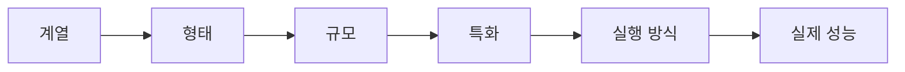
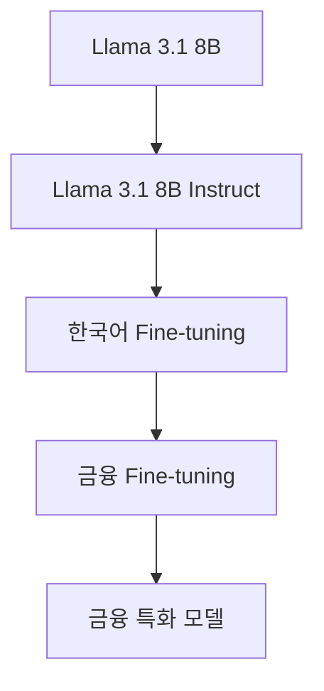

> 🗂️ **Notes · Deep Learning** — `llm` `model-family` `fine-tuning` `quantization` `gguf`
{: .prompt-info }

---

> 💡 LLM을 이해할 때는 모델 이름을 통째로 외우기보다, 아래 순서대로
> **계열 → 형태 → 규모 → 특화 → 실행 방식 → 실제 성능**으로 나눠서 보는 것이 가장 쉽습니다.
{: .prompt-tip }



---

## 1. 👪 모델 계열(Family)부터 본다

먼저 이 모델이 어떤 계열인지 확인합니다.

예:

- Llama
- Qwen
- Gemma
- Mistral
- Phi

이 단계에서는 다음을 봅니다.

- 누가 만든 모델인가?
- 어떤 세대인가?
- 어떤 기본 구조와 방향성을 가진 모델인가?

예:

```text
Llama
→ Meta가 개발한 모델 계열

Qwen
→ Alibaba 계열에서 개발한 모델 계열

Gemma
→ Google이 개발한 모델 계열
```

예를 들어:

```text
Llama 3.1
Qwen2.5
Gemma 3
```

처럼 뒤의 숫자는 보통 모델의 세대나 버전을 의미합니다.

---

## 2. 🏷️ Base 모델인지 Instruct 모델인지 본다

같은 모델 계열이라도 용도가 다를 수 있습니다.

### Base Model

기본적인 언어모델입니다.

```text
입력
↓
다음 토큰 예측
↓
텍스트 생성
```

대화용으로 바로 쓰기보다는 추가 학습이나 Fine-tuning의 기반으로 많이 사용됩니다.

### Instruct / Chat Model

사람의 지시를 따르도록 추가 학습한 모델입니다.

예:

```text
질문:
파이썬 리스트와 튜플의 차이를 설명해줘.

→ 사용자의 요청을 이해
→ 설명 형태로 답변
```

실제 챗봇이나 Assistant를 만들 때는 보통 Base보다 Instruct 모델을 많이 사용합니다.

---

## 3. 📏 모델 크기(Parameter)를 본다

다음으로 모델의 크기를 봅니다.

예:

```text
4B
7B
8B
14B
70B
```

여기서 `B`는 Billion입니다.

```text
7B
→ 약 70억 개 파라미터

8B
→ 약 80억 개 파라미터
```

일반적으로 모델이 커질수록:

- 더 많은 표현과 패턴을 학습할 가능성이 커짐
- 복잡한 문제 처리 능력이 좋아질 수 있음
- RAM / VRAM 사용량 증가
- 실행 속도 저하 가능
- 저장 용량 증가

하지만:

```text
큰 모델 = 무조건 좋은 모델
```

은 아닙니다.

> ⚠️ 좋은 데이터와 Fine-tuning을 사용한 7B 모델이 다른 8B 모델보다 특정 작업에서 더 잘할
> 수도 있습니다.
{: .prompt-warning }

---

## 4. 🎯 무엇에 특화됐는지 본다

이 단계가 매우 중요합니다.

기본 모델 위에 특정 데이터로 추가 학습하면 도메인 특화 모델이 만들어질 수 있습니다.

| 이름 | 도메인 |
| --- | --- |
| `Finance` | 금융 |
| `Coder` | 코딩 |
| `Medical` | 의료 |
| `Math` | 수학 |
| `Commerce` | 이커머스 |

예를 들어:

```text
Qwen2.5-7B-Instruct
```

를 코딩 데이터로 추가 학습하면:

```text
Qwen2.5-Coder-7B-Instruct
```

같은 모델이 될 수 있습니다.

즉 모델을 볼 때:

```text
무슨 모델인가?
```

보다

```text
무엇을 잘하도록 학습했는가?
```

를 같이 봐야 합니다.

---

## 5. 🌳 Fine-tuning 계보를 확인한다

특화 모델은 어떤 모델에서 출발했는지 확인해야 합니다.

아래 그림처럼 하나의 기본 모델에서 단계적으로 추가 학습이 쌓입니다.



이런 구조를 모델의 계보라고 볼 수 있습니다.

중요한 이유는:

```text
모델 이름이 다르다
≠
완전히 다른 모델
```

이기 때문입니다. 예를 들어 같은 원본 모델을 다른 사람이 GGUF로 변환한 경우도 있습니다.

따라서 Model Card에서 다음 항목을 확인합니다.

- Base model
- Finetuned from
- Parent model
- Quantized from
- Model tree

---

## 6. 🗜️ 실행 방식 — 양자화와 파일 포맷

### 양자화(Quantization)

양자화는 모델의 지식이나 정체성보다는 **실행 방식**에 가깝습니다.

예:

```text
FP16
Q8
Q6
Q5
Q4_K_M
```

양자화의 목적:

- 모델 용량 감소
- RAM / VRAM 사용량 감소
- 로컬 실행 가능성 증가
- 실행 속도 개선 가능

대신 너무 강하게 양자화하면 품질이 일부 떨어질 수 있습니다.

```text
원본 모델
Llama 3.1 8B Instruct

↓ Q4_K_M 양자화

로컬 실행 버전
Llama 3.1 8B Instruct Q4_K_M
```

따라서 `Q4_K_M`은 모델 자체의 특화 기능이 아니라 **어떤 형태로 압축해서 실행하는가**를
의미합니다.

아래 그림처럼 모델 이름 하나에도 지금까지 본 관점들이 그대로 이어 붙어 있습니다.

{: w="720" h="350" }

이름을 통째로 외우는 대신 이렇게 나눠서 보면, 처음 보는 모델이라도 각 부분이 무엇을 뜻하는지
읽어낼 수 있습니다.

### GGUF는 모델이 아니라 파일 포맷이다

GGUF도 모델 이름처럼 보이지만 실제로는 로컬 LLM 실행을 위한 파일 형식입니다.

주로 다음과 함께 사용됩니다.

- llama.cpp
- Ollama
- LM Studio

예:

```text
Llama-3.1-8B-Instruct-GGUF
```

라고 되어 있다면:

```text
Llama 3.1 8B Instruct 모델을
GGUF 형식으로 변환한 버전
```

이라고 이해하면 됩니다.

---

## 7. 🔤 Tokenizer와 Chat Template도 중요하다

같은 질문을 넣어도 모델마다 내부 처리 방식이 다를 수 있습니다.

### Tokenizer

문장을 모델이 처리할 수 있는 토큰 단위로 나눕니다.

```text
"안녕하세요"
↓
여러 개의 Token ID
```

모델마다 tokenizer가 다르기 때문에:

- 같은 문장이라도 토큰 수가 다를 수 있음
- 속도 비교에 영향을 줄 수 있음
- Context 사용량이 달라질 수 있음

### Chat Template

사용자와 Assistant의 대화를 모델이 학습한 형식으로 변환합니다.

```text
system
user
assistant
```

등의 구조를 모델에 맞게 가공합니다. Ollama를 사용할 경우 대부분 이 부분을 Ollama가
처리합니다.

---

## 8. 📜 Context Length를 본다

Context Length는 모델이 한 번에 참고할 수 있는 토큰 범위입니다.

예:

```text
4K
32K
128K
256K
```

하지만 두 가지를 구분해야 합니다.

```text
문서상 최대 Context
vs
실험에서 실제 사용한 Context
```

예:

```text
문서상 최대:
128K

실험:
4096
```

> ⚠️ 현재 모델 비교 실험에서는 모든 모델의 실험 Context를 동일하게 맞추는 것이 중요합니다.
{: .prompt-warning }

---

## 9. ⚖️ License를 확인한다

모델을 실제 프로젝트나 서비스에 사용할 경우 라이선스도 중요합니다.

예:

- Apache-2.0
- Llama Community License
- Gemma License

특히 파생 모델은:

```text
Repository License
+
Base Model License
```

를 같이 확인하는 것이 좋습니다.

---

## 10. 🧪 마지막에는 실제 성능으로 판단한다

Model Card만 보고 좋은 모델을 결정하면 안 됩니다. 결국 같은 질문을 직접 넣어보고 비교해야
합니다.

| 품질 관점 | 성능 관점 |
| --- | --- |
| 정확성 | 응답 시간 |
| 핵심 정보 누락 | Token/s |
| 지시 준수 | 출력 토큰 |
| 한국어 자연스러움 | VRAM |
| Hallucination | 성공률 |
| 정보 부족 상황 대응 | Context 사용량 |

즉:

```text
Model Card
→ 후보 선정

실제 테스트
→ 최종 판단
```

입니다.

---

## 11. 🔬 현재 비교 중인 3개 모델에 적용

| 항목 | Model C — 금융 | Model D — 코딩 | Model F — 이커머스 |
| --- | --- | --- | --- |
| **Family** | Llama | Qwen | Qwen |
| **Generation** | Llama 3.1 | Qwen2.5 | Qwen2.5 |
| **Size** | 8B | 7B | 7B |
| **Type** | Instruct 계열 | Instruct | Instruct 기반 |
| **Domain** | 한국어 + 금융 | Coding | Shopping / E-commerce |
| **Quantization** | Q4_K_M | Q4_K_M | Q4_K_M |
| **Format** | GGUF | GGUF | GGUF |

각 모델의 핵심 질문은 다음과 같습니다.

> ❓ **Model C** — 금융 Fine-tuning이 일반 모델보다 금융 질문에서 실제로 도움이 되는가?
>
> ❓ **Model D** — Coder 특화가 코딩 질문에서 실제 성능 향상을 만드는가?
>
> ❓ **Model F** — Commerce Fine-tuning이 상품 문의 / 추천 / 비교 / 리뷰 분석에서 실제로
> 도움이 되는가?

---

## 12. ✅ 핵심 정리

앞으로 새로운 모델을 보면 아래 순서대로 확인하면 됩니다.

```text
1. 누가 만든 모델인가?
   ↓
2. 어떤 Family인가?
   ↓
3. 어떤 세대인가?
   ↓
4. 몇 B인가?
   ↓
5. Base / Instruct / Chat 중 무엇인가?
   ↓
6. 무엇에 Fine-tuning 됐는가?
   ↓
7. 어떤 모델에서 파생됐는가?
   ↓
8. Context Length는 얼마인가?
   ↓
9. 어떤 Quantization인가?
   ↓
10. GGUF 등 어떤 실행 포맷인가?
   ↓
11. License는 무엇인가?
   ↓
12. 실제 내 Task에서 얼마나 잘하는가?
```

> 📌 LLM 모델은 **"모델 계열 + 규모 + 학습 형태 + 도메인 특화 + 실행 방식 + 실제 성능"**의
> 조합으로 이해하면 된다.
{: .prompt-info }

---

## 13. 🧠 핵심 기억 카드

<details markdown="1">
<summary><strong>펼쳐서 확인</strong></summary>

- **이해 순서** : 계열 → 형태 → 규모 → 특화 → 실행 방식 → 실제 성능
- **Family** : 누가 만들었는지 · 어떤 세대인지 · 어떤 기본 구조인지 — Llama(Meta) / Qwen(Alibaba) / Gemma(Google)
- **버전 숫자** : `Llama 3.1`, `Qwen2.5`의 뒤 숫자는 보통 세대나 버전
- **Base Model** : 입력 → 다음 토큰 예측 → 텍스트 생성, 추가 학습·Fine-tuning의 기반
- **Instruct / Chat Model** : 사람의 지시를 따르도록 추가 학습 — 챗봇·Assistant에 주로 사용
- **`B`** : Billion — `7B` 약 70억 개, `8B` 약 80억 개 파라미터
- **모델이 커지면** : 표현·처리 능력 향상 가능 / RAM·VRAM·용량 증가, 속도 저하 가능
- **큰 모델 ≠ 무조건 좋은 모델** : 좋은 데이터와 Fine-tuning을 쓴 7B가 8B보다 나을 수도 있음
- **도메인 특화** : Finance · Coder · Medical · Math · Commerce
- **볼 것** : "무슨 모델인가?"보다 "무엇을 잘하도록 학습했는가?"
- **계보** : 이름이 다르다 ≠ 완전히 다른 모델 — Base model · Finetuned from · Parent model · Quantized from · Model tree 확인
- **양자화** : 지식이 아니라 실행 방식 — 용량·메모리 감소, 로컬 실행 가능성·속도 개선, 대신 품질 일부 저하 가능
- **`Q4_K_M`** : 특화 기능이 아니라 어떤 형태로 압축해서 실행하는가
- **GGUF** : 모델이 아니라 로컬 실행용 파일 형식 — llama.cpp · Ollama · LM Studio
- **Tokenizer** : 모델마다 달라 토큰 수 · 속도 비교 · Context 사용량이 달라질 수 있음
- **Chat Template** : system · user · assistant 구조를 모델이 학습한 형식으로 변환 (Ollama가 대부분 처리)
- **Context Length** : 문서상 최대 Context와 실험에서 실제 사용한 Context를 구분 — 비교 실험에서는 동일하게 고정
- **License** : 파생 모델은 Repository License + Base Model License를 함께 확인
- **최종 판단** : Model Card → 후보 선정, 실제 테스트 → 최종 판단
- **한 문장 정리** : LLM 모델 = 모델 계열 + 규모 + 학습 형태 + 도메인 특화 + 실행 방식 + 실제 성능의 조합

</details>

---

## 14. 🔗 관련 글

- [LLM 모델 계열 — Llama와 Qwen, 그리고 파생 모델](/posts/llm-model-family-llama-qwen/)
- [temperature와 실행 지표 — LLM 응답을 채점하기 전에 확인할 값들](/posts/llm-temperature-and-runtime-metrics/)
- [Hugging Face Model Card와 Pipeline, 그리고 Task · Backbone · Head](/posts/hugging-face-model-card-and-backbone-head/)
