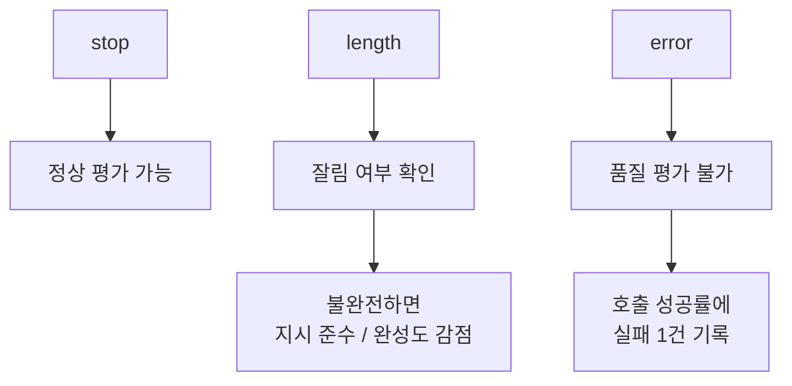

> 🗂️ **Notes · Deep Learning** — `llm` `temperature` `token` `inference-speed` `model-evaluation`
{: .prompt-info }

---

## 1. 🌡️ temperature는 무엇을 조정하는 값인가

다음 토큰을 고를 때 얼마나 보수적으로 고를지, 얼마나 다양한 후보를 허용할지 조정하는 값이다.

| 설정 | 후보 선택 |
| --- | --- |
| 낮음 | 높은 확률의 후보를 더 강하게 선택 |
| 높음 | 낮은 확률 후보도 선택될 가능성이 커짐 |

아래 그림처럼 temperature가 높아질수록 선택 대상이 되는 후보의 범위가 아래쪽까지 넓어진다.

{: w="720" h="330" }

> ⚠️ 모델의 지능 자체를 높이거나 낮추는 설정은 아님. 같은 모델의 **출력 선택 방식**만 바꾸는
> 것임.
{: .prompt-warning }

---

## 2. 📊 temperature 값에 따른 성격

| Temperature | 성격 |
| ----------: | --- |
| `0` | 매우 일관적, 사실·평가 실험에 적합 |
| `0.2` | 안정적이면서 약간의 표현 다양성 |
| `0.5` | 적당한 다양성 |
| `0.7~1.0` | 일반 대화/창작에 더 다양한 출력 |
| `>1.0` | 다양성 매우 높음, 불안정성도 증가 |

> 📌 **한 줄 정리** · temperature = 답변 생성 시 확률이 낮은 토큰까지 얼마나 적극적으로
> 선택하게 할지 조정하는 값
{: .prompt-info }

---

## 3. 📈 채점 전에 확인하는 실행 지표

모델의 실행 결과를 채점하기 전 해당 모델의 실행 지표를 확인한다. 수치는 아래와 같음.

```text
출력 288토큰 / 4.8초 / 60.5 t/s / 종료 stop / 응답 553자
```

| 지표 | 의미 | 중요하게 볼 것 | 직접 점수화? |
| --- | --- | --- | --- |
| 출력 288토큰 | 모델이 생성한 토큰 수 | 너무 짧거나 불필요하게 긴지 | △ |
| 4.8초 | 전체 응답 시간 | 사용자가 실제로 기다린 시간 | ✅ 성능 지표 |
| 60.5 t/s | 초당 생성 토큰 | 생성 속도 | ✅ 성능 지표 |
| 종료 `stop` | 정상적으로 답변 종료 | 토큰 제한으로 잘린 것은 아닌지 | ✅ 성공 여부 |
| 응답 553자 | 실제 한국어 답변 길이 | 답변 밀도·장황함 확인 | △ |

> ⚠️ 위 숫자만 보고 "좋은 모델" 이라고 판단하면 안됨.
{: .prompt-warning }

---

## 4. 🔍 지표별로 무엇을 보는가

### 토큰

모델이 답변을 생성하면서 사용한 output token 수.

응답의 길이와 비용/속도에 영향을 주는 지표다.

> 💡 **판단 근거** · 필요한 내용을 빠짐없이 포함하면서 불필요하게 길지 않은가?
> (효율성 보조지표)
{: .prompt-tip }

### 응답 시간

질문을 보내고 최종 답변을 받을 때까지 얼마나 걸렸는가? 사용자가 느끼는 전체 응답 시간임.

수치를 측정하고 비교할 때는 다음으로 분리해서 비교하는게 좋음.

```text
total_response_time
load_duration
prompt_eval_duration
eval_duration
```

### t/s

1초에 몇 개의 output token을 생성했는가?

- 로컬 LLM에서는 중요한 성능 지표가 될 수 있음.
- 같은 품질일 경우, t/s가 높을 수록 쾌적한 사용 환경이라고 봐도 무방함.

> ⚠️ 절대적인 채점 기준이 아니라 **사용 환경과 모델 크기에 따른 상대 비교 기준**임.
{: .prompt-warning }

### 응답 글자 수

사람이 실제로 읽는 문자 수.

길다고 / 짧다고 무조건 좋은 것이 아님. **정보 밀도**가 중요함.

---

## 5. 🛑 종료 이유에 따른 처리

`stop`은 모델이 답변을 정상적으로 끝냈다는 뜻이다. 다만 여러가지 상황이 있을 수 있음.

아래 그림처럼 종료 이유에 따라 그 응답을 채점에 어떻게 반영할지가 갈린다.



---

## 6. 🧠 핵심 기억 카드

<details markdown="1">
<summary><strong>펼쳐서 확인</strong></summary>

- **temperature** : 다음 토큰을 고를 때 얼마나 보수적으로 고를지, 얼마나 다양한 후보를 허용할지 조정하는 값
- **낮은 temperature** : 높은 확률의 후보를 더 강하게 선택
- **높은 temperature** : 낮은 확률 후보도 선택될 가능성이 커짐
- **temperature ≠ 지능** : 모델의 지능이 아니라 같은 모델의 출력 선택 방식만 바꾸는 설정
- **값 기준** : `0` 매우 일관적(사실·평가 실험) / `0.2` 안정적 + 약간의 다양성 / `0.5` 적당한 다양성 / `0.7~1.0` 일반 대화·창작 / `>1.0` 다양성 매우 높음, 불안정성 증가
- **채점 전 확인** : 출력 토큰 · 응답 시간 · t/s · 종료 이유 · 응답 글자 수
- **출력 토큰** : output token 수 — 응답 길이와 비용/속도에 영향, 효율성 보조지표(△)
- **응답 시간** : 사용자가 느끼는 전체 응답 시간(✅) — `total_response_time` · `load_duration` · `prompt_eval_duration` · `eval_duration`으로 분리해 비교
- **t/s** : 초당 생성 output token(✅) — 절대 기준이 아니라 사용 환경과 모델 크기에 따른 상대 비교 기준
- **종료 `stop`** : 정상 평가 가능 / **`length`** : 잘림 여부 확인, 불완전하면 지시 준수·완성도 감점 / **`error`** : 품질 평가 불가, 호출 성공률에 실패 1건 기록
- **응답 글자 수** : 사람이 읽는 문자 수(△) — 길이보다 정보 밀도가 중요
- **주의** : 위 숫자만 보고 "좋은 모델"이라고 판단하면 안 됨

</details>

---

## 7. 🔗 관련 글

- [LLM 모델을 이해하는 순서 — 계열부터 실제 성능까지](/posts/llm-model-understanding-order/)
- [Token과 Vocabulary — 텍스트가 숫자가 되기까지](/posts/nlp-token-subword-vocabulary/)
